# 伯特之后会发生什么？总结后面的那些想法

> 原文：<https://medium.com/analytics-vidhya/what-happens-after-bert-summarize-those-ideas-behind-ee02f1eae5d9?source=collection_archive---------5----------------------->

> 伯特巴特斯潘伯特 XLM XLNet 阿尔伯特罗伯塔 T5 MTDNN GPT2 …

# 各种模式和思维已经让人目不暇接。他们想告诉我们什么？希望这篇文章会让你看完之后明白。

我们将从以下几点着手:

*   增加覆盖面以改善掩蔽 LM
*   下一句预测👎？
*   其他的前期训练任务会更好吗？
*   把它变小
*   多语言
*   模型越大，效果越好？
*   多任务处理

预培训

伯特的模型之所以如此不可思议，是因为它改变了一个 NLP 模型的训练方式。

使用大规模语料库训练语义模型，然后使用该模型做下游任务，如阅读理解/情感分类/ NER 等

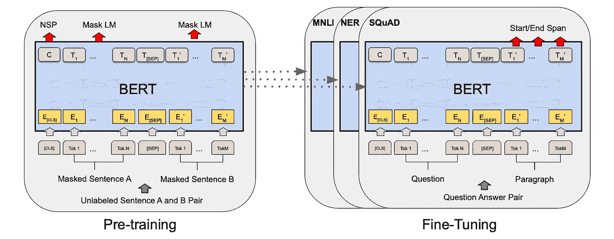

这也被 Yann LeCun 称为自我监督学习

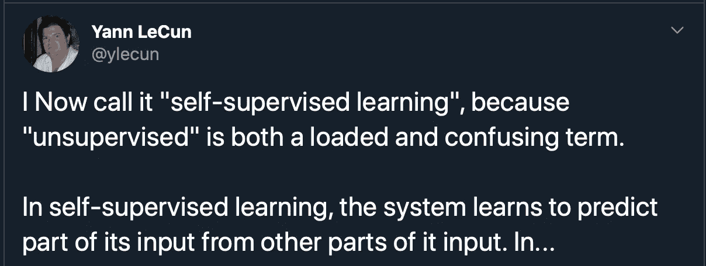

Bert 使用基于 Transformer 编码器的多任务模型，通过 task MaskedLM 和 NextSentencePrediction 来捕获语义。

**增加覆盖率提高 MaskedLM**
在 MaskedLM 中，MASK 是在 WordPiece 之后的 one-pieces 上执行的。

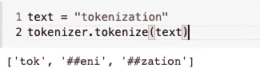

当提供' ##eni '和' # # zation '时，不难得到 guess 'tok ',而不是根据上下文猜测整个单词。

由于词本身和词与他人之间的关联不同，伯特可能无法了解词与词之间的关系。

预测单词的一部分意义不大，预测整个单词可以更多地了解其语义。因此，扩大掩蔽的覆盖面势在必行:

对整个单词进行屏蔽—wwm
对短语进行屏蔽—厄尼
缩放到一定长度— Ngram 屏蔽/ Span 屏蔽

短语级别需要提供相应的短语列表。提供这种人为添加的信息可能会扰乱模型，给它一个偏差。看来马克斯在更长的长度上应该是一个更好的解决方案，所以 T5 尝试不同的长度来得出这个结论:

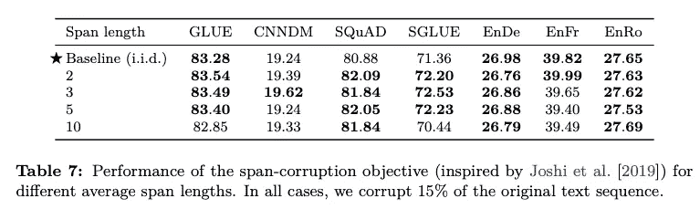

可见，增加长度是有效的，但并不意味着越长越好。SpanBert 有一个更好的解决方案，通过概率抽样来减少屏蔽过长文本的机会。

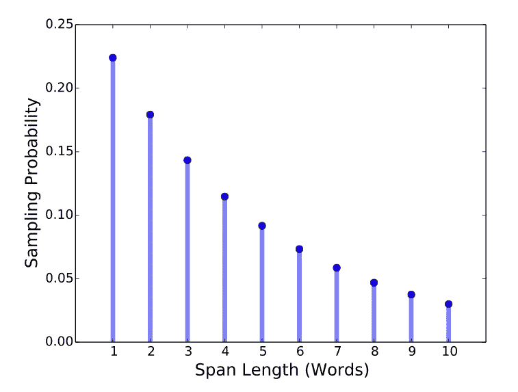

斯潘伯特的实验结果:

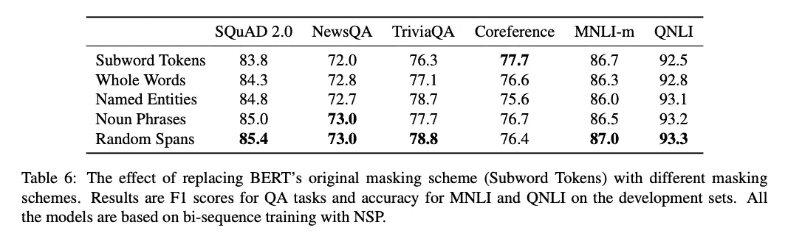

**改变蒙版比例**
谷歌的 T5 尝试不同的蒙版比例，探索最佳的参数设置是什么。令人惊讶的是，伯特最初的设定是最好的:

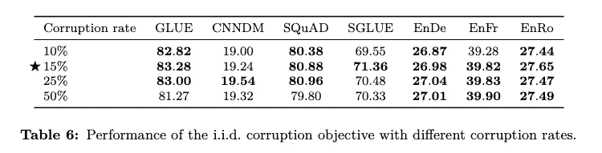

**下一句预测👎？**
NSP 通过预测两个句子是否有语境来学习句子层面的信息。从实验结果来看，并没有太大的改善，甚至在某些任务上有所下降。

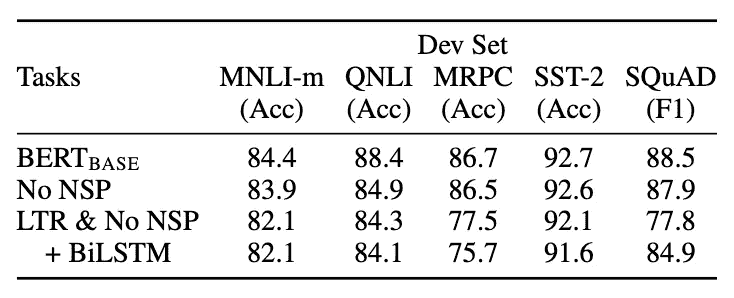

NSP 似乎不太管用！这成了大家围攻的地方，下面的报纸都踩在上面:XLNET/RoBERTa/ALBERT
RoBERTa

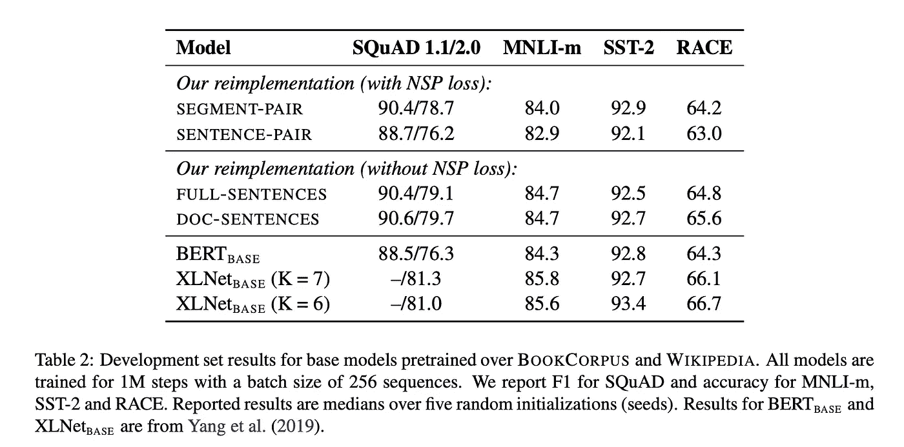

艾伯特

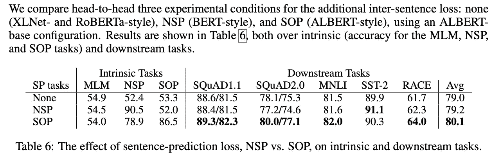

XLNet

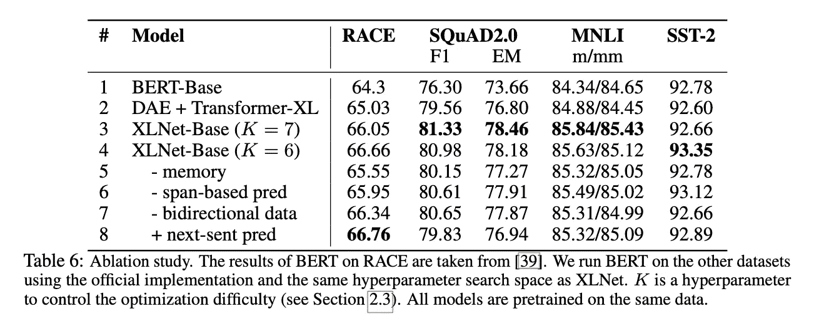

它发现 NSP 带来更多的负面影响！这可能是由于 NSP 任务设计的不合理——从其他容易区分的文档中抽取负样本，结果不仅学习的知识少，而且噪音大。此外，NSP 把输入分成两个不同的句子，长句样本的缺乏使得伯特的差表现在长句上。

**其他预训任务**
NSP 表现平平，有没有更好的预训方式？每个人都尝试了各种方法，我认为总结各种预训练任务的最好方法是 Google 的 T5 和 FB 的 BART

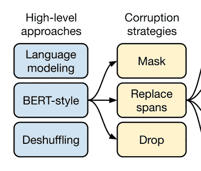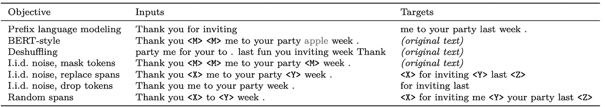

巴特尝试的方式

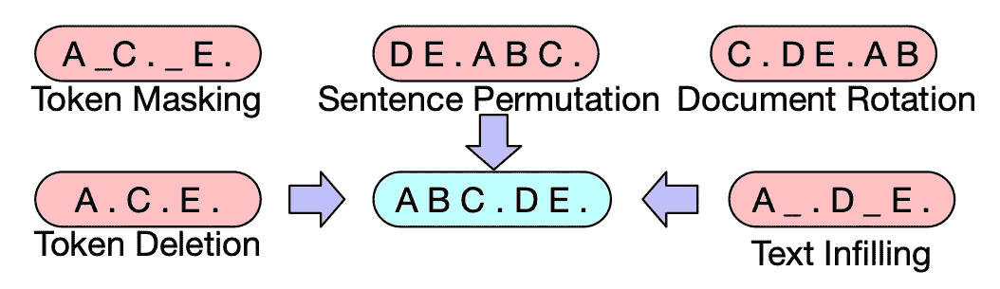

通常，语言模型将被用作每个人的基线。

*   覆盖一些代币，预测覆盖的内容
*   打乱句子的顺序，预测正确的顺序
*   删除一些令牌，预测在哪里删除
*   随机挑选令牌，之后，所有内容将移动到开头，并预测正确的开头在哪里。
*   添加一些令牌并预测删除的位置
*   替换一些令牌并预测它们在哪里被替换

实验结果如下:

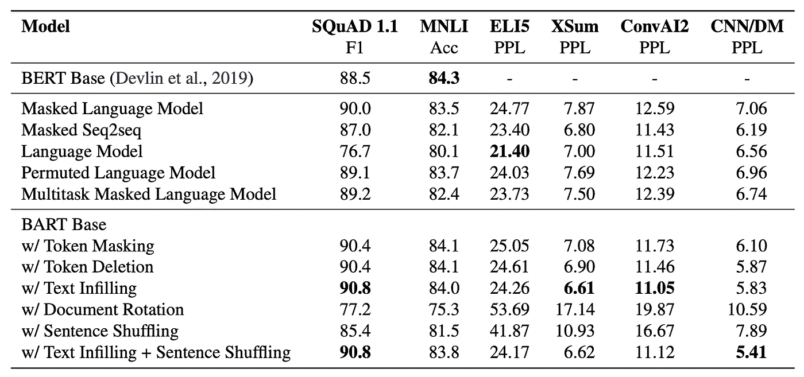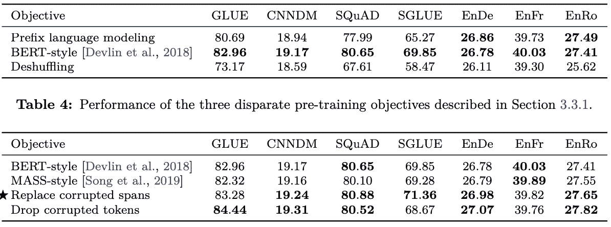

这些实验发现，MaskedLM 是最好的预训练方法。为了更好的效果，更长的掩码和更长的输入句子似乎是更有效的改善方法。为了避免泄露屏蔽了多少单词，您只能标记一个屏蔽并预测一个或多个单词结果

# 轻量级选手

伯特的模型非常大。为了使运行时更快，另一个方向是轻量级模型。
你可以压缩的所有方法伯特已经详细说明了这一点。
方向是:

*   修剪-删除模型的部分，删除一些层，一些头部

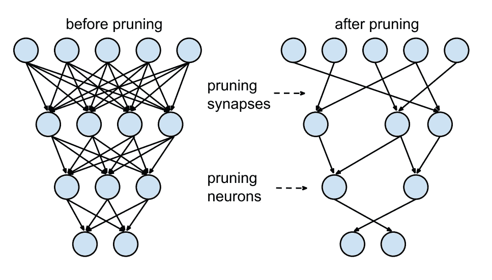

*   矩阵分解-词汇/参数的矩阵分解

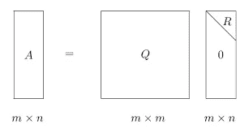

*   知识的升华——伯特对其他小模型的“学习”

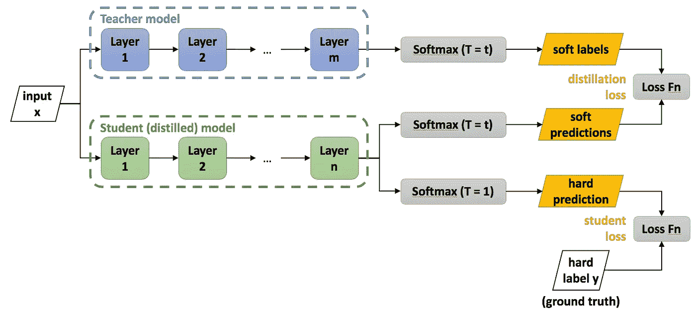

*   参数共享-在层之间共享相同的权重

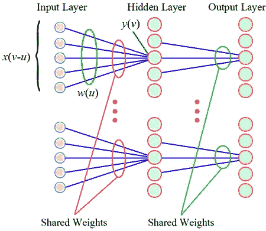

模型和效果可以参考原文
http://mitch Gordon . me/machine/learning/2019/11/18/all-the-ways-to-compress-Bert . html

# 多语言

不同语言的数据集非常不均衡。通常情况下，有大量的英语语言数据集，其他语言的数据相对较少。在繁体中文中，这个问题更严重。由于伯特的预训方式没有语言限制。将更多的语言数据放入预训练模型，希望它可以在下游任务中取得更好的结果。

Google 发布的 Bert-Multilingual 就是一个例子。它在不增加任何中文数据的情况下，在下游任务上取得了接近中文模型的结果。

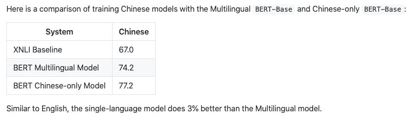

在基于多语言语言表征模型的跨语言迁移学习的零距离阅读理解中，发现多语言版本的 Bert 对 SQuAD(英语阅读理解任务)和 evaluation(汉语阅读理解任务)进行了微调。可以达到接近 QANet 的结果；而且多语言模型不把数据翻译成同一种语言，比翻译好！

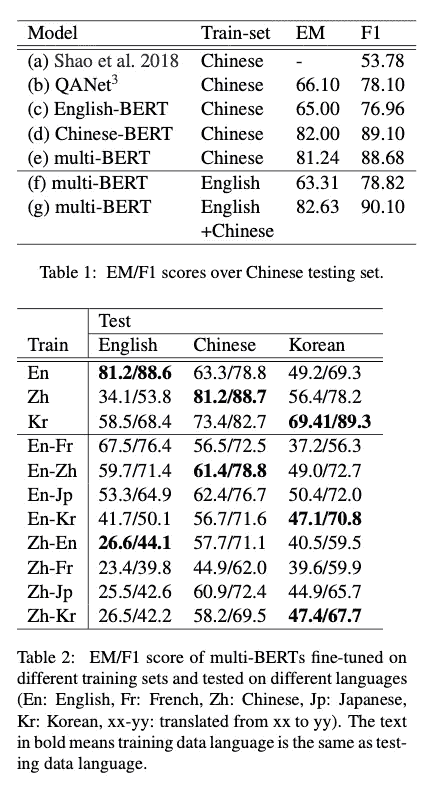

以上结果表明，Bert 已经学会了用不同的语言链接数据，无论是在嵌入中还是在 transformer 编码器中。预训练语言模型中的新兴跨语言结构想要了解 bert 如何连接不同的语言。
首先，它使用 TLM 在同一个预训练模型中连接不同的语言:

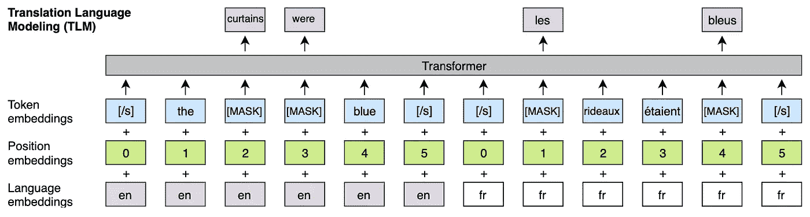

然后，通过共享组件或不共享组件，它试图找出哪个部分对结果影响最大。

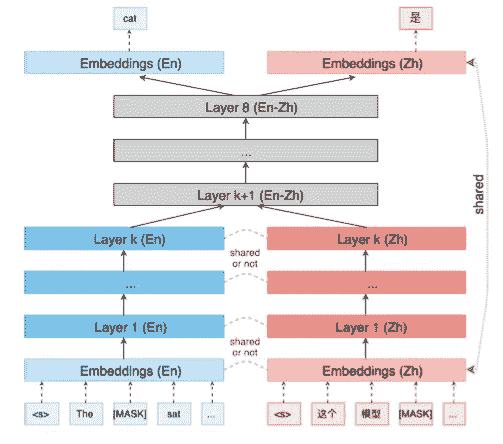

模型之间的参数共享是成功的关键

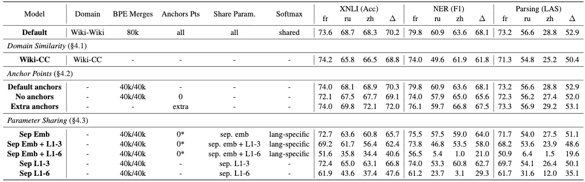

这是因为 Bert 了解单词的分布及其背后的上下文。在不同的语言中，同样的词义，语境的分布应该是接近的。

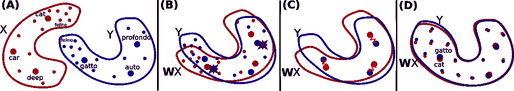

而 Bert 的参数就是学习其中的分布，使得多语言转移产生如此惊人的效果。

# 模型越大，效果越好？

虽然 Bert 用过大模型，但直觉上，数据越多，模型越大，效果应该越好。这也可能是提高的关键:

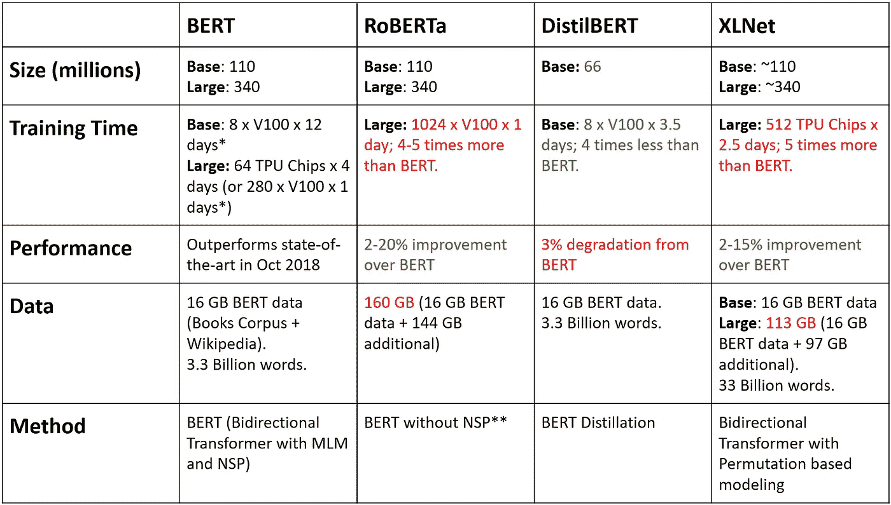

T5 利用 TPU 和金钱的魔力将其归咎于峰会

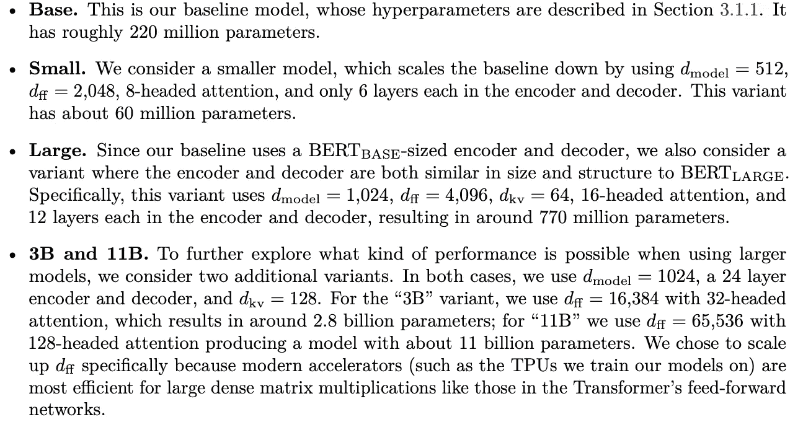

较大的型号似乎没有多大改进

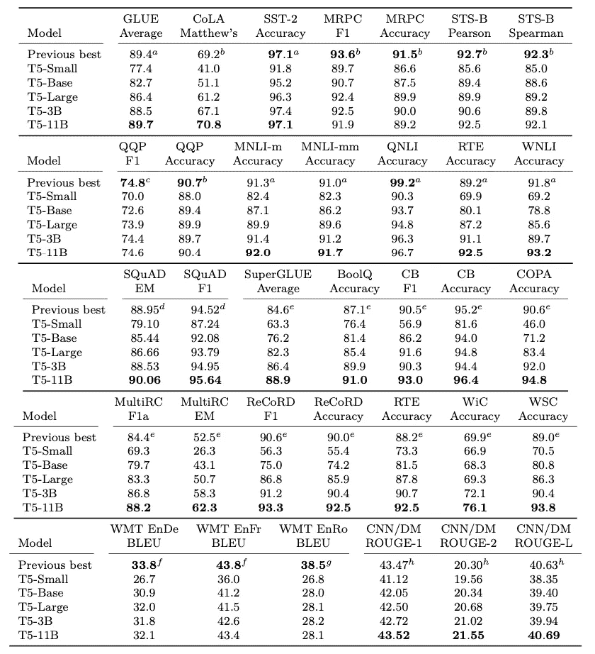

所以单纯增加模型并不是最有效的方法。使用不同的训练方法和目标也是提高成绩的一种方法。
例如，ELECTRA 使用了一种新的训练方法，让每个单词都参与进来，以便模型能够更有效地学习表征。

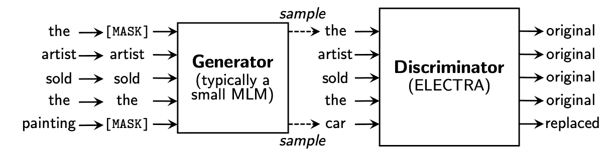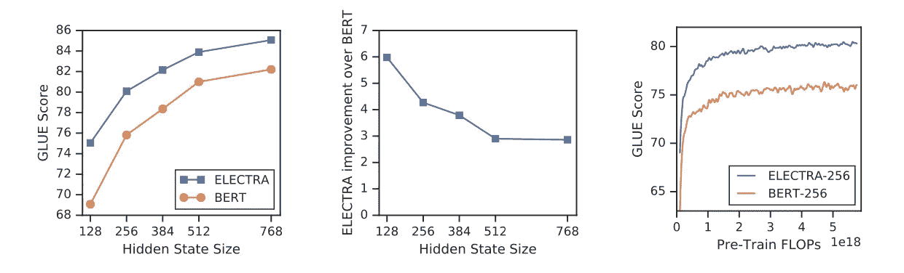

Albert 使用参数共享来减少参数的数量，同时效果没有显著下降。

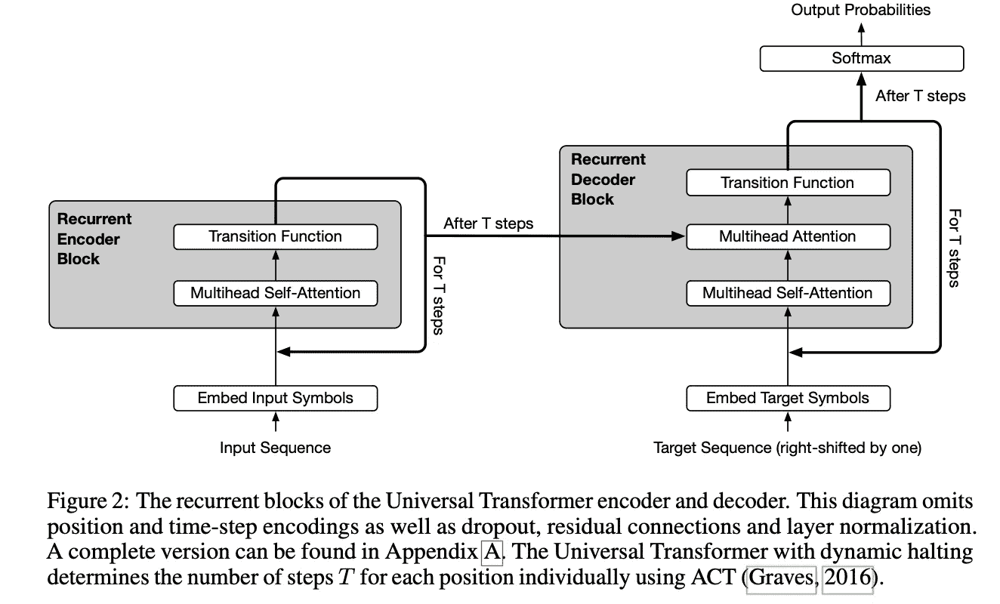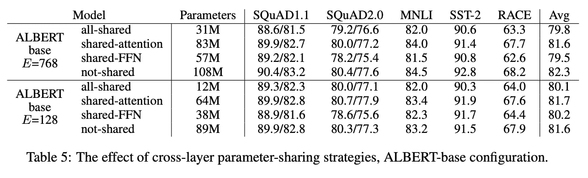

# 多任务处理

Bert 使用多任务进行预训练。不仅如此，我们还可以使用多任务进行微调。**用于自然语言理解的多任务深度神经网络(MTDNN)** 正在这么做。

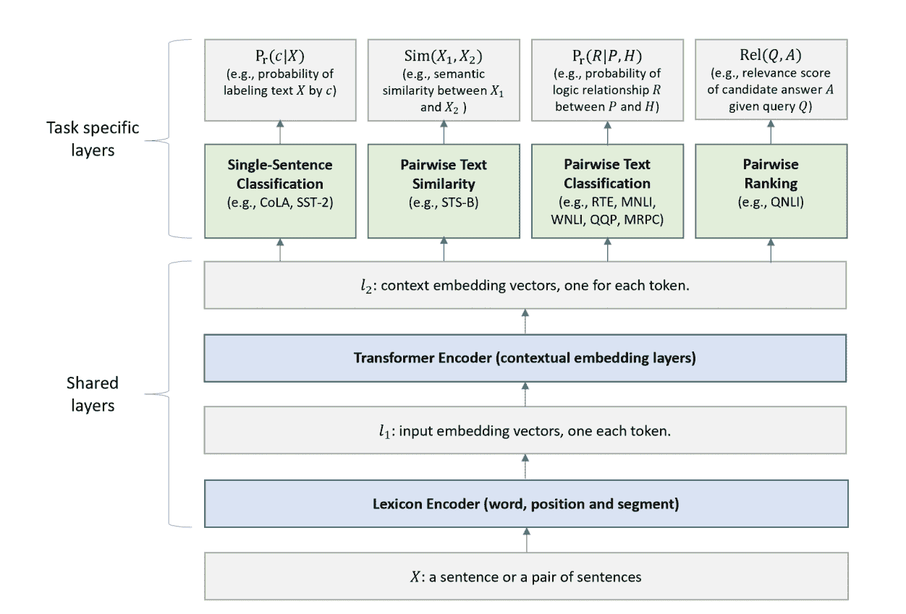

与 MTDNN 相比，GPT2 更加激进:使用一种极端的语言模型来捕捉一切，无需微调，只需给出任务的信号，它就可以处理其余的事情。这令人印象深刻，但离成功还很远。

T5 让它成为一种平衡

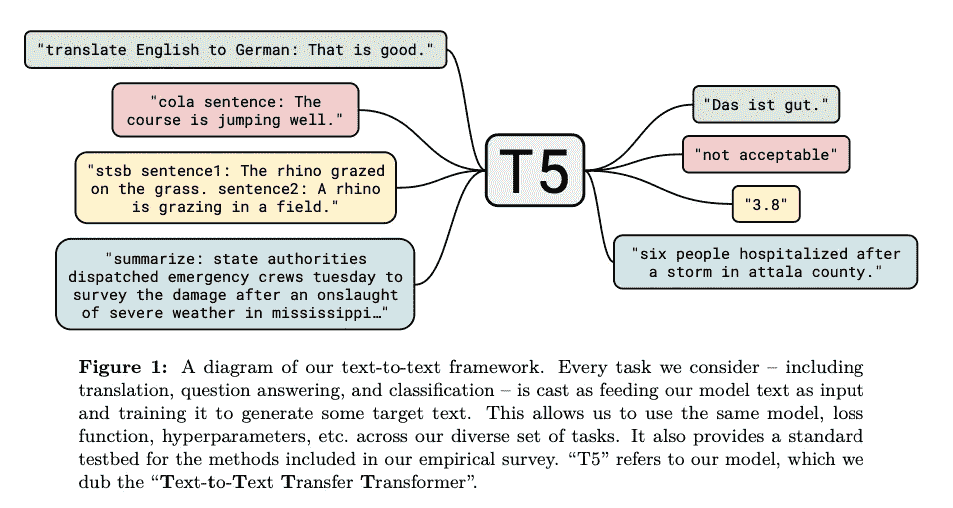

Google 的 T5 类似于 GPT2，训练生成模型生成所有文本答案。也和 MTDNN 一样，在训练的时候，它会让模型知道它现在是在解决不同的任务，是一个训练/微调的模型。

如此大规模的预训练模型需要解决两个问题:不平衡数据的处理和训练策略。

**处理不平衡数据**

任务之间的数据量不同，这导致模型对于一些数据量小的任务表现不佳。
减少大量数据的采样，增加少量数据的采样是解决方案之一。伯特如何进行多语言培训就是一个例子:

> 为了平衡这两个因素，我们在预训练数据创建(以及单词块词汇创建)期间对数据进行了指数平滑加权。换句话说，假设一种语言的概率是 P (L)，例如，P(英语)= 0.21 意味着在将所有维基百科串联在一起后，我们的数据中有 21%是英语。我们将每个概率乘以某个因子 S，然后重新归一化，并从该分布中取样。在我们的例子中，我们使用 S = 0.7。因此，像英语这样的高资源语言将被欠采样，而像冰岛语这样的低资源语言将被过采样。例如，在最初的发行版中，英语将比冰岛语多抽样 1000 倍，但平滑后，它只多抽样 100 倍。

**训练策略**

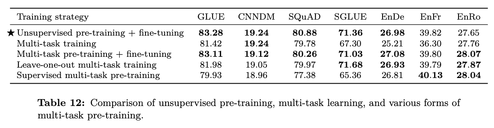

*   无监督预训练+微调是指 T5 预训练后在各项任务上的微调结果
*   多任务训练是将 T5 预训练和所有任务一起训练，直接在每个任务上验证结果
*   多任务预训练+微调就是把 T5 预训练和所有任务放在一起训练，然后微调每个任务的训练数据，然后验证结果
*   留一法多任务训练是对 T5 预训练和目标任务以外的任务进行多任务训练，然后对目标任务的数据集进行微调，然后验证结果
*   有监督的多任务预训练会直接对所有数据进行多任务训练，然后在每个任务上对结果进行微调

可以看出，在大量附属数据后，对特定数据进行微调，可以缓解大量数据预训练时数据不平衡的问题。

# 参考

[BERT:用于语言理解的深度双向变换器的预训练](https://translate.googleusercontent.com/[https://arxiv.org/pdf/1810.04805.pdf](https://arxiv.org/pdf/1810.04805.pdf))
[BART:用于自然语言生成、翻译和理解的去噪序列间预训练](https://translate.googleusercontent.com/[https://arxiv.org/pdf/1910.13461.pdf](https://arxiv.org/pdf/1910.13461.pdf))
[SpanBERT:通过表示和预测跨度来改进预训练](https://translate.googleusercontent.com/[https://arxiv.org/pdf/1907.10529.pdf](https://arxiv.org/pdf/1907.10529.pdf))
[BART:用于自然语言生成、翻译、 和理解](https://translate.googleusercontent.com/translate_c?depth=1&rurl=translate.google.com&sl=zh-CN&sp=nmt4&tl=en&u=https://arxiv.org/pdf/1910.13461.pdf&xid=17259,15700021,15700186,15700191,15700256,15700259,15700262,15700265,15700271,15700283&usg=ALkJrhhh9FSWEkToU5quuftH2FC9tW7iKw)
[跨语言语言模型预训练](https://translate.googleusercontent.com/translate_c?depth=1&rurl=translate.google.com&sl=zh-CN&sp=nmt4&tl=en&u=https://arxiv.org/pdf/1901.07291.pdf&xid=17259,15700021,15700186,15700191,15700256,15700259,15700262,15700265,15700271,15700283&usg=ALkJrhjXthAUBgZqpTiJkIBWHlz6Z9gtiw)
[Chinese-BERT-wwm](https://translate.googleusercontent.com/translate_c?depth=1&rurl=translate.google.com&sl=zh-CN&sp=nmt4&tl=en&u=https://github.com/ymcui/Chinese-BERT-wwm&xid=17259,15700021,15700186,15700191,15700256,15700259,15700262,15700265,15700271,15700283&usg=ALkJrhgLdlW9SurkWQBCzsW0ZvDZBAAkMA)
[XLNet:用于语言理解的广义自回归预训练](https://translate.googleusercontent.com/translate_c?depth=1&rurl=translate.google.com&sl=zh-CN&sp=nmt4&tl=en&u=https://arxiv.org/pdf/1906.08237.pdf&xid=17259,15700021,15700186,15700191,15700256,15700259,15700262,15700265,15700271,15700283&usg=ALkJrhgDqYVug3IpRuCFpDvpeeSpw4D6CQ)
[ALBERT:用于语言表示的自监督学习的 LITE BERT](https://translate.googleusercontent.com/translate_c?depth=1&rurl=translate.google.com&sl=zh-CN&sp=nmt4&tl=en&u=https://arxiv.org/pdf/1909.11942.pdf&xid=17259,15700021,15700186,15700191,15700256,15700259,15700262,15700265,15700271,15700283&usg=ALkJrhhLXedA84D7bP3FSvhIdw95XM4nnQ)
[RoBERTa:一种健壮优化的 BERT 预训练方法](https://translate.googleusercontent.com/translate_c?depth=1&rurl=translate.google.com&sl=zh-CN&sp=nmt4&tl=en&u=https://arxiv.org/pdf/1907.11692.pdf&xid=17259,15700021,15700186,15700191,15700256,15700259,15700262,15700265,15700271,15700283&usg=ALkJrhhcNQreUcfXZu2PzB71LKt6ZE3efA)
[所有可以压缩 BERT 的方法](https://translate.googleusercontent.com/translate_c?depth=1&rurl=translate.google.com&sl=zh-CN&sp=nmt4&tl=en&u=http://mitchgordon.me/machine/learning/2019/11/18/all-the-ways-to-compress-BERT.html&xid=17259,15700021,15700186,15700191,15700256,15700259,15700262,15700265,15700271,15700283&usg=ALkJrhhccjso5--kRIZkACBEfr0yO_nUuw)
[ELECTRA:预训练文本编码器作为鉴别器而不是生成器](https://translate.googleusercontent.com/translate_c?depth=1&rurl=translate.google.com&sl=zh-CN&sp=nmt4&tl=en&u=https://openreview.net/forum%3Fid%3Dr1xMH1BtvB&xid=17259,15700021,15700186,15700191,15700256,15700259,15700262,15700265,15700271,15700283&usg=ALkJrhgVDPWkdshWBYCS3FndriyDdnejrg)
[DistilBERT](https://translate.googleusercontent.com/translate_c?depth=1&rurl=translate.google.com&sl=zh-CN&sp=nmt4&tl=en&u=https://voidful.github.io/voidful_blog/implement/2019/12/02/bert-recent-update-2019/DistilBERT,%2520a%2520distilled%2520version%2520of%2520BERT:%2520smaller,%2520faster,%2520cheaper%2520and%2520lighter&xid=17259,15700021,15700186,15700191,15700256,15700259,15700262,15700265,15700271,15700283&usg=ALkJrhg5MfHlaMPHmdgbskiGxqGtKv6Ppg)
[用统一的文本到文本转换器探索迁移学习的极限](https://translate.googleusercontent.com/translate_c?depth=1&rurl=translate.google.com&sl=zh-CN&sp=nmt4&tl=en&u=https://arxiv.org/pdf/1910.10683.pdf&xid=17259,15700021,15700186,15700191,15700256,15700259,15700262,15700265,15700271,15700283&usg=ALkJrhjzs-JN-qgIT8gAtr5IgGhnxlsq5Q)
[用多语言语言表征模型进行跨语言迁移学习的零距离阅读理解](https://translate.googleusercontent.com/translate_c?depth=1&rurl=translate.google.com&sl=zh-CN&sp=nmt4&tl=en&u=https://arxiv.org/pdf/1909.09587.pdf&xid=17259,15700021,15700186,15700191,15700256,15700259,15700262,15700265,15700271,15700283&usg=ALkJrhjDMaWy2a2r5sRC0eTV549RwrI1YQ)
[预训练语言模型中出现的跨语言结构](https://translate.googleusercontent.com/translate_c?depth=1&rurl=translate.google.com&sl=zh-CN&sp=nmt4&tl=en&u=https://arxiv.org/pdf/1911.01464.pdf&xid=17259,15700021,15700186,15700191,15700256,15700259,15700262,15700265,15700271,15700283&usg=ALkJrhjUbwlEFoTz2BDyGG6Sgi6gCl787A)
[通用转换器](https://translate.googleusercontent.com/translate_c?depth=1&rurl=translate.google.com&sl=zh-CN&sp=nmt4&tl=en&u=https://arxiv.org/pdf/1807.03819.pdf&xid=17259,15700021,15700186,15700191,15700256,15700259,15700262,15700265,15700271,15700283&usg=ALkJrhh0uLqqfENqA_TeuVAJ8s5xBLscPQ)