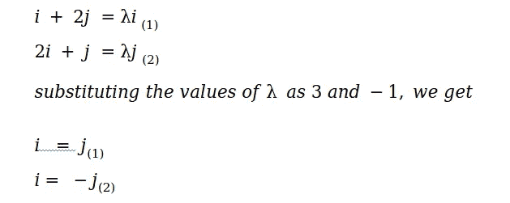

# 矩阵碰到向量会怎么样？

> 原文：<https://medium.com/analytics-vidhya/what-happens-when-a-matrix-hits-a-vector-ac14349c3596?source=collection_archive---------11----------------------->

## 理解特征向量，特征值和特征分解。让我们更好地理解一个矩阵。

你有没有想过，谷歌是如何在成千上万的网页中爬行，为你提供更好的搜索结果？或者根据矩阵的性质，你如何计算它的 100 次方？让我们试着回答这个系列中的一些问题。

是什么让矩阵如此重要？
矩阵的性质使其运算在计算上很快。回忆一下，借助矩阵运算，你是多么轻松地解决了线性方程组。你知道你的电脑是如何储存图像的吗？像素集，RGB 通道？又是矩阵。

**让我们回到我的问题。**假设我有一个 2×1 的向量乘以一个 2×2 的矩阵。为了便于说明，我把矢量表示在笛卡尔平面上。乘法前后。

(图 1:矩阵 A 和向量 v 的乘法)

> A = [[1，2]，[2，1]]，v = [[1]，[3]]，x = [[1]，[1]]
> Av = [[7]，[5]]

(图 2:矩阵 A 和向量 x 的乘法)

> Ax = [[3]，[3]] = 3[[1]，[1]] = λx 其中λ=3，λ是标量。

我建议你花 2 分钟时间，观察当我们用向量 v 乘以矩阵 A 时会发生什么，以及当我们用向量 x 乘以 A 时会发生什么，你能看出有什么不同吗？

**A 与 v 相乘后:** *1。合成矢量变化的幅度。
2。合成向量的方向也会改变。* ***我们可以说合成向量被偏离以及缩放(幅度增加/减少)***

**A 与 x 相乘时:** *1。合成矢量变化的幅度。
2。合成向量的方向保持不变。* ***我们可以说，合成向量是成比例的，但不是偏离的。***

> **向量 *x* ，称为特征向量。数学上，矩阵 A 的特征向量 *x* 是满足条件的向量。:**

> Ax = λx，______(1)
> 
> 其中，λ是标量，称为矩阵 a 的特征值，x 是非零向量。

> ***待办事项*** *:能否证明特征向量只能为方阵定义？(* ***提示*** *:听说过一个叫次元矩阵的东西？)*

现在我们知道了什么是特征向量和特征值，让我们来了解如何获得它们。

我们可以把 **Ax = λx** 写成
**axλx = 0⇔axλIX = 0⇔(aλI)x = 0**，I 是一个单位矩阵。记得我们在寻找一个非零向量，于是

> 当且仅当矩阵(AλI)有零行列式时，方程 Ax = λx 对向量 x 有非零解。
> 
> (A-λI 是单数)。即解方程
> 
> det(AλI)= 0 _ _ _ _ _ _ _ _(2)

通过解这个方程，我们可以得到λ的值。对于一个 NxN 矩阵，我们可以有 N 个λ值。

通过解方程(2 ),我们将得到λ中的 n 次多项式。在求解多项式的零点时，我们得到对应矩阵 a 的特征值。通过代入方程(1)中得到的特征值，我们得到对应于特征值λ的特征向量 x。

就拿上面的例子来说吧。并手动求解。

特征值的计算

现在我们已经得到了特征值，让我们求解方程 1，找到特征向量 x。

特征向量的计算。

分别对应于特征值 3 和-1 的特征向量。

*观察到了什么？没有吗？再看特征向量…对。一个矩阵可能有无穷多个特征向量。我建议你稍微研究一下特征值和特征向量，得出类似有趣的观察结果？如果矩阵是平方的，特征值会发生什么变化？矩阵 A 的 n 次方的特征值是多少？A 的逆的特征值是什么？*

> **NumPy 的实现同样是在 Google colab**[T5 这里](https://colab.research.google.com/drive/1NMnnTYVWyBUOmXVF-VbFg14CsSqFJPpn)

在下一部分，我们将学习矩阵的非国有化和特征分解。敬请关注。请随意提出任何建议。有什么想法吗？大家讨论一下。( [*LinkedIn*](https://www.linkedin.com/in/parth-patel12/) )。感谢 [Venktesh](https://medium.com/u/28b126a36b67?source=post_page-----ac14349c3596--------------------------------) (又名 Venky)不断把我推向曼梯·里。