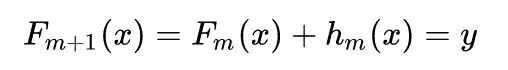
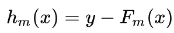
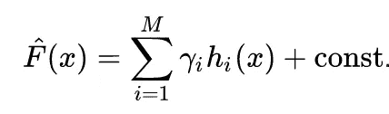
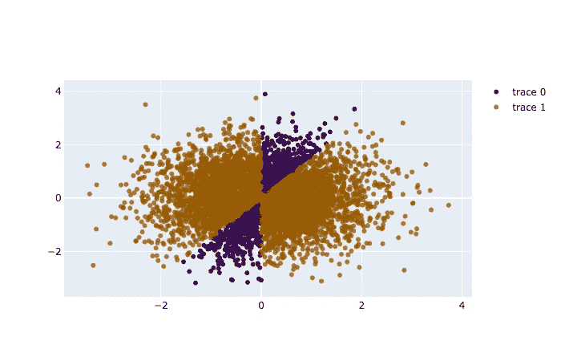

# 当你把第一棵树或者最后一棵树从你的梯度推进系综中移除时会发生什么？

> 原文：<https://medium.com/analytics-vidhya/what-happens-when-you-remove-first-or-the-last-tree-from-your-gradient-boosting-ensemble-315efaa85d5f?source=collection_archive---------7----------------------->


谢尔盖·阿库利奇在 [Unsplash](https://unsplash.com?utm_source=medium&utm_medium=referral) 上的照片

这一切都始于两位杰出的科学家迈克尔·科恩斯和莱斯利·加百利·瓦利安特早在 1989 年提出了一个简单的问题*“一组弱学习者能创造出一个强学习者吗？”*。这是非常直观的，有时一些弱球员变得不可或缺，互相补充，形成一支非常强大的球队，以弗格森爵士和他的曼联为例。这是否也适用于机器学习和统计学领域。然而，这个问题并没有长期得不到解答，因为一年后，Robert Schapire 发表了一篇论文，以积极的方式回答了这个问题，正是他的工作奠定了这一奇妙技术的基础，这一技术深受全球 kagglers 和数据科学家的喜爱。

从形式上讲，强化是一种将许多弱学习者结合起来创造强学习者的技术。当你这样听的时候，就好像蚂蚁在组队搬石头什么的。这里的“学习者”是一个比随机猜测表现稍好的模型。所以在回归的情况下，它可能是数据的平均值，很简单，不是吗？

在这篇文章中，我们将讨论梯度推进决策树是如何工作的，以及如果我们从计算中移除第一棵树或最后一棵树的贡献，我们的模型会发生什么。

## **决策树更新器**

决策树的核心是一个足够简单的分类器，它利用分治法，根据数据点在空间中的概率递归地分割特征空间。每次分割都平行于超维度中的一个轴。如果我们把我们的决策树模型画成流程图，我们会发现一个由' *if 和 else'* 语句组成的树，因此被命名为决策树。当我们使用线性模型并且我们有一个编码为数字的分类变量时，比如说一个描述假设数据集中位置的特征，编码可能看起来像{纽约:1，旧金山:2，德里:3}。线性模型将假设存在一个顺序，因为数字 1、2 和 3 具有序数依赖性。因此，为了将这些信息安全地合并到我们的线性模型中，我们必须“一次热编码”该特征，这似乎是一种可行的方法，但有时当我们的特征中有太多不同的值时，我们最终会有许多列，因此显著增加了我们的计算时间。这就是基于树的模型派上用场的地方，使用基于树的模型，我们可以很容易地摆脱顺序依赖。假设在我们假设的例子中，2 映射到一个特定的类，1 和 3 映射到另一个类。使用“if — else ”,我们可以轻松地创建一个简单、快速且相当准确的模型。

## **梯度推进决策树**

现在，与随机森林不同，随机森林的最终输出是由系综中的树产生的输出的模式或均值，其中每棵树都独立于另一棵树，梯度提升以逐阶段的方式工作，其中每个树学习器都依赖于其先前的树。随机森林生成大量试图捕捉不相关特征的树，而每个树学习者在梯度提升中的学习依赖于前一个树的输出。



现在让我们试着理解这个等式的含义。Fm 表示模型的'm^th'阶段的输出。我们在模型的开始指定总 m。这个等式假设如果我们有足够多的阶段，那么我们的输出将等于我们的目标“y”。hm(x)是我们试图拟合样本的模型(这里是决策树)。



因此，梯度提升将使模型“h”与作为上述等式的 RHS 的剩余值相匹配，从而减少每个后续阶段中的误差。

所以最后的等式是



其中γ可以被认为是学习率，而常量值用于初始化模型。因此，在梯度增强中，最终模型被构建为一系列后续模型，其中每个模型试图拟合由它的先前模型计算的残差值，这简单地意味着每个模型拟合((目标)——(它的先前模型的误差))。

现在你可能已经预感到标题中问题的答案了。如果你认为砍掉第一棵树比砍掉最后一棵树更具灾难性，那么是的，你完全正确。让我们在下一节用一个简单的例子来检验我们的理论。

```
import numpy as np
from sklearn.model_selection import train_test_splitX_all = np.random.randn(5000, 2)y_all = ((X_all[:, 0]/X_all[:, 1]) > 1.5)*2 - 1X_train, X_test, y_train, y_test = train_test_split(X_all, y_all, test_size=0.5, random_state=42)
```

因此，我们将创建一个从随机分布中采样的二维数据集。此外，我们将留出 50%用于测试集。让我们首先尝试一个单一的决策树桩，并检查它的表现如何。

> 虚拟化数据集



```
from sklearn.tree import DecisionTreeClassifier
from sklearn.metrics import log_loss
clf = DecisionTreeClassifier(max_depth=1)clf.fit(X_train, y_train)
y_pred = clf.predict_proba(X_test)[:, 1]print ('Accuracy for a single decision stump: {}'.format(clf.score(X_test, y_test)))
```

> 单个决策树桩的准确度:0.8224
> 测试对数损失:0.00086868686

现在，让我们安装一个梯度提升树分类器，并将其与我们的简单模型进行比较。

```
from sklearn.ensemble import GradienBoostingClassifier
clf = GradientBoostingClassifier(n_estimators=5000, learning_rate=0.01, max_depth=3, random_state=0)clf.fit(X_train, y_train)
y_pred = clf.predict_proba(X_test)[:, 1]print('Accuracy for a GBM: {}'.format(clf.score(X_test, y_test)))
print("Test logloss: {}".format(log_loss(y_test, y_pred)))
```

> GBM 的精度:0.9824
> 测试测井曲线损失:0.00008600001

很明显，梯度推进模型比单个树执行得更好，现在让我们检查如果我们移除第一个树或最后一个树的输出会发生什么。

```
def sigmoid(x):
    return 1 / (1 + np.exp(-x))def compute_loss(y_true, scores_pred):
    return log_loss(y_true, sigmoid(scores_pred))
```

因为我们使用原始分数，所以在计算 log_loss 本身之前，我们将包装 log_loss 并将 sigmoid 应用于我们的预测。

获取树的*决策函数*的累积和(cum_preds)。第 I 个元素是树 0…i-1 的和。我们不能使用 staged_predict_proba，因为我们想要操纵原始分数(而不是概率)。最后才使用 sigmoid 将分数转换成概率。

```
cum_preds = np.array([x for x in clf.staged_decision_function(X_test)])[:, :, 0]print ("Logloss using all trees:           {}".format(compute_loss(y_test, cum_preds[-1, :])))print ("Logloss using all trees but last:  {}".format(compute_loss(y_test, cum_preds[-2, :])))print ("Logloss using all trees but first: {}".format(compute_loss(y_test, cum_preds[-1, :] - cum_preds[0, :])))
```

> 使用所有树的对数损失:0.04533302136082253
> 使用除最后一棵树之外的所有树的对数损失:0.0453406808646

综上所述，移除最后一棵树没有太大影响的原因是因为我们的模型中有 5000 个阶段，对于这样一个简单的例子来说已经足够高了。即使级数较少，去除最后一级的贡献也不会有相当大的影响，因为前面的级是完整的。但是除去第一棵树的贡献，我们的损失增加了 0.02，这看起来并不多，但是如果这被应用到现实世界的问题中，变化将是巨大的。

第一棵树对 GBM 输出有相当大的影响，因为所有后续阶段(树)都是基于它构建的。如果我们提高学习速度，去掉第一棵树，模型就会爆炸。

希望您现在对 GBMs 及其工作原理有了更好的理解。GBM 通常是 kagglers 的*到*型号。

> 如果你喜欢这本书，请给它一个掌声或者你知道 50！