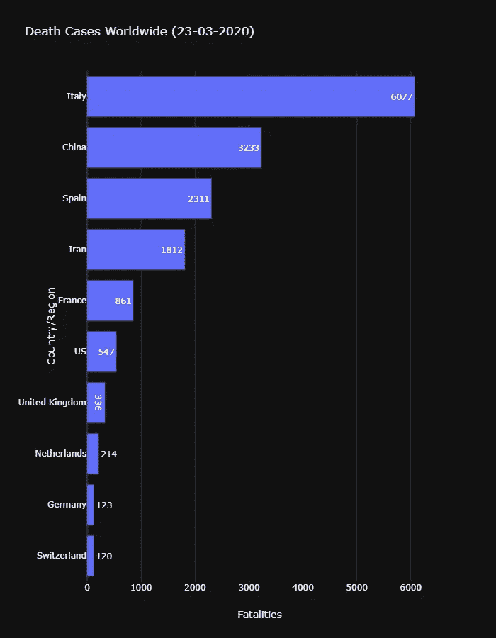

# 到目前为止我对新冠肺炎的了解——第一部分

> 原文：<https://medium.com/analytics-vidhya/what-i-have-learnt-so-far-about-covid-19-part-1-cfa5d02bf3b4?source=collection_archive---------17----------------------->

## 作为 EDA 的意识。


照片由[融合医学动画](https://unsplash.com/@fusion_medical_animation?utm_source=medium&utm_medium=referral)在 [Unsplash](https://unsplash.com?utm_source=medium&utm_medium=referral) 上拍摄

2019 年 12 月 31 日，世卫组织中国办事处首次报告了在中国武汉检测到的不明原因肺炎。该疫情于 2020 年 1 月 30 日被宣布为国际突发公共卫生事件。世卫组织宣布将这次爆发的冠状病毒命名为新冠肺炎。

根据[维基百科](https://en.wikipedia.org/wiki/Coronavirus)，**冠状病毒**是一组引起哺乳动物和鸟类疾病的相关病毒。在人类中，冠状病毒导致呼吸道感染，这些感染可能是轻微的，如一些普通感冒病例(在其他可能的原因中，主要是鼻病毒)，以及其他可能是致命的，如 [SARS](https://en.wikipedia.org/wiki/Severe_acute_respiratory_syndrome) 、 [MERS](https://en.wikipedia.org/wiki/Middle_East_respiratory_syndrome) 和[新冠肺炎](https://en.wikipedia.org/wiki/Coronavirus_disease_2019)。其他物种的症状各不相同:在鸡中，它们会导致上呼吸道疾病，而在牛和猪中，它们会导致腹泻。目前还没有疫苗或抗病毒药物来预防或治疗人类冠状病毒感染。

# 目前，世界正面临世卫组织宣布的疫情(新冠肺炎)疫情

我们直接进入数据分析。该数据集由[约翰·霍普斯金·CSSE](https://github.com/CSSEGISandData/COVID-19/tree/master/csse_covid_19_data/csse_covid_19_time_series)创建，可以在这里[下载。代码的链接可以在我的 github 页面上找到。](https://www.kaggle.com/c/covid19-global-forecasting-week-1/data)

**注意:**数据集每天都在更新，我将使用的数据集是从 2020 年 1 月 22 日到 2020 年 3 月 23 日。

# 导入库

```
# linear algebra
import numpy as np# data processing
import pandas as pd# for visualization
import matplotlib.pyplot as plt
import plotly.graph_objects as go
import plotly.express as px
import plotly.io as pio
pio.templates.default = "plotly_dark"%matplotlib inline
```

# 获取数据

```
# only the train data will be used
df = pd.read_csv('train.csv', na_filter=False)
```

`na_filter`参数忽略所有空数据，例如`Province/State`列为空数据。

# 探索性数据分析

```
df.columns.tolist()
```


数据中的列列表

有 8 个特征/列，分别包括 **ID:每个病例的标识符，省/州:各个国家的州，国家/地区:每个州的国家/地区，Lat & Long:每个地区的纬度&经度，日期:每个病例/死亡发生的时间段，已确认病例:每个国家的病例数，死亡人数:死亡病例数。**

```
df=df.drop(['Id'],axis=1)
df.head(10)
```


十大数据

从上表中，我们可以注意到一些事情。首先，已经使用`.drop()`方法移除了`ID`列，因为它与分析无关。其次，`Province/State`列中的空数据被忽略。

```
df['Country/Region'].unique().tolist()# rename 'Gambia, The' as 'The Gambia'
df['Country/Region'] = df['Country/Region'].replace('Gambia, The','The Gambia')
```

第一行显示所有受影响国家的列表。另一行将`Gambia, The`替换为`The Gambia.`

```
# no of affected country
affected_country = df['Country/Region'].nunique()
earliest_entry = f"{df['Date'].min()}"
last_entry = f"{df['Date'].max()}"print('There are {a} number of affected country within {b} and {c}'.format(a=affected_country,b=earliest_entry,               c=last_entry))
```

从上面的代码片段来看，在 2020 年 1 月 22 日 00:00:00 和 2020 年 3 月 23 日 00:00:00 之间有 162 个受影响的国家

# 更深入

让我们对确诊病例进行分析

1.  哪个国家的病例最多？

```
# confirmed cases as at 23-03-2020
cc = df.drop('Province/State',axis=1)
current = cc[cc['Date'] == max(cc['Date'])].reset_index()
current_case = current.groupby('Country/Region')['ConfirmedCases','Fatalities'].sum().reset_index()highest_case = current.groupby('Country/Region')['ConfirmedCases'].sum().reset_index()fig = px.bar(highest_case.sort_values('ConfirmedCases', ascending=False)[:10][::-1], 
             x='ConfirmedCases', y='Country/Region',
             title='Confirmed Cases Worldwide (23-03-2020)', text='ConfirmedCases', height=900, orientation='h')
fig.show()
```


确诊病例排名前十的国家。

中国的确诊病例最多，而伊朗是除中国之外受影响最大的亚洲国家。

2.世界范围内的案例。

```
ww_case = df.groupby('Date')['ConfirmedCases'].sum().reset_index()fig = px.line(ww_case, x="Date", y="ConfirmedCases", 
              title="Worldwide Confirmed Cases Over Time")fig.show()
```


显示一段时间内全球确诊病例

病毒的增长仍处于高峰期，这一点都不好。

3.随机国家的确诊病例。让我们对随机的国家进行分析

```
# China
ch= df.loc[df['Country/Region'] == 'China'].reset_index()
ch_group =ch.groupby('Date')['Date','ConfirmedCases'].sum().reset_index()# Italy
it = df.loc[df['Country/Region'] == 'Italy'].reset_index()
it_group =it.groupby('Date')['Date','ConfirmedCases'].sum().reset_index()# USA
us= df.loc[df['Country/Region'] == 'US'].reset_index()
us_group =us.groupby('Date')['Date','ConfirmedCases'].sum().reset_index()# plotting confirmed cases of the random countries
plot_titles = ['China', 'Italy', 'USA']# China 
fig = px.line(ch_group, x="Date", y="ConfirmedCases", 
              title=f"Confirmed Cases in {plot_titles[0].upper()} Over Time", 
              color_discrete_sequence=['#F61067'],
              height=500
             )
fig.show()# Italy
fig = px.line(it_group, x="Date", y="ConfirmedCases", 
              title=f"Confirmed Cases in {plot_titles[1].upper()} Over Time", 
              color_discrete_sequence=['#91C4F2'],
              height=500
             )
fig.show()# USA 
fig = px.line(us_group, x="Date", y="ConfirmedCases", 
              title=f"Confirmed Cases in {plot_titles[2].upper()} Over Time", 
              color_discrete_sequence=['#6F2DBD'],
              height=500
             )
fig.show()
```


显示一段时间以来中国确诊病例。


显示一段时间内意大利确诊病例


显示一段时间内美国确诊病例

从中国病例的情况来看，很明显，自 3 月份以来，这种疾病一直在缓慢传播，这是一个好消息。从表面上看，不像意大利。他们受到了严重的影响。我们也应该注意到美国的情况，在过去的几周里，他们已经增加了确诊病例。

4.截至 2020 年 3 月 23 日受病毒影响的所有国家地图。

**注:** `**current**` 变量取 2020 年 3 月 23 日的病毒信息。

```
fig = px.choropleth(current_case, locations="Country/Region", 
                    locationmode='country names', color="ConfirmedCases", 
                    hover_name="Country/Region", range_color=[1,5000], 
                    color_continuous_scale="peach", 
                    title='Countries with Confirmed Cases')
# fig.update(layout_coloraxis_showscale=False)
fig.show()
```


显示确诊病例的地理地图。

上图显示了病毒是如何在不同国家传播的。超过 20000 例的国家有:中国、德国、伊朗、意大利、西班牙、美国。

5.截至 2020 年 3 月 23 日，哪个国家的死亡病例最多？

```
highest_death = current.groupby('Country/Region')['Fatalities'].sum().reset_index()fig = px.bar(highest_death.sort_values('Fatalities',ascending=False)[:10][::-1],
            x='Fatalities',y='Country/Region',
             title='Death Cases Worldwide (23-03-2020)', text='Fatalities', height=900, orientation='h')fig.show()
```



展示全球死亡案例。

意大利的死亡率最高，令中国和世界其他国家黯然失色。

6.一段时间内的死亡率。

```
death_case = df.groupby('Date')['Fatalities'].sum().reset_index()fig = px.line(death_case, x="Date", y="Fatalities", 
              title="Worldwide Fatalities Over Time")fig.show()
```


展示了一段时间内世界范围内的死亡。

上图显示了全球死亡率的快速增长。

7.全球死亡病例地理地图。

```
fig = px.choropleth(current_case, locations="Country/Region", 
                    locationmode='country names', color="Fatalities", 
                    hover_name="Country/Region", range_color=[1,5000], 
                    color_continuous_scale="peach", 
                    title='Countries with Confirmed Cases')
# fig.update(layout_coloraxis_showscale=False)
fig.show()
```


显示不同国家死亡率的地理地图

意大利的死亡率最高，超过 6077 人，死亡率超过 1000 的国家有中国、伊朗、意大利和西班牙。

# 我们来查一下非洲各国的死亡率。

```
# all affected african country as at 23-03-2020africa = list(['Nigeria','Ethiopia','Egypt','Republic of the Congo','Tanzania','South Africa','Kenya','Algeria','Sudan','Morocco',
'Ghana','Cameroon','Cote d\'Ivoire','Burkina Faso','Zambia','Senegal','Somalia','Guinea','Rwanda','Benin',
 'Tunisia','Togo','Congo (Brazzaville)','Congo (Kinshasa)','Liberia','Central African Republic','Mauritania',
'Namibia','The Gambia','Gabon','Equatorial Guinea','Mauritius','Eswatini','Djibouti','Seychelles'])africa_death_rate = current[current['Country/Region'].isin(africa)]
# africa_death_rate.head()# plotting the the death rate geographically
fig = px.choropleth(africa_death_rate, locations="Country/Region", 
                    locationmode='country names', color="Fatalities", 
                    hover_name="Country/Region", range_color=[1,2000], 
                    color_continuous_scale='peach', 
                    title='African Countries with Confirmed Death Cases', scope='africa', height=800)
# fig.update(layout_coloraxis_showscale=False)fig.show()# the death cases of african countries as at 23-03-2020
africa_dr_group=africa_death_rate.groupby('Country/Region')['ConfirmedCases', 'Fatalities'].sum().reset_index()
africa_dr_group.sort_values('Fatalities', ascending=False)[['Country/Region', 'Fatalities']][:15].style.background_gradient(cmap='Reds')
```


显示非洲确诊死亡病例的地理地图。


非洲的死亡率。

截至 2020 年 3 月 23 日，埃及是非洲死亡率最高的国家，有 19 例死亡病例和 366 例确诊病例。

# 让我们来看看死亡率是如何在全球传播的。

```
# create death_spread variable
death_spread = df.groupby(['Date', 'Country/Region'])['ConfirmedCases', 'Fatalities'].max()
death_spread = death_spread.reset_index()
death_spread['Date'] = pd.to_datetime(death_spread['Date'])
death_spread['Date'] = death_spread['Date'].dt.strftime('%m/%d/%Y')
death_spread['Size'] = death_spread['Fatalities'].pow(0.3)fig = px.scatter_geo(death_spread, locations="Country/Region", locationmode='country names', color="Fatalities", size='Size', hover_name="Country/Region", range_color= [0, 100], projection="natural earth", animation_frame="Date", title='COVID-19: Deaths Spread Over Time  Globally (2020–01–22 to 2020–03–23.)', color_continuous_scale="peach")fig.show()
```


显示全球范围内由病毒引起的死亡传播。

上面的图显示，该病毒始于中国，导致越来越多的死亡病例，并于 2020 年 2 月 2 日开始传播到菲律宾和其他国家。

虽然新冠肺炎主要影响老年人，但也可能影响年轻人。即使你没有生病，你所做的关于去哪里的选择对其他人来说也可能是生与死的区别。请让我们保持安全，并遵循世卫组织预防措施，以遏制病毒。更多更新将会公布。

**未完待续……**

**参考**

1.  【https://en.wikipedia.org/wiki/Coronavirus 
2.  [https://www . ka ggle . com/c/covid 19-GLO https://www . ka ggle . com/c/covid 19-global-forecasting-week-1 bal-forecasting-week-1](https://www.kaggle.com/c/covid19-global-forecasting-week-1)
3.  [https://www . who . int/emergencies/diseases/novel-coronavirus-2019/events-as-these-as-than-occurrency](https://www.who.int/emergencies/diseases/novel-coronavirus-2019/events-as-they-happen)
4.  [https://www . ka ggle . com/abhi NAND 05/新冠肺炎-深入挖掘一点点](https://www.kaggle.com/abhinand05/covid-19-digging-a-bit-deeper)