# 我从零开始建立深度神经网络中学到了什么，以及为什么你也应该这样做！

> 原文：<https://medium.com/analytics-vidhya/what-i-learned-from-building-a-deep-neural-network-from-scratch-and-why-you-should-do-it-too-a2e6f422d3db?source=collection_archive---------9----------------------->

## 通过深度神经网络的实际实现和 Python 中真实数据集的正则化，我对神经网络的理解之旅

> 本文使用数学等式，将 [this](https://golopot.github.io/tex-to-unicode/) Tex 添加到 Unicode 扩展中，以获得更好的阅读体验。

我和神经网络斗争了很长时间。由于某种原因，在经历了无数的教程和指南后，我还是不能很好地掌握数学和神经网络的内部工作，老实说，这很令人沮丧，因为我认为自己在数学方面相当不错。因此，我不顾一切地试图理解正向传播和反向传播背后的数学原理，决定从头开始构建自己的神经网络，并希望能边学边学。根据我的经验，神经网络背后的数学并不难理解，相反，事实证明，有效实现它的过程才是具有挑战性的。现在，我同意一个人不需要真正理解神经网络的来龙去脉来有效地使用它，这要感谢 Tensorflow 和 Pytorch，它们使得实现你想要的任意多层的神经网络变得非常方便。但这不是这个活动的重点。这里的要点是理解和欣赏深度神经网络的幕后实现，以便我们可以学习使用 Tensorflow、Pytorch 或 Theano 等库来充分发挥它们的潜力。

让我带你看看我用 Python 从头开始构建深度神经网络的过程，并希望说服你也自己构建一个…

# 神经网络快速概述

深度前馈网络，也称为前馈神经网络，或多层感知器(MLPs)，代表了最典型的深度学习模型。MLP 的目标是逼近某个函数 f* *。根据 Goodfellow、Bengio 和库维尔在他们的书“* [*深度学习*](http://www.deeplearningbook.org/) *”中的说法，对于一个分类器，y= f** (x)将一个输入 x 映射到一个类别 y .一个前馈网络定义了一个映射 y = f(x；θ)并学习产生最佳函数近似的参数θ。

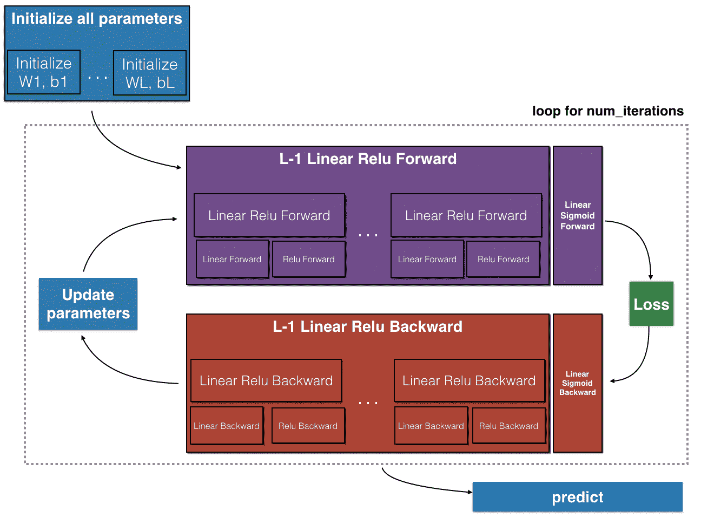

来自吴恩达关于神经网络和深度学习的课程:[https://www . coursera . org/learn/Neural-Networks-Deep-Learning？专业化=深度学习](https://www.coursera.org/learn/neural-networks-deep-learning?specialization=deep-learning)

神经网络的组件

*   输入层 X
*   任意数量的隐藏层
*   参数 W(权重)和 b(偏差)
*   每层的激活功能
*   输出图层 y^ (yhat)

在这里阅读更多关于神经网络

# 概观

我们将在 Python 中实现的是——

1.  挑选真实的数据集
2.  为我们的神经网络准备好数据集，即预处理
3.  构建神经网络

*   初始化参数，he 初始化和 Xavier 初始化
*   正则化、L2 正则化和脱落正则化

4.带脱落正则化的前向传播

*   ReLU 和 Sigmoid 激活

5.用 L2 正则化计算成本

*   对数损失成本函数

6.具有 L2 和脱落正则化的反向传播

*   ReLU 和 Sigmoid 函数的导数

7.训练模型并预测结果

注意:

*   本文假定您理解 Python
*   本文并没有详细介绍一些概念和理论，但是，我提供了一些研究论文和文章的链接，这些论文和文章深入探讨了这些概念。我试图通过实际的实现来理解这些概念是如何运作的。

# 数据集

本活动的目的是通过实际实施加深对神经网络的理解。所以我选择了一个二元分类问题。这里的任务是训练一个深层的神经网络来区分电动汽车和电动公交车([链接到数据集](https://www.kaggle.com/positivepc/object-detection?)))。这个数据集包含了 900 多张电动汽车和电动公交车的图片，这些图片已经被分成了一个测试集文件夹和一个训练集文件夹，这样就方便了。

首先，让我们导入我们将用于这个项目的所有库-

```
import numpy as np 
import matplotlib.pyplot as plt 
import cv2 
import os 
import random 
import seaborn as sns 
from tqdm import tqdm
```

接下来，让我们写一个函数，它将允许我们从测试和训练集图像中创建我们的 X 和 y 数组

这里，我们需要加载图像，并将其重新缩放到 64 x 64，因为它们的大小不同。函数 get_data(文件)采用文件夹名(“Training_set”或“test”)，该文件夹名又包含两个不同的文件，分别是“电动汽车”和“电动公交车”。由于该功能会逐一检查每个文件，因此对数据集进行洗牌很重要，这样就不会将所有的电动汽车一起成批处理，也不会将所有的电动公交车一起成批处理。

数据集被预分割成训练集(743 个图像)和测试集(191 个图像)，所以我们只需要调用这些文件夹上的 get_data()函数来获得我们的 X_train、y_train 和 X_test、y_test 数组。

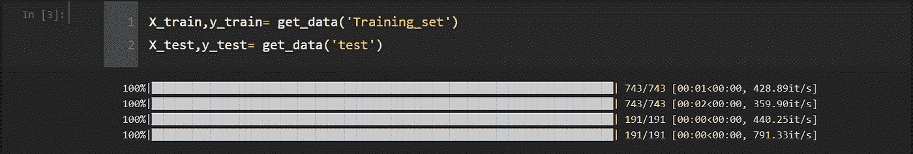

作者的形象

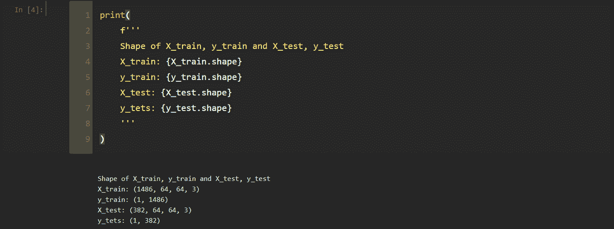

作者的形象

这是一些来自我们数据集的图像例子以及它们的标签-


作者的形象

# 图像的预处理

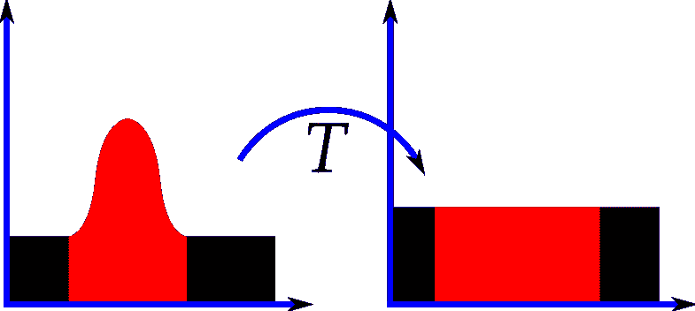

均衡前后图像的直方图。([https://en.wikipedia.org/wiki/Histogram_equalization](https://en.wikipedia.org/wiki/Histogram_equalization))

我们需要处理图像，通过抑制不必要的失真来改善图像数据，或者增强对我们的模型的更好性能很重要的一些图像特征。我们需要做的第一件事是使图像符合统一的纵横比，这是我们在 get_data(file)函数中将图像调整为 64 x 64 时所做的。接下来，我们将通过直方图均衡化来标准化光照。这种方法通过增加图像的整体对比度来帮助更好地分布发光强度。(更多关于直方图均衡化的信息[请点击这里](https://en.wikipedia.org/wiki/Histogram_equalization))

图像中的像素在范围[0，255]内，通过将每个像素除以 255，我们能够将它们缩放到范围[0，1]。这使得在训练网络的同时成本收敛更快(关于图像预处理的大文章[这里](https://becominghuman.ai/image-data-pre-processing-for-neural-networks-498289068258#:~:text=This%20is%20done%20to%20expose,characteristics%20in%20the%20data%2Dset.)))。最后，通过将图像转换为灰度，我们能够将 RGB 通道压缩为一个通道，并降低数据集的维度，从而加快训练速度。

> 关于我们如何处理图像以增强神经网络性能的补充阅读[此处](https://arxiv.org/ftp/arxiv/papers/1710/1710.06805.pdf)。

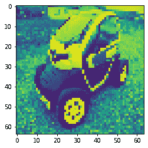

图片来自作者

这是预处理后随机图像的外观

需要做的最后一件事是拉平数据，这基本上意味着减少输入数据集 XXX 的维度。如上所述，输入数据的形状是(m，64，64，3 ),现在当它被处理并变成灰度级时，它的形状将是(m，64，64，1)。数组 X_train 和 X_test 现在需要以形状(64 *64* 1，m)展开，以便减少维数，并获得可以输入到我们的神经网络中的形式。

```
#flattening X X_train= X_train.reshape(X_train.shape[0],-1).T X_test= X_test.reshape(X_test.shape[0],-1).T
```

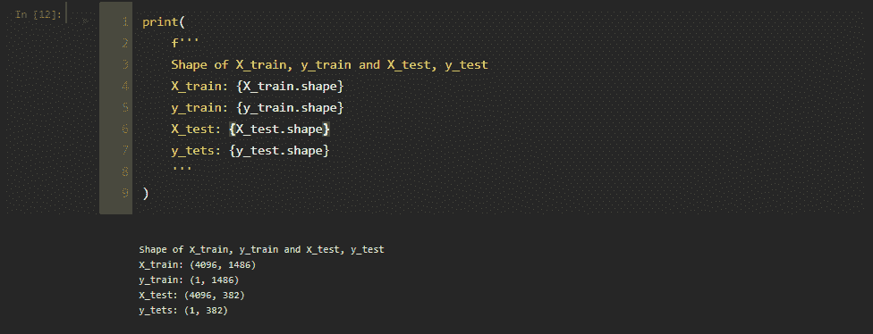

图片来自作者

> 现在数据已经准备好了，我们可以开始构建我们的神经网络了…

# 初始化

首先，我们需要通过给网络中每一层的每个神经元分配随机权重来初始化神经网络。这些权重不能用零初始化，因为这将导致所有神经元在训练期间学习相同的特征。用相等的权重(在这种情况下为零)初始化将意味着所有隐藏单元对成本具有相同的影响，因此将具有几乎相同的梯度。这将阻止不同的神经元学习不同的东西。为了克服这个问题，我们需要打破这种对称性，用随机值初始化权重。

然而，还有另一个问题，如果用太小的值初始化权重，将导致学习缓慢，并引入消失梯度的问题。这发生在相对于早期层中的权重的梯度变得非常小时，这将意味着对我们的参数的更新非常小，并且成本函数最终停留在相同的值。另一方面，如果初始化的权重太大，可能会导致发散(更多信息[此处](https://www.deeplearning.ai/ai-notes/initialization/))。这可以通过使用用于 ReLU 激活的 *He 初始化(*[*He et al 2015*](https://arxiv.org/pdf/1502.01852.pdf)*)*或用于 tanh 激活的 *Xavier 初始化(*[*Glorot et al 2010*](http://proceedings.mlr.press/v9/glorot10a/glorot10a.pdf)*)*来解决。

*   关于激活功能的伟大文章[在这里](https://towardsdatascience.com/activation-functions-neural-networks-1cbd9f8d91d6)
*   解释消失/爆炸渐变问题的视频[这里](https://www.youtube.com/watch?v=qO_NLVjD6zE)

使用大小为 64 x 64 和 3 个颜色通道(RGB)的输入图像来决定初始化神经网络的矩阵形状的快速指南

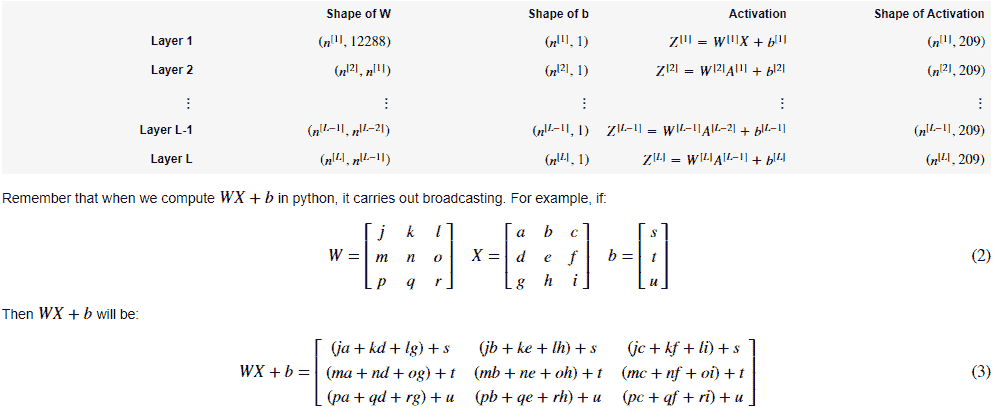

来自吴恩达关于神经网络和深度学习的课程:[https://www . coursera . org/learn/Neural-Networks-Deep-Learning？专业化=深度学习](https://www.coursera.org/learn/neural-networks-deep-learning?specialization=deep-learning)

我们将对所有隐藏层使用 ReLU 激活函数，对输出层使用 Sigmoid 激活函数。

# 关于正则化的快速注释

在我们继续向前传播之前，理解过拟合的概念是很重要的。就像消失/爆炸渐变一样，过度拟合也会导致我们的模型表现不佳。一般来说，过度拟合发生在数据训练得太好的时候。这意味着该模型非常适合训练数据，但不能推广到其他数据。

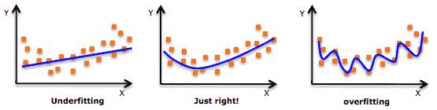

[https://www . analyticsvidhya . com/blog/2015/02/avoid-over-fitting-regularity/](https://www.analyticsvidhya.com/blog/2015/02/avoid-over-fitting-regularization/)

这种情况的一个常见原因是在小数据集上训练模型，算法将试图确保它完全满足所有数据点，并最终过度拟合。对付它的一个方法是使用正规化。正则化本质上迫使模型更简单，从而减少过度拟合的机会(关于过度拟合的好文章[在这里](https://elitedatascience.com/overfitting-in-machine-learning)

谈到正则化的实际应用，有两种最常见的正则化方法用于神经网络，L-2 正则化和丢弃正则化(后者不太常见)。这两种方法都非常有效，但 Srivastava、Hinton、Krizhevsky、Sutskever 和 Slakhutdinov 在 2014 年发表的这篇[论文](https://www.cs.toronto.edu/~hinton/absps/JMLRdropout.pdf)证明，如果同时使用 L-2 正则化和 Dropout 正则化，可以提高模型的准确性。现在就来吧！！当 Geoffrey Hinton 让你对你的模型做些什么的时候，你不要问问题，你只要做就行了！

*   L-2 正则化-这里我们将权重 W 的平方值添加到成本函数中，这一术语也称为权重衰减，有助于使权重更接近于零。(进一步详情[此处](http://www.deeplearningbook.org/contents/regularization.html))
*   退出正则化-这种技术在每次迭代中关闭随机神经元，这意味着在每次迭代中，您训练一个不同的模型，该模型只使用一些神经元。这使得神经元对其他神经元不太敏感，从而减少过度拟合。

我们的模型可能会也可能不会过度拟合数据，但这里的目标是学习深度神经网络的概念和实现，因此我们将实现上面提到的两种正则化技术。

> [这里](https://towardsdatascience.com/regularization-techniques-for-neural-networks-e55f295f2866)是一篇进一步详细讨论正规化的文章。

# 正向传播

在神经网络的这个阶段，输入被输入到神经网络中。这导致使用当前权重集跨隐藏层的正向计算流。这些通过层的正向计算的结果是基于当前权重的预测结果 *y^* ，使用损失函数将该预测结果与实际预期输出( *y* )进行比较。这个损失函数的导数需要根据我们网络的所有层中的权重来计算，当我们实现反向传播时更是如此。

简而言之，我们在前向传播期间计算并存储神经网络的中间变量。

让我们快速回顾一下计算步骤-

注意:大写字母是指包含来自给定层 *l* 中所有神经元或节点的值的矩阵和向量。例如， *a^l* 是层 *l* 中单个节点的激活，而 *A^l* 是包含层 *l* 中每个节点的激活值的向量。

# 价值函数

成本函数 J 是神经网络在给定训练数据和预期输出的情况下表现如何的度量。对数损失或交叉熵成本衡量分类模型的性能，其中预测输入是介于 0 和 1 之间的概率值，目标是最小化该值。随着预测值( *y^* )偏离实际标签( *y* )，测井曲线损失增加。(更多信息[此处](http://wiki.fast.ai/index.php/Log_Loss#:~:text=Logarithmic%20loss%20(related%20to%20cross,is%20to%20minimize%20this%20value.&text=Log%20loss%20increases%20as%20the%20predicted%20probability%20diverges%20from%20the%20actual%20label.)))

# 反向传播

这里的主要目标是通过使用微分学的链式法则来学习损失函数相对于不同权重的梯度。然后使用这些梯度更新权重。这些梯度是从输出节点开始反向学习的，这一过程称为反向传播。

简单地说，计算出的梯度显示了我们的参数需要改变多少才能使成本最小化。

让我们回顾一下计算和代码:

> 关于反向传播的精彩文章[这里](http://neuralnetworksanddeeplearning.com/chap2.html)

# 更新参数

在这个最后的步骤中，我们使用反向传播期间计算的梯度来更新我们的参数

# 把所有东西放在一起

现在让我们写一个函数把所有的东西放在一起。这里，我们需要多次循环梯度下降，以使成本收敛。超参数学习率、迭代次数、lambda 和 keep prob 可以进一步微调，以提高我们的神经网络的性能。

# 微调模型以获得更好的结果

最佳实践是将测试数据集进一步划分为交叉验证集和测试集。交叉验证集用于通过更改和调整不同的超参数来比较和评估模型的性能，一旦找到这些超参数的最佳值，它们将用于在训练集上训练模型，然后最终在测试集上进行测试。

注意:我没有在这里这样做，因为运行多个模型在计算上是昂贵的，如上所述，这个项目的重点不是找到最好的模型，而是通过实际的实现来学习。

## 偏差与方差

偏差-高偏差表示模型与训练数据不太吻合，训练误差较大，而低偏差表示模型与训练数据非常吻合，训练误差较小。

方差-高方差意味着模型无法对验证/测试集做出准确预测，验证误差较大，而低方差意味着模型非常适合验证/测试集，验证误差较小。

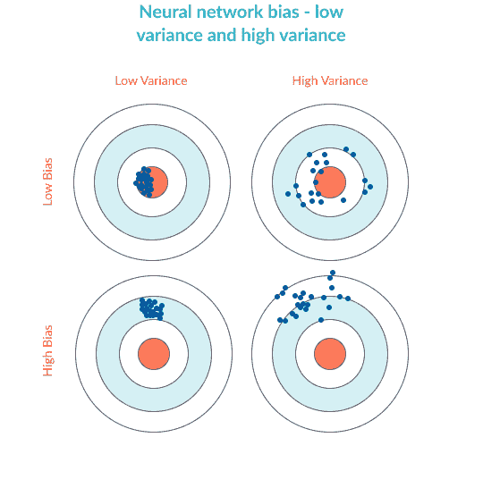

[https://missing link . ai/guides/neural-network-concepts/neural-network-bias-bias-neuron-over fitting-under fitting/](https://missinglink.ai/guides/neural-network-concepts/neural-network-bias-bias-neuron-overfitting-underfitting/)

当模型经历低偏差和高方差时会出现过度拟合，处理此问题的一些方法是

*   使用更大的网络，即更多层
*   训练时间更长，即迭代次数或周期数更多

当模型经历高偏差和高方差时，会出现欠拟合，处理这个问题的一些方法是

*   获取更多数据或在图像分类的情况下使用[图像增强](https://towardsdatascience.com/image-augmentation-for-deep-learning-histogram-equalization-a71387f609b2)
*   使用正则化

# 训练模型并预测结果

正如我上面提到的，我没有创建交叉验证数据集，也没有通过尝试超参数学习率、lambda 和保持概率的不同值来调整模型。我确信，通过改变这些超参数，尝试不同的架构，甚至使用图像增强来获得更多数据，可以对该模型进行微调，以实现更好的性能。然而，要记住的一点是，运行多个模型在计算上是昂贵的，尤其是因为我们还使用了 L2 和下降正则化。

> 你可以从我的 Github [这里](https://github.com/harsheev/DeepNeuralNetwork_from_scratch)下载完整的笔记本并试一试！

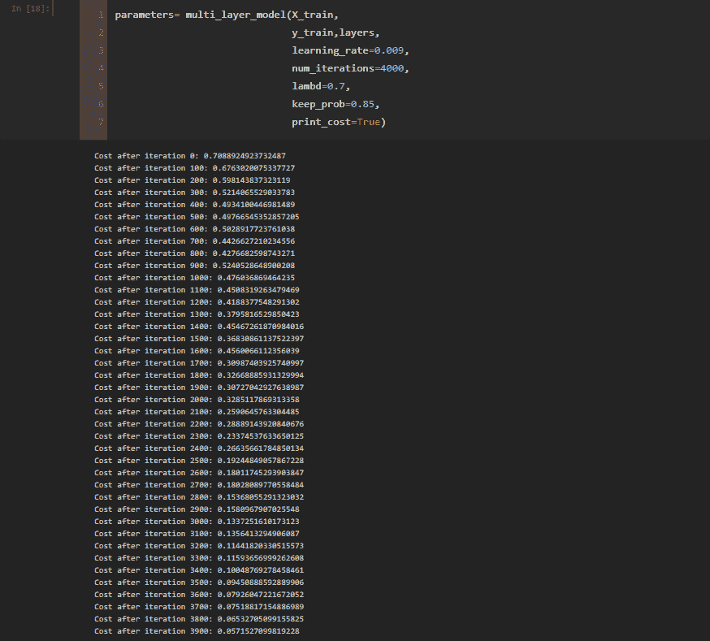

图片来自作者

# 预测结果

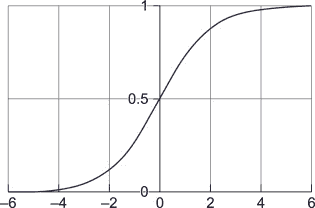

s 形曲线([https://en.wikipedia.org/wiki/Sigmoid_function](https://en.wikipedia.org/wiki/Sigmoid_function))

为了获得对新数据集的预测，我们需要使用我们新学习的参数 W 和 b 对输入数据 X 实施正向传递。这种正向传递的输出将是概率，因为我们在最后/输出层上使用 sigmoid 函数。观察 sigmoid 曲线，我们可以有把握地假设，如果激活大于 0.5，则 y^=为 1，否则 y^=为 0。

让我们写一个函数，根据概率来预测输出-

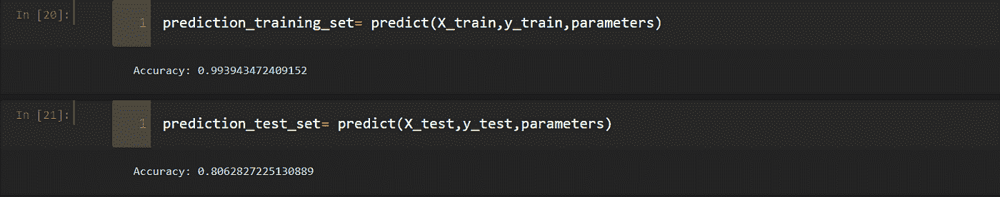

图片来自作者

在没有任何调整的情况下，我们的训练精度为 *99.4%* ，测试/交叉验证精度为 *80.6%* ，这是一个良好的开端，我可以很高兴地说，我们的小项目取得了巨大的成功，结果可以通过微调超参数来改善。

我非常鼓励所有有抱负的数据科学家在学习神经网络的旅程中至少做一次这项活动，因为它不仅会让你对神经网络更加熟悉，还会帮助你对许多使用的概念形成有用的直觉。现在，当你使用 TensorFlow 和 PyTorch 时，你可以肯定你确切地知道幕后发生了什么。这个活动给了我很大的帮助，我希望你也会觉得有用。

最后，我想与你分享一些我用来学习和理解本文中使用的一些概念的资源

## 我推荐的关于深度学习的书籍

> **神经网络和深度学习:一本教科书**(Charu c . Aggarwal):[https://www . pdf drive . com/Neural-Networks-and-Deep-Learning-A-Textbook-e 184020999 . html](https://www.pdfdrive.com/neural-networks-and-deep-learning-a-textbook-e184020999.html)
> 
> **深度学习**(伊恩·古德菲勒和约舒阿·本吉奥和亚伦·库维尔):[http://www.deeplearningbook.org/](http://www.deeplearningbook.org/)

## 在线课程

> **神经网络与深度学习:**([https://www . coursera . org/learn/Neural-Networks-Deep-Learning？)](https://www.coursera.org/learn/neural-networks-deep-learning?))
> 
> **改进深度神经网络:超参数调整、正则化和优化:**([https://www.coursera.org/learn/deep-neural-network?)](https://www.coursera.org/learn/deep-neural-network?))