# 我从我的第一个图像处理项目中学到了什么

> 原文：<https://medium.com/analytics-vidhya/what-i-learned-from-my-first-image-processing-project-44433d1fddb7?source=collection_archive---------13----------------------->

## 利用 OpenCV Python 从眼底图像中提取血管

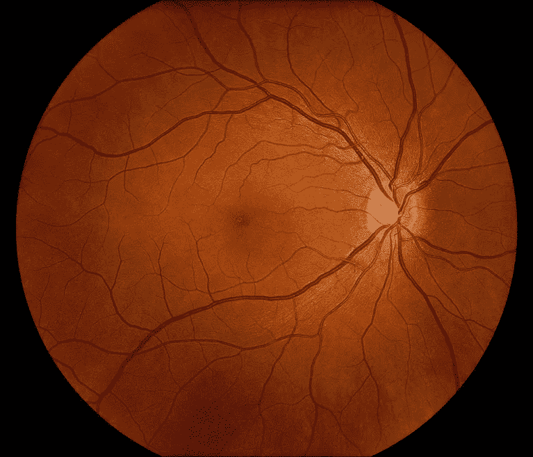

眼底图像

图像处理是对图像进行某种操作，以获得增强的图像或从中提取有用信息的方法。

管道是一系列相连的操作集合，其中一个操作的输出是下一个操作的输入。在图像处理中，一项任务可以通过许多不同质量的不同管道来完成。

我对任何试图用一个新框架开始一个项目的人的建议是，不要试图在项目开始之前了解关于该框架的一切。你可以边做边了解。最好能有个大概的概念，我们能用这个技术和项目蓝图做什么。让我们以这个项目为例。

在这个项目中，我们的最终目标是分别提取大血管和小血管。血管在图像中被突出显示，因为它们比其他血管更暗。所以一开始我想，如果我能通过颜色过滤所有的血管(这不起作用)，那么我可以通过平滑或模糊来去除小血管，并提取大血管。之后，我需要做的就是从所有血管中减去大血管，提取小血管。这是我实现目标的最初途径。

然后我发现了一种使用 HSV 颜色空间来检测物体的方法。这是代码。

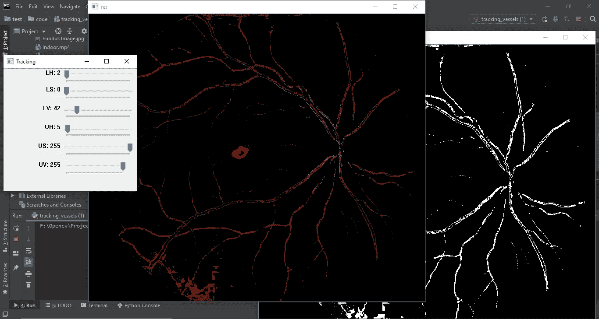

带跟踪条的遮罩和分辨率输出

在这里，您可以更改参数并查看输出如何变化。点击退出按钮关闭它。上面的数字是我得到的最好的一个，我对输出不满意。然后我开始用增加亮度和对比度的方法试了一下。但是它没有给我我想要的东西。所以我决定换一种方法。

然后我发现 ***灰度*** 和 ***绿色通道*** 图像更容易在各种任务中工作，例如在许多形态学操作和图像分割问题中，并且当我们处理单层图像时，更容易区分图像的特征。于是我应用了 ***灰度*** 和 ***阈值*** 配合 ***去噪*** 。

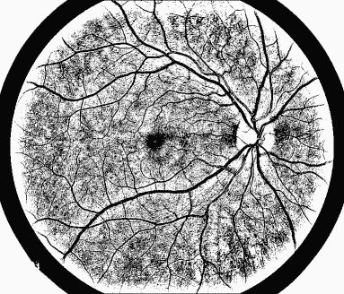

应用灰度后的阈值和去噪

因此，我们可以清楚地看到，它比以前提取了更多的血管，但有很多噪声。所以我必须想办法消除这些噪音。多亏了堆栈溢出，我找到了移除小对象的方法，但是当我直接将它应用到这里时，它移除了相当多的数据。在谷歌和 stack overflow 的帮助下，我找到了一个解决这个问题的方法，应用 ***膨胀*** ，然后移除小物体。

移除小物件

内核大小的膨胀(5，5)

我尝试了不同内核大小的膨胀，最终得到的是 size (2，2)。然后我不小心用大小(1，2)试了一下，它有一些比内核大小(2，2)更多的细节。然后我用大小(2，1)试了一下，它也有一些比内核大小(2，2)更多的细节，甚至比(1，2)更多的细节，但有些细节丢失了。当我合并(1，2)和(2，1)图像时，它给出了更好的输出。

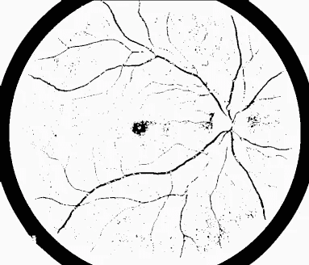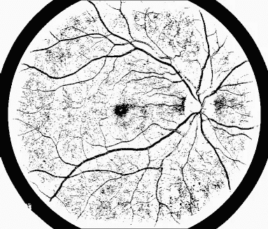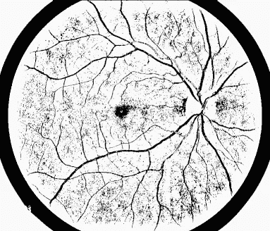

从左边开始(内核大小为(2，2)，内核大小为(1，2)，内核大小为(2，1))

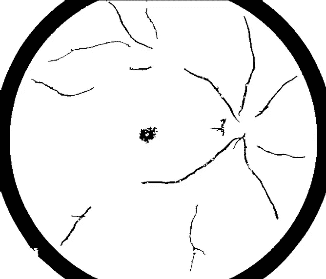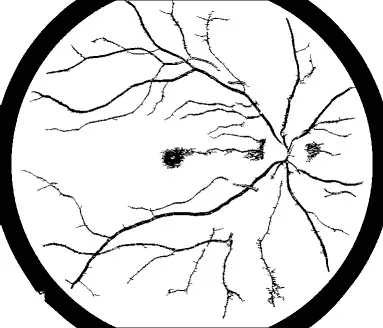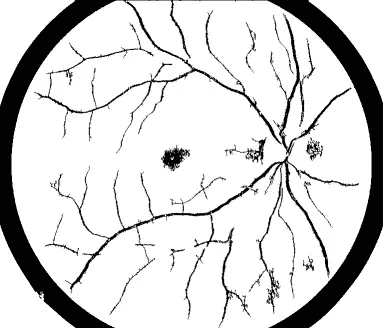

从左侧开始(移除内核大小为(2，2)、内核大小为(1，2)、内核大小为(2，1)的小对象后)

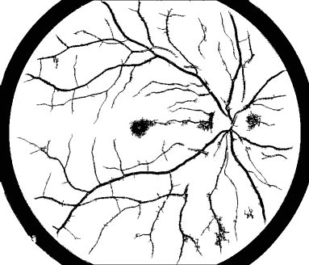

合并用核大小(1，2)和(2，1)过滤的图像后

提取所有血管

可能有一些其他的管道可以提供比这更好的输出。但是我很高兴我得到了什么，因为这是我的第一个图像处理项目和我的时间😉。如果我们去掉背景，你会看得更清楚。你可以使用**屏蔽**和 ***逐位非*** 运算符来完成。

**遮罩**是由零值和非零值组成的二进制图像。如果**屏蔽**应用于另一个二进制或相同尺寸的**灰度**图像，则**屏蔽**中为零的所有像素在输出图像中被设置为零。所有其他保持不变。

在我们的例子中，我们可以定义一个类似下面的函数来移除背景。

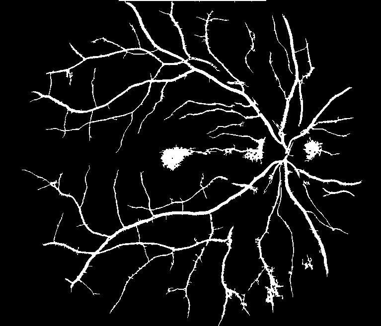

移除背景后

那好吧。现在我的第一步完成了。现在我应该尝试提取大血管或小血管。然后我可以从所有血管中减去它，得到另一种血管类型。但是由于小血管比较细，我觉得除了大血管之外的小血管切除起来会比较容易。

我最初的想法是通过应用模糊和平滑来提取小血管。但是并没有像我想的那样奏效。所以我不得不转向另一种方法。然后，我尝试使用椭圆形状的结构元素进行形态变换，我能够移除小血管。然后我发现轮廓，并删除小组件，同时绘制其他轮廓。以下功能将为您提取大血管。

在应用形态变换之后

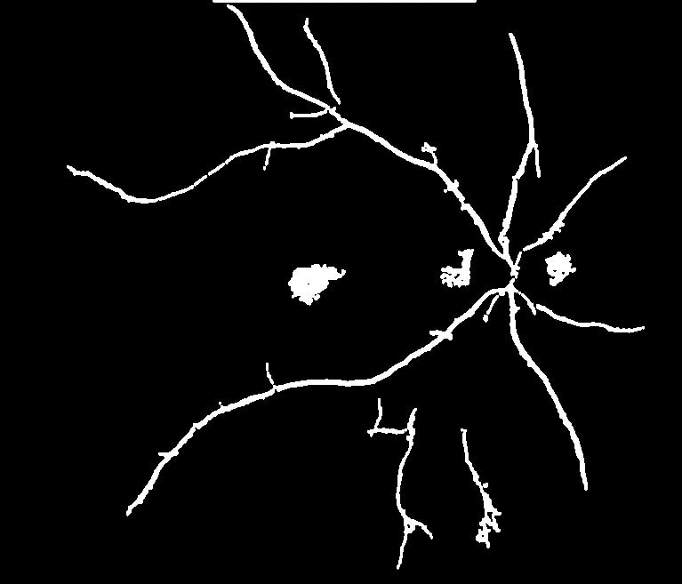

大血管

然后通过减法，你可以使用下面的函数提取小血管。

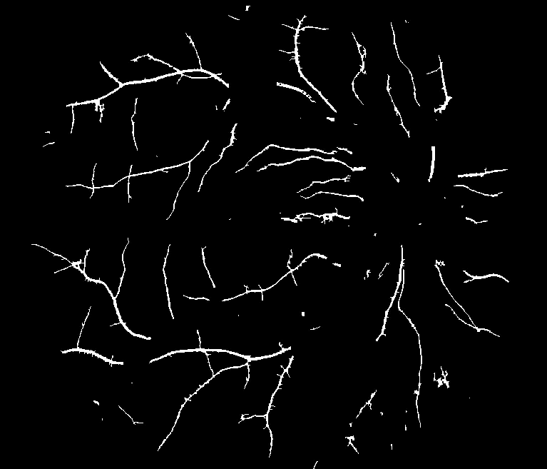

小血管

正如我已经说过，这是我的第一次尝试，它可能不是最好的管道。如果你有比这更好的东西，请留下评论，让我知道。最后，我学到的是，没有找到最佳管道的理论或规则。这是你必须从经验和研究中获得的东西。

希望这个关于图像处理操作的教程能够帮助那些刚接触 OpenCV 图像处理的人。

完整代码请访问我的 [Github 库](https://github.com/jpbinith/Extract_Blood_Vessels_from_Fundus_Image.git)。