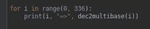

# 如果嵌套循环的数量取决于执行时的输入，会怎么样？递归的简明介绍

> 原文：<https://medium.com/analytics-vidhya/what-if-the-number-of-nested-loops-depends-on-inputs-at-runtime-4b161721eb22?source=collection_archive---------14----------------------->

## 让我们从一个简单的例子开始，使标题清晰，

假设给我们两组东西，一组是圆，另一组是三角形，我们想尝试所有可能的圆-三角形对。

两组

2 个嵌套循环(Draw 是一个示例函数，可以画出任何给它的东西)

现在不仅要考虑改变圆形或三角形的数量，还要考虑改变组的数量，例如，给你圆形、三角形、心形等等…

三组

3 个嵌套循环(Draw 是一个示例函数，可以画出任何给它的东西)

因此，一个简短的描述是，你有一个算法问题，其中嵌套循环根据用户输入而变化，或者准确地说是在运行时，而不是在代码运行时，如上面的例子所示。

一般来说，你不可能为所有可能的用户输入编写所有可能的程序！

我在实践中不止一次遇到这个问题，我不认为我找到了好的资源。

## 所以现在，让我们开发一个解决方案(使用数字基数)，

(稍后我们将使用递归开发另一个不同的解决方案)

如果你是计算机科学或一般算法的新手，你会想是否有一个神奇的语法东西可以实现这个功能，但一般来说，这个功能没有语法糖，但我们可能会以不同的方式思考这个问题。

如果我们把每一个配置都看作是一堆状态中的**单个状态的一个元组/配置【如图中的圆形、三角形、心形】会怎么样，如下图所示，**

在状态上循环(Draw 是一个示例函数，可以画出给它的任何东西)

在这种形式下，我们可以从任意数量的桶直接循环任意数量的状态。在我们的例子中，我们有 3 个桶，即圆形、三角形和心形，现在我们准备接受任意数量的桶。

## 现在如何找到这些状态呢？

如果你仔细观察，你会发现我们实际上在做类似于**计算状态**的事情，但是我们实际上是如何计算十进制数的呢？还是二进制？

既不是十进制也不是二进制，我们用的是不同基数的**数系！**

让我们回忆一下二进制到十进制的转换，

我没有这张图片([https://www . online math 4 all . com/binary-to-decimal-conversion . html](https://www.onlinemath4all.com/binary-to-decimal-conversion.html))

这很简单，要把二进制转换成十进制，二进制数 **b** 中的每一个二进制数字 **b_i** 都要经过 **2^i** 的加权，才能找到十进制的等价数 **d** 。

因此，我们处在一个以 **2** 为基数的二进制系统中。

我猜你现在知道不同基数的数字系统意味着什么了吧！我们将得到一个基数为 T3 的 T2 列表，而不是二进制中的固定基数 2。十进制等效值 **d** 由源数 **s** (类似于 **b_i** )中的每一个源数字 **s_i** 通过(基数)到 **i** 的乘积而不是固定基数 2 加权得到。

**(base_j)** 表示位于 **j** 的基地

每个 **s_i** 数字都有自己可能的值，如果 **s_i** 是二进制的我们就有 0，1 如果 **s_i** 是三进制的我们就有 0，1，2……嗯？

我认为这个不清楚，最好用下面的图片来描述它，

我们对**四位数**分别带 **(2，7，4，6)** 有问题。

在二进制中，基数看起来像(2，2，2，2..)和十进制 **(10，10，10，10..)**

在上图中，绿色方框表示我们在**四位多基数系统**中为数字 1323 选取的特定值。

为了找到十进制的等价数(基数为 1323 ),我们将使用上面第二个难看的公式，

而这个系统要表示的最大数量是 6*4*7*2=336。

所以我们从一开始就把所有的基数相乘，而不是我们在第一个公式中使用的幂。

**现在，我们可以使用这些状态，就像我们在用十进制计数一样，并将它们转换为用户输入所需的基数，这导致嵌套循环发生变化。(比如尝试不同品种或不同组别的事物)**

> 我说我们**以十进制**计数，**把**换算成我们的基数，那么 255 十进制怎么换算成 1323 我的基数呢？

## 就像你把二进制转换成十进制一样！

让我们首先回顾一下二进制到十进制的转换，并将其反映在我们开发的基础系统(2，7，4，6)上。

我没有这张图片([https://www . online math 4 all . com/binary-to-decimal-conversion . html](https://www.onlinemath4all.com/decimal-to-binary-conversion.html))

这里有两个函数，一个用于十进制到二进制的转换，另一个用于十进制到多进制的转换

代码有点复杂，但是让我们澄清一下，

## 十进制到二进制:

如图所示，在每一步中，我们除以 2，将余数作为二进制数，想象一下，我们取 2 的幂，即 1，2，4，8，16..询问数字还剩多少个 16，然后是 8(16 包含 8，所以我们从最大的 16 开始)，并且随着每一步，递归调用将下一个二进制数字追加到左边。

在我们的例子中，8 十进制被映射成 1000 二进制

## 多碱基对二进制:

基于**十进制到二进制**算法，我们可以转换任何基数，只需通过添加**步长参数**来定义每个位置的基数((2，7，4，6)反过来用于数组索引)，并随着每一步递增。

在我们的例子中，在我们的多基数(2，7，4，6)中，十进制的 255 被映射成 1323。
因此，我们不是寻找二进制中有多少个 16，而是首先寻找有多少个(1*6*4*7)，然后是(1*6*4)，然后是(1*6)！

> 那么现在如何使用多基数到二进制转换来解决我们的问题**圆形、三角形、心形**..等等

如前所述，直接在状态上循环

好吧，让我们考虑我们的系统(2，7，4，6)我们可以认为它有 6 个圆形，4 个三角形，7 个心形和 2 个长方形。

我们将循环的最大状态数是多少？2*7*4*6=336

所以将使用我们的多进制到二进制转换器将数字从 0 转换到 335，

示例输出

例如，使用多基数 1635，我们可以得到第二个矩形、第七个心形、第四个三角形和第六个圆形。

解释状态 1635，编码为(第二个矩形，第七个心形，第四个三角形和第六个圆形)

我们甚至可以更有选择性**，你可以拒绝第二个矩形有第三颗心，例如，拒绝 12**其中**是任何三角形或圆形。**

# **就是这样，我们引入了多基数系统的概念来解决不同值集的动态 c **自流积。****

**事实上，我们所做的是一个简单的应用，叫做计数中的乘积法则。使用 python 的 **itertools** 中的**产品**可以获得
和类似的行为。**

**老实说，我们可以使用****将**分支到不同状态的**动态笛卡尔积**来查看。****

********

****蓝色箭头表示所选的配置(没有画出所有的分支，它们有 335 个状态:)****

****分支意味着对每个圆尝试所有可能的三角形等等。****

********

****使用递归来遍历状态****

****这将打印所有 336 个状态，输出如下所示，
0000
0001
0010
…
5351
5360
5361****

# ****结论****

*****不同组值的笛卡尔积，在执行时变化，不能直接用* ***循环*** *解决，我们需要某种递归或基于堆栈的解决方案***(没有提到，但可以从上面的讨论中很容易地推导出来)。递归能够动态地重写嵌套循环的程序编号，我们正在编写一个* ***for 循环，它为循环*** *编写子循环。******

# *****谢谢你的时间，❤*****

*****这是我的第一篇博客，我相信这是独一无二的，很多资源都没有以这种方式讨论过。*****

## *******请在评论中分享你的想法，我非常感谢你的反馈。*******

*****帖子代码
[https://gist . github . com/Mohammed-elkomy/e49e 8808 F5 f 7 e 45 ea 137 f 16 c 5727982 e](https://gist.github.com/mohammed-elkomy/e49e8808f5f7e45ea137f16c5727982e)*****

*****你可以随时联系 LinkedIn。*****