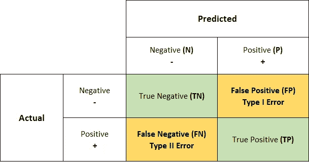
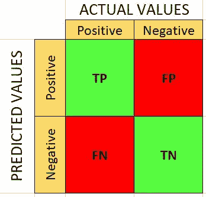

# 什么是混淆矩阵？

> 原文：<https://medium.com/analytics-vidhya/what-is-a-confusion-matrix-d1c0f8feda5?source=collection_archive---------0----------------------->

> 你应该知道的关于机器学习混淆矩阵的一切

一个**混淆矩阵**是一个***N×N 矩阵*** ，用于评估一个分类模型的**性能，其中 **N** 是 ***目标类*** 的数量。该矩阵将实际目标值与机器学习模型预测的目标值进行比较。**

二元分类问题(2x2 矩阵)

1.  **好的模型**是具有 ***高 TP 和 TN 比率*** ，而 ***低 FP 和 FN 比率*** 的模型。
2.  如果你有一个 ***不平衡数据集*** 要处理，那么使用 ***混淆矩阵*** 作为你的机器学习模型的评估标准总是比较好的。

**混淆矩阵**是分类器做出的**正确和不正确预测**数量的列表汇总。它用于衡量分类模型的性能。它可用于通过计算准确性、精确度、召回率和 F1 分数等性能指标来评估分类模型的性能。

混淆矩阵被广泛使用，因为它们比分类精度更好地反映了模型的性能。例如，在分类准确性方面，没有关于错误分类实例数量的信息。假设你的数据有**两类**其中 **85%的数据属于 A 类**，15%属于 B 类。此外，假设您的分类模型正确地对 A 类的所有实例进行了分类，而对 b 类的所有实例进行了错误分类，在这种情况下，模型的准确率为 85%。然而，B 类被错误分类，这是不可取的。另一方面，混淆矩阵显示了所有类的正确分类的*和不正确分类的*实例，因此可以更好地洞察分类器的性能。

我们可以通过两种方法来衡量模型的准确性。准确性仅仅意味着正确预测的值的数量。

**1。混乱矩阵**

**2。分类措施**

# 1.混淆矩阵

# a.理解混淆矩阵:

以下 4 个基本术语将帮助我们确定我们需要的指标。

*   **真阳性(TP)** :实际值为正，预测值也为正时。
*   **真负值(TN)** :实际值为负值，预测也为负值时。
*   **误报(FP)** :实际为负，预测为正。也被称为**1 型错误**
*   **假阴性(FN)** :实际为正，但预测为负。也被称为**类型 2 错误**

对于二进制分类问题，我们将有一个 2 x 2 矩阵，如下所示，有 4 个值:

二元分类的混淆矩阵

*   目标变量有两个值:**正**或**负**
*   **列**代表目标变量的**实际值**
*   **行**代表目标变量的**预测值**

# b.以更简单的方式理解混淆矩阵:

让我们举个例子:

我们总共有 2 只猫和狗，我们的模型预测它是否是一只猫。

**实际值= ['狗'、'猫'、'狗'、'猫'、'狗'、'猫'、'猫'、'狗'、'狗'、'狗'、'猫'、'狗'、'狗'、'狗'、'猫'、'狗'、'狗'、'猫']
预测值= ['狗'、'狗'、'狗'、'猫'、'猫'、'狗'、'狗'、'狗'、'猫'、'狗'、'狗'、'狗'、'狗'、'狗'、'狗'、'狗'、'狗'、'猫']**

> **真阳性(TP) = 6**

你预测是肯定的，这是真的。你预言一种动物是猫，它确实是。

> **真负值(TN) = 11**

你预测是负面的，这是真的。你预测动物不是猫，它实际上也不是(它是一只狗)。

> **假阳性(1 型错误)(FP) = 2**

你预测是积极的，但它是错误的。你预测动物是猫，但它实际上不是(它是狗)。

> **假阴性(2 型错误)(FN) = 1**

你预测是负面的，这是错误的。你预测那种动物不是猫，但它实际上是。

# **2。分类措施**

基本上，它是混淆矩阵的扩展版本。除了混淆矩阵，还有其他方法可以帮助更好地理解和分析我们的模型及其性能。

a.准确(性)

b.精确

c.召回(TPR，灵敏度)

d.f1-分数

e.FPR(第一类错误)

f.第二类误差

> **a .精度:**

**准确性**只是衡量分类器做出正确预测的频率。它是正确预测数和预测总数的比率。

对于**不平衡类**，精度度量**为 ***不适合*** 。**精度**自有*缺点*，对于**不平衡数据**，当模型预测每个点属于多数类标签时，精度会高。但是，这个模型并不准确。**

这是在**真实预测**中实现的**正确性**的度量。简单来说，它告诉我们有多少*的预测实际上是全部 ***中的全部*** 的正预测。*

***准确度**是对****不偏斜或不存在类不平衡的分类问题 ***评价的有效选择。********

**

> ***b. *精度* :***

*这是在**真实预测**中实现的**正确性**的度量。简单来说，它告诉我们有多少 ***的预测实际上是正面的*** 出了所有 ***的总正面预测*** 。*

*精度被定义为正确分类的正类总数*除以预测的正类总数*的比率。或者说，在所有的预测积极类中，我们预测正确的有多少。**精度要高(理想情况下 1)。***

**"* ***精度*** *在* ***假阳性*** *比* ***假阴性****

****

****例 1:——在垃圾邮件检测中**:需要关注**精度****

**假设**邮件不是垃圾邮件**但是模型被**预测为垃圾邮件:** FP(误报)。我们总是试图降低 FP。**

****Ex 2:-** **精准**在 ***音乐或视频推荐系统、电商网站等*** 中很重要。错误的结果可能导致客户流失，并对业务造成损害。**

> ****c .召回:****

**它是对正确预测**的**实际观测值**的度量，即有多少正类观测值实际上被预测为正。它也被称为**灵敏度**。 ***回忆*** 当我们想要捕获尽可能多的*时，是一个有效的评估指标选择。*****

*****召回被定义为*正确分类的肯定类别总数*除以*肯定类别总数*的比率。或者说，在所有的积极类中，我们正确预测了多少。**召回率应该很高(理想情况下为 1)。*******

********回忆*** *在* ***假阴性*** *胜过* ***假阳性****的情况下，是一个有用的度量******

**********

********例 1:-*** 假设人得了癌症(或者没有)？**他患了癌症**但是模型预测为**没有患癌症*******

*******例 2:——回忆*** *在* ***医学病例*** *中很重要，我们是否提出假警报并不重要，但* ***实际阳性病例不应未被发现！*******

*****召回将是一个更好的衡量标准，因为我们不想让一个感染者* ***意外出院*** *并让他们与健康人群混合从而* ***传播传染性病毒*** *。现在，您可以理解为什么准确性对于我们的模型来说是一个糟糕的指标了。*****

*******窍门记住:*******Pre****cision 有****Pre****dictive Results in 分母。******

> ******4。f-测量/F1-分数******

******F1 分数**是一个介于 **0 和 1** 之间的数字，是精度和召回 的**和*调和平均值。我们使用调和平均值，因为它对非常大的值不敏感，不像简单平均值。*******

******F1 分数**在分类器的 ***精度和召回*** 之间维持一种**平衡**。如果您的 ***精度低*** ，则 ***F1 低*** ，如果 ***召回低*** ，则您的 ***F1 分数低*** 。****

****会出现无法明确区分*精度更重要还是召回*的情况。我们把它们结合起来！****

****实际上，当我们试图提高模型的精确度时，召回率会下降，反之亦然。F1 分数在一个值中捕捉了这两种趋势。****

********

****F1 的得分是一个 ***的谐音，表示*** 的精确和回忆。与算术平均相比，调和平均对极值的惩罚更大。F 值应该很高(最好是 1)。****

> ******5。灵敏度&特异性******

********

# ****3.如果已经有了很高的准确率，还有必要检查召回(或)精度吗？****

****当类别不平衡时，我们不能依赖单一的分类精度值。例如，我们有一个 100 名患者的数据集，其中 5 名患有糖尿病，95 名健康。然而，如果我们的模型仅预测大多数类别，即所有 100 个人都是健康的，即使我们具有 95%的分类准确度。****

# *******4。何时使用准确度/精确度/召回率/ F1 评分？*******

****a. ***准确度*** 在 ***真阳性和真阴性*** s 更重要时使用。 ***准确性*** 是 ***平衡数据的更好指标。*******

****b.每当**假阳性**更重要的时候就使用**精确*。*******

****c.每当**假阴性**重要得多的时候就用**召回*。*******

****d. ***F1-Score*** 在 ***假阴性和假阳性*** 重要时使用。 ***F1-Score*** 对于 ***不平衡的数据是一个更好的度量。*******

# ****5.用 Python 创建一个混淆矩阵****

****为了用 python 代码来解释，考虑数据集*基于他们的**性别、年龄、血压和各种其他指标来“预测某人是否患有心脏病”。**数据集有 14 个的**列和 303 个**的**行。*******

********************

*****清点剧情显示有多少只**患有*心脏病或者没有。********

************************

******分类报告:******

****`**classification_report()**`接受实际标签列表、预测标签列表和指定标签顺序的可选参数。它计算精度、召回和支持等性能指标。****

********

******混淆矩阵:******

****`**confusion_matrix()**`接受实际标签列表、预测标签列表和指定标签顺序的可选参数。它计算给定输入的混淆矩阵。****

****************

# ****就是这样！****

****感谢阅读！****

****谢谢你的阅读。以后我会写更多初学者友好的帖子。请在[媒体](https://anugantisuresh.medium.com/)上关注我，以便了解他们。我欢迎反馈，可以通过 LinkedIn[anuganti-Suresh](https://www.linkedin.com/in/anuganti-suresh-9aa17822/)联系我。快乐学习！****

# ****参考资料:****

**** [## sk learn . metrics . confusion _ matrix-sci kit-learn 0 . 23 . 2 文档

### sci kit-learn:Python 中的机器学习

scikit-learn.org](https://scikit-learn.org/stable/modules/generated/sklearn.metrics.confusion_matrix.html)  [## 混淆矩阵-sci kit-学习 0.23.2 文档

### 使用混淆矩阵评估虹膜数据集分类器输出质量的示例。的…

scikit-learn.org](https://scikit-learn.org/stable/auto_examples/model_selection/plot_confusion_matrix.html) 

# 如果你喜欢这篇文章，请鼓掌！****