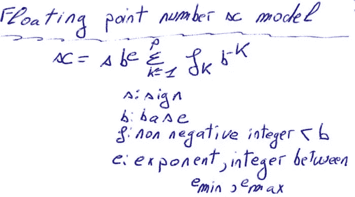
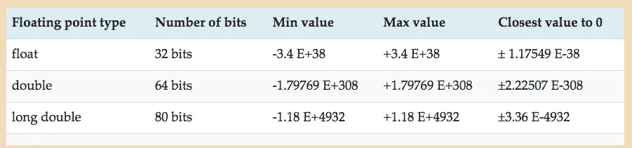

# 什么是 C 语言中的浮点数、双精度数、长双精度数和浮点字面量？

> 原文：<https://medium.com/analytics-vidhya/what-is-a-float-double-long-double-and-a-floating-point-literal-in-c-e789c31aa36c?source=collection_archive---------10----------------------->

# 什么是浮、双、长双？

要在计算机中存储数字，必须使用一种算法。 ***C 标准没有指定*** 用于存储任何类型的数字的算法或编码，无论是有理数如`1/2`、整数如`5`还是无理数如`pi`。

***它只指定*** 数值数据类型的名称，如`int`，或`float`。它们的含义，例如`int`用于存储有符号整数类型，如`-1`或`1`，而`float`用于存储实数的近似值，如`1.2`或`-12.5`。它们的最小范围，例如`int`型的最小范围在`-32767`和 `+32767`之间。编码数字的算法是由计算机制造商指定的。

C 中的 ***实型是`float`、`double`、`long double`。C 标准定义了必须编码的实数模型，该模型称为浮点模型，其格式如下:***



浮点编码有多种算法，最常用的是 [IEEE 浮点格式](https://twiserandom.com/data-structure-and-algorithms/what-is-a-floating-point-number/)。

在计算机上， ***使用 IEEE*** 浮点格式算法，`float`类型映射到 IEEE 单精度浮点，而`double`类型映射到 IEEE 双精度浮点。`long double`映射到 IEEE 四倍精度浮点格式或 IEEE 80 位浮点格式。

**的 C 实数类型，使用 IEEE 浮点格式时如下。**

****

**`float.h`头、 ***包含与浮点实现*** 相关的信息，例如每个浮点类型的范围【min，max】的绝对值，以及与`0`最接近的值。**

```
**#include<stdio.h>
#include<float.h>int main( void){
  /*
    print absolute value min,max range , each floating
    type .*/
  printf( "float absolute value of range : %e\n", FLT_MAX);
  printf( "double absolute value of range : %e\n", DBL_MAX);
  printf( "long double absolute value of range : %Le\n", LDBL_MAX);/* print closest absolute value to 0 , for each
     of the floating types .*/
  printf( "closest to 0 absolute value , float : %e\n", FLT_MIN);
  printf( "closest to 0 absolute value , double : %e\n", DBL_MIN);
  printf( "closest to 0 absolute value , long double : %Le\n", LDBL_MIN);}/* Output :
float absolute value of range : 3.402823e+38
double absolute value of range : 1.797693e+308
long double absolute value of range : 1.189731e+4932closest to 0 absolute value , float : 1.175494e-38
closest to 0 absolute value , double : 2.225074e-308
closest to 0 absolute value , long double : 3.362103e-4932 */**
```

**执行浮点运算操作的 ***类型在宏`FLT_EVAL_METHOD`中定义，在头文件`float.h`中定义。*****

**如果`FLT_EVAL_METHOD`值被设置为`2`，则通过将操作数提升为`long double`类型来执行算术运算。如果`FLT_EVAL_METHOD`被设置为`1`，则通过将操作数提升为`long double`来执行算术运算，如果任何操作数是`long double`类型，否则操作数被提升为`double`类型，即使两个操作数都是`float`类型。如果`FLT_EVAL_METHOD`设置为`0`，则算术运算以最宽操作数的类型进行。如果`FLT_EVAL_METHOD`设置为`-1`，则不可确定。**

```
**#include<stdio.h>
#include<float.h>int main( void){
  printf( "FLT_EVAL_METHOD : %d\n" , FLT_EVAL_METHOD);}/* Output : 
FLT_EVAL_METHOD : 0 */**
```

# **浮点文字**

**C 语言中的浮点文字， ***可以写成十进制*** ，格式如下:**

```
**d+.d*
d*.d+
d+[.]ed+**
```

**其中`d`是`0-9`之间的任意数字，`+`表示一个或多个，`*`表示零个或多个，`[]`之间的数字是可选的，`e`不区分大小写，表示数字 10 的指数。举个例子:**

```
**double x; 
x = 1\. ;
x = .1 ;
x = 1.0;
x = 1e1; // 10.0
x = 1.E1; // 10.0**
```

**默认情况下，C 语言中浮点文字 的 ***类型是`double`类型，除非带有不区分大小写的`f`后缀，在这种情况下，它将是`float`类型，或者带有不区分大小写的`l`后缀，在这种情况下，它将是`long double`类型。举个例子:*****

```
**float aFloat = 1.0f ;
double aDouble = 1.0 ;
long double alongDouble = 1.0L ;**
```

**一个浮点文字，也可以用十六进制记数法写成**

```
***0xh+[.]h*Pd+
0xh*.h+Pd+***
```

***其中`0x`不区分大小写，代表十六进制，`h`是`0-F`之间的十六进制数字，`+`表示一个或多个，`[]`之间的是可选的，`*`表示零个或多个，`P`不区分大小写，表示`2`的`p`次方，`d`是`0-9`之间的一个或多个数字。举个例子:***

```
***double x ;
x = 0xfP0; // 15.0
x = 0Xf.P0; // 15.0
x = 0xf.0P0; // 15.0
x = 0X.1P0; // 1/16 = 0.062500
x = 0x.1p1; // (1/16) * 2 = 0.125000***
```

***与十进制浮点常量一样，十六进制浮点常量 ***有一个默认类型****`double`。要提供十六进制浮点常量，一种类型的`float`，使用后缀`f`，不区分大小写，要给它类型的`long double`，使用后缀`l`，不区分大小写。举个例子:****

```
***float aFloat = 0x1P2f;// 4.0f
double aDouble = 0x.1p3 ;// 0.5
long double alongDouble = 0X.3p2L ; // 0.75L***
```

****原载于 2020 年 12 月 14 日*[*https://twiserandom.com*](https://twiserandom.com/c/what-is-a-float-double-long-double-and-a-floating-point-literal-in-c/)*。****