# 什么是浮点数？

> 原文：<https://medium.com/analytics-vidhya/what-is-a-floating-point-number-b376e7098ada?source=collection_archive---------15----------------------->

一个 ***数字，可以被认为是*** 的一种投影，例如用于测量，无论是时间还是距离，或者用于计数。数字是一种离散的度量方式，与连续相对，离散在某些情况下很有用。

在数学中 ***存在多种数字*** 。比如有 ***非负整数*** ，如`0`或`1`，用集合`N`表示。

有 ***整数*** 由: `0`，负整数如`-1`或`-2`，正整数组成。整数由集合`Z`表示。

还有 ***有理数*** ，形式为`p/q`，其中 p 和 q 为整数，q 与`0`不同。有理数由集合`Q`表示。

数字在计算机中用一种算法来表示。集合`N`用[无符号数表示法](https://twiserandom.com/data-structure-and-algorithms/what-is-an-unsigned-integer/)表示，集合`Z`用[有符号数表示法](https://twiserandom.com/data-structure-and-algorithms/what-is-a-signed-integer/)表示，集合`Q`用浮点数表示法表示。

# 位置数制的局限性

在位置数字系统中，有些数字不能用 ***有限小数序列*** 来表示。

***无理数*** ，如`pi`，在位置数系中，根本无法用有限的数字序列来表示。

***形式为`p/q`的有理数*** ，当选择的基数或者乘以`1,2 ... q-1`的基数不能被`q`整除时，不能用有限的小数序列如`.12`来表示。

例如`1/4`可以用十进制位数制*来表示，因为`10 * 2`可以被`4`整除，这样`1/4`可以写成十进制位数制，如`0.25`。*

*`1/3`在 ***三进制位置数制*** 中是可表示的，因为在这种情况下借用时，我们是借用 3 的倍数，所以`1/3`可以写成`0.1`，以`3`为基数。*

*`1/3`在十进制位数字系统中有一个 ***重复表示*** ，因为`10 * 1` 、`10 * 2` 不能被`3`整除。因此`1/3`在十进制位置数字系统中表示为重复序列`0.33333...`。*

*可以证明， ***任意重复的小数*** ，都可以写成有理数，例如:*

*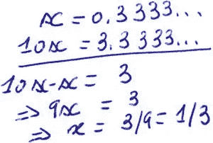*

****当*** 把一个位置数制中一个数的小数部分限制在有限的位数时，问题就出现了。*

*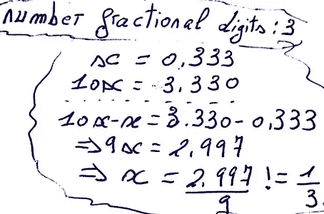*

*当位数有限时，这意味着只能产生有限数量的小数值。因此要问的问题是，如何表示非生成的小数值，是通过生成的值之一，还是仅仅声明它不能被表示。*

*我们来举个例子，在限制小数位数为三个 *时，以 2 为基数生成的小数部分的集合， ***。*****

*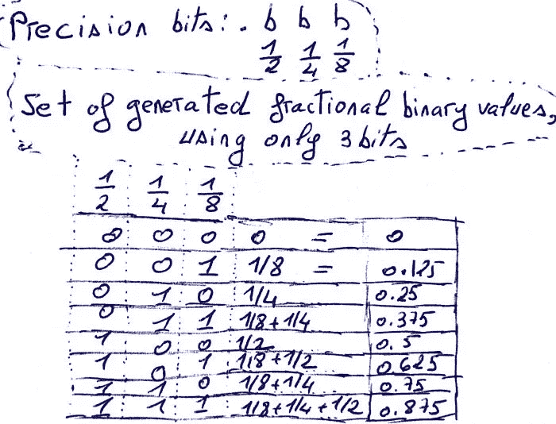*

*`0.1`以 10 为基数，以`2`为基数表示如下。*

*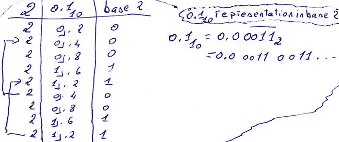*

*`0.1`小于所选基`2`子集中的任何非零值，其小数位数有限，因此无法在该子集中表示。这就是 ***所谓的下溢*** 。*

*较大的值，如大于`0.1`的值，并且不存在于生成的集合中，只能用近似来表示。例如，`0.4`可以表示为`.011`，在十进制上等于`0.375`。 存储值与实际值之差 ***如下:`0.4 - 0.375`，等于`0.025`。****

*从`0.57`的存储值中减去`0.77`的存储值，等于`.110 - .100`，等于`.010`。`0.3`的存储值是`.010`，因此在我们以 2 为基数的小数部分的表示中，`0.77 - 0.57`等于`0.3`，并且 ***不等于*** `0.2`。*

*向小数部分添加更多的位，将会提高所表示的数字和计算的精度。例如，`4`位用于小数部分时，十进制的`0.1`可以表示为二进制的`0.0001`。*

*即使位数再多，前面讨论的 ***问题也会一直持续*** 。有些数不能用有限的位数准确表示，比如无理数，而且位数有限，可用的小数部分有限，这样精度有限。*

# *IEEE 浮点格式*

*使用 IEEE 浮点数表示法时， ***除了精度*** (为小数部分选择的位数)之外，还有符号位和指数位。*

*这意味着，由于指数和符号位的存在，可以生成额外的值，所以简单地说，这是 ***提高*** 精度的一种方式。*

*一个 IEEE 浮点数，有一个位表示和一个数值。IEEE 规定了浮点数必须具有的*位格式*，并且通过它来解释它的数值。这种位格式可以用于不同的字长。一个字是由许多位组成的，所以这种格式可以用于 32 位、64 位、128 位等等…它的工作原理是一样的。*

*一个 ***单精度*** 浮点数有 32 位表示，一个 ***双精度*** 浮点数有 64 位表示，一个 ***四倍精度*** 浮点数有 128 位表示*

*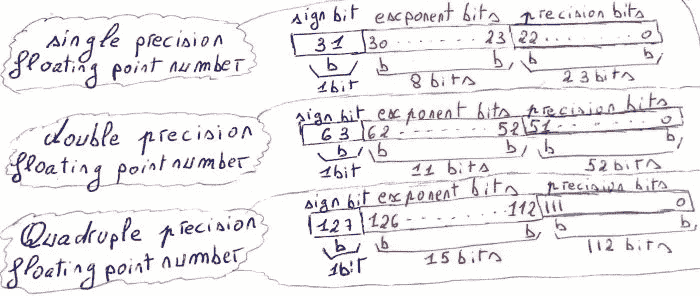*

## *无限值*

*当指数位全部设置为`1`，精度位全部设置为`0`时，浮点数位序列表示一个无限值。*

*有 ***两个无穷大值*** ，正负无穷大。当符号位为`0`时，这是正无穷大，当符号位为`1`时，这是负无穷大。*

*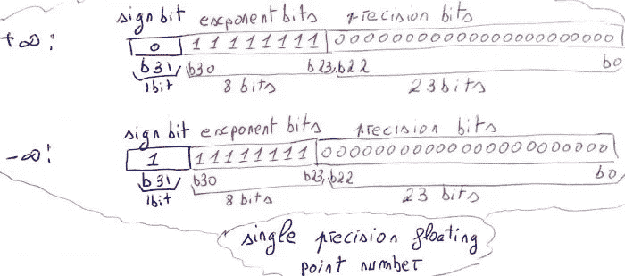*

****无穷大可以引起*** 例如，当一个非零数除以`0`时，或者当一个运算的结果，经过舍入后具有无穷大的值时。*

## *不是数字值*

*当指数位全部设置为`1`，精度位设置为除浮点数的位序列`0`之外的任何值时， ***表示*** `***NAN***`。*

*值`NAN`，表示不是一个数， ***它可能发生*** 例如，当`0`除以`0`时，或者当正负无穷大相加时。*

*不存在负 NAN 或正 NAN，所以 ***符号位与*** 无关。*

**

## *非标准值*

*当指数位全部设置为`0`时，浮点数处于所谓的***非规格化形式*** 。*

*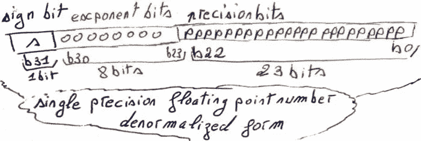*

**浮点数的* ***有理数值*** ，等于，对符号值，乘以`2`对指数值，乘以精度值*

**

****符号值*** 如果符号位值为`0`则为`1`，如果符号位值为`1`则为`-1`。*

*使用公式`1 - bias`计算 ***指数值*** 。偏差通过以下公式计算:*

*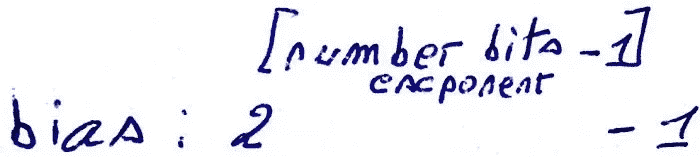*

****精度值*** 与精度位值相同。精度位值计算为分数位置二进制数。*

**到* ***举例说明了这个*** ，比方说，使用`7`位对浮点进行编码。`1`位是符号位，3 位是指数位，3 位是精度位。*

****符号值*** *在符号位为`0`时为*等于`1`，在符号位为 1 时为`-1`。*

****指数值*** 等于`1 - bias`，等于`-2`。*

*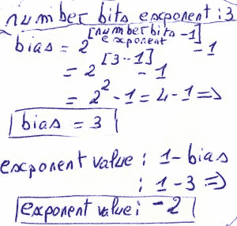*

****精度位值*** 被计算为位置二进制分数。*

**

****精度值*** 与精度位值相同。*

*因此，当处于非规格化形式时，`7`位浮点数、 ***可能的有理数值*** 为:*

*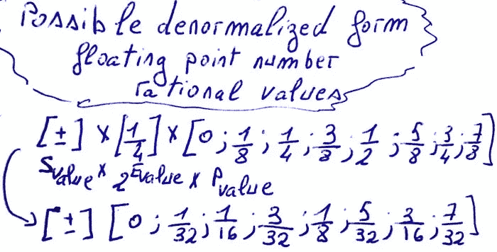*

## *标准化值*

**当* ***指数位*** 未全部设置为`0`或未全部设置为`1`时，浮点数位为规格化形式。*

*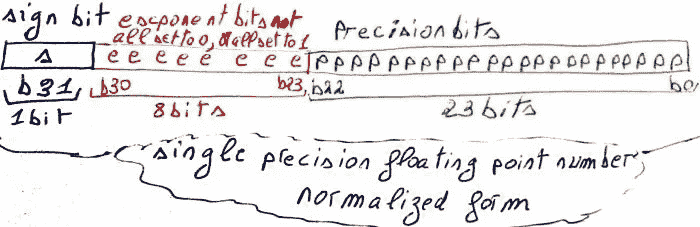*

*浮点数 ***有理数*** ，等于符号值，乘以二的幂的指数值，乘以精度值。*

**

*当符号位为`0`时， ***符号值*** 等于`1`，当符号位设置为`1`时，等于`-1`。*

****指数值*** ，等于指数位值减去偏差。计算指数位值，就好像指数位是二进制位置数字系统一样。偏差的计算方式与非规格化形式相同。*

*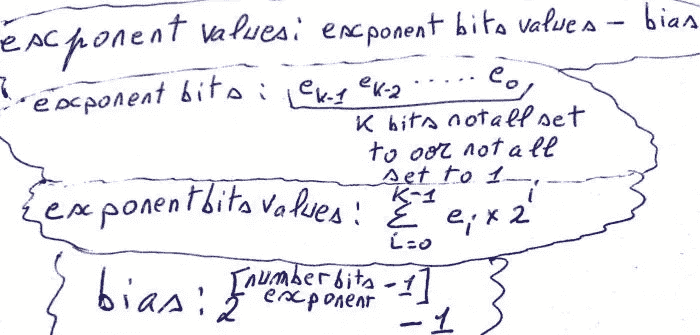*

****的精度值*** ，等于 1，加上精度位值。计算精度位值时，假定精度位是以二为基数的小数。*

*为了 ***说明这个*** ，我们就说浮点数是用`7`位编码的。`1`位用于符号，`3`位用于指数，`3`位用于精度。*

*当符号位为`0`时， ***符号值等于*** 至`1`，当符号位为`1`时，等于`-1`。*

****可能的指数值*** 为:*

*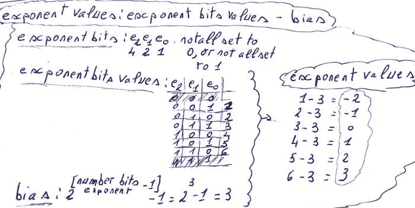*

**可能的精度值有:**

**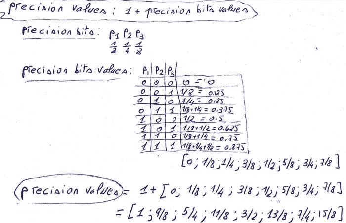**

**7 位浮点数，可能的 ***规格化形式有理数*** 有:**

**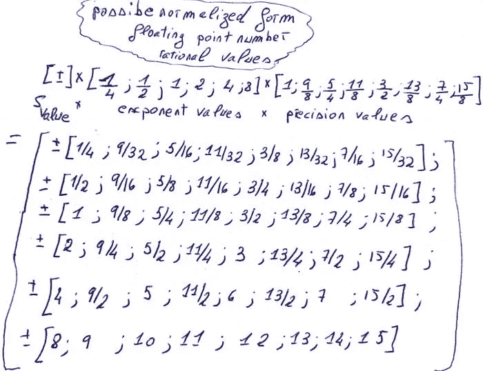**

## **当对 7 位进行编码时，可视化浮点可能值**

**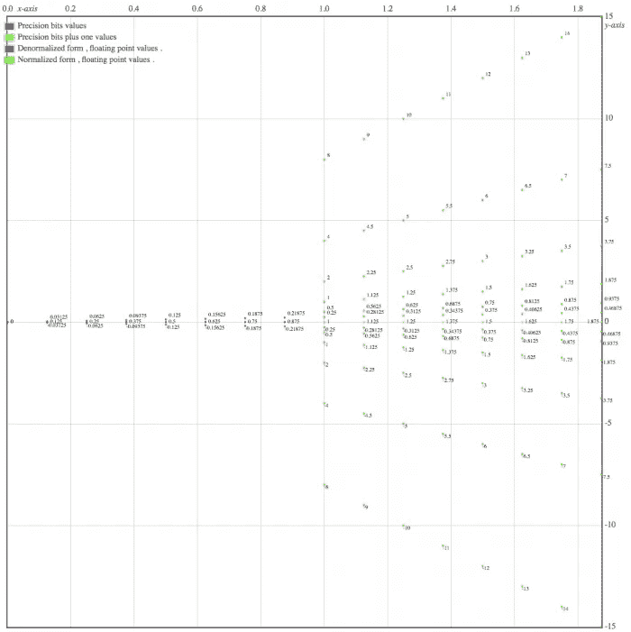**

## **交换性、结合性和分配性**

```
**IEEE floating point addition 
    commutative : a + b = b + a 
    not associative : ( 5 + 1e40  )  - 1e40 != 5 + ( 1e40    - 1e40 )
                  because               0   !=  5IEEE floating point multiplication 
    commutative : a * b = b * a 
    not associative : 1e40 * ( 1e300 * 1e-300 ) != ( 1e40 *  1e300 ) * 1e-300 
                  because             1e40      !=   Infinity
    not distributive over addition and subtraction 
                  0 * (1e308 + 1e308 ) != ( 0 * 1e308 )  + ( 0 * 1e308 )
                  because          NaN != 0
                  1e30 * ( 1e300 - 1e300 ) != 1e30 * 1e300 - 1e200 *1e300
                  because        0         !=   NaNIEEE floating point division 
    not commutative  : ( 1.0 / 2 ) != ( 2.0 / 1 ) 
    not associative  : ( 1.0 / 2 ) / 3 != 1 / ( 2.0 / 3 )  
                  because     0.1666 !=   1.5IEEE floating point subtraction 
    not commutative : 1.0 - 2 != 2 - 1.0  
    not associative : -4 - ( -4 - -3.0 ) != ( -4 - -4.0 ) - -3
          -4 - ( -4 - -3 )   = -4 - -1 = -3 
          ( -4 - -4 ) - -3 = 0 - -3 = 3**
```

# **C 语言中的浮点格式**

**在计算机中，浮点格式用来表示实数或有理数。C 标准有三种数据类型*用于浮点标准，它们是:`float`、`double`和`long double`。***

***c 标准没有指定使用哪种浮点标准**，但通常使用 IEEE 浮点格式，因此`float`被映射到 IEEE 单精度浮点格式，而`double`被映射到 IEEE 双精度浮点格式。*****

***默认情况下，浮点文字(如`1.0`)具有类型`double`，除非以`f`为后缀，在这种情况下，它将具有类型`float`，或者以`l`为后缀，在这种情况下，它将具有类型`long double`。***

***为了 ***检测浮点值*** *是否为* `NaN`，可以使用`isnan`函数来完成，为了检测浮点数是否为无穷大，可以使用`isinf`函数来完成。***

**`isnan`和`isinf`功能都在`math.h`标题中定义。**

```
**#include<stdio.h>
#include<math.h>int main ( void ){
  printf( "%d\n", isnan( 0.0/0.0 ) );
  /* 0.0 divided by 0.0 , results in
     not a number , as such isnan
     returns a nonzero value . */
  // Output : 1
  printf( "%d\n" , isinf( 1.0/0.0 ) );
  /* 1.0 divided by 0.0 results in
     + infinity , as such isinf
     returns a nonzero value  */
  // Output : 1
}**
```

***原载于 2020 年 12 月 11 日 https://twiserandom.com*[](https://twiserandom.com/data-structure-and-algorithms/what-is-a-floating-point-number/)**。****