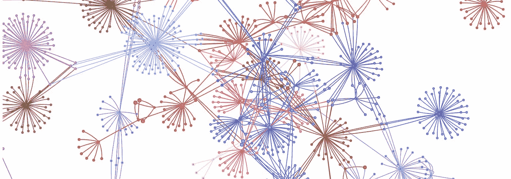
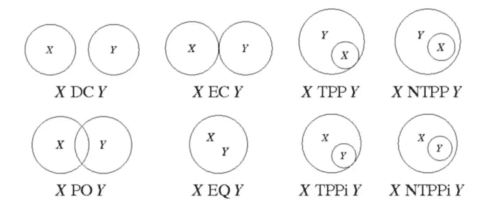
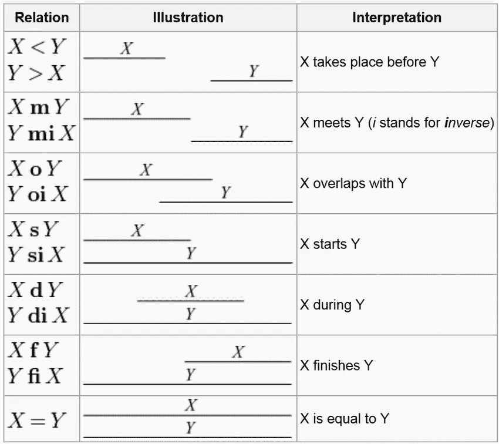
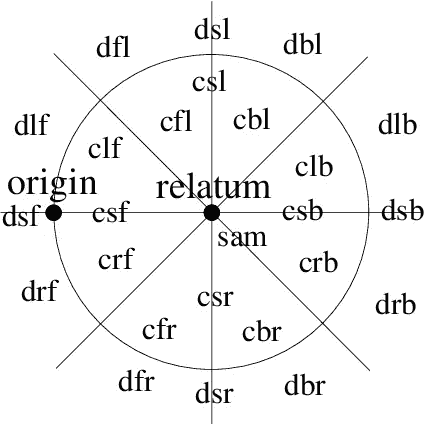

# 什么是元数据可视化工具？

> 原文：<https://medium.com/analytics-vidhya/what-is-a-metadata-visualizer-22a1c9bbbe0?source=collection_archive---------16----------------------->

*DAMA DMBOK 中定义的元数据，这是一个可以关联到我们的通用集合的可视化工具*

# 介绍

> 以图表格式对系统和组合元素进行代数表示是元数据可视化工具。

以图表格式可视化定性空间关系代数(如 TPCC(三元点配置演算)、RCC(区域连接演算)和 AIA(艾伦区间代数))的行为属于元数据可视化工具。

元数据是描述关于数据的数据。根据英国 DAMA DMBOK，有 5 种类型的元数据。它们是:

> (1)技术
> 
> (2)可操作性
> 
> (3)商业
> 
> (4)流程
> 
> (5)管理

IBM 数据价值链和摘要周期就是包含流程元数据的例子。业务规则和 ETL 信息本质上是可操作的和业务的。

# 可视化神经网络

> 在可视化神经网络中，代码被转换成用于处理信息的图解节点，例如模型切割、后处理、添加定制层或转换。

可视化地分析例如基于 keras 的神经网络和基于 openvino 的神经网络图之间的图的性能是有用的。Tensorflow 有 Tensorboard 及其图形可视化，用于对操作、图像、日志文件等数据进行分析。

# 可视化分布

> 在数据科学中，元数据提取器与回归技术或支持向量机学习技术相关联。它通常是在分析算法的路线，并可能使用组合学。

让我们把性能作为分析的属性:有时间、成本和质量拆分作为分析上下文。对表格数据进行统计测试，例如零假设、t-测试、偏斜度测试是可视化数据分布的元数据的好例子。

# 数据传输的要素

> 元数据是上下文驱动的，并且在几种分析上下文中转换元数据的类型。

> 用于评估语音信息的语音数据分析的操作元数据可以被转换成语义上表示整个项目的语音和弦的技术元数据，并且描述文本的管理数据可以被转换成作为整体的文本分析项目的业务数据。

> 这与作为分析背景的数据和项目有关。

> 还有另一种场景，其中解决方案和项目被考虑用于数据分析。

> 在面向客户的任务中，从解决方案的角度来看，业务元数据可能会被转换为计费项目的流程元数据。这是因为面向客户的任务可能涉及接听电话、提交基于网络的表单或使用为交付任务而记录的现有客户偏好。
> 
> 另一种情况是当基于阶段的关系被纳入考虑范围时。在这种基于阶段的关系中，最终交付给客户的是初始技术元数据，如图纸、配置等。在一个架构场景中，通过提供交付的结果被转换成业务元数据。

> 值得注意的是，数据传输的这些要素涉及到成本。

> 考虑第三种情况，其中训练神经网络的过程元数据级联到技术元数据。这主要见于神经网络的中间层，在那里它学习并将输入转化为可视化。

# 处理定性空间关系

> 有趣的是，qsr 构成了整个元数据可视化的基础。区域连接演算可视化的位置，大小和边界的比喻方法。

> Allen 的区间代数以一种理解两个分布何时接近并计算分离程度的方式来分析时间关系。它评估两个不同的分布在什么点上表现出相同的行为。

> 在三元点配置演算中，如果分布在其任何表示中显示一致性，那么它必然显示为基于 TPCC 的可视化。

# 结论

> 描述需求度量的元数据确保为该需求创建适合的标准。由于集成了流程元数据，Volere Shell 中的基本原理是解释性的。元数据本质上是调查性的，因为它的新闻属性:5WH(什么、如何、何时、为什么、谁)开始发挥作用，这就是它在数据传输元素中发生转变的原因。

## 可视化的方法在本质上总是与上下文相关的，就像元数据本身一样。元数据可视化的不同之处在于，它是一种可以自动化的形象化解释。

> 一些标准化的可视化已经在讨论中，但是那些与元数据相关的已经为我们所熟知。与元数据存储库相关联的逻辑和物理数据模型用于可视化。在定义元数据架构的情况下，对数据血统的良好理解是必不可少的。

## 为了交付解决方案，必须解决连接性问题，例如导入和导出元数据。为了确保长期使用，元数据管理还必须解决元数据新条目的数据标记问题。