# 什么是神经网络？

> 原文：<https://medium.com/analytics-vidhya/what-is-a-neural-network-3c7fb143d4b4?source=collection_archive---------17----------------------->

回想一下你第一次听到“神经网络”或“神经网络”这个词的时候——也许就是现在——试着回忆你的第一印象是什么。作为一名应用数学和经济学专业的学生，我对数据科学和机器学习产生了新的兴趣，我记得我认为无论神经网络是什么，它们都一定非常重要，非常酷，非常复杂。我还记得当时的想法是，对神经网络的真正理解必须在厚厚的必备知识墙的另一边，包括神经科学和研究生数学。

通过与布朗大学的塞缪尔·沃森(Samuel Watson)教授一起参加机器学习课程，我了解到，在大多数情况下，前面四种说法中有三种是正确的——神经网络极其重要，非常酷，并且根据模型的架构，它们可能非常复杂。但最重要的是，我了解到理解神经网络需要最少的先决知识，只要信息以逻辑和可消化的方式呈现。事实上，这是本文目的的一部分:提供一个易于理解，但有见地的神经网络概述。本文的另一个目的是解释标准“香草”神经网络相对于递归神经网络(RNNs)的优点和缺点。

为了实现这些目标，我将文章分成了三个部分。第一部分介绍什么是神经网络。第二部分将神经网络(特别是香草神经网络)置于更广泛的机器学习模型框架中，并对其优缺点进行了评论。最后一节介绍了一种不同类型的神经网络(RNN)，并讨论了它如何减轻标准香草神经网络的一些缺点。

对于 DATA 1010 的同学来说，神经网络可能只是我们用来模拟数据之间关系的众多工具之一。尽管花了大量时间研究普通神经网络，但很容易忽略它们如何适应更广泛的神经网络环境，以及神经网络如何适应更广泛的机器学习环境。我相信后退一步，提醒自己为什么我们正在研究的主题是重要的，并探索不同类型的神经网络，以帮助我们更好地将我们的知识融入更大的画面，这可能是有益的。对于普通读者来说，我希望这篇文章能够打破“厚厚的必备知识墙”,并对一些不同类型的神经网络进行有价值的介绍。对于任何专业人士或任何已经熟悉这个话题的人，我应该为这篇文章的简单化和缺乏深度提前道歉。尽管如此，我希望这篇文章仍然是一个有用的总结性资源，并作为一个愉快的阅读。

*数据 1010 注:本文的第一部分将主要回顾我们在课堂上熟悉的普通神经网络。虽然我知道这篇文章的主要目的是探索一个相邻的主题，但我的另一个目标是讲述一个对更多观众有用的好故事。因此，我认为，重要的是提供一些背景，并建立我们工作的更广泛的框架。也就是说，可以从“神经网络的优点和缺点”部分开始阅读，在那里我开始过渡到我对相邻主题(RNNs)的探索。*

# 设置场景

先说一些背景。人工智能(AI)是计算机科学的一个分支，研究如何给机器编程以执行需要人类智能的任务。机器学习(ML)是人工智能的一个子集，专注于自动化这些过程，以及在不需要用户输入的情况下学习和改进过去结果的能力。神经网络(本质上与深度学习同义)是基于大脑结构的 ML 的子集。

图 1:人工智能、机器学习和深度学习

区分生物神经网络和人工神经网络(ANN)也很重要。生物神经网络是人体实际神经系统的一部分，包括受体、神经网络和效应器。神经网络的主要组成部分是神经元(如下图),由树突、体细胞和轴突组成。在本文中，我们将使用“神经网络”来指代 ann，而不会花任何时间关注它们的生物学对应物。可以肯定的是，人工神经网络是基于我们对生物神经系统的理解，所以它们真的不应该被认为是独立的实体。当我们在亚马逊上读到以“这是最好的…”开头的评论时，我们很可能会推断该评论是积极的，并将随着我们继续阅读而更新我们的信念。例如，我们可能会对模拟我们的大脑在这个过程中的行为感兴趣，并可以创建一个模型来预测评论的评级。无论如何，神经网络允许我们模拟大脑的复杂能力，因此它们的重要性应该是显而易见的。

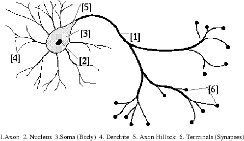

图 2:神经元图

# 什么是神经网络？

有了这样的认识，让我们从数学的角度来看看什么是神经网络。我们用来自[类](https://www.youtube.com/watch?v=Z1I8mCHR7ys&t=395s&ab_channel=SamuelS.Watson)的稍加修改的例子来说明这个定义

假设我们有在 x-y 平面上表示的波士顿地区的 1000 所房屋的数据。房子的房间数是 x 值，距离最近的火车站的英里数是 y 值，房子的市场价值是否超过 250，000 美元(红点)是彩色编码的。这是一个分类问题的例子，因为我们感兴趣的是在给定两个特征(x 值和 y 值)的情况下预测数据点属于哪个类别。如果我们对预测准确的市场价值感兴趣，那么这将是一个回归问题。

机器学习的本质是我们可以使用数据的子集(训练数据)来训练我们的模型。在这个例子中，我们可以使用(比方说)1000 个数据观测值中的 800 个作为训练数据。假设我们对构建尽可能精确的线性模型感兴趣，该模型获取一个数据点(x，y)并计算数量 ax + by，如果 ax + by > c，则预测市场价值超过 250，000 美元，否则低于 250，000 美元。我们可以想象，某一组常数 a1、b1 和 c1 将导致 800 所房屋中的 600 所被正确分类，而另一组常数 a2、b2 和 c2 将导致 800 所房屋中只有 500 所被正确分类。然后，我们的目标是找到 a、b 和 c 的值，使模型在训练数据上的准确性最大化。然后，我们在原始数据的一个单独的子集(称为测试数据)上测试我们的模型的准确性。在这种情况下，将剩余的 200 所房屋用于测试是合乎逻辑的。

这种类型的问题可能可以用各种其他机器学习技术来解决，如支持向量机，因为我们希望数据在 x-y 平面的第一象限中稍微均匀分布。然而，如果我们的数据以更复杂的方式定向，例如螺旋形状(如下图)，那么许多标准的机器学习技术可能不具备足够的复杂性来分离数据点(例如，线性边界不会完成这项工作)。

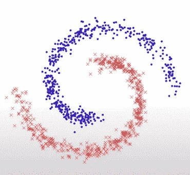

图 3:初始数据，神经网络分离区域，3D 投影数据，数字线表示的数据(从左到右)

这就是神经网络的优势所在。我们可以想象从 x-y 平面获取数据，然后将它们映射到 x-y-z 平面，如上面第三张图所示。数据似乎在立方体的表面上定向，我们可以看到它们现在很容易分离。我们可以使用另一个函数将 3D 中的点映射到数字线，其中越接近 0 的点表示红色的可能性越大，越接近 1 的点表示蓝色的可能性越大。如果数字行上的值大于 0.5，那么我们的模型预测“蓝色”，否则预测“红色”。上图的模型能够完美地分离我们的数据。

更具体地说，我们感兴趣的是定义一个函数组合，它将一个 2x1 向量(2D)作为输入，将其映射到一个 3x1 向量(3D)，然后将该 3x1 向量映射到一个 1x1 向量(1D)。

图 4:将数据从 2D 转换到 3D 再转换到 1D

那么我们如何做到这一点呢？一般来说，为了将 2×1 向量转换成 3×1 向量，我们可以将 2×1 向量乘以 3×2 矩阵，然后加上 3×1 向量。例如，假设我们在 2D 图中的原点是(3，2)。我们可以将该点表示为 2×1 的向量，并乘以 3×2 的“权重矩阵”。这个过程如下图所示。换句话说，权重矩阵表示，得到的 3×1 向量的第一个分量(在添加偏置向量之前)由 3 的 1 个拷贝和 2 的-1 个拷贝组成，第二个分量由 3 的 2 个拷贝和 2 的 0 个拷贝组成，最后一个分量由 3 的 2 个拷贝和 2 的-4 个拷贝组成。偏置向量只是移动得到的 3×1 向量的每个分量。任何这种形式的函数(x -> Ax + b，其中 A 是权重矩阵，b 是偏置向量)称为仿射函数。事实上，仿射函数的一维模拟就是 f(x) = mx+ b 形式的任何函数。

图 5:仿射函数

现在，为了将 3x1 向量转换为 1x1 向量(从 3D 到 1D)，我们对最后一个函数的输出应用另一个仿射函数。这次，我们的权重矩阵是 3x1，偏差向量是 1x1。总的来说，我们使用仿射函数的组合(将前一个函数的输出作为下一个函数的输入),将 x-y 平面(3，2)中的点变换为 x-y-z 平面(2，6，1)中的点，再变换为数轴(9)上的点。

图 6:仿射函数，其中输入是前一函数的输出

这种方法的唯一问题是仿射函数的合成本身就是仿射函数！例如，在 1D 的情况下，如果我们有一个函数 f(x) = 2x + 7，g(x) = 5x - 3，那么 f(g(x)) = 2(5x - 3) + 7 = 10x + 1。换句话说，即使我们在输入和最终输出之间有几个中间步骤，我们也可以使用仿射函数将输入直接映射到最终输出(在上面的例子中，h(x) = 10x + 1 等价于 f(g(x))，因此函数的组合在这种情况下不会增加任何复杂性。换句话说，在前面的例子中，我们可以用一个仿射函数直接从 2D 到 1D。

为了解决这个问题，我们只需在每一步的末尾引入一个“激活函数”。激活函数是组件式的(意味着它们被单独应用于向量的每个组件),并允许我们将非线性引入仿射函数的合成中。最常见的激活函数之一是 sigmoid(如下所示)。另一个常见的激活函数是 ReLU，它将负数映射到 0，正数映射到自己(f(x) = max(0，x))。

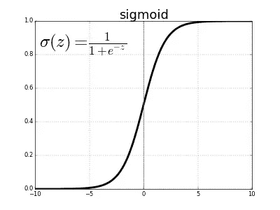

图 7:一个激活函数的例子

那么，神经网络不过是仿射函数和组件式激活函数的组合。在我们的示例中，神经网络的示例可能如下所示，其中 A1 和 A2 是两个仿射函数，具有相同的权重矩阵和上面的偏差向量:

图 8:神经网络的例子

这里唯一的区别是，在我们将向量(2，6，1)输入第二个仿射函数之前，我们对每个分量应用 sigmoid 激活函数(2 变成 1/1 + e^-2，等于 0.88，依此类推)。同样，我们这样做的原因是，仿射函数(A1 和 A2)的合成不仅会产生与输入线性相关的输出。

这是课堂上的另一个例子(如下图)。这一次，我们从一个 3x1 向量输入(1，-2，3)开始，并将其馈送到第一个具有权重矩阵 W1 和偏置向量 b1 的仿射函数，该仿射函数将其发送到 2D。然后我们取输出(-3，4)，应用 ReLU 激活函数(负数变成 0，正数保持不变)得到(0，4)。接下来，我们将(0，4)馈入另一个具有权重矩阵 W2 和偏置向量 b2 的仿射函数，并得到(3，1，2，-5)的输出。再次应用 ReLU，我们得到(3，1，2，0)，并将其发送到最终的仿射函数，该函数产生(-1，-1)。在应用最后一个仿射函数之后，我们将我们的输出取为输出乘以单位矩阵。你可以认为这是一个特殊的激活函数，它只是保持输出不变。

图 9:神经网络的另一个例子

请注意，这个模型的“架构”(结构)与第一个不同。更具体地说，该架构更复杂，因为它涉及更长的仿射函数序列。我们从一个 3x1 向量开始，将其映射到 2D，然后映射到 4D，再映射回 2D。我们将隐藏层定义为不是输入或输出层的任何层或步骤。所以这个神经网络比上一个有更多的“隐藏层”。

最后，我们将模型得出的输出与对应于我们的数据的实际期望输出进行比较。在我们的数据中，(1，-2，3)的输入产生(3，2)的输出，而模型给我们的输出是(-1，-1)。我们可以使用这些输出之间的差异的平方范数作为我们的模型表现有多差(损失)的度量，目标是平均地最小化训练数据上的模型损失。让我们用最后一个例子来总结一下:

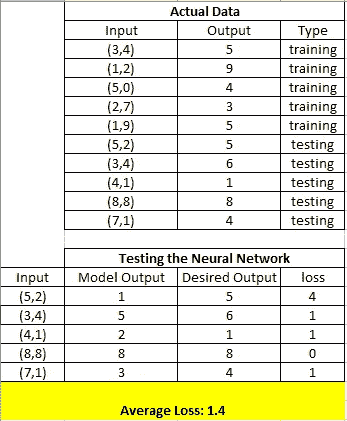

图 10:数据示例

上面，我们有 10 个数据观察，其中每个输入(x，y)对应于一个输出 z。我们的目标是构建一个神经网络，它将允许我们预测给定的 z(x，y)。为此，我们将数据分为训练数据和测试数据(各 5 个)。接下来，我们使用训练数据建立一个神经网络，使训练数据的平均损失最小化。也就是说，当我们向模型提供 5 个训练数据输入时，我们希望我们的模型能够尽可能分别返回 5、9、4、3 和 5 个输出。换句话说，我们希望找到最佳的权重矩阵和偏置向量(组成每个仿射函数),使模型的输出尽可能接近实际输出。

一旦我们确定了最佳的权重矩阵和偏置向量，我们就有了一个可以在测试数据上进行测试的神经网络。我们将测试数据的 5 个输入输入到我们刚刚构建的模型中，并查看模型的输出与实际期望的输出有多接近。如果我们做得好，那么我们的平均损失应该很小。

要明确的是，仅仅因为我们可以构建一个在训练数据上表现良好的模型，并不意味着该模型在总体上是好的。请记住，我们构建神经网络的方式是最大限度地提高它们在训练数据上的性能。我们在单独的数据集上测试模型，因为训练数据可能不能很好地代表总体。

在真实世界的场景中，我们可能会得到 100，000 个数据观测值的样本，我们会从中随机选择 80，000 个观测值来训练我们的模型。训练后，我们的模型将是在我们对其进行训练的 80，000 次观察中表现最好的模型(换句话说，当我们仅考虑训练数据时，我们模型的权重矩阵和偏差向量将产生最低的可能平均损失)。由于我们有如此大的样本，并且训练数据是随机选择的，因此我们确信 80，000 个训练观察值代表了一般人群(可能远大于 100，000)。由于我们无法访问 100，000 样本之外的任何其他数据，我们目前最多只能在剩余的 20，000 个观察值上测试模型。也就是说，总体目标是在未来数据上使用该模型。

下表总结了我们关于什么是神经网络以及如何构建神经网络的讨论:

图 11:部分摘要

等等，那么我们如何确定权重矩阵和偏差向量的最佳值呢？如果你最初的想法是试错，那你就不远了。总的想法是，我们从这些权重矩阵和偏置向量中的某些值开始，一次稍微改变一个值，看看这是否会使我们的输出更准确或更不准确。这是偏导数的本质，它回答了“在所有其他输入保持不变的情况下，我的输出如何对我的输入的微小变化做出反应？”如果我们有办法计算权重矩阵和偏置向量的所有值的偏导数，那么我们可以使用梯度下降，以微小的步长将我们的值向最大精度改进的方向移动，直到我们的平均损失低于某个阈值。在本文中，我们不会花时间讨论训练神经网络的细节，但希望这一段提供一些基本的直觉。

# 神经网络的优点和缺点

我们刚刚讨论的神经网络被称为标准或普通神经网络。这里，我们还引入了术语“前馈网络”,它只是指节点从不形成循环的网络；输入馈入一些节点，这些节点馈入新的节点，以此类推，直到我们到达输出。把“前馈”想象成从左向右移动。香草神经网络只是一个前馈网络，通常至少有一个隐藏层，就像我们在上一节和下图的例子中提到的那样。

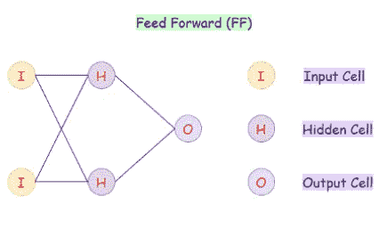

图 12:前馈网络

在深入研究优点和缺点之前，我们需要介绍的最后一个概念是欠拟合和过拟合。回想一下，当我们训练一个模型时，我们希望最小化训练数据的平均损失，训练数据通常是我们拥有的数据观察的子集。我们所拥有的数据观测值是整个样本总体的一个子集，任何模型的目标都是准确地代表总体。下面，我们有 3 个不同的模型对应相同的训练数据。训练数据似乎遵循某种向上的二次 U 形，中间模型很好地拟合了我们数据的一般形状。即使样本量不是特别大，我们也很有信心总体遵循某种二次形状。

图 13:欠拟合与过拟合

过度拟合是指当我们做“太好的工作”并引入不太可能准确代表总体的复杂性时。我们右边的模型在最小化训练数据的平均损失方面做得非常好，因为该模型基本上通过每个点。然而，引入这样一个更高程度的复杂性对我们得出关于整个群体的结论没有任何好处，因为整个群体不太可能遵循这样一个激进的形状。

当我们说训练的目标是最小化训练数据的平均损失时，我们需要小心。如果我们的模型过于严格地理解这些指令，我们最终会过度拟合数据。防止过度拟合的合理方法是引入一些关于模型形式的约束。最常见的例子是线性回归，其基本意思是“尽最大努力使平均损失最小化，但只允许使用一条直线”。线性回归可以帮助我们避免过度拟合，但有时可能会有点过于严格，导致我们实际上对数据进行了欠拟合。正如您在上面看到的，左边的模型似乎比右边的模型好一点，但是缺少了中间模型提供的一些期望的复杂性。

因此，我们需要根据包括数据复杂性在内的许多因素来选择我们的模型。线性回归在许多情况下都非常有效，但是当数据更多地是二次型(例如上面的例子)或螺旋形(例如前面的例子)时，线性回归的限制性假设限制了我们准确建模数据的能力。

下图显示了五种不同的 ML 技术，每种技术都有其优缺点，具体取决于数据的分布方式。

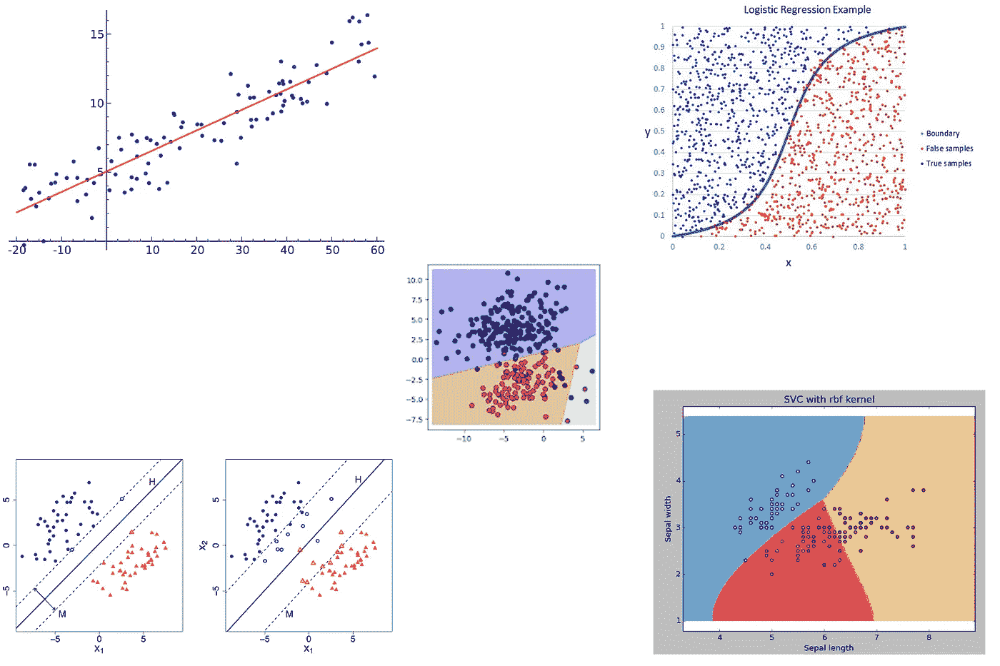

图 14:线性回归、逻辑回归、二次判别分析、支持向量机、内核化支持向量机(从左到右、从上到下)

神经网络的主要优势是其学习模式的几乎无限的灵活性，这是其他 ML 模型无法学习的。如果我们的数据相对简单，我们可以使用一个具有简单架构的神经网络(也许直接从 2D 映射到 1D)。如果我们的数据更复杂，我们可以增加架构的复杂性。根据我们的需要校准模型结构的能力使得神经网络成为最健壮的 ML 模型。神经网络解决不了的问题很少。

神经网络的主要缺点是它们在许多不同的意义上都很昂贵。首先，大多数神经网络需要大量的数据来产生理想的结果，并且与它们的对应物相比在计算上是昂贵的。还有，即使选择结构的自由是一件好事，挑选一个好的架构(隐藏层的数量，我们需要多少维度等等。)可能具有挑战性。因此，神经网络的开发过程往往相当漫长和复杂。另一个缺点是大多数神经网络的“黑盒”性质，尤其是具有多个隐藏层的神经网络。尽管神经网络往往非常精确，但我们往往无法理解模型是如何得出结论的，也无法对数字做出解释，因为大多数神奇的事情都发生在仿射函数的巨大迷宫中。

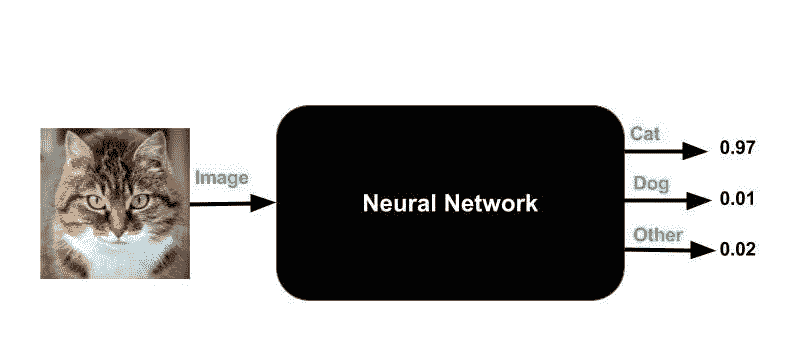

图 15:神经网络的黑盒性质

为了举例说明这些优点和缺点，请考虑下面的数字识别模型。我们的输入是一个 28x28 像素的图像，输出是一个从 0 到 9 的数字。784 (28)个像素中的每一个都代表一个输入，该输入具有从 0(黑色)到 1(白色)的值，指示该像素的强度(例如，下图中数字 7 的 784 个像素中的大部分像素将具有对应于黑色的值 0，一些像素将具有接近于 1 的值，对应于七个像素中最亮的部分，边缘的像素将具有 0 到 1 之间的值)。换句话说，我们的输入是一个 784x1 向量，输出是一个 10x1 向量。我们有两个隐藏层(每个有 16 个节点)并应用一些未知的激活函数。

图 16:数字识别

那么这里有多少参数在起作用呢？我们知道，第一个仿射函数会将我们的 784×1 输入向量转换为 16×1 向量，这需要 16×784 权重矩阵和 16×1 偏移向量。在应用一些激活函数之后，第二仿射函数将把一个 16×1 的向量变换成另一个 16×1 的向量，需要一个 16×16 的权重矩阵和一个 16×1 的偏移向量。在再次应用一些激活函数之后，最终的仿射函数将把 16×1 的向量变换成 10×1 的向量，需要 10×16 的权重矩阵和 10×1 的偏移向量。然后，该模型将选择最终 10x1 输出向量中具有最大值的分量作为其预测。因此，在上述示例中，10x1 向量的第 8 个分量具有最大值，因此模型预测为“7”。

总的来说，我们有三个权重矩阵(16 x 784，16x16，10x16)和三个偏置向量(16x1，16x1，10x1)，它们对应于我们必须通过训练过程确定的 13，002 个不同的值！现在，神经网络需要大量的训练数据来确定每个参数的最佳值，这是有意义的，这种数字识别网络是比较简单的。也就是说，识别数字的任务(10 类分类问题)超过了大多数其他机器学习技术的能力。在这个例子中，充分展示了神经网络的能力和它的高成本之间的权衡。

虽然神经网络显然有其缺点，但大多数人都会同意，它们提供的好处远远超过它们的负面影响。首先，尽管神经网络往往很昂贵，但在分析高度复杂的数据时，它们往往是我们唯一可行的选择。此外，我们可以完全控制我们选择使用的神经网络类型及其架构，因此神经网络可以解决任何复杂的问题。下一节讨论为什么在某些情况下即使是普通的神经网络也可能过于简单，以及递归神经网络如何减轻这一缺点。

# 递归神经网络

普通神经网络背后的关键思想是所有的输入都是独立的。这对于模式识别(包括数字识别、图像识别、数据分类等)等任务来说是个好兆头。)我们所有的数据被同时输入神经网络。例如，在数字识别示例中，我们同时输入图像的 784 个像素值，并且训练标准神经网络来检测 10 个数字中每一个的区别特征。

图 17:普通神经网络

普通神经网络的一个明显缺点是它们无法对序列数据进行预测。因为所有的数据都是同时输入的，所以没有时间或相关性的概念。诸如根据前 90 天的收盘价预测股票价格和语音识别(依赖于哪个单词最有可能跟随前面的单词(Siri ))之类的任务超出了这些基本神经网络的能力。

递归神经网络通过一次接受一个输入来减轻这一缺点。下面的 RNN 不是一开始就输入所有数据(x0，x1，…，xt ),而是从只输入 x0 开始，通过一个隐藏层 A，返回 h0 作为输出。关键区别在于，当输入下一个数据点 x1 时，它的隐藏状态与 x0 的隐藏状态相结合，产生 h1。因此，h1 依赖于 x0 和 x1，h2 隐含地依赖于 x0、x1 和 x2，等等，其中每个输出依赖于所有先前的输入。

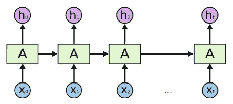

图 18:递归神经网络

让我们用一个例子来证明这一点。假设我们的目标是创建一个自动完成单词的字符级语言模型。为了做到这一点，我们需要想出一个好方法来将字母表示为数字。

向量化字母表中的字母的逻辑方法是让每个字母由一个 26×1 的向量表示，在对应于该字母的分量中有 1，在剩余的 25 个分量中有 0。

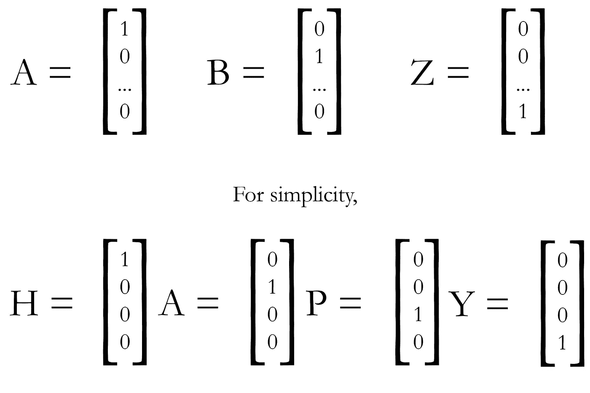

图 19:矢量化的字母

我们将遵循该方法的简化版本，假设我们的字母池仅由字母 H、A、P 和 y 组成。我们希望我们的模型执行如下:

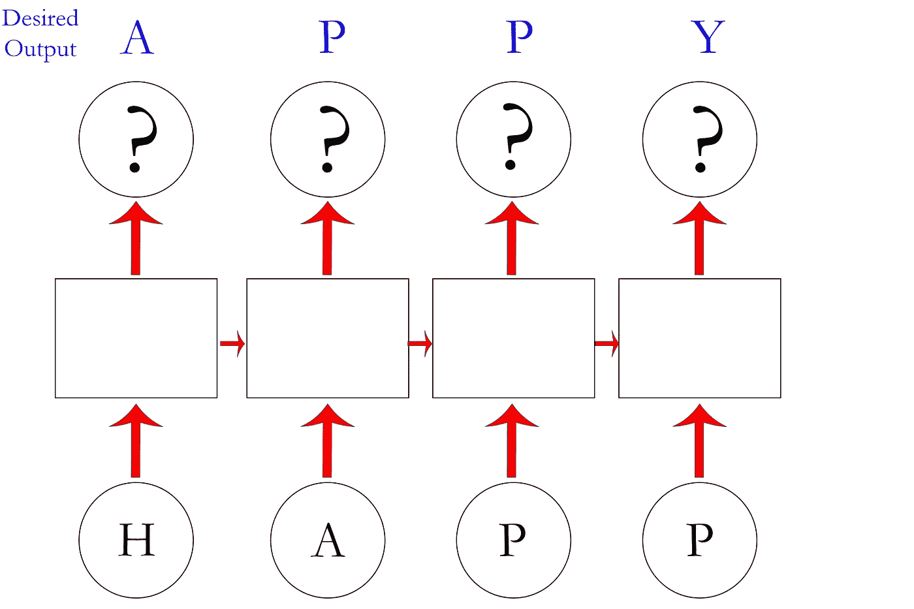

图 20:快乐 RNN 第一步

换句话说，我们希望按顺序输入 4 个字母 H、A、P、P，并希望模型按该顺序返回 A、P、P、Y。更具体地说，我们希望我们的模型在给定字母 H 时预测字母 A，在给定 HA 时预测字母 P，在给定 HAP 时预测 P，在给定 HAPP 时预测 Y。中间的水平箭头表明输出(除了第一个)依赖于所有以前的输入。

请注意，在下面的所有图表中，都有一个错别字。“4x3 W3a”和“4x3 W4a”应该是“4x3 W3b”和“4x 3 W4b”

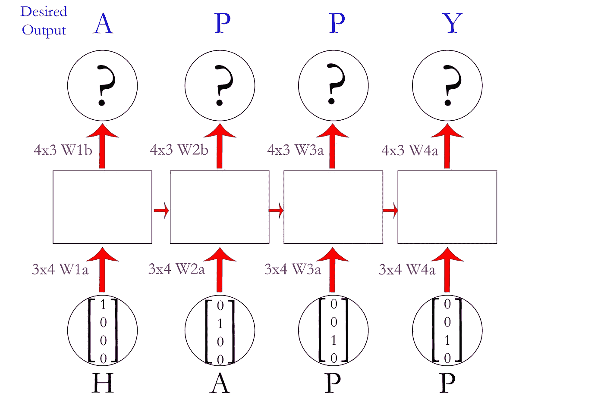

图 21:快乐的 RNN 第二步

每个垂直箭头仍然代表仿射函数。这一次我们不考虑偏置向量(换句话说，假设偏置向量都是 0 ),但是这个过程可以很容易地推广到包括偏置向量。我们知道输入向量是 4x1 向量，输出向量也是 4x1 可能是有意义的，所以我们可以将其转换回 4 个字母{H，A，P，Y}中的一个。我们选择将隐藏层中的 4x1 矢量转换为 3x1 矢量，然后再转换回输出层的 4x1 矢量。这包括将我们的输入乘以 3×4 的权重矩阵，然后将其结果乘以 4×3 的权重矩阵。总共，我们将有四个 3×4 权重矩阵和四个 4×3 权重矩阵。

当然，我们仍然需要在两个仿射函数之间选择一个激活函数，否则我们将无法引入非线性。能够引入非线性非常重要，因为就像我们上面讨论的那样，让输出与输入成线性关系限制了模型的复杂性。

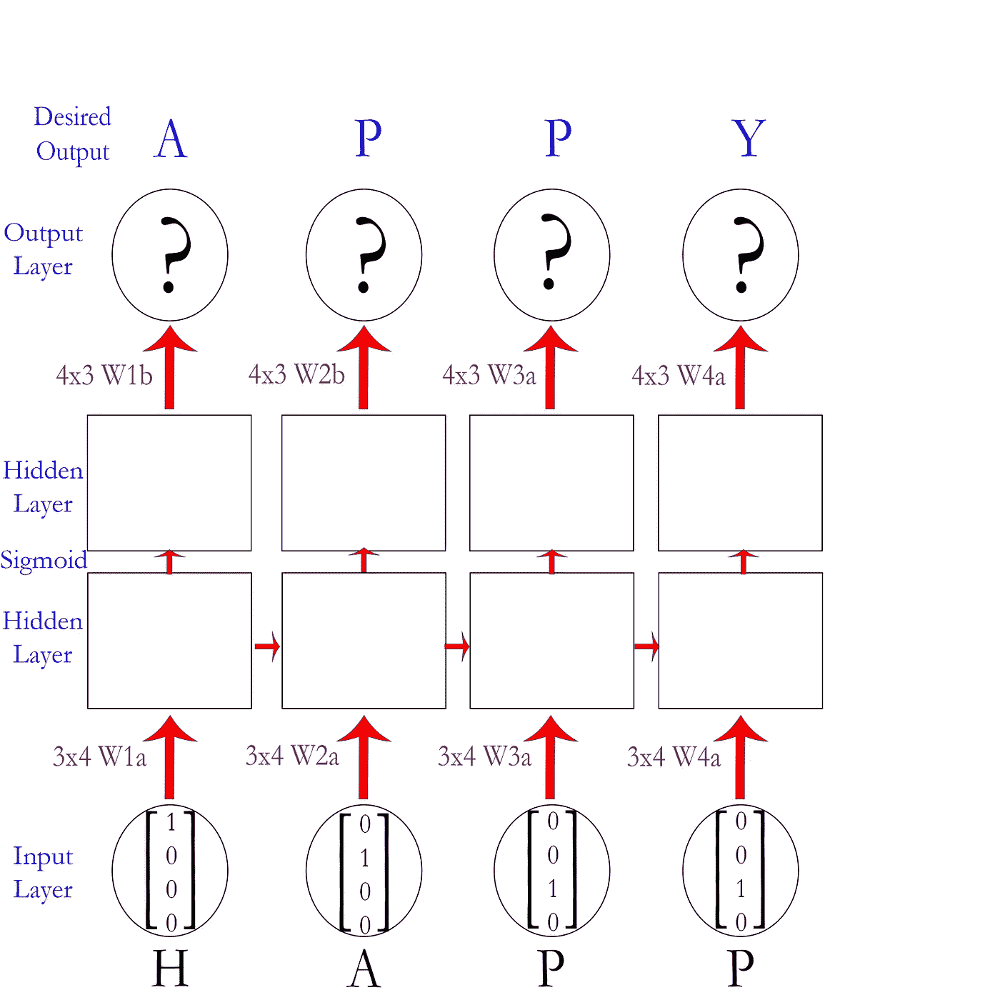

图 22: RNN 快乐的第三步

我们现在演示使用代码输入第一个向量的过程:

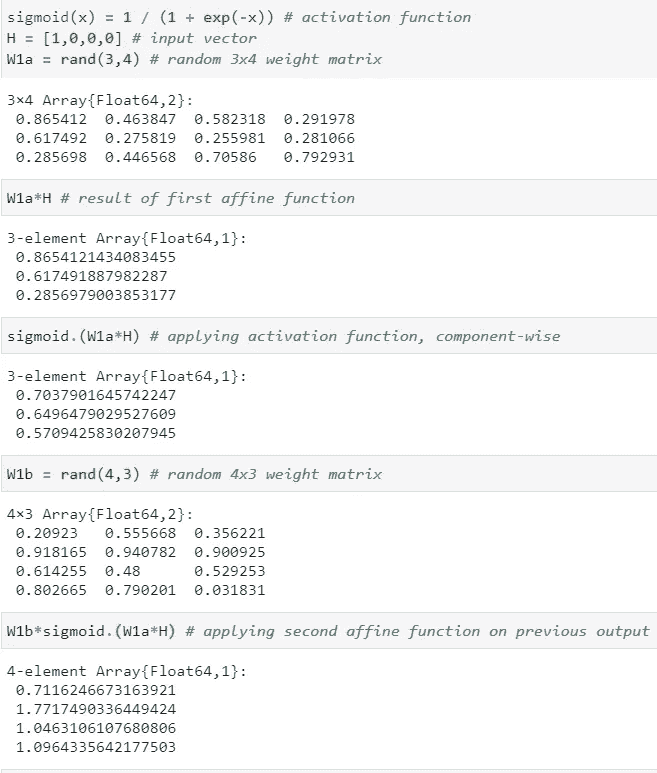

图 22:使用代码的第一次输入

我们先定义激活函数为 sigmoid，初始化输入向量 H，做一个随机的 3x4 权重矩阵 W1a。

接下来，我们将权重矩阵 W1a 对应的仿射函数应用于我们的输入向量 H(记住，这次没有偏差)。

然后，我们将激活函数应用于结果输出的每个组件。

接下来，我们创建对应于第二仿射函数的随机 4×3 权重矩阵，并将第二仿射函数应用于先前的输出。

根据需要，我们的输出是一个 4x1 向量，我们可以将最大的分量取为 1，其余 3 个分量取为 0，以便将其转换回一个字母。在这种情况下，我们实际上纯粹是偶然得到字母 A 作为输出。

我们相应地更新我们的图表:

图 24: RNN 快乐的第四步

因为这是第一次输入，所以不依赖于以前的字母，我们遵循的过程与普通神经网络的过程相同。我们现在将看到，第二个输出(隐含地)依赖于第一个和第二个输入。

请注意，我们仍然没有定义水平箭头的含义。通常它们会表示另一个仿射函数，但是为了演示的目的，让我们假设它们表示加法。换句话说，一旦字母 A (0，1，0，0)乘以 3x4 权重矩阵(W2a)，我们将把得到的 3x1 向量加到(0.86，0.62，0.29)。让我们用代码再做一次:

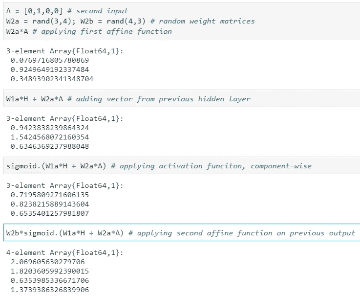

图 25:编码第二个输入

我们初始化第二个输入 A，并定义对应于图中所示仿射函数的随机权重矩阵 W2a 和 W2b。

接下来，我们对输入向量 A 应用第一仿射函数(W2a ),并将得到的 3x1 向量与来自先前隐藏层的 3x1 向量相加。

然后，我们在新的 3×1 向量上按分量应用激活函数，并在结果上应用对应于 W2b 的第二仿射函数。

我们最终得到一个 4x1 矢量，其第一个分量最大，因此对应于(1，0，0，0)或 h 的输出。我们相应地更新我们的图:

图 26: RNN 快乐的第五步

重要的一点是，向量(0.94，1.54，0.63)是(0.86，0.62，0.29)与 W2a 和(0，1，0，0)相乘得到的 3x1 向量之和。换句话说，第二个输入的隐藏层依赖于 H 和 A，所以我们引入了顺序依赖。

我们对两个 P 遵循相同的流程，完成的图表如下所示:

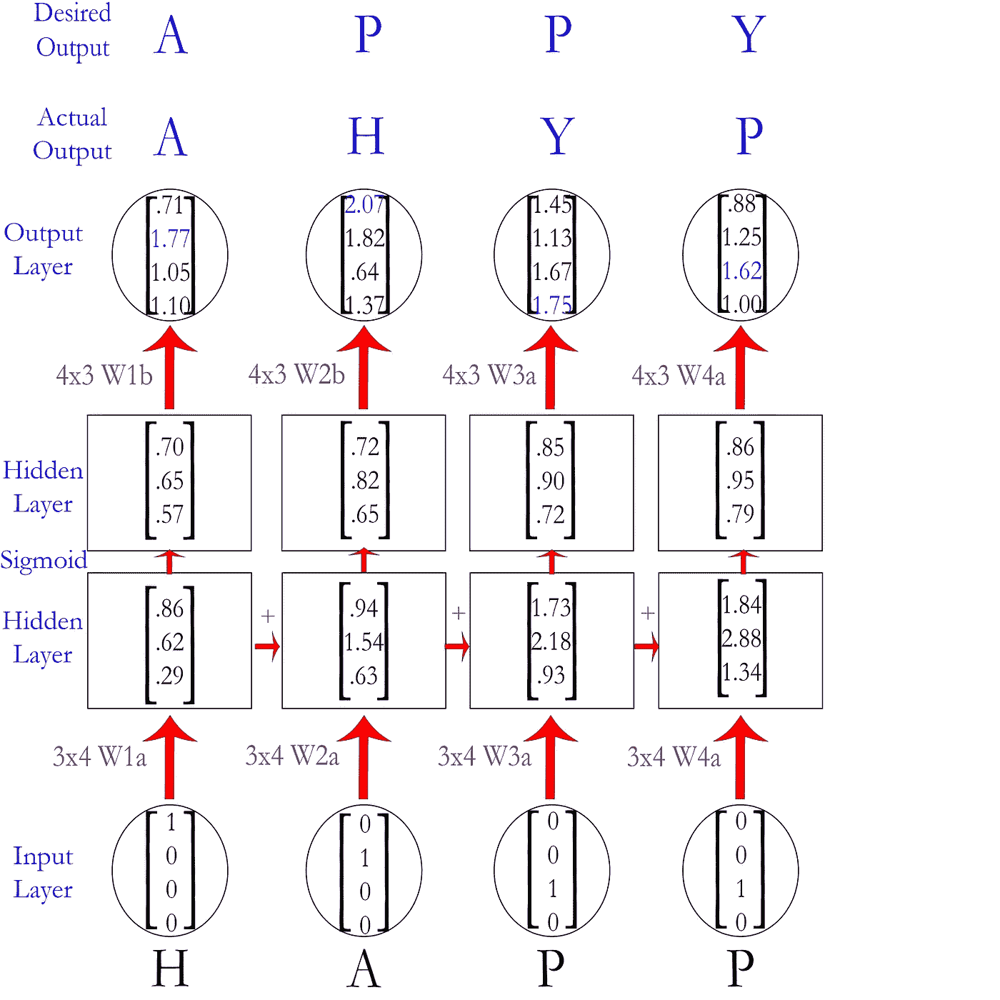

图 26: RNN 快乐的第六步

我们可以看到，我们得到的模型在预测下一个字母方面做得很差，只有四分之一正确。鉴于我们的八个权重矩阵是随机生成的，这并不奇怪。训练神经网络，就像在普通情况下一样，包括为八个权重矩阵中的每一个寻找最优值。在我们的例子中，我们希望我们的模型返回尽可能多的正确字母，并且有充分的理由相信我们可以做得比四分之一更好。

概括这个例子，我们可以对所有 26 个字母和对应于几十万个单词的数据做类似的事情。在这些单词的子集上训练我们的模型后，一个成功的模型将能够确定最有可能跟随一系列字母的字母。记住，之前字母的依赖来自于隐藏层。在我们这个简单的例子中，我们只是添加了向量，但是在这个步骤中通常会涉及到更复杂的函数。

RNN 的缺点是什么？他们往往会很快忘记之前的输入，就像下面的动画所示。圆圈代表隐藏层，我们可以看到，当你在第五次输入时，隐藏层几乎不依赖于第一次输入。我们可以使用长短期记忆(LSTM)网络来解决这个问题，但那是另一篇文章的内容了。

图 27: RNN 动画

# 结论

这里要传达的信息是，机器学习没有灵丹妙药。我们讨论了过拟合和欠拟合的概念，并展示了每个模型是如何倾向于要么缺乏解决某些问题的复杂性，要么过于计算昂贵或效率低下。对各种机器学习技术有严格理解的价值不能被夸大；它将为你提供一套强大的技能，来解决各种有趣且切实的问题。如果你以前在这个领域有经验，我鼓励你继续加深对神经网络和其他机器学习技术的理解。如果这是你第一次接触人工智能，希望我已经让你相信神经网络是一个很好的起点，并激起了你探索更多的兴趣。我在下面附上了最常见的神经网络类型的图片:

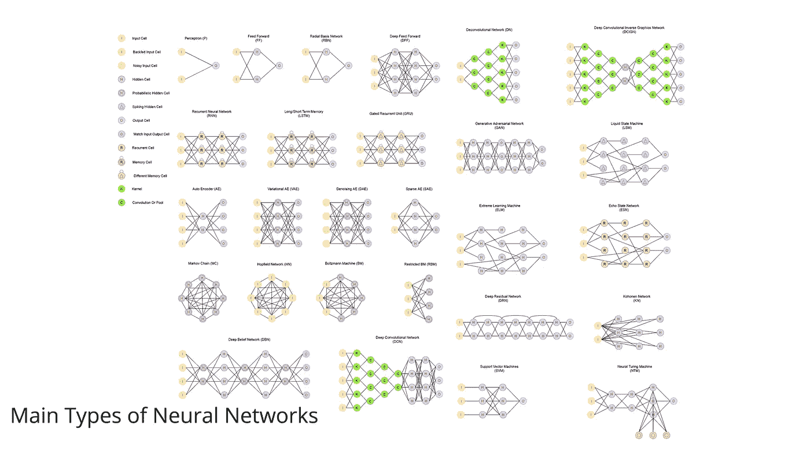

图 28:不同类型的神经网络

如果我有时间逐一探索这些神经网络，并为它们写一篇文章，我会的，但像这样的文章到处都有，包括就在介质上。事实上，我对 RNNs 的很多了解都是通过浏览其他媒体的文章而获得的，这些文章展示了一个积极参与的学术团体是多么强大。

这就结束了我们对神经网络的讨论。我希望你离开这篇文章时，对这些不可思议的机制是如何工作的有了新的兴趣和理解。此外，我希望你离开这篇文章时会带着比你进来时更多的问题。这篇文章并不是神经网络的全面指南。相反，它旨在将神经网络置于一个易于理解和连贯的框架中，并作为未来发现的跳板。

感谢您的阅读，如果您有任何问题，请随时给我发电子邮件(ethan_huang1@brown.edu)。

# 来源

 [## 神经网络-机器学习-数学

### 阅读时间:40 分钟揭示所有步骤还有一种方法可以从更基本的模型中构建复杂的模型…

mathigon.org](https://mathigon.org/course/machine-learning/neural-networks)  [## 神经网络介绍，优势和应用

### 人工神经网络(ANN)使用大脑的处理过程作为基础来开发算法，可用于…

towardsdatascience.com](https://towardsdatascience.com/introduction-to-neural-networks-advantages-and-applications-96851bd1a207)  [## 神经网络的主要类型及其应用——教程

### 关于神经网络的主要类型及其在现实世界挑战中的应用的教程。

medium.com](/towards-artificial-intelligence/main-types-of-neural-networks-and-its-applications-tutorial-734480d7ec8e)  [## 深度学习 Vs 神经网络——有什么区别？

### 近年来，大数据和人工智能(AI)给企业带来了许多优势。但是有了这些…

bernardmarr.com](https://bernardmarr.com/default.asp?contentID=1789)  [## 2.2 生物神经网络

### 接下来:2.3 人工神经网络 Up: 2。人工神经网络以前:2.1 背景…

wwwold.ece.utep.edu](http://wwwold.ece.utep.edu/research/webfuzzy/docs/kk-thesis/kk-thesis-html/node10.html#:~:text=Axon%20is%20a%20thin%20cylinder,diffusion%20but%20sometimes%20electrical%20impulses)  [## 2.3 人工神经网络

### 接下来:2.3.1 麦卡洛克-皮茨模型。人工神经网络以前:2.2 生物神经网络…

wwwold.ece.utep.edu](http://wwwold.ece.utep.edu/research/webfuzzy/docs/kk-thesis/kk-thesis-html/node11.html)  [## 什么是人工智能？AI 是如何工作的？内置的

### 人工智能(AI)是计算机科学的一个广泛的分支，它涉及到构建智能机器，使之能够…

builtin.com](https://builtin.com/artificial-intelligence)  [## AI vs 机器学习 vs 深度学习| Edureka

### 人工智能 vs 机器学习 vs 深度学习-人工智能是机器学习的更广泛的保护伞…

www.edureka.co](https://www.edureka.co/blog/ai-vs-machine-learning-vs-deep-learning/)  [## 2.2 生物神经网络

### 接下来:2.3 人工神经网络 Up: 2。人工神经网络以前:2.1 背景…

wwwold.ece.utep.edu](http://wwwold.ece.utep.edu/research/webfuzzy/docs/kk-thesis/kk-thesis-html/node10.html)  [## 什么是深度学习？-机器学习精通

### 深度学习是机器学习的一个子领域，它涉及的算法是由大脑的结构和功能激发的

machinelearningmastery.com](https://machinelearningmastery.com/what-is-deep-learning/)  [## 深度学习和神经网络不总是正确选择的 4 个原因

### Dee learning 目前正受到大肆宣传。人们希望在任何地方都使用神经网络，但它们总是…

builtin.com](https://builtin.com/data-science/disadvantages-neural-networks)  [## 递归神经网络和 LSTM 解释

### 在这篇文章中，我们将探索 RNN 和 LSTM

medium.com](/@purnasaigudikandula/recurrent-neural-networks-and-lstm-explained-7f51c7f6bbb9)  [## 递归神经网络图解指南

### 理解直觉

towardsdatascience.com](https://towardsdatascience.com/illustrated-guide-to-recurrent-neural-networks-79e5eb8049c9)  [## 深度学习的基础——递归神经网络导论

### 让我以一个问题开始这篇文章——“工作爱学习我们深入”，这对你有意义吗？不是…

www.analyticsvidhya.com](https://www.analyticsvidhya.com/blog/2017/12/introduction-to-recurrent-neural-networks/)  [## 递归神经网络最直观和最简单的指南

### 揭开 RNN 的神秘面纱

towardsdatascience.com](https://towardsdatascience.com/the-most-intuitive-and-easiest-guide-for-recurrent-neural-network-873c29da73c7)