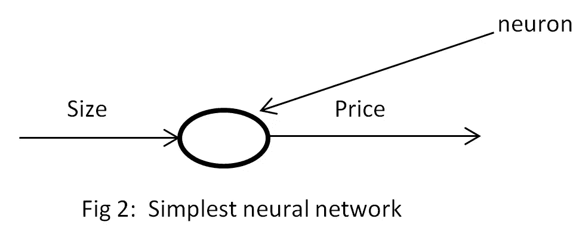
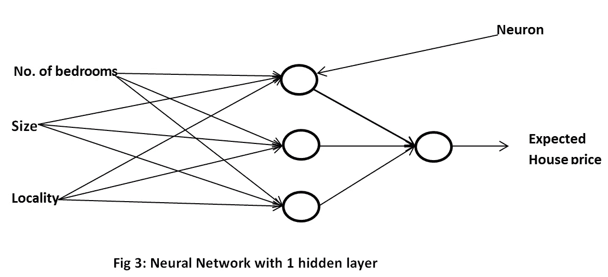

# 什么是神经网络？

> 原文：<https://medium.com/analytics-vidhya/what-is-a-neural-network-fb5b46f9950a?source=collection_archive---------33----------------------->

神经网络是计算机如何在数据的帮助下学习执行一些任务。让我们通过一个例子来详细了解这一点。

每当一个房地产经纪人想出售任何房子，他会寻找最好的价格与利润的房子可以出售。经纪人自己根据一些特征来计算房子的价格，如大小、卧室数量和位置，他的经验将有助于计算出最优价格。神经网络如何完成同样的任务？在人类中，我们所谓的“经验”类似于神经网络的数据，神经网络将通过这些数据来学习预测房价。让我们假设现在我们只有一个特征来预测房子的价格:**大小，**并且通常房子大小的增加与价格的增加成正比。即，随着房屋大小的增加，价格也增加。

作者照片

从图 1 来看。我们可以观察到房子的价格随着面积的增加而增加。因为房子的大小和价格都不是从零开始的，所以原点对应的是某个正值，而不是零。

**那么现在神经元到底在做什么？**

作者照片

对于每一个**给定的“大小”输入，神经元都试图预测房子的“价格”(图 2)** ，因此神经元只是计算房子的“价格”与“大小”相关的函数，在这种情况下，它是线性的(来自图 1)。现在我们只剩下一个问题**神经网络如何计算出函数及其值？**(就像在**直线**的情况下，我们必须找到**直线**的斜率和截距)。让我们详细看看这个:

现在，我们非常确定，只有一个单一的特征不会给出价格的最佳预测，也就是说，只看到房子的大小，我们不会估计它的价格。

因此，让我们假设数据由 3 个**输入特征**组成:卧室数量、大小、位置和单个**输出**，即房价。因此，在**训练神经网络**(用于**学习**预测价格:就像你使用已知答案的前一年的试卷准备考试一样)时，我们将有输入-输出对，即对于输入特征(大小、位置、卧室数量)的每栋房子，将有单个输出“房价”。即给定房子的大小、位置、卧室数量作为输入，以及该房子的**已知**输出(已经存在于数据中)【价格】。什么是**数学函数**最适合预测与该房屋的观察价格接近的价格，即“**预测价格必须与该房屋的观察价格接近”。**这正是我们要做的，我们必须**最小化**观察价格和预测价格之间的差异，所涉及的步骤被称为**‘反向传播步骤’。**使用数学函数找到房屋输入特征的价格值所涉及的步骤被称为“**正向传播步骤**”。

作者照片

**隐层神经元的作用是什么？**

隐藏层中的每个神经元都采用图 3 中给出的所有输入特征(大小、位置、卧室数量)。但是他们不需要计算同样的东西。因此，如果我们考虑第一个神经元，并让来自**位置**的输入为 0，即我们将只有**大小(**是房子**的大小)**和**数量。那栋房子的卧室**。不难看出**家族大小**可以从那两个特征中预测出来，所以即使在输入特征(数据)中没有给出家族大小，也是由隐层神经元预测出来的，同样，其他特征也可以提取出来。

同样，你很容易看到输出神经元(隐层后的神经元)会预测**房价**。

所以，到目前为止，在很高的层面上，神经元到底是做什么的已经很清楚了，那么隐藏层呢？因此，隐藏层有助于提取未明确提供的特征，如:“家庭规模”，因此，隐藏层的数量越多，要提取的特征就越复杂(如图像中面部的鼻子)。这确实有助于更准确的预测(提取更复杂的特征)。

完整的过程描述如下:

**在训练中，**网络从对函数及其值的一些假设开始，以预测房价。对于每栋房子，它试图预测价格(**正向传播**，并查看它产生了多少误差(原始价格和预测价格之间的差异)，并试图最小化误差(**反向传播**)。因此，在预测下一个房价时，函数会稍微好一点，因为它从每个例子中学习，所以它学习的数据越多，预测就越准确。训练后的函数用于测试，其中输出(房价)不显示给网络(就像在准备(训练)后你给考试(测试))。**在测试**中，训练好的网络将从测试数据中获得输入(大小、位置和卧室数量),网络预测房价，然后与测试数据中的原始价格进行比较，以查看网络的表现如何(就像考试结果一样)。然后，决定要么对网络进行修改再培训(比如学生考试不及格)，要么部署到现实世界中。

**注:这里的测试数据是神经网络在训练过程中未见过的数据。**

**参考:**

**吴恩达的神经网络和深度学习课程，Coursera**