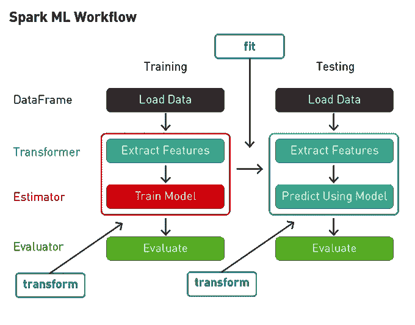
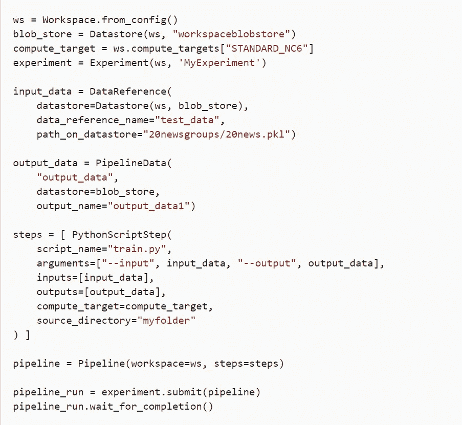

# 机器学习中的流水线是什么？如何创建一个？

> 原文：<https://medium.com/analytics-vidhya/what-is-a-pipeline-in-machine-learning-how-to-create-one-bda91d0ceaca?source=collection_archive---------1----------------------->

Jukan Tateisi 在 [Unsplash](https://unsplash.com?utm_source=medium&utm_medium=referral) 上拍摄的照片

> 机器学习正在蓬勃发展

**熟悉 ML 管道**

机器学习管道用于帮助自动化机器学习工作流。它们通过使一系列数据在一个模型中进行转换和关联来运行，该模型可以被测试和评估以获得结果，无论是积极的还是消极的。

机器学习(ML)管道由训练模型的几个步骤组成。机器学习管道是迭代的，因为每一步都重复进行，以不断提高模型的准确性，并实现成功的算法。为了建立更好的机器学习模型，并从中获得最大价值，可访问、可扩展和耐用的存储解决方案是必不可少的，这为内部对象存储铺平了道路。

日常数据已经成为现代货币。从大量捕获的数据集(大数据)中提取出了巨大的价值和情报，从而对当今世界产生了切实可行的见解。它不再仅仅是存储数据，而是捕获、保存、访问和转换数据，以利用其可能性和它可以提供的价值。

1.  为任何 ML 模型建立适当的管道的主要目的是对其进行控制。组织良好的管道使实现更加灵活。这就像有一个计算机的分解图，在那里你可以挑出有问题的部分并替换它——在我们的例子中，替换一大块代码。
2.  术语 ML 模型是指由训练过程创建的模型。
3.  学习算法在训练数据中查找将输入数据属性映射到目标(要预测的答案)的模式，并输出捕获这些模式的 ML 模型。
4.  一个模型可以有许多依赖项，为了存储所有的组件以确保所有的特性都可以离线和在线部署，所有的信息都存储在一个中央存储库中。
5.  管道由一系列组件组成，这些组件是计算的汇编。数据通过这些组件发送，并在计算的帮助下进行处理。

管道不是单向流动的。它们本质上是循环的，并使得迭代能够提高机器学习算法的分数，并使模型可扩展。

今天的许多 ML 模型都是“训练有素”的神经网络，能够执行特定的任务或提供从“发生了什么”到“可能会发生什么”(预测分析)的见解。这些模型很复杂，永远不会完成，而是通过重复数学或计算程序，应用于以前的结果，并每次都进行改进，以更接近“解决问题”。数据科学家希望获取更多的数据，为训练 ML 模型提供动力。

> ML 的目标很简单:"**做出更快更好的预测**"

# 与 ML 管道相关的挑战

典型的机器学习流水线将由以下过程组成:

*   数据收集
*   数据清理
*   特征提取(标记和降维)
*   模型验证
*   (英)可视化(= visualization)

谷歌图片

数据收集和清理是任何想要从数据中获取意义的机器学习工程师的主要任务。但是获取数据，尤其是获取正确的数据本身就是一项艰巨的任务。

数据质量及其可访问性是在构建管道的初始阶段会遇到的两个主要挑战。

捕获的数据应该被提取并放在一起，收集的好处应该超过收集和分析的成本。

为此，建议每个组织都建立一个数据湖。数据湖是一个集中式存储库，允许用户存储任何规模的结构化和非结构化数据。它还通过将模式应用于读取而非写入来实现即席分析。通过这种方式，用户可以对相同的数据应用多种分析和处理框架。

由于每个案例都有自己的数据量，通常在无人监管的情况下，如果可用于训练的数据量较少，事情可能会失控。

**用例**

机器学习模型的生命周期需要更适应模型调整和监控。随着新数据的频繁出现，结果可能会发生重大变化。

目前，正在对现有的神经网络进行改进，以使它们即使在数据模糊和缺乏标记训练数据时也能运行。

# 一个简单的 Python 管道

此代码片段显示了创建和运行基本管道所需的对象和调用:

图片由[沙珊卡·曼雅姆](/@shashanka.manyam)提供

这个片段从常见的 Azure 机器学习对象开始，一个*工作空间*，一个*数据存储*，一个*计算目标*和一个实验。然后，代码创建对象来保存*输入数据*和*输出数据*。数组 steps 包含一个元素，一个将使用数据对象并在 *Compute_Target* 上运行的 *PythonScriptStep* 。然后，代码实例化*管道*对象本身，传入工作区和步骤数组。对*experience . submit(pipeline)*的调用开始 Azure ML 管道运行。对 *wait_for_completion()* 的调用会一直阻塞，直到管道完成。

在项目变大或接近部署之前，您的管道应该更粗而不是更细。如果你认为你的 ML 项目包括*阶段*和一个提供完整工作流程的管道，让你通过一个特定的阶段，你就在正确的道路上。

修修补补真开心！！

**参考文献:**

[https://docs . Microsoft . com/en-us/azure/machine-learning/service/concept-ml-pipelines](https://docs.microsoft.com/en-us/azure/machine-learning/service/concept-ml-pipelines)

## 脚注

*恭喜！你坚持到了最后！我真的希望你喜欢数据科学的软件工程之旅！*

[*我定期在媒体上写关于技术的&数据——如果你想阅读我未来的帖子，请“关注”我！*](/@shashanka.manyam)