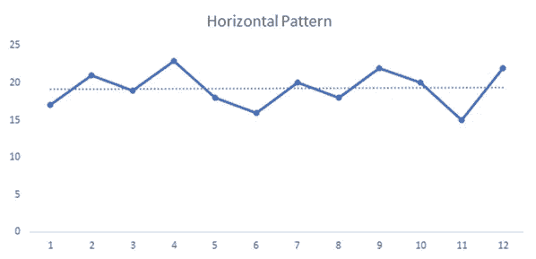
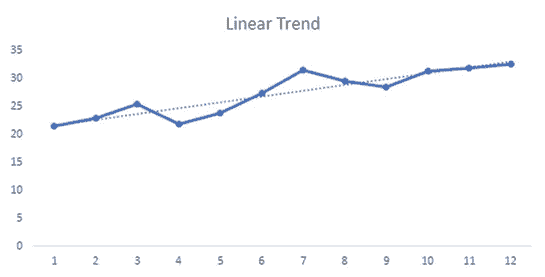
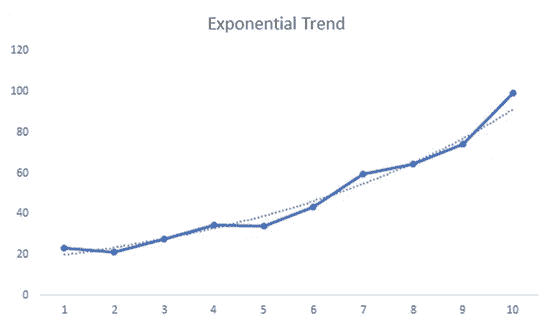
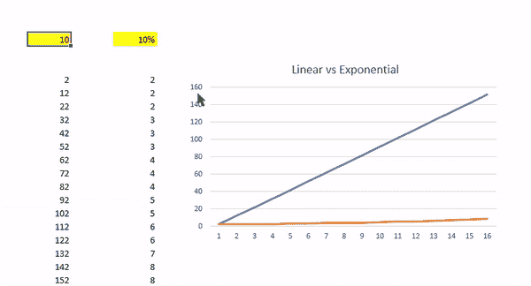
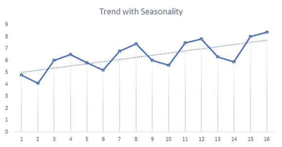

# 什么是时间序列？

> 原文：<https://medium.com/analytics-vidhya/what-is-a-time-series-fab8ebc4451b?source=collection_archive---------4----------------------->

预测只是对未来可能发生的事情的预测。不管有多种技术可用，几乎不可能做出完美的预测。

预测方法有定性的和定量的。**定性**方法包括使用专家判断来进行预测。我们在相应的历史数据不可用或不适用的情况下使用它。

**定量**预测适用于以下情况:

过去的数据是可用的

信息是可以量化的

我们有理由假设过去的模式没有改变。

# 什么是时间序列？

时间序列是在连续时间点或连续时期的一系列观察值。测量可以是每小时、每天、每周、每月、每年或任何其他有规律的间隔。

时间序列分析的目标是理解时间序列中的模式，然后将模型外推至未来。预测完全基于历史值或过去的预测误差。

另一种流行的方法是因果或探索性预测方法。它假设我们预测的变量与一个或多个其他变量有因果关系。例如，销售预测取决于广告。在这种情况下，使用回归分析的预测模型可以根据广告预算预测未来的销售额。请注意，如果我们使用时间序列方法进行预测，我们会忽略广告预算。

时间序列方法仅根据过去的销售额计算预测。

# 时间序列模式

第一步是使用时间序列图可视化数据。它有助于理解潜在的模式。时间序列图是时间与我们需要预测的变量之间关系的图形表示。横轴表示时间，纵轴表示时间序列变量。按照惯例，我们使用折线图来直观表示时间序列。

# 水平格局

当数据在一段时间内围绕一个恒定平均值随机波动时，就存在水平模式。

有时，条件的变化通常会导致具有水平模式的时间序列在某个时间点转移到新的水平。例如，前面例子中的创业公司在第 13 周增加了一个新地点。随着这一变化，销售量从第 13 周开始有了显著的变化。

这种转变也被称为*新常态。*

# 趋势模式

通常，时间序列数据表现出随机波动。它也可能显示在一段时间内逐渐向更高或更低的值转移或移动。这种行为表明**趋势模式**在数据中可用。

时间序列图显示了这段时间内的一些上下运动。它也有系统地增加或上升的趋势。从一个周期到另一个周期，数据点以*恒定量*变化；因此，趋势是线性的。

当从一个时期到另一个时期有一个恒定的*百分比变化*，那么它就是一个指数趋势。

下图显示了指数趋势与线性趋势之间的差异。第一个系列是相对于前一个数据点的持续增长，而第二个系列是相对于前一个数据点的百分比变化。

趋势通常是长期因素的结果，如人口变化、人口特征变化、技术进步、竞争格局变化和/或消费者偏好变化。

# 季节性模式

通过观察连续时期内的循环模式来识别季节性模式。

季节性是一个完整的数据周期所需的时间步数，在此之后，该周期在整个时间序列中重复。

例如，一家电子商店预计夏季空调或空气冷却器以及冬季室内加热器的销量将会上升。这种模式每年都在重复。

一个普遍的概念是季节模式在每年的数据中是明显的。然而，时间序列数据也可以显示持续时间不到一年的季节性模式。例如，道路交通量显示一周内、一天内的季节性行为，在高峰时间和非高峰时间具有重复模式。

# 趋势和季节模式

一些时间序列同时包含趋势和季节模式。例如，时间序列图表示每年第四季度销售量增加而下降。

# 循环模式

如果时间序列图显示持续一年以上的趋势线之上和之下的点的交替序列，则存在循环模式。各种经济时间序列显示了周期性的行为，在趋势线之上和之下都有规律的观察。

商业周期极难预测，如果不是不可能的话。

# 寻找时间序列模式

发现时间序列数据中的模式是选择正确预测方法的基本因素。如果数据显示水平模式，那么我们选择移动平均或简单指数平滑。同样，如果数据显示趋势或季节性，我们选择正确的预测技术

点击此处查看关于以下内容的文章:

[移动平均线](https://www.vivran.in/post/moving-average-using-dax)

[简单指数平滑](https://www.vivran.in/post/time-series-forecast-exponential-smoothing)

[Excel 中的时间序列(针对霍尔特的&霍尔特温特的指数平滑)](https://www.vivran.in/post/time-series-forecast-with-excel)

现在我们知道了更多的预测方法

*我写关于*[*MS Excel*](https://www.vivran.in/my-blog/categories/excel)*[*权力查询*](https://www.vivran.in/my-blog/categories/powerquery)*[*权力毕*](https://www.vivran.in/my-blog/categories/powerbi)*[*权力中枢*](https://www.vivran.in/my-blog/categories/power-pivot)*[*DAX*](https://www.vivran.in/my-blog/categories/dax)*[*数据分析【数据*](https://www.vivran.in/my-blog/categories/data-analytics)*****

**[@imVivRan](https://twitter.com/imvivran)**