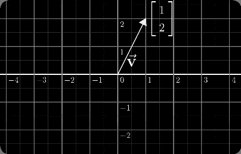

# 什么是向量？

> 原文：<https://medium.com/analytics-vidhya/what-is-a-vector-5c86fc2b57c1?source=collection_archive---------3----------------------->



[注意:这是我的第一次尝试，我不更新这篇文章]

向量是线性代数的基本元素。向量是由一个或多个称为标量的值组成的元组。

在本文中，我们将发现用于机器学习的线性代数向量。

看完这篇文章，你会知道:

*   向量是什么。
*   为什么矢量很重要。
*   数组和向量的主要区别。

向量在整个机器学习领域中用于描述算法和过程，例如训练算法时的目标变量(y)。向量通常用于机器学习，因为它们提供了一种组织数据的便捷方式。通常，制作机器学习模型的第一步是对数据进行矢量化。

# 机器学习中的向量

在机器学习和编程中，使用向量通常很方便。向量可以是数据本身的形式，或者是模型参数，等等。

例如，输入(3.14159，2.71828，1.618)是 3 个元素的向量，并且可以表示为三维空间中的一个点。您的程序将声明一个 1x3 数组(一维数据结构)来保存这三项。

特征向量只是一行输入。例如，在房屋价格预测的流行机器学习示例中，我们可能有一些特征(表列)，包括房屋的建造年份、卧室数量、面积(m)和车库大小(汽车容量)。这将给出输入向量，例如

```
[1988, 4, 200, 2]
[2001, 3, 220, 1]
```

简单来说，
***维度*** :用于分析的属性/特征

***n 维向量*** : < e1，e2，e3，…，en >其中 *ei* 是尺寸 *i* 的值，并且元素是有序的。

**例** :
< 180，74，M，60，120 >是一个 6 维向量，其中 180，74，M，60，120 分别是属性/维度身高、体重、性别、脉率、胆固醇水平的值。

<180, **74，M，** 60，120 >和< 180， **M，74** ，60，120 >尺寸顺序不同，重量和性别不同。

可以把它想象成一个值列表或表格中的一行。数据结构是一维数组；一个由 **N** 个元素组成的向量是一个 **N** 维向量，每个元素一个维度。

向量可以指以下任何一项:

1.在计算机编程中，向量要么是指针，要么是只有一维的数组。

2.在数学中，向量是既有大小又有方向的量。

3.在计算机图形学中，向量这个术语描述了一条有起点和终点的直线。

4.在计算机安全学中，术语“攻击向量”指的是利用系统漏洞的特定方法。

**例如:**

如果我们对人口中的身高进行调查，我们可能会得到这样的分布:


该直方图显示了调查中任何人处于特定身高范围的可能性。(6 英尺约为 180 厘米)

该直方图也可以由矢量表示，即一列数字。

在这种情况下，我们以 2.5 厘米的间隔记录小组中身高的人的频率，即在 150 厘米和 152.5 厘米之间，在 152.5 厘米和 155 厘米之间，等等。我们可以将此定义为向量 **f** 的分量:


向量 **f**

这些矢量分量就是直方图中每个条的大小。

# **注意事项**

*   在编程中，向量是一种一维数组。
*   向量通常表示为一维数组，称为分量，以列或行的形式显示。
*   向量是编程语言中用于存储数据的逻辑元素。
*   向量类似于数组，但它们的实际实现和操作不同。
*   向量容器被实现为动态数组；就像常规数组一样，向量容器将它们的元素存储在连续的存储位置，这意味着它们的元素不仅可以使用迭代器来访问，还可以使用指向元素的常规指针上的偏移量来访问。
*   但与常规数组不同，向量中的存储是自动处理的，允许根据需要扩展和收缩。
*   此外，向量通常可以保存任何对象，因此您可以创建一个类来保存有关车辆的信息，然后将车队存储在向量中。
*   除了调整大小之外，向量的好处在于它们仍然允许通过索引在固定时间内访问单个元素，就像数组一样。
*   向量中的每一项都必须是相同的长度和类型。如果我们选择将不同的类型放入其中，无论是通过造型还是指针操作，我们都有在以后的造型和指针操作中出错的风险。
*   用几何图形表示，向量通常表示 n 维空间内的坐标，其中 n 是维数。向量的一个简单表示可能是向量空间中的一个箭头，带有原点、方向和大小(长度)

# 数组和向量的主要区别

*   与典型的数组不同，向量的容器大小可以很容易地增加和减少，以适应不同的数据存储类型。
*   向量具有动态结构，并提供预先分配容器大小的能力，并支持快速分配内存空间。
*   向量可以被认为是动态数组。

在下一篇文章中，我们将讨论向量运算。

# 结论

向量主要用于大多数编程语言的编程环境中，并作为数据结构容器。作为一种数据结构，向量用于以有组织的结构存储对象和对象集合。