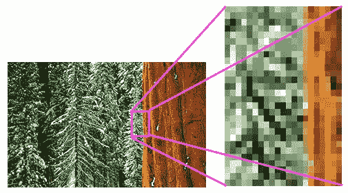
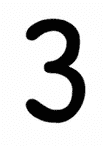
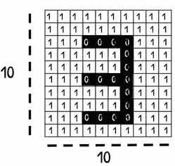
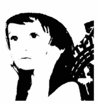
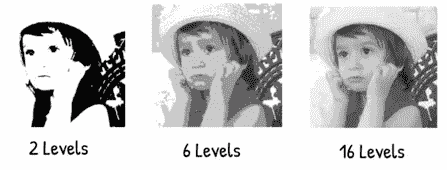

# 什么是图像？

> 原文：<https://medium.com/analytics-vidhya/what-is-an-image-8ed87969f721?source=collection_archive---------22----------------------->

机器学习中最酷的事情之一(IMO ),是能够把图像作为数据拉进来。

当我们看到一只猫的图像时，我们知道它是一只猫。这是我们小小的人类大脑有着数年或数十年的经验来看待猫并给它贴上这样的标签。所以对我们来说，这几乎是瞬间的。但试图让计算机做到这一点，绝对是一个过程。在我们训练机器给图片贴标签之前，我们必须理解

# **那么什么是图像呢？**

我们可以将图像分解成像素。我们将从一些基本的东西开始，比如数字 3。如果我们要显示实际数字的图像，我们告诉计算机显示什么？

计算机读取该图像的方式是用二进制数 0 和 1 来表示。因此，如果我们建立一个 10x10 的网格，0 将代表黑色，而 1 将代表白色或零。当然，看 3 下面的图像看起来比上面的 3 更机器人化，这是因为我们没有足够的像素。如果我们将像素大小增加到 640 x 480，3 看起来会更清晰一点，如果将像素大小增加到 1920 x 1080，会更清晰。这些数字听起来是不是有点耳熟？如果你有一台旧的 VGA 电视，你可能会运行 640 x 480，如果你有一台 2010 年的电视，你可能会运行 1920 x 1080。

输出的‘3’是二进制图像。这意味着它只有黑色和白色。因此，如果我们用二进制来看真实的生活画面，它会是这样的:

现在我们要给我们的图像添加更多的“层次”。意味着更多的灰色，它看起来会像下面的图片。你可以看到画面越来越清晰。

为了获得最清晰的图像，我们使用了 8 位的级别。意思是 2⁸ = 256。所以有 256 级灰度。这实际上是图像阅读的“神奇”尺度。但是如果我们有一个彩色的图像呢？

这让事情变得复杂了，但也不尽然。一幅彩色图像就是三种颜色的叠加。因此，当你将一幅图像分解成不同色度的红、绿、蓝三色，然后叠加在一起，你就会得到你所看到的全色图像。

# 为什么这很重要？

当涉及到图像分类中的深度学习模型时，理解这一点很重要。当谈到神经网络时，有许多矩阵数学发生在后端，所以理解图像如何分解很重要，这样你就知道使用哪个超参数。