# 什么是无符号整数？

> 原文：<https://medium.com/analytics-vidhya/what-is-an-unsigned-integer-fc5e5c9247e5?source=collection_archive---------11----------------------->

数学中的整数，是属于集合`Z`的任何数。集合`Z`，包含正整数如:`1`，负整数如:`-1`，数字:`0`。

问什么是`signed`或者`unsigned`整数，实际上是问，在计算机中如何表示`-1`、`0`、`1`等整数。

在计算机中表示数字是在有限数量的位上完成的，例如`8`位或`16`位。

在这第一部分，我们将描述什么是一个`unsigned`整数，在第二部分，我们将描述什么是一个`signed`整数。

# 无符号整数

也就是说，我们可以首先选择对非负数进行编码，比如正整数，如`1`或`2`等。，以及编号 `0`。

因为计算机存储器是有限的，所以计算机中的编码可以仅使用有限数量的比特来执行。

因此，一旦选择了编码非负整数值的位数，就只能表示有限的一组非负整数。这个有限的非负整数集合及其编码称为无符号整数集合。一个无符号整数，有一个非负的整数值，并且它有一个编码。

计算机中的编码包括使用仅由`0`和`1`组成的位串(如`10101`)来表示数据，称为二进制表示。二进制如所用的数字，仅由两个值`0`或`1`组成。

在无符号编码中，非负整数使用二进制位置数字系统进行编码。在二进制位置数字系统中，例如，`0101`在十进制位置数字系统中具有值`5`。

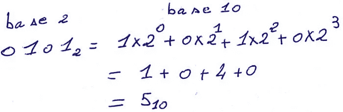

在高级编程语言中，无符号整数使用某种数据类型来表示，例如在`c`或`c++`中，无符号整数使用以下数据类型来表示:

```
unsigned char 
# typically 8 bits .
# at least 8 bits .unsigned short 
# typically 16 bits .
# at least 16 bits .unsigned int 
# typically 32 bits .
# at least 16 bits .unsigned long 
# typically 64 bits
# at least 32 bits .unsigned long long 
# typically 64 bits
# at least 64 bits .
```

选择了一些位，以及如何在计算机中对非负整数进行编码，我们最终得到一个无符号整数集，由有限数量的非负整数及其编码组成，因此要问的问题是，可以对这个集执行什么操作。

对于以下所有部分，假设编码仅使用`2`位执行，因此无符号整数集为:

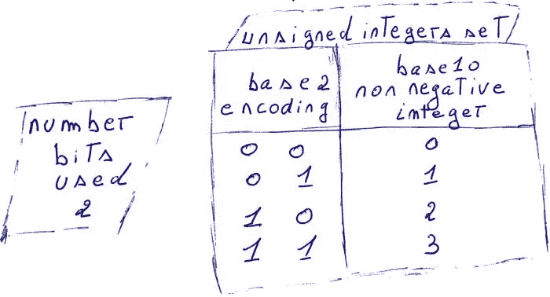

# 无符号整数加法

加法是使用二进制位置数字系统执行的，因此它的工作方式类似于常规加法，带有进位等等。

当使用无符号整数执行加法时，面临的一个问题是，用于编码的位数有限。这可能会导致溢出，即结果太大而无法使用所选的编码来表示。

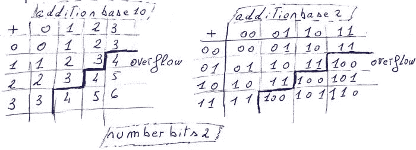

当无符号加法的结果太大而不能用所选位数表示时，多余的位被丢弃，因此得到的位数被截断以适合所选位数。这与以下内容相同:

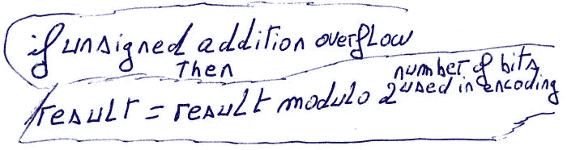

这样，当选择用于编码的位数只有`2`时，执行无符号整数加法的结果是:

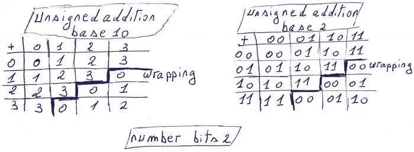

要检测无符号整数加法是否发生溢出，只需检查无符号加法的结果是否小于其两个操作数中的任何一个。

```
int unsignedAdditionOverflow( unsigned int x , unsigned int y ){
  /* Check if unsigned int addition overflow ,
    will occur , return 1 , if it does , 0 
    otherwise .*/ 
  return ( x + y )  < x;}// end unsignedAdditionOverflow
```

# 无符号整数乘法

无符号整数乘法的工作方式类似于常规乘法，因为它是使用基数`2`来执行的。

无符号乘法面临的问题是由使用的有限位数引起的，这导致溢出。

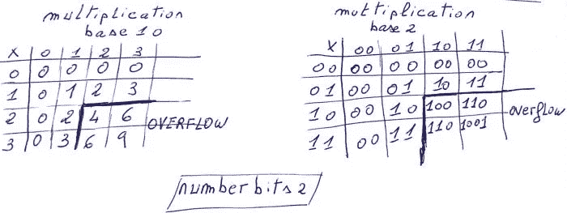

对于无符号整数乘法，当溢出发生时，超出的位被丢弃，结果被截断为选定的位数。这与以下内容相同:

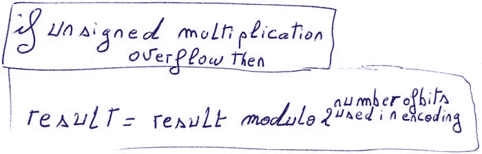

例如，当使用两位执行编码时，无符号乘法的表是:

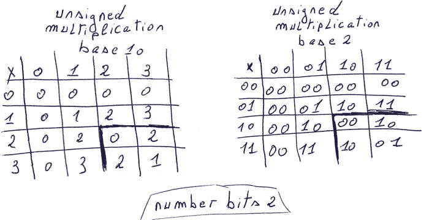

要检测`C`中的无符号乘法溢出，可以使用这个方法，或者它的一个派生方法。

```
#include<limits.h>
/* The limits.h header contains the
   min and  max values , that integer
   types in C , can have on a certain
   machine . */int unsignedMultiplicationOverflow( unsigned char x , unsigned char y ){
  //Check for unsigned char multiplication overflow 
  if( x == 0 || y == 0 )
    return 0; //no unsigned char multiplication overflow
  if( x == 1 || y == 1 )
    return 0; // no unsigned char multiplication overflow
  unsigned char z = UCHAR_MAX / x ;
  /* Perform unsigned division ,
     For example , x = 20 , UCHAR_MAX = 255
       z = 12 .
     z is the greatest number such that :
       z * x <= UCHAR_MAX */
  if( y > z )
    return 1;//unsigned char multiplication overflow
  else
    return 0; /*no unsigned char multiplication overflow*/}//end unsignedMultiplicationOverflow
```

# 无符号整数除法

无符号整数除法的工作原理与常规整数除法相同，因为除法是使用基数`2`来执行的。它只返回商，没有任何余数或小数部分。

执行无符号整数除法时不会发生溢出，被`0`除的结果是未定义的。

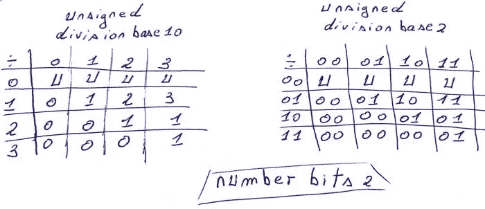

# 无符号整数减法

从较小的无符号值中减去较大的无符号值时，结果是正确的，但从较大的无符号值中减去较小的无符号值时，结果是负的。

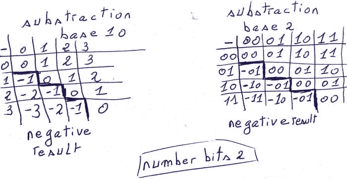

当两个无符号整数相减产生负值时，计算结果的公式如下:

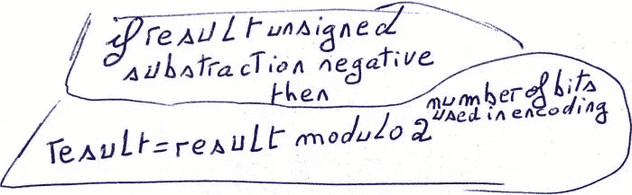

例如，下表详细说明了使用 2 位的无符号减法:

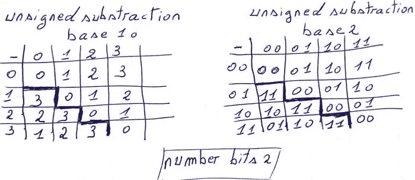

要检查两个无符号整数相减是否会产生取模结果，可以按如下方式进行:

```
int unsignedSubstractionModulo( unsigned char x , unsigned char y ){
  // Check if y - x cause modulo result . 
  if( x <= y )
    return 0; // no unsigned char substraction modulo result
  else
    return 1;/* unsigned char substraction modulo result */}// end unsignedSubstractionModulo
```

# 交换性、结合性和分配性

```
unsigned addition 
    commutative : a + b = b + a 
    associative : a + ( b + c ) = ( a + b ) + cunsigned Multiplication
    commutative : a * b = b * a 
    associative : a * ( b * c ) = ( a * b ) * c 
    distributive over addition and substraction 
                  a * ( b + c ) = ( a * b ) + ( a * c )
                  a * ( b - c ) = ( a * b ) - ( a * c )unsigned Division
    not commutative  : ( 1 / 2 ) != ( 2 / 1 )
    not associative  : ( 1 / 2 ) / 3 != 1 / ( 2 / 3 ) 
                  because     0      !=   undefinedunsigned Subtraction
    not commutative : 1 - 2 != 2 - 1  
    not associative : ( 1 - 2 ) - 1 != 1 - ( 2 - 1 )
```

*原载于 2020 年 11 月 30 日*[*【https://twiserandom.com】*](https://twiserandom.com/data-structure-and-algorithms/what-is-an-unsigned-integer/)*。*