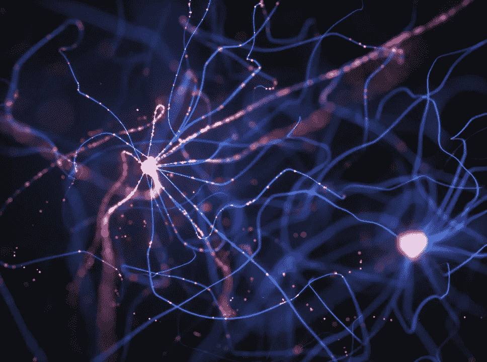
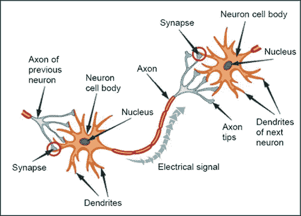
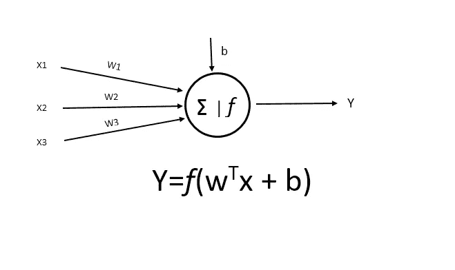
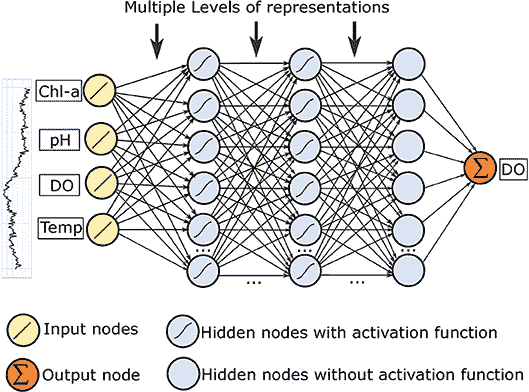

# 什么是人工神经网络，它是如何模仿人脑的？

> 原文：<https://medium.com/analytics-vidhya/what-is-artificial-neural-network-and-how-it-mimics-the-human-brain-f92c45564e20?source=collection_archive---------10----------------------->

图 1:神经元的网络。来源:curealz.org

这是为机器学习领域的新人写的文章。在这篇文章中，我将尝试给你一个关于人工神经网络的简单直觉。
人工网络网络是模仿人脑的机器学习算法之一。它建立在与人脑工作原理相同的概念上。在本文的最后，我们还将学习感知器。

人脑是人类神经系统的指挥中心，是世界上最神秘的事物之一。对人脑的研究已有几千年的历史。人类神经系统的核心组成部分是神经元。大约 1000 亿个神经元通过相互连接来创建神经元网络。信息通过电脉冲和化学信号从一个神经元传递到另一个神经元。

图 2:神经元——人脑的电脑芯片。来源:[humanagingcentral.com](http://www.humanagingcentral.com/images/brain_cells.jpg)

神经元是可兴奋的细胞。所有神经元都包含树突、细胞体(包含细胞核)和轴突。树突看起来像收集信息的树枝。轴突看起来像一条长尾，在不同的细胞之间传递信息或讯息。细胞体处理输入信号，产生电脉冲和化学信号。当神经元达到阈值水平时，两个不同的神经元通过在相邻神经元的轴突和树突之间的突触上发送神经递质(一种化学物质)来相互通信。

机器学习中的人工神经网络是一种信息处理技术，它使用与生物神经网络相同的概念，但并不完全相同。在 20 世纪 50 年代，IBM 研究实验室的 Nathanial Rochester 迈出了模拟假设神经网络的第一步。但不幸的是，他的第一次尝试失败了。1958 年心理学家 Frank Rosenblatt 发明了第一个人工神经网络叫做 [**感知器**](https://towardsdatascience.com/what-the-hell-is-perceptron-626217814f53) 。人工神经网络的模式匹配和学习能力帮助解决了许多难题。到 20 世纪 80 年代末，许多现实世界的机构开始将人工神经网络用于各种目的。如今，人工神经网络被用于语言处理、机器翻译、语言生成、股票市场预测、癌细胞分析、聊天机器人、飞机故障检测等等。简而言之，人工神经网络在人工智能领域带来了一场巨大的革命。

人工神经网络由三个基本部分组成——
1。输入层:包含输入。
2。隐藏层:包含一层或多层神经元。
3。输出层:这里输出正在生成。
人工神经网络通过以下两种策略完成其学习过程。正向传播
2。反向传播
在正向传播中，执行不同的计算方法来生成输出。反向传播用于通过更新权重来最小化实际输出和人工神经网络模型生成的输出之间的误差。我们将在下文中了解人工神经网络的权重和生物表示。

图 3:受生物神经网络启发的人工神经网络。来源:[维基百科](https://en.wikipedia.org/wiki/Artificial_neural_network#/media/File:Neuron3.png)

现在让我们看看图 3。这是一个受生物神经网络启发的人工神经网络示意图，其中 x1，x2，x3，…，xn 代表输入，y1，y2，y3，..ym 代表输出。输入可以是任何整数、浮点或双精度值。神经网络中的树突接收输入，并将这些输入传递给神经元。在这里，神经元就像一个处理输入的细胞体。

在人工神经网络中，我们可以给每个树突加上权重值。这是人工神经网络中最重要的因素。它类似于线性回归中的斜率。每个神经元将输入的乘积值与权重相加。这种输入与相应的树突权重值的相乘将输入转换成有影响的输出。然后使用不同的[激活函数](https://en.wikipedia.org/wiki/Activation_function)来产生输出。它就像神经元中的阈值电压，帮助神经元产生有意义和有用的输出信号。输出通过轴突传递。

让我们用一个感知(一个有一个神经元的简单人工神经网络)来阐述这个概念。

图 4:感知器

设输入值为 x1=1，x2=0，x3=1。权重为 w1=0.2，w2=0.4，w3=0.5。在这种情况下，让偏置值 b=0。偏差值用于调整输入值与输出值的加权和。在图 4 中，输入值的加权和是，
x1 * w1+x2 * w2+x3 * w3 = 1 * 0.2+0 * 0.4+1 * 0.5 = 0.7
现在，这个加权和通过一个激活函数。假设激活函数是[s 形](https://en.wikipedia.org/wiki/Sigmoid_function)。所以，通过激活函数后的结果是，
y = *f* (0.7) = 0.6682
所以，图 4 的输出是 0.6682。

图 4 显示了单个神经元。许多像这样的神经元通过相互连接创建了一个复杂的人工神经网络。

图 5:具有多个隐藏层的 ANN。来源:[frontiersin.org](https://www.frontiersin.org/files/Articles/433165/fenvs-07-00046-HTML-r1/image_m/fenvs-07-00046-g004.jpg)