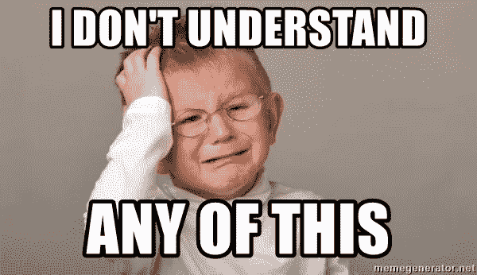
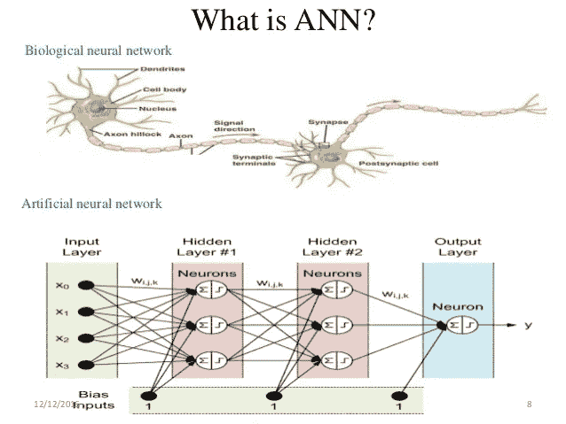
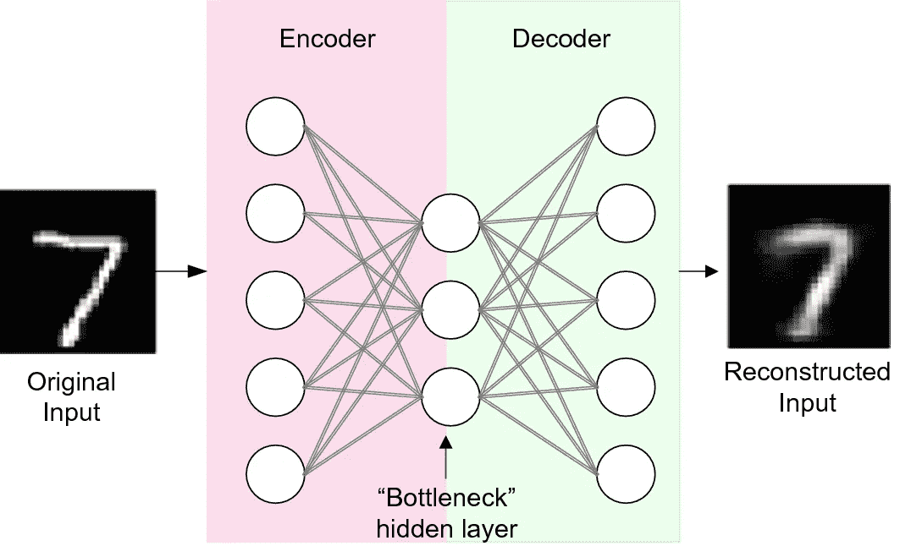

# 深度学习中的自动编码器是什么？

> 原文：<https://medium.com/analytics-vidhya/what-is-auto-encoder-in-deep-learning-5d668f94651b?source=collection_archive---------3----------------------->

**自动编码器**是一种**无监督学习算法**，其中**人工神经网络(ANN)** 被设计成执行**数据编码加数据解码**的任务来重构输入。

别担心！！上面的定义中使用了一些术语**,这使得初学者和非该领域的人很难理解。为了更好地理解它，首先要理解以下术语-**

1.  ****无监督学习-** 它是一种机器学习的技术，在没有任何指导的情况下，在未标记的数据上训练一台机器。允许模型独立工作，并从数据中发现新的模式。聚类和关联是两类无监督算法。**
2.  ****人工神经网络(ANN)——**这是一个简单的大脑数学模型，用于并行处理输入和输出之间的非线性关系，就像人脑每秒钟所做的一样。**

****

**3.**数据编码和解码-** 数据编码是将(感官)输入数据映射到不同的(通常是低维的、压缩的)特征表示。而数据解码是将特征表示映射回输入数据。**

## ****现在，简单来说——****

****自动编码器**是一个**复杂数学模型**，它在**未标记**和未分类**数据**上训练，用于将**输入数据映射到**另一个压缩的**特征表示**，并从该特征表示**重建回输入数据。****

****

# **哪里使用自动编码器？**

**自动编码器可以用来消除噪音，执行图像着色和各种其他目的，如-**

1.  *****降维:*** 降维是指将一组维数巨大的数据转换成维数较小的数据，保证其简洁地传达相似信息的过程。**
2.  *****图像去噪:*** 有噪声的图像可以作为自动编码器的输入，去噪声的图像可以作为输出。自动编码器将通过学习图像的潜在特征来尝试**去噪，并使用它来重建没有噪声的图像**。重建误差可以作为输出图像和地面真实图像的像素值之间的距离的度量来计算。**
3.  *****特征提取:*** 一旦模型适合训练数据集，就可以丢弃模型的**重建(解码)方面**，并且可以使用达到瓶颈点的模型(仅需要**编码部分**)。瓶颈处模型的输出是一个固定长度的向量，它提供了输入数据的压缩表示。**
4.  *****数据压缩:*** It 是减少表示数据所需比特数的过程**。**压缩数据可以节省存储容量，加快文件传输速度，降低存储硬件和网络带宽成本。自动编码器能够生成输入数据的简化表示。**
5.  *****去除图像中的水印*****

# **自动编码器的缺点:**

1.  **自动编码器学会捕捉尽可能多的信息，而不是尽可能多的与 T21 相关的信息。**
2.  **为了训练自动编码器，甚至在开始构建真实模型之前，需要大量的数据、处理时间、超参数调整和模型验证。**
3.  **经过使用损失度量的“反向传播技术”的训练，在输入的重建期间有可能丢失重要的信息。**

****

*****多余的奶酪:)-*** 自动编码器的结构看起来像一个空竹，因此也被称为空竹网络。**

**对自动编码器的实现部分更好奇？请参考[链接](https://github.com/anushkajain97/Image_denoising_using_Autoencoder)了解自动编码器如何用于图像去噪。**

**感谢阅读。快乐学习！！**