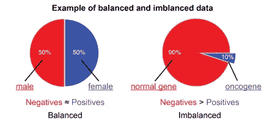
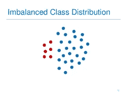
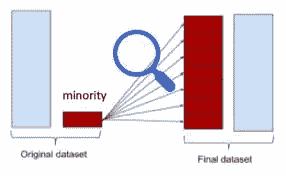
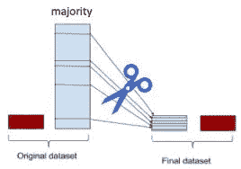
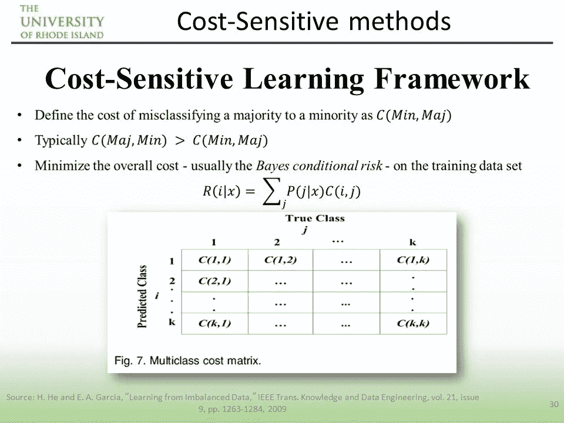
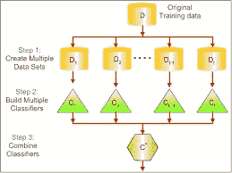

# 什么是平衡和不平衡数据集？

> 原文：<https://medium.com/analytics-vidhya/what-is-balance-and-imbalance-dataset-89e8d7f46bc5?source=collection_archive---------0----------------------->

## **将不平衡数据集转换成平衡数据集的技术**

**每个人都想成为**完美**。那么为什么我们的数据集**不应该是完美的**？让我们**让它变得完美****

**我们将在本文中讨论的内容**

*   **不平衡数据集的问题。**
*   **什么是平衡和不平衡数据集？**
*   **不平衡数据集到平衡数据集的转换技术。**
*   **结论和未来范围。**

> **想要建立一个现实生活中的推荐系统吗？**

** [## 基于网页视觉相似性的产品推荐:机器学习项目…

### 众所周知，谷歌、亚马逊、网飞等大型科技公司都在使用推荐系统…

iamhimanshutripathi0.medium.com](https://iamhimanshutripathi0.medium.com/product-recommendation-based-on-visual-similarity-on-the-web-machine-learning-project-end-to-end-6d38d68d414f) 

**那么让我们开始:-**

## **不平衡数据集的问题**

假设你在一家领先的科技公司工作，公司给你一个任务，训练一个检测欺诈的模型。但是有个问题。欺诈交易相对较少；

所以你开始训练你的模型，并获得超过 95%的准确率。

你感觉良好，并在公司 CEO 和股东面前展示你的模型。

当他们给你的模型输入数据，所以你的模型每次都预测“不是欺诈交易”。

这显然是一个问题，因为许多机器学习算法的设计都是为了最大化整体准确性。

现在发生了什么？？你得到了 95%的准确率，但是你的模型每次都预测错了？？

让我们找出原因？

## **什么是平衡和不平衡数据集？**

**平衡数据集:——**让我们举一个简单的例子，如果在我们的数据集中，我们有大约与负值相同的正值。那么我们可以说我们的数据集是平衡的

平衡数据集

将橙色视为正值，将蓝色视为负值。我们可以说，正值和负值的数量大致相同。

**不平衡数据集:——**正值和负值之间是否有很大差异。那么我们可以说我们的数据集在不平衡数据集中。

## **将不平衡数据集转换成平衡数据集的技术**

不平衡的数据并不总是一件坏事，在真实的数据集中，总是存在某种程度的不平衡。也就是说，如果不平衡程度相对较低，应该不会对您的模型性能产生任何大的影响。

现在，让我们介绍一些解决班级不平衡问题的技巧。

**1 —使用正确的评估指标:**

可以应用评估指标，例如:

*   **混淆矩阵:**显示正确预测和错误预测类型的表格。
*   **精度:**真阳性数除以所有阳性预测数。精度也叫阳性预测值。它是对分类器准确性的一种度量。低精度表示大量的误报。
*   **回忆:**测试数据中真阳性的数量除以阳性值的数量。回忆也称为敏感度或真实阳性率。它是对分类器完整性的一种度量。低召回率表示大量的假阴性。
*   **F1-Score:** 准确率和召回率的加权平均值。

**2 —过采样(上采样):**该技术用于修改不相等的数据类，以创建平衡的数据集。当数据量不足时，过采样方法试图通过增加稀有样本的大小来平衡。

(或)

过采样增加了训练集中少数类成员的数量。过采样的优点是不会丢失来自原始训练集的信息，因为保留了来自少数类和多数类的所有观察值。另一方面，它容易过度拟合。

**优点**

*   没有信息丢失
*   减轻过采样导致的过拟合。

**缺点**

*   过度拟合

**3 —欠采样(下采样):**与过采样不同，这种技术通过减少丰富类的大小来平衡不平衡数据集。分类问题有各种方法，如聚类质心和 Tomek 链接。聚类质心方法用 K-means 算法的聚类质心代替样本的聚类，而 Tomek 链接方法去除类之间不需要的重叠，直到所有最小距离的最近邻都属于同一类。

(或)

与过采样相反，欠采样旨在减少多数样本的数量，以平衡类别分布。因为它从原始数据集中删除了观察值，所以可能会丢弃有用的信息。

**优点**

*   可以通过减少训练数据集的数量来改善运行时间。
*   帮助解决记忆问题

**缺点**

*   丢失一些关键信息

**4 —特征选择:**为了解决不平衡问题，我们计算了正类和负类的单侧度量，如相关系数(CC)和优势比(OR)，或双侧度量评估，如信息增益(IG)和卡方(chi)。基于这些分数，我们从每个类中识别出重要的特征，并对这些特征进行联合以获得最终的特征集。然后，我们用这些数据对问题进行分类。

识别这些特征将有助于我们对每一类产生一个清晰的决策边界。这有助于模型更准确地对数据进行分类。这执行了智能子采样的功能，并且可能有助于减少不平衡问题。

**5 —成本敏感学习技术**

成本敏感学习(CSL)通过最小化总成本来考虑错误分类成本。这种技术的目标主要是追求将示例分类到一组已知类别的高准确度。它在包括现实世界数据挖掘应用在内的机器学习算法中扮演着重要的角色。

**优势:**

*   该技术避免了预先选择参数，并自动调整决策超平面

**5 —集成学习技术**

基于集成的方法是另一种用于处理不平衡数据集的技术，集成技术结合了几个分类器的结果或性能，以提高单个分类器的性能。该方法通过组合不同的分类器来修改单个分类器的泛化能力。它主要结合多个基础学习者的输出。集成学习有多种方法，如 Bagging、Boosting 等。

**优点**

*   这是一个更稳定的模型
*   预测更好

## **结论**

不平衡数据是数据挖掘和机器学习领域潜在的问题之一。这个问题可以通过适当地分析数据来解决。有几种方法可以帮助我们在数据点级别解决这个问题，它们是欠采样、过采样和特征选择。展望未来，在更有效地处理数据不平衡问题方面，仍然需要进行大量的研究。

下一篇文章再见。暂时就这样了。

**如果你觉得这篇文章有趣、有帮助，或者你从这篇文章中学到了什么，请发表评论并留下反馈。**

**感谢阅读！**

> **看看我以前的文章:**

 [## 深度学习的必备术语

### 我开始深度学习、机器学习和人工智能的那一天，我总是听到一个非常著名的…

medium.com](/datadriveninvestor/must-know-terms-for-deep-learning-c2747d4fa318)  [## 基于网页视觉相似性的产品推荐:机器学习项目…

### 众所周知，谷歌、亚马逊、网飞等大型科技公司都在使用推荐系统…

medium.com](/@iamhimanshutripathi0/product-recommendation-based-on-visual-similarity-on-the-web-machine-learning-project-end-to-end-6d38d68d414f)  [## Web 上印度语言(印地语)的自然语言处理(NLP)

### "语言是一个秘密，每个人都可以处理，对我来说，这是美丽的."

medium.com](/datadriveninvestor/natural-langauge-processing-nlp-for-indian-language-hindi-on-web-64d83f16544a)  [## 什么是平衡和不平衡数据集？

### 不平衡数据集到平衡数据集的转换技术及其比较

medium.com](/analytics-vidhya/what-is-balance-and-imbalance-dataset-89e8d7f46bc5)  [## 基于迁移学习的脑肿瘤分类

### 迁移学习的详细解释以及如何使用它进行分类

medium.com](/analytics-vidhya/brain-tumor-classification-transfer-learning-e04f84f96443)  [## 用于分类变量编码的不同类型的特征工程编码技术

### “让我们从现有功能中创建新功能。”

medium.com](/analytics-vidhya/different-type-of-feature-engineering-encoding-techniques-for-categorical-variable-encoding-214363a016fb) 

## **参考资料:-**

[https://www . analyticsindiamag . com/5-important-techniques-to-process-unbalanced-data-in-machine-learning/](https://www.analyticsindiamag.com/5-important-techniques-to-process-imbalanced-data-in-machine-learning/)

[https://en . Wikipedia . org/wiki/over sampling _ and _ under sampling _ in _ data _ analysis](https://en.wikipedia.org/wiki/Oversampling_and_undersampling_in_data_analysis)

**还有，让我们在**[**Linkedin**](https://www.linkedin.com/in/iamhimanshu0/)**[**Twitter**](https://twitter.com/iam_himanshu0)**[**insta gram**](https://instagram.com/iamhimanshu0/)**[**Github**](https://github.com/iamhimanshu0)**，以及** [**脸书**](https://www.facebook.com/iamhimanshu0) **。**********