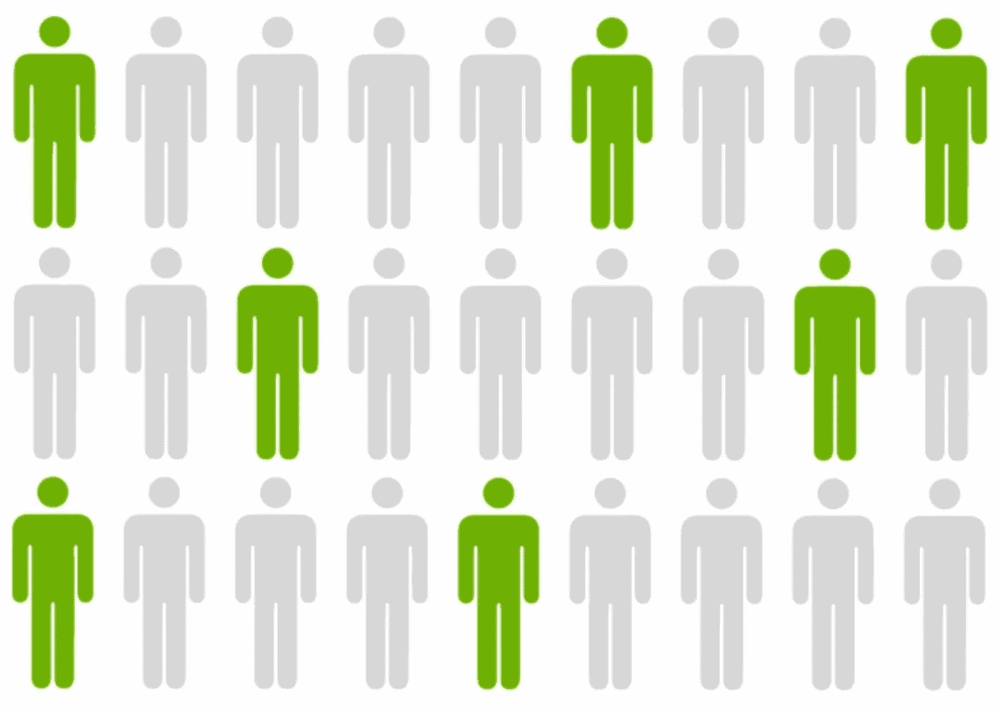
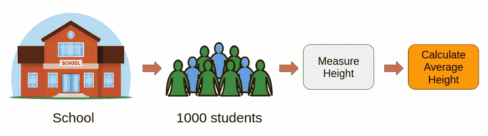
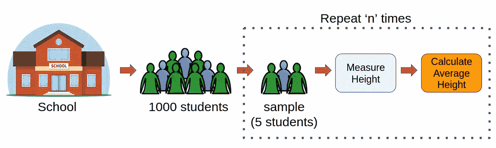
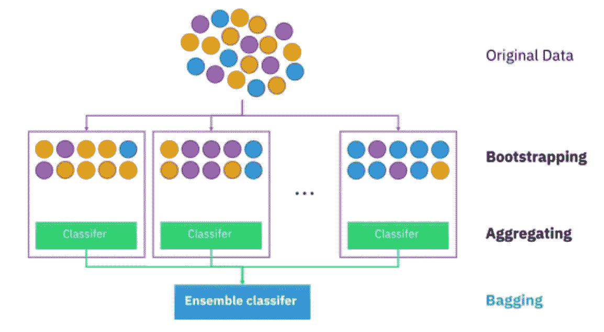
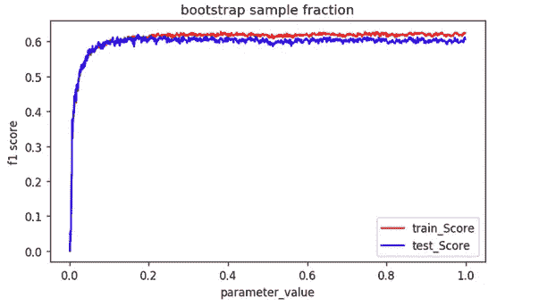

# 什么是统计学和机器学习中的 Bootstrap 抽样？

> 原文：<https://medium.com/analytics-vidhya/what-is-bootstrap-sampling-in-statistics-and-machine-learning-4bb510fa4a8c?source=collection_archive---------16----------------------->

# 介绍

你是否曾在 DataHack 或 Kaggle 上的机器学习黑客马拉松中努力提高自己的排名？你已经尝试了所有你喜欢的技巧和技术，但你的分数拒绝让步。我去过那里，那是一次相当令人沮丧的经历！

这在你刚进入这个领域的时候尤其重要。我们倾向于使用我们所学的熟悉技术，如线性回归、逻辑回归等等(取决于问题陈述)。

然后出现了自举抽样。这是一个强大的概念，将我的排名推向了这些黑客马拉松排行榜的上层。这是一次很好的学习经历！



Bootstrap 抽样是一项我觉得每个数据科学家，无论是有抱负的还是已有成就的，都需要学习的技术。

所以在这篇文章中，我们将学习你需要知道的关于 bootstrap 抽样的一切。它是什么，为什么需要它，它如何工作，以及它在机器学习图景中的位置。我们还将在 Python 中实现自举采样。

# 什么是 Bootstrap 抽样？

以下是 Bootstrap 抽样的正式定义:

> 在统计学中，Bootstrap 抽样是一种从数据源中重复抽取样本数据并替换样本数据以估计总体参数的方法。

等等，那太复杂了。让我们分解一下，了解一下关键术语:

*   **抽样:**就统计学而言，抽样是从大量项目(总体)中选择一个项目子集的过程，以估计总体的某个特征
*   **替换抽样:**表示一个抽取样本中的数据点也可以在以后的抽取样本中重现
*   **参数估计:**是利用样本对总体进行参数估计的方法。参数是与总体相关的可测量特征。比如一个城市的居民平均身高，红细胞数量等。

有了这些知识，继续重新阅读上面的定义。现在更有意义了！

# 为什么我们需要 Bootstrap 抽样？

这是我见过的机器学习爱好者努力解决的一个基本问题。Bootstrap 抽样的意义是什么？哪里可以用？我举个例子来解释一下这个。

假设我们想要找出一所学校(总人口为 1000)中所有学生的平均身高。那么，我们怎样才能完成这项任务呢？

一种方法是测量所有学生的身高，然后计算平均身高。我在下面举例说明了这个过程:



然而，这将是一项单调乏味的任务。试想一下，我们必须单独测量 1000 名学生的身高，然后计算平均身高。需要几天时间！我们需要一个更聪明的方法。

这就是自举抽样发挥作用的地方。

我们可以随机抽取 5 名学生来测量他们的身高，而不是测量所有学生的身高。我们将重复这一过程 20 次，然后对收集到的 100 名学生的身高数据进行平均(5 x 20)。这个平均身高是对该校所有学生平均身高的估计。

很简单，对吧？这是 Bootstrap 抽样的基本思想。



因此，当我们必须估计一个大群体的参数时，我们可以借助自助抽样。

# 机器学习中的自助抽样

Bootstrap 采样用于称为 bootstrap aggregating(也称为 bagging)的机器学习集成算法中。它有助于避免过度拟合，并提高机器学习算法的稳定性。

在 bagging 中，数据集的一定数量的大小相等的子集通过替换来提取。然后，机器学习算法被应用于这些子集的每一个，并且输出被集合，如下图所示:



你可以在这里阅读和了解更多关于集成学习的内容:

*   [集成学习综合指南(带 Python 代码)](https://www.analyticsvidhya.com/blog/2018/06/comprehensive-guide-for-ensemble-models/)

# 用 Python 实现自举采样

是时候对我们的学习进行测试，并在 Python 中实现自举采样的概念了。

在这一节中，我们将借助于 bootstrap 抽样来估计总体均值。让我们导入所需的库:

接下来，我们将创建 10，000 个元素的高斯分布(总体),总体平均值为 500:

**输出:**18660 . 686868686867

现在，我们将从分布(总体)中抽取 40 个大小为 5 的样本，并计算每个样本的平均值:

让我们检查所有 40 个样本的平均值:

```
np.mean(sample_mean)
```

输出:。58660 . 68868686861

事实证明，这与人口平均值非常接近！这就是为什么 Bootstrap 抽样在统计学和机器学习中是如此有用的技术。

# 总结我们所学的

在本文中，我们了解了自助抽样在统计和机器学习中的效用。我们还用 Python 实现了它，并验证了它的有效性。

以下是引导的一些主要优点:

*   bootstrap 抽样的估计参数与实际总体参数相当
*   由于我们只需要很少的样本来进行自举，所以计算量很小
*   在随机森林中，即使 20%的引导样本大小也能提供相当好的性能，如下所示:



当提供的数据少于原始数据集的 0.2 分之一时，模型性能达到最高。

*原载于 2020 年 2 月 12 日 https://www.analyticsvidhya.com*[](https://www.analyticsvidhya.com/blog/2020/02/what-is-bootstrap-sampling-in-statistics-and-machine-learning/)**。**