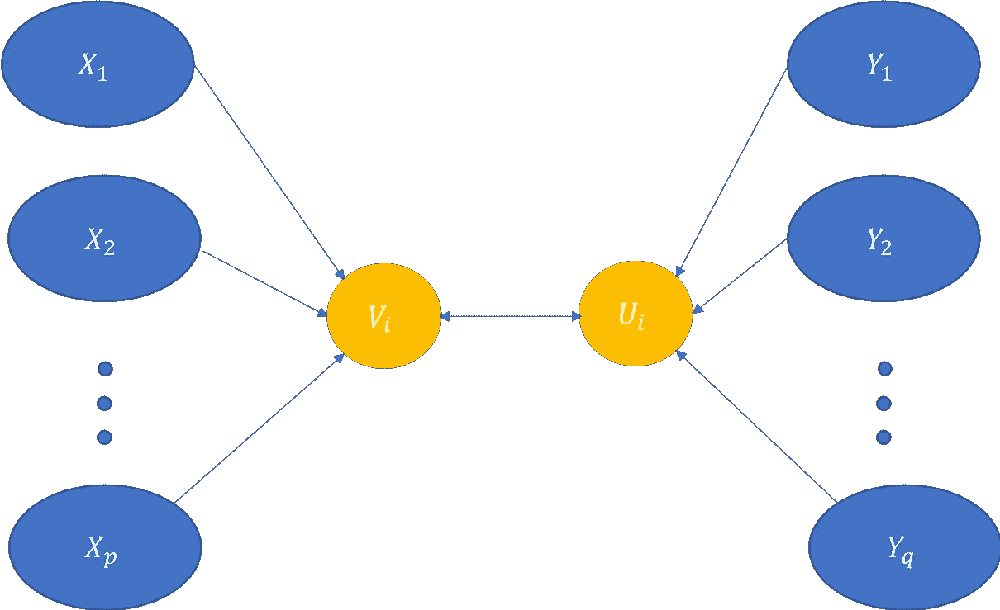
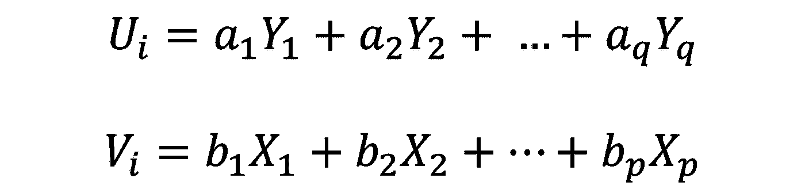
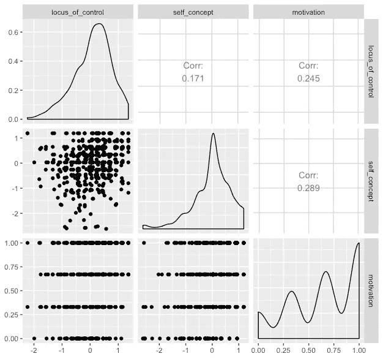
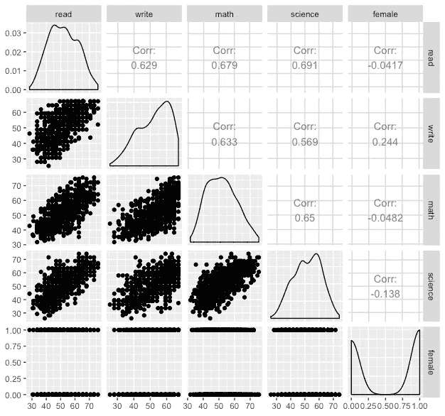

# 什么是典型相关分析？

> 原文：<https://medium.com/analytics-vidhya/what-is-canonical-correlation-analysis-58ef4349c0b0?source=collection_archive---------4----------------------->

匿名相关分析(CCA)是一种统计技术，用于推导两组变量之间的关系。理解 CCA 的一个方法是使用多元回归的概念。在多元回归中，研究一个因变量和一组自变量之间的关系。在 CCA 中，我们将多元回归概念扩展到一个以上的因变量。在某些应用中，我们会遇到不止一个相互关联的因变量，因此忽略相关性是不明智的。例如，在抑郁症研究中，流行病学研究中心(CESD)的抑郁症和健康状况是相互关联的，两者都可以作为因变量，取决于一些变量，如性别、年龄、教育和收入。因此，我们的目标是导出一组变量的函数与另一组变量的函数之间的关系。该函数通常是一个线性函数，其权重是基于一些约束条件来指定的。



CCA:通过规范变量连接的两组变量

正如你在上面的图中看到的，我们有一组变量在左边，另一组在右边。不失一般性，让我们假设自变量和因变量的数量分别为 *p* 和 *q* 。左侧和右侧的所有变量都集中在两个不同的变量中，如图中黄色圆圈所示。CCA 的目的是找出两个集总变量之间的关系，使这两个变量之间的相关性达到最大。显然，变量有几种线性组合，但目的是只选择那些能最好地表达两个变量集之间相关性的线性函数。这些线性函数称为**规范变量，**而规范变量对应对之间的相关性称为**规范相关性。**

CCA 背后的基本思想是找到与 x 的线性组合具有最大相关性的 y 的线性组合。说



正则方程，等式(1)

对于每一个权重的选择，我们可以导出 U 和 V 的值对，然后可以得到 U 和 V 之间的相关性。有 k=min(q，p)个变量，每个变量对应不同的权重集，这给了我们 k 个不同的相关性。这些相关性被证明是等式(2)给出的两个矩阵乘积的特征值的平方根。


情商。(2)

注意，X 是一个有 n 行和 p 列的矩阵。类似地，Y 是一个具有 *n* 行和 *q* 列的矩阵。 *n* 行表示观察到的样本数，而 *p* 或 *q* 分别是 X 和 Y 的特征数。本征值和本征向量给了我们正则相关和相应的圆锥变量 U 和 v。如前所述，有 *k* 个不同的正则变量。 ***第一个规范变量是最重要的一个，因为对应的相关性是其他变量之间最大的相关性。*** 相关系数按降序排列。换句话说，第一个典型相关最大，第二个典型相关次之，依此类推。现在我们掌握了 CCA 背后的基础知识，让我们看看如何使用 CCA 来分析真实世界的数据。CCA 不如多元回归普遍，因为结果解释比多元回归更难。

# CCA 在实际案例中的应用

为了证明 CCA 的有用性，我们将 CCA 应用于真实世界的数据，以了解它如何有助于获得洞察力。为此，我们使用数据集 [**mmreg.dta**](https://stats.idre.ucla.edu/stat/data/mmreg.csv) ，对八个变量进行 600 次观测。心理变量有`**locus_of_control**`、`**self_concept**`和`**motivation**`。学术变量是阅读(`**read**`)、写作(`**write**`)、数学(`**math**`)和科学(`**science**`)的标准化测试。此外，变量`**female**`是零一指示变量，其中一个指示女学生。代码片段可以从[这里](https://stats.idre.ucla.edu/r/dae/canonical-correlation-analysis/)获得。

```
library(lme4)
library(CCA) #facilitates canonical correlation analysis
library(CCP)
require(ggplot2)
require(GGally)mm <- read.csv("[https://stats.idre.ucla.edu/stat/data/mmreg.csv](https://stats.idre.ucla.edu/stat/data/mmreg.csv)")

summary(mm)
```

数据变量汇总如下:

```
locus_of_control   self_concept       Motivation         Read     
Min.   :-2.2300   Min.   :-2.6200   Min.   :0.000   Min.   :28.3  
1st Qu.:-0.3725   1st Qu.:-0.3000   1st Qu.:0.330   1st Qu.:44.2  
Median : 0.2100   Median : 0.0300   Median :0.670   Median :52.1  
Mean   : 0.0965   Mean   : 0.0049   Mean   :0.661   Mean   :51.9  
3rd Qu.: 0.5100   3rd Qu.: 0.4400   3rd Qu.:1.000   3rd Qu.:60.1  
Max.   : 1.3600   Max.   : 1.1900   Max.   :1.000   Max.   :76.0  

    Write           Math         Science          Sex       
Min.   :25.5   Min.   :31.8   Min.   :26.0   Min.   :0.000  
1st Qu.:44.3   1st Qu.:44.5   1st Qu.:44.4   1st Qu.:0.000  
Median :54.1   Median :51.3   Median :52.6   Median :1.000  
Mean   :52.4   Mean   :51.9   Mean   :51.8   Mean   :0.545  
3rd Qu.:59.9   3rd Qu.:58.4   3rd Qu.:58.6   3rd Qu.:1.000  
Max.   :67.1   Max.   :75.5   Max.   :74.2   Max.   :1.000
```

两组变量的组内相关系数可以通过下面的代码片段获得

```
psych <- mm[, 1:3]
acad <- mm[, 4:8]ggpairs(psych)ggpairs(acad)
```

输出将是



心理变量的相关系数



学术变量内的相关系数

现在，转到获得典型相关。如前所述，规范变量的个数为 *k = min(p，q) = min(4，3) = 3。*因此，我们将有三个典型相关，对于我们的情况，可以获得如下

```
matcor(psych, acad)
cc1 <- cc(psych, acad)
cc1$cor
```

代码片段的输出将是

```
0.4640861 0.1675092 0.1039911
```

可以看出，第一典型相关是 0.464，这是第一典型变量之间的相关。*这个相关系数大于任何一对心理和学业变量之间的任何单个相关性(这里没有显示)。*生成规范变量的系数可以通过下面的代码片段获得

```
cc1$ycoef
cc1$xcoef
```

输出将是

```
> cc1$ycoef
            [,1]         [,2]         [,3]
read    -0.044620600 -0.004910024  0.021380576
write   -0.035877112  0.042071478  0.091307329
math    -0.023417185  0.004229478  0.009398182
science -0.005025152 -0.085162184 -0.109835014
female  -0.632119234  1.084642326 -1.794647036> cc1$xcoef
                      [,1]       [,2]       [,3]
locus_of_control -1.2538339 -0.6214776 -0.6616896
self_concept      0.3513499 -1.1876866  0.8267210
motivation       -1.2624204  2.0272641  2.0002283
```

例如，第一个规范变量(U1)的读取变量的系数是-0.044。

如果你想看看规范变量本身，你可以调用**cc1 $ scores $ ys scores**和**cc1 $ scores $ ys scores。它会给你规范变量 Ui 和 Vi。**

我们也可以看看学术和心理变量和典型变量之间的相关性。这些相关性被称为**标准可变载荷**。代码片段及其相应的输出可以如下获得:

```
cc1$scores$corr.X.xscores
                        [,1]       [,2]       [,3]
locus_of_control    -0.90404631 -0.3896883 -0.1756227
self_concept        -0.02084327 -0.7087386  0.7051632
Motivation          -0.56715106  0.3508882  0.7451289cc1$scores$corr.Y.xscores
              [,1]        [,2]        [,3]
Read    -0.3900402 -0.06010654  0.01407661
Write   -0.4067914  0.01086075  0.02647207
Math    -0.3545378 -0.04990916  0.01536585
Science -0.3055607 -0.11336980 -0.02395489
Sex     -0.1689796  0.12645737 -0.05650916cc1$scores$corr.X.yscores
                         [,1]        [,2]        [,3]
locus_of_control    -0.419555307 -0.06527635 -0.01826320
self_concept        -0.009673069 -0.11872021  0.07333073
Motivation          -0.263206910  0.05877699  0.07748681cc1$scores$corr.Y.yscores
              [,1]        [,2]       [,3]
Read    -0.8404480 -0.35882541  0.1353635
Write   -0.8765429  0.06483674  0.2545608
Math    -0.7639483 -0.29794884  0.1477611
Science -0.6584139 -0.67679761 -0.2303551
Sex     -0.3641127  0.75492811 -0.5434036
```

这里，规范变量加载显示了变量集和规范变量之间的相关性。例如，要查看*读取的数据*和第一个规范变量 Y 之间的相关性，我们应该查看 **cc1$scores$corr.Y.yscores，**的第一列，即-0.84。

# 解释结果

解释 CCA 的结果比多元回归稍微复杂一点。为了解释这些结果，我们来看看**标准化系数**。标准化系数可以通过将非标准化系数乘以相应变量的标准偏差得到。标准化系数可以通过下面的代码片段获得。

```
# standardized psych canonical coefficients diagonal matrix of psych sd's
s1 <- diag(sqrt(diag(cov(psych))))
s1 %*% cc1$xcoefs2 <- diag(sqrt(diag(cov(acad))))
s2 %*% cc1$ycoef
```

输出将是

```
> s1 %*% cc1$xcoef
                      [,1]       [,2]       [,3]
locus_of_control   -0.8404196 -0.4165639 -0.4435172
self_concept        0.2478818 -0.8379278  0.5832620
Motivation         -0.4326685  0.6948029  0.6855370> s2 %*% cc1$ycoef
               [,1]        [,2]        [,3]
Read      -0.45080116 -0.04960589  0.21600760
Write     -0.34895712  0.40920634  0.88809662
Math      -0.22046662  0.03981942  0.08848141
Science   -0.04877502 -0.82659938 -1.06607828
Female    -0.31503962  0.54057096 -0.89442764
```

CCA 的互操作与多元回归非常相似。例如，可以看出，`**locus_of_control**` 的标准化相关系数为 **-0.84。**这意味着当模型中的所有其他变量保持不变时，`**locus_of_control**` 增加一个单位将导致第一个规范变量减少 0.84。查看三个规范系数，我们看到`**locus_of_control**` 对所有规范变量都有负面影响。每个规范变量基于给定的系数给出不同的解释。然而，由于第一相关系数是最大的，基于第一组系数的解释更合理和可靠。

**延伸阅读:**

[1] Afifi，a .，May，s .，和 Clark，V. A. (2003 年)。*计算机辅助多元分析*。CRC 出版社。

[2] González，I .，Déjean，s .，Martin，P. G .，和 Baccini，A. (2008 年)。CCA:扩展典型相关分析的 R 包。*统计软件杂志*， *23* (12)，1–14。

[3]科尔特斯，p .，塞尔代拉，a .，阿尔梅达，f .，马托斯，t .，和赖斯，J. (2009 年)。通过物理化学特性的数据挖掘建立葡萄酒偏好模型。*决策支持系统*， *47* (4)，547–553。