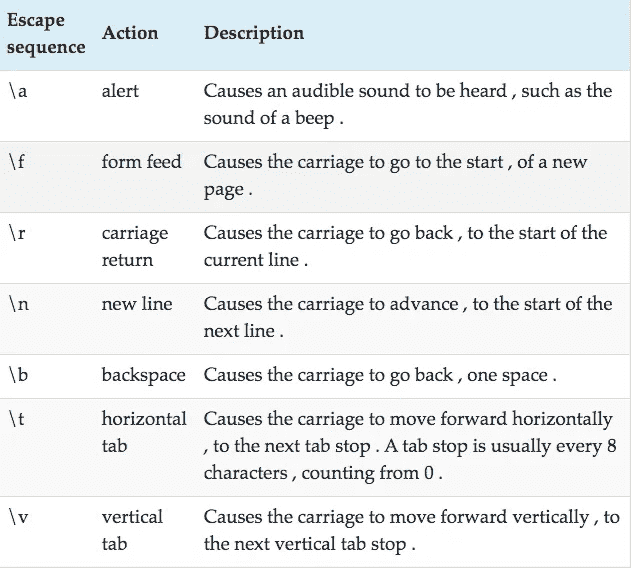
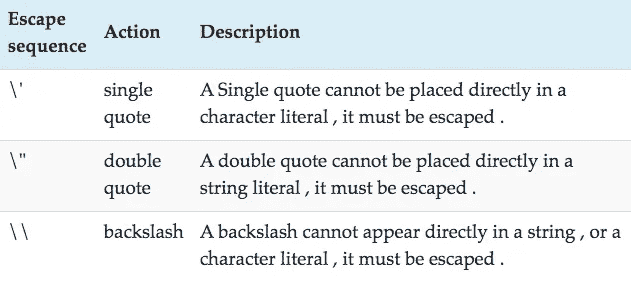
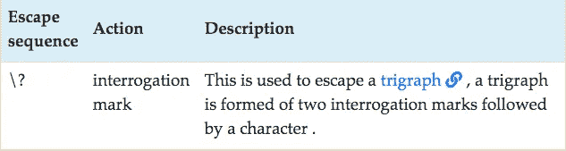
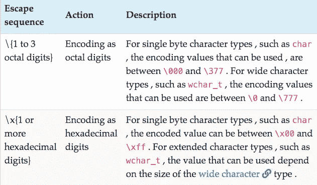
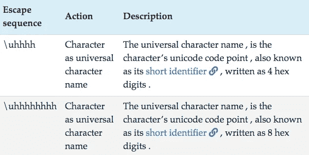

# 什么是 C 语言中的字符、有符号字符、无符号字符和字符文字？

> 原文：<https://medium.com/analytics-vidhya/what-is-char-signed-char-unsigned-char-and-character-literals-in-c-796034139b98?source=collection_archive---------6----------------------->

# 什么是 char，无符号 char，有符号 char？

C 中的`char`类型， ***有一个大小为`1`字节的*** 。在给定机器上定义的一个字节的大小，可以通过检查`limits.h`标题中的宏`CHAR_BITS`来查看。

```
/*Excerpt from limits.h */
#define CHAR_BITS 8
/* Define the number of bits in a char */
```

典型地，在 C 或给定机器上的一个字节由`8`位组成。

char 类型*是* ***的一个整数类型*** ，它用来存储[编码](https://twiserandom.com/c/c-source-execution-basic-and-extended-character-sets/)的字符。例如，当`a`被认为是 ascii 字符集的一部分时，字符`a`的编码是十进制的`97`，或者二进制的`01100001`。如果`a`被认为属于不同的字符集，它可能有不同的编码，因为这样一个`char`类型的变量将为字符`a`存储不同的编码值。

字符类型可以是有符号的，也可以是无符号的，这是由实现定义的。C 标准定义了`char`类型可以具有的 ***最小范围*** ，实现可以定义大范围。

如果 `char`类型为[无符号](https://twiserandom.com/data-structure-and-algorithms/what-is-an-unsigned-integer/)，那么它只能包含非负值，C 标准定义的其最小范围在`0`和`127`之间。如果字符类型是[有符号](https://twiserandom.com/data-structure-and-algorithms/what-is-a-signed-integer/)，那么它可以包含`0`，负值和正值，其最小范围由 C 标准定义，在`-127`和`127`之间。

除了 C 中的`char`类型、 ***类型外，还有***`unsigned char`、`signed char`类型。三种类型都不一样，但是都有相同大小的`1`字节。按照 C 标准的定义，`unsigned char`类型只能存储非负整数值，它的最小范围在 `0`和`127`之间。`signed char`类型可以存储负、零和正整数值。根据 C 标准的定义，它在`-127`和`127`之间有一个最小范围。

# 字符文字

一个 ***字符的字面意思，是由*** 组成的一个字符，如`a`，用单引号括起来。

```
char achar = 'a';
```

一个字符文字 ***可以包含转义序列*** 。一个转义序列，被用作 ***方式来表示字符，在*** [中执行字符集](https://twiserandom.com/c/c-source-execution-basic-and-extended-character-sets/)。例如，必须出现在控制台或终端上的新行。



```
#include<stdio.h>int main( void){
  char alert = '\a';
  printf( "Hello world %c\n" , alert);}
/* Output : 
Hello world */
```

转义序列也用于表示 ***字符，这些字符不能出现在字符文字(如单引号)或字符串文字(如双引号)中。***



```
#include<stdio.h>int main( void){
  char quote = '\'';
  printf( "To quote : %c Limitation , Definition , "
          "Construction , Knowledge , Usability %c \n" ,
          quote,quote);}
/* Output : 
To quote : ' Limitation , Definition , Construction , Knowledge , Usability ' */
```

转义序列，也用于 ***转义某些特殊字符的解释*** ，如`?`。



```
#include<stdio.h>int main( void){
  char escape_interrogation_mark_using_trigraph = '??/?';
  /* ??/ is a trigraph , and is replaced before preprocessing
   by the character \ , so it is as if the character
   literal , is written as '\?'*/
  printf( "%c\n", escape_interrogation_mark_using_trigraph);}
/* Output : 
? */
```

转义序列，也被用作输入字符的一种方式， ***通过输入它们的编码*** ，而不是字符本身。



```
#include<wchar.h>int main( void){char character = '\141'; // a
  character = '\x61'; // awchar_t wide_character = L'\7'; // alert
  wide_character = L'\x0000ab11'; /* ꬑ  */}
```

转义序列，也可以作为一种方式来使用， ***输入一个字符的通用名称*** ，在这种情况下，该字符必须是一个宽字符类型。



```
#include<wchar.h>int main( void){
  wchar_t wide_character = L'\u0800'; /* Samaritan letter alaf */
  wide_character = L'\U00000800'; /* Samaritan letter alaf */ }
```

由于、`signed char`、`unsigned char`、`char`和宽字符都是整数类型，因此可以使用整数文字 对它们 ***进行初始化。[整数文字](https://difyel.com/c/literal/integer-literals-in-c/)在这种情况下，保存字符的编码值。***

```
#include<uchar.h>int main( void){
  unsigned char x = 97;
  /* 97 , is the encoding of the
     character a , in ascii  */
  char16_t wide_character = 97;}
```

*原载于 2020 年 12 月 15 日*[*【https://twiserandom.com】*](https://twiserandom.com/c/what-is-char-signed-char-unsigned-char-and-character-literals-in-c/)*。*