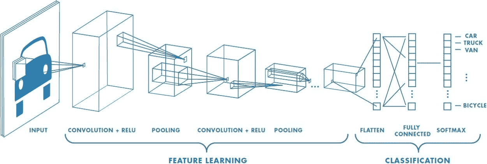
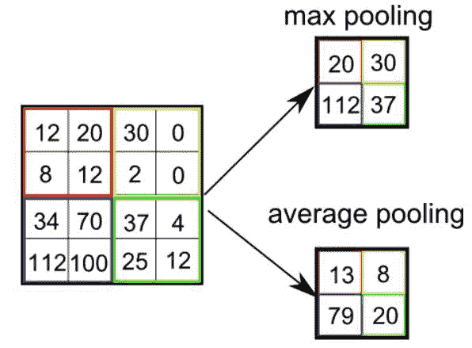

# CNN 是什么？卷积神经网络 5 年指南

> 原文：<https://medium.com/analytics-vidhya/what-is-cnn-a-5-year-old-guide-to-convolutional-neural-network-c9d0338c3bf7?source=collection_archive---------9----------------------->

一个试图理解 CNN 的 5 岁小孩

> 好吧，这个标题可能有点误导，因为让我们面对它，没有一个 5 岁的孩子会试图找出什么是卷积神经网络🤣。本指南面向深度学习的初学者，他们希望学习更多关于图像处理的知识，但在看到似乎有点难以理解的论文和其他文章时感到有压力😂。

# 温和的介绍

人工智能或人工智能是一个巨大的突破，它弥合了人类和机器之间的差距。受人工智能发展影响的许多领域之一是计算机视觉。这些进步为计算机视觉领域创造了一种算法，被称为卷积神经网络或简称为 CNN。

CNN 像神经网络一样，由具有可学习的权重和偏差的神经元组成。等等，什么是神经网络？这本指南不是应该教一个 5 岁的孩子吗？？😢。是的，我不想打断你，但是要理解 CNN，你必须先知道什么是神经网络。不过你可以参考[这个](/technologymadeeasy/for-dummies-the-introduction-to-neural-networks-we-all-need-c50f6012d5eb)参考😁。CNN 中的每个神经元将接收几个输入，对它们进行加权求和，将其传递给一个激活函数，并以一个输出作为响应。整个网络有一个损失函数，我们为神经网络开发的所有提示和技巧仍然适用于 CNN。好了，最难的部分到此为止😊。

因此，CNN 基本上是一种深度学习算法，它可以将图像作为输入，并通过一些学习过程来区分不同的图像。这个结果可以通过改变模型本身的参数(可学习的权重和偏差)来实现。

CNN 架构的表示

使 CNN 从用于图像分类的其他分类技术中脱颖而出的是，与其他分类算法相比，CNN / ConvNet 所需的预处理总数要低得多。有趣的事实是，CNN 的架构和大多数神经网络本身与人类大脑内部的连接模式非常相似，并且受到人类视觉皮层本身的启发。

# 关于 CNN 的几个概念

好吧，如果你在读到这一节之前还在读这篇文章，你可能会意识到我在骗你们关于一个 5 岁小孩指南的事🤣。事实上，这篇文章是为害怕学习 CNN 和神经网络的初学者而写的(不适合 5 岁的孩子)。了解一些关于 CNN 的概念也可能会让你大开眼界，这个神经网络是多么迷人。所以事不宜迟，准备好真正理解 CNN 所需的概念😉

用于分类的 CNN 层

**图像作为输入**

图像是矩阵值的矩阵，指示图像的像素值。CNN 非常擅长基于图像的分类的主要原因之一是因为 CNN 能够通过应用相关的过滤器来捕捉图像中的空间和时间依赖性。请记住，CNN 的作用是将图像简化为算法更容易处理的形式，同时仍然保留图像的信息。正因为如此，与其他算法相比，CNN 处理图像所需的时间更少，这使得它成为处理图像问题时使用的最佳算法之一。

**卷积层**

卷积层是一个过滤器(或内核),它是 CNN 本身分层结构的一个组成部分。一般来说，它指的是应用于整个输入(在我们的例子中，图像)的操作，以便将像素中编码的信息转换为更小的细节。实际上，核只是输入大小矩阵的一个较小的矩阵，由实值条目组成。有人说，一张图片胜过一千次讲座。这里是卷积层的表示，以及它如何使神经网络稍后处理的信息更小，同时仍然保留所有信息。

卷积过程

由于**步长= 1(非步长)**，内核移动 9 次，每次在 K 和内核悬停的图像部分 P 之间执行**矩阵乘法运算。请记住，此操作仅适用于具有 1 个通道的图像，如灰度图像。对于具有多个通道的图像(如 RGB 图像)，在 Kn 和 In stack ([K1，I1])之间执行矩阵乘法；[K2，I2]；[K3，I3])，所有结果与偏差相加，得到一个压缩的单深度通道卷积特征输出。**

好吧，在一次阅读中囊括所有这些东西绝对不容易。请记住，卷积层的目标是**从输入图像中提取高级特征**，如边缘。随着在神经网络架构上添加层，该架构也将试图适应高级特征，这使得它对数据集中的图像有完整的理解，类似于我们在看到图像时试图识别图像的方式。

**汇集层**

最大池与平均池

好了，接下来我们有一个池层。这一层和上一层有什么不同？🤔池层本质上与卷积层相同。它只是 CNN 的另一个构件，负责减小卷积特征的空间大小。当我们试图通过降维来降低处理数据所需的计算能力时，这一层是有用的。不仅如此，当试图**从输入中提取主要特征**时，池层也是有用的。有两种类型的池层:最大池和平均池。**最大池**从内核覆盖的图像部分返回**最大值**。另一方面， **Average Pooling** 返回内核覆盖的图像部分的所有值的**平均值。由于 max pooling 层的性质，它还可以作为**噪声抑制器，**因为它完全丢弃了有噪声的激活，还可以在降维的同时执行去噪。**

**ReLu(整流线性单元)层**

因此，卷积层和池层是卷积神经网络的主要构件。但是我们如何将每一层连接起来。欢迎 ReLu 层，因为它是一个激活功能层，负责将来自节点的总加权输入转换成该节点的激活或该输入的输出。

ReLu 层不仅仅被指定给卷积神经网络。它是一个常用层，作为任何神经网络中所需的激活函数，用于神经网络中的变换。由于这是一个指南，可以让你更好地理解 CNN，所以我不会对这一层做太多解释，但是如果你想深入了解，你可以在这里[查阅](https://machinelearningmastery.com/rectified-linear-activation-function-for-deep-learning-neural-networks/)

**全连接层**

现在，使用卷积层和池层，加上 ReLu 层，我们可以通过将图像展平为列向量，将输入图像转换为更适合我们的多级感知器的形式。然后将展平的向量馈送到前馈神经网络，并将反向传播应用于训练的每次迭代。好吧，对于初学者来说，这听起来有点难以理解。

让我一步一步地解释给你听，让你明白训练一个神经网络时实际上发生了什么，这是 CNN 的基本基础。我们通过重复模型的学习过程来训练神经网络，然后识别我们的模型是否已经找到图像输入的模式并且能够区分图像输入。在每个学习过程完成后，模型将重新评估每一层的参数，以便在下一次迭代中表现得更好。这个动作被称为反向传播，通过这样做，模型在每次训练时都会表现得越来越好(可能需要注意过度拟合，但是这个概念不在本主题范围内)。

经过一系列时期的训练，该模型能够区分图像中的主要特征和某些低级特征，并使用 **Softmax 分类**技术对它们进行分类。

> 只有当你能感受到，通往精通的旅程才是美好的。不要着急，找到你的节奏，你会成功的😘

# 参考

https://cs.nju.edu.cn/wujx/teaching/15_CNN.pdf

【https://cs231n.github.io/convolutional-networks/ 

[https://towards data science . com/simple-introduction-to-convolutionary-neural-networks-cdf8d 3077 BAC](https://towardsdatascience.com/simple-introduction-to-convolutional-neural-networks-cdf8d3077bac)

[https://towards data science . com/deep-dive-into-卷积网络-48db75969fdf](https://towardsdatascience.com/deep-dive-into-convolutional-networks-48db75969fdf)

[https://medium . com/technology made easy/the-best-explain-of-convolutionary-neural-networks-on-the-internet-fbb 8 B1 ad 5d F8](/technologymadeeasy/the-best-explanation-of-convolutional-neural-networks-on-the-internet-fbb8b1ad5df8)