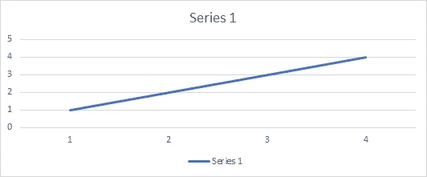
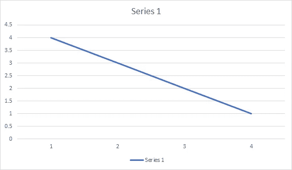
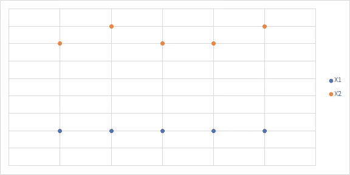

# 机器学习中的相关性是什么？

> 原文：<https://medium.com/analytics-vidhya/what-is-correlation-4fe0c6fbed47?source=collection_archive---------1----------------------->

# 相关性:

相关性解释了一个或多个变量是如何相互关联的。这些变量可以是用于预测我们的目标变量的输入数据特征。

相关性，决定一个变量如何相对于另一个变量移动/变化的统计技术。它给了我们关于这两个变量的相关程度的概念。这是一种双变量分析方法，描述了不同变量之间的关联。在大多数商业活动中，用一个主题与其他主题的关系来表达这个主题是很有用的。

例如:Corona 的检测数与阳性病例数。

1.如果两个变量密切相关，那么我们可以从一个变量预测另一个变量。

2.相关性在确定其他变量所依赖的重要变量方面起着至关重要的作用。

3.它被用作各种建模技术的基础。

4.适当的相关性分析有助于更好地理解数据。

5.相关性有助于理解因果关系(如果有的话)。

**正相关:**两个特征(变量)可以相互正相关。这意味着当一个变量的值增加时，其他变量的值也会增加。

**正相关**

**负相关:**两个特征(变量)可以彼此负相关。这意味着当一个变量的值增加时，其他变量的值就会减少。

**负相关**

**不相关:**两个特征(变量)互不相关。这意味着当一个变量的值增加或减少时，其他变量的值不会增加或减少。

**无相关性**

> 感谢您阅读这个故事。

请在媒体上关注我，并订阅我的 YouTube 频道，以便将来上传。

YouTube 解释链接:

*   YouTube 机器学习频道链接:[https://www.youtube.com/channel/UCeBUYcRJ2LDIhKxZvdqWG5g?view _ as =订户](https://www.youtube.com/channel/UCeBUYcRJ2LDIhKxZvdqWG5g?view_as=subscriber)
*   GitHub 代码链接:[https://GitHub . com/amitupadhyay 6/My-Python/blob/Linear-Regression/Linear % 20 Regression/LG % 20 correlation % 20 example . ipynb](https://github.com/amitupadhyay6/My-Python/blob/Linear-Regression/Linear%20Regression/LG%20Corelation%20example.ipynb)
*   [https://github . com/amitupadhyay 6/My-Python/blob/Linear-Regression/Linear % 20 Regression/LG % 20-% 20 Boston-co relation % 20 applied . ipynb](https://github.com/amitupadhyay6/My-Python/blob/Linear-Regression/Linear%20Regression/LG%20-%20Boston-Corelation%20Applied.ipynb)