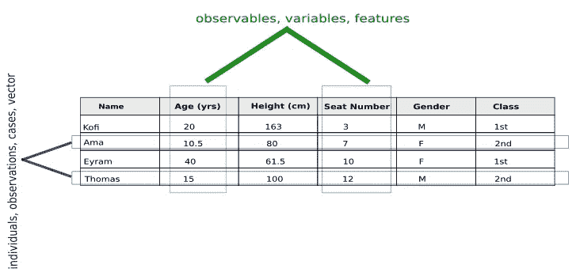

# 什么是数据:理解数据含义的初学者指南。

> 原文：<https://medium.com/analytics-vidhya/what-is-data-a-beginners-guide-4810170c7797?source=collection_archive---------11----------------------->

卢克·切瑟在 [Unsplash](https://unsplash.com?utm_source=medium&utm_medium=referral) 上的照片

# 介绍

你可能在学校、新闻、日常工作或职业中多次听说过**“数据”**这个词，也可能在互联网或任何地方偶然发现过几次，如果你是一名数据科学家，那么你的整个职业都依赖于它。

数据是无限的，它存在于宇宙的任何地方，但使用术语数据有时会令人困惑，因为几乎每个人都知道它对他们意味着什么。
【我的数据不是你的数据😃]

# 定义

在计算中，数据可以是文本、文档、图像、音频和视频的形式。在最基本的层面上，数据是一堆 1 和 0。

在统计学中，数据被定义为可以从中得出结论的事实或数字。

IT 专业人员将根据实体和属性来描述数据。

通俗地说，数据描述用户上下文或环境中的人、地点、对象、事件或概念，其含义取决于其组织。
例如。

*   在计算中不同组织的 **1 的**和 **0 的**表示不同的东西，
    **【0001 = 1 和 0010 = 2】**。
*   在生物学中，不同的基因组序列 **(A、C、G 和 T)** 产生不同的遗传密码，代表不同的个体或物种。
*   用顾客的身份列出购买历史代表了特定个人的购买习惯。
*   你的推文可以是任意排列的 26 个英文字符和空格。然而你选择了以一种传达意义的方式来排列它们。

如果数据不放在上下文中，它对人类或计算机就没有价值。背景是关键。

*   在计算的上下文中， **0001** 是 **1** 的二进制表示。
*   在意大利语环境中，你的英语推文毫无意义，即使它们可能包含相同的字符序列。

有人说“事实”是可以被证明是真实的、存在的或已经发生的事情。

> 理想情况下，数据可以被定义为任何事物属性的实际表示。

我说“理论上”是因为数据并不总是真实的。简单来说，数据可能是错误的。部分或全部数据有时可能代表与您期望或打算衡量的完全不同的东西。一名小学生在美国国家航空航天局的数据中发现一个漏洞和[数学错误，让马里兰州损失 3100 万美元](http://www.washingtonpost.com/wp-dyn/content/article/2009/01/11/AR2009011102287.html)

真实的数据或满足问题领域需求的数据有时被称为好数据或信号。
错误的、无效的或不符合问题领域需要的数据有时被称为坏数据或噪音。

描述一组(不止一组)数据的数据称为元数据，一组数据通常称为数据集。

# 数据剖析

让我们考虑一个场景(环境或特定的实验),其中你想了解在你当地的公共汽车/火车站和你一起上同一辆公共汽车/火车的乘客的种类。所以你收集了一些关于每个人的信息，这些信息成为了你的数据集。[跟踪狂😏]

数据集通常显示在表格中，如下所示。

> 数据集是由特定实验、场景、主题或环境确定的一组数据。

在表中，行代表个人，列代表变量

从上面我们可以说:
**数据**是组织成**变量**的关于**个体**的信息片段

我们所说的**个人**是指特定的人或物。
在我们的场景中，乘客是个体。
**个体**有时被称为观察值、案例、向量或特征向量。

所谓的**变量**，我们指的是个体的一个特定特征。在我们的场景中，变量是年龄、身高、座位号、性别、阶级。
**变量**有时被称为观察值、变量或特征。

每一行为我们提供关于特定个人(在本例中是一名乘客)的所有信息，每一列为我们提供关于所有乘客的特定特征的信息。

# 数据类型

数据可以以多种方式从不同的角度进行分类，值得拥有自己的博客，但简而言之，数据可以分为**原始的**或**加工过的**、**结构化的**或**非结构化的**，也可以分为**定性的**或**定量的**。

# 名字，名字，还有更多名字

如果你仔细观察，你会发现对同一事物有不同的命名方式，这些命名方式源于研究领域、偏好或仅仅是习俗。这对一个初学者或某个特定领域的新人来说可能是难以承受的，但不要气馁。你可能已经知道一个术语的意思了。都是熟不熟的问题。不心疼去问问或者上网搜一下。