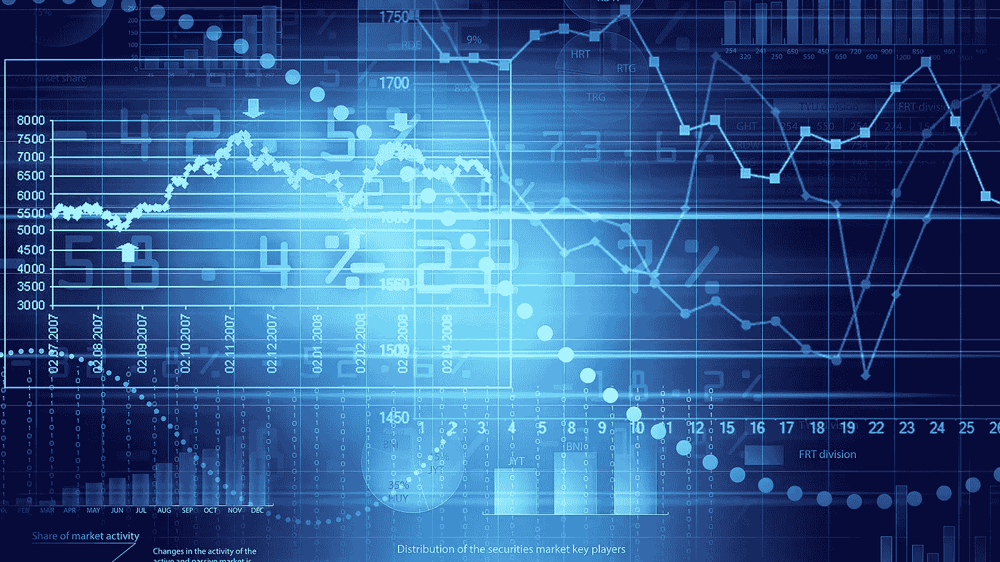

# 什么是数据科学管道？

> 原文：<https://medium.com/analytics-vidhya/what-is-data-science-pipeline-cf69310c75fe?source=collection_archive---------17----------------------->

在当今世界，毫无疑问**【数据科学】**显然是一个热门词汇。每个人都在不停地谈论数据科学。但是，究竟什么是数据科学很少有人知道，数据科学管道中的阶段究竟是什么，很少有人知道。我将从 complete basic 开始解释本文中的数据科学管道。

> 从较高的层面来看，我们实际上讨论了数据科学的 3 个阶段，如下所示:
> 
> 数据收集
> 
> 数据建模
> 
> 数据部署

## 数据收集

进入数据管道的第一步是`Data Collection`，这意味着我们必须收集数据。很明显，要用数据做任何事情，我们必须先收集数据，否则，就不可能。

数据是本世纪的新石油&为了在当今世界经营任何业务，我们都应该拥有数据，否则我们如何获得洞察力并推动业务或任何公司或新创业公司，因为数据是唯一的关键，通过给我们洞察力，我们可以做出重要的决策，从而引领我们走向成功。

可以通过许多来源收集数据，例如:

1.  日志数据
2.  智能设备数据
3.  传感器数据
4.  社交媒体数据
5.  调查数据等。

这是我们可以收集数据的数据科学管道的第一部分。

## 数据建模

这是数据科学管道中最大的一部分，因为在这一部分中，我们采取的所有行动/步骤都是为了将获取的数据转换成将在任何机器学习或深度学习模型中使用的格式。

这一部分包括:

1.  **数据探索:**在这一步中，数据被探索，即重要特征被识别，特征的相关性被识别，各种特征的重要性通过绘制各种图形或通过从使用各种库(如 pandas & numpy)的一些功能获得的基本描述中获得洞察力来计算。
2.  **数据清理:**这包括移除不需要的值，填充缺失的值。
3.  **数据转换:**这包括通过编码将分类数据转换成数字数据。
4.  **数据简化:**在该步骤中，移除不需要的特征。
5.  **拆分数据:**现在，我们必须将数据拆分为训练集、验证集和测试集，以便构建一个能给出最佳结果的模型。要了解更多关于数据分割的信息，请参考我的文章:

 [## 关于机器学习世界中的数据分割！

### 当一个人进入机器学习领域时，了解模型和方法是非常兴奋的…

medium.com](/@harshitdawar/all-about-data-splits-in-machine-learning-world-ec014e5a314a) 

现在，这涵盖了数据建模部分，从这里，我们必须进行到最后一部分。

## 数据部署

在这一步中，我们必须用我们在前面部分已经建模的数据来训练模型，然后评估该模型，以检查该模型是否可以在现实世界中使用。

> 如果模型的精度较低，我们必须进行实验，以便改进模型。例如，我们可以调整模型的超参数以改善结果。

最后，我们部署该模型，或者将该模型用于真实世界的数据，并获得有助于我们推动业务或其他任何事情的见解。

***我希望我的文章提供了关于*** `***Data Science Pipeline***` ***的深度知识，并且我成功地用最简单的方式解释了这个概念！***