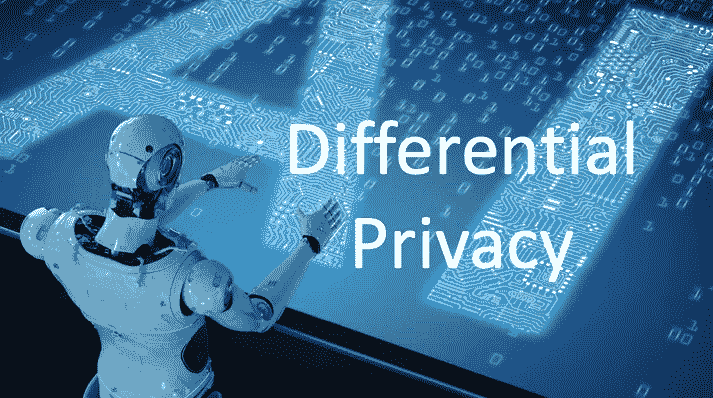

# 什么是差分隐私？

> 原文：<https://medium.com/analytics-vidhya/what-is-differential-privacy-553f41a757fd?source=collection_archive---------7----------------------->

差分隐私是人工智能的一个重要研究分支。它给人工智能带来了根本性的变化，并继续改变着人工智能的发展。这就是我写关于**差分隐私**和**隐私保护机器学习(ML)** 系列文章的动机。关于差异化隐私，Dataman 发表了“[你可以通过你的网飞观看历史](/ai-in-plain-english/ahh-the-computer-algorithm-still-can-find-you-even-there-is-no-personal-identifiable-information-6e077d17381f)”和“[什么是差异化隐私？](/@Dataman.ai/what-is-differential-privacy-553f41a757fd?source=friends_link&sk=5fbfe72aefa002cda23c742f869017fa)“更多精彩尽在……