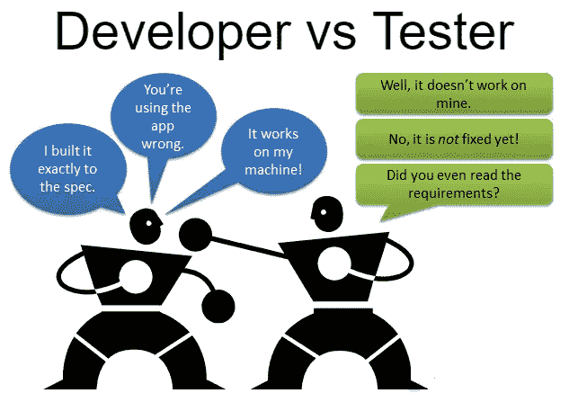
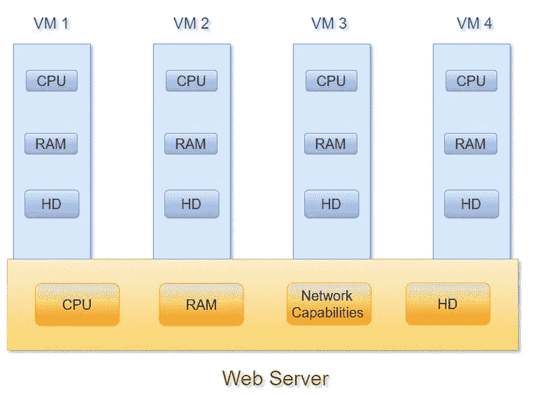
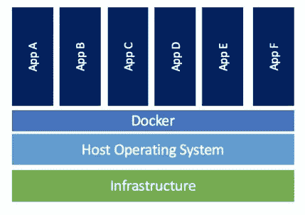
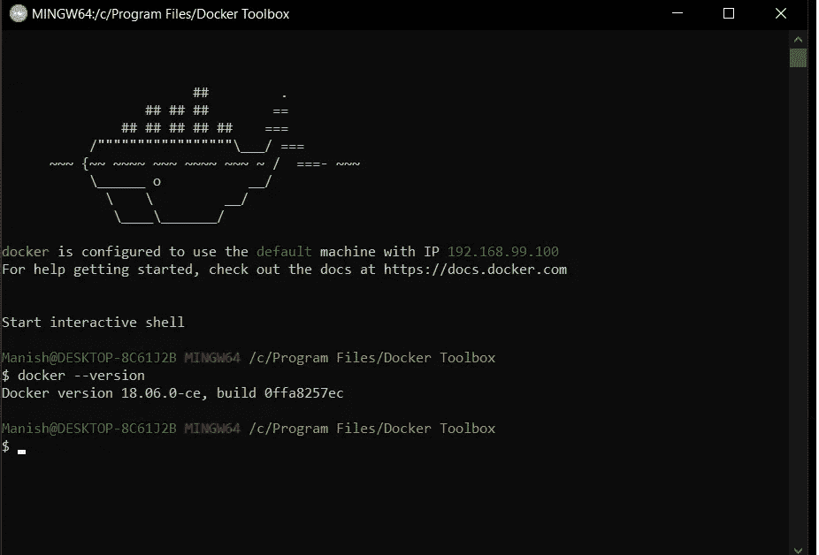

# 什么是 docker，如何在虚拟机上使用它？

> 原文：<https://medium.com/analytics-vidhya/what-is-docker-and-how-could-you-use-it-over-virtual-machines-e2420d03b78f?source=collection_archive---------23----------------------->

**Docker** 可以让你创建独立隔离的环境。一个 **Docker** 容器映像是一个轻量级的、独立的、可执行的软件包，包含了运行应用程序所需的一切。

致所有非技术极客，让我们通过使用一些**现实世界的问题**来理解码头工人

> **案例 1:**

假设你要搬家或离开一个住处，定居在另一个地方，在这个过程中，你需要打包所有的物品，可能包括你的电视、冰箱、洗衣机、餐桌、沙发套等。把它搬到你的新房子里。例如，假设你正在一个接一个地移动项目，在此过程中，你可能会因为各种原因错过一个项目，从而导致问题。

我们最好把所有物品都放在一个容器里，把所有东西作为一个整体，也就是说，按照适当的规则，在新房子里打开包装，这样丢失物品的可能性就很小。

> **案例二:**

在一家公司中，有这样一种情况:一名开发人员正在开发一个 web 应用程序，此人拥有 windows 操作系统和“X”硬件配置，而该应用程序部署在开发人员的机器上，开发人员可以很容易地对其进行测试，即倾向于零错误。现在，同一个 web 应用程序被发送到测试团队进行进一步的评估。让我们假设测试团队有 Linux 操作系统和“Y”硬件配置，在这个测试过程中，开发人员开发的 web 应用程序可能无法在测试人员的机器上运行，由于机器兼容性的巨大差异，会抛出许多错误。

如何预防？开发人员应该将整个应用程序放入一个容器中，更准确地说是 docker 容器。在将 web 应用程序发送给测试人员并让他们在自己的环境中安装和运行时，QnA 配置的映像会放在开发人员端。

> 一次构建，随处部署……

# Dockers 相对于虚拟机的优势

在每台服务器中，你有四个最基本的东西，它们是 CPU、RAM、网络能力(网络应用运行的端口号，即 5000/8000)、硬盘。在每台 web 服务器之上，我们尝试创建虚拟机，在其中分配一定量的 CPU、RAM 和硬盘，假设您有 1TB 容量的硬盘，您为每台虚拟机分配 200GB。

*   **环境标准化**与虚拟机配合得非常好，因为我们可以在一个独立的环境中安装所有的库和需求，该环境独立于其余的虚拟机
*   **环境与其他环境的隔离**不会妨碍当前工作环境的任何问题。

> 但问题在于**资源可用性**和**可移植性。**

docker 解决这个问题的方法是通过使用虚拟化，这里 docker 是在操作系统之上创建的，每个 docker 都有进程 ID(PID)、网络配置和用户根文件夹。现在假设您已经创建了 4 个停靠站 d1、d2、d3、d 4，假设 d2 不工作，那么您可以使用它的资源对其余的停靠站执行操作，从而解决资源的可用性和可移植性。

容器比虚拟机更灵活，它们的应用程序共享通用的操作系统和软件库，这极大地提高了虚拟机中的 CPU 利用率。这意味着组织可以减少运行其环境所需的虚拟机总数，并增加可在服务器上运行的应用程序数量。Docker Enterprise 客户通常会看到容器化后服务器整合增加了 50%,这意味着更少的硬件成本以及虚拟机和操作系统许可方面的节约。*这难道不是获取利润的好方法吗……*

# 在您的机器上安装 docker

你可以点击链接[https://docs.docker.com/docker-for-windows/install/](https://docs.docker.com/docker-for-windows/install/)下载 dockers，只要确保你的系统与下载兼容。上面的链接会引导你到 Windows 操作系统的 dockers，但是也有其他操作系统的选项，你可以看看。

如果你有 windows home edition，那么你需要从这里下载 docker toolbox[https://github.com/docker/toolbox/releases](https://github.com/docker/toolbox/releases)相信我，伙计们，如果你能首先安装任何提到的工具箱版本，那么你是幸运的，因为实际上，我花了 30 分钟来找出哪个版本将与我的系统兼容*不过感谢我的互联网！。*如何搞清楚兼容性？安装完成后，打开 docker 终端，等待几分钟，直到看到类似这样的内容👇

版本 18.09.0-ce

如果你不能得到这个，那么只需卸载虚拟箱，docker 工具箱，并继续下载另一个版本。

我希望你们都清楚什么是 docker 及其相关性。

如果你喜欢我的写作，请给我一个掌声，让我在未来写更多有趣的内容，也与你的朋友分享。

保持安全

支持我的工作❤️

继续编码！

马尼什·库马尔

数据科学爱好者