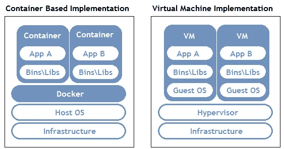

# Docker 是什么，为什么它对数据科学有用？

> 原文：<https://medium.com/analytics-vidhya/what-is-docker-and-why-is-it-useful-for-data-science-683294a57b81?source=collection_archive---------16----------------------->

" 2013–2019 Docker，Inc .保留所有权利。"

你正在做一个项目，你把你的代码发给一个同事或朋友去检查。他们进行分析，结果发现你的结果不同！当您的机器和您的同事运行不同的操作系统、不同版本的 R/Python 或不同版本的库(或其他任何东西)时，可能会出现这样的问题。Docker 是一个工具，可以帮助解决这个问题(以及许多其他事情)。

Docker 是一个使用“容器”系统轻松创建和部署虚拟化应用的平台。Docker 在他们的网站上是这样解释容器的:

> “容器是一个标准的软件单元，它将代码及其所有依赖项打包，以便应用程序能够快速可靠地从一个计算环境运行到另一个计算环境。”

简而言之，容器让数据科学家或开发人员将应用程序或脚本与所需的所有库和依赖项打包在一起，然后作为一个包共享。容器类似于虚拟机，但它不是模拟一个完整的独立操作系统，而是使用与您的系统相同的主操作系统。因此，容器比虚拟机消耗的资源少得多。因此，通常的做法是在一个容器上只运行一个进程，然后将它们连接起来，这样它们就可以相互通信。

容器和虚拟机虚拟化的比较。来自 https://www.aquasec.com/[的](https://www.aquasec.com/)

你可以分享和交换带有 Docker 图片的容器。图像是容器及其内容的快照或蓝图，一旦被激活，它们就变成了容器。如果您要加载一个 Docker 图像，更改容器的某些方面，然后将容器保存到一个图像中，它将不再是原来的图像。这就是为什么图像被认为是不可变的。[去 Docker Hub](https://hub.docker.com/) 看看那里所有可用的图片。

## 为什么 Docker 对数据科学有用？

**重现性:**它通过将您所有的资源和库捆绑到一个可共享的包中，确保您的分析是可重现的。因为 Docker 图像是不可变的，所以您创建的图像不能与任何其他图像混淆。这有点像为整个项目设置一个特定的随机种子值——所有的逻辑和结果最终都是一样的。

**代码共享:**你可以使用 Docker 容器与同事(或任何人)共享你的代码，他们将能够轻松获得你的代码，而不必担心版本冲突。此外，您可以快速下载 Docker 库中任何软件的 Docker 映像，并轻松运行它们。

我的下一篇文章将会是一篇关于如何实际使用 Docker 的教程！

