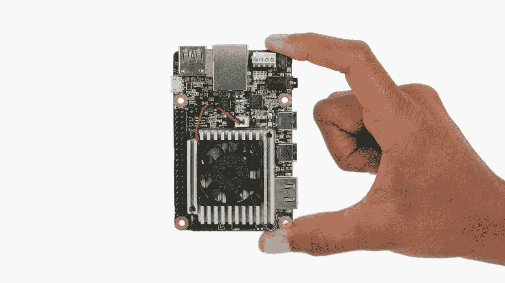

# 什么是边缘计算和 EdgeAI？

> 原文：<https://medium.com/analytics-vidhya/what-is-edge-computing-and-edgeai-92df4931e089?source=collection_archive---------26----------------------->

图片来源:coral.ai

随着物联网、5G 在全球的普及，数据传输和处理的效率变得越来越重要。虽然云计算传统上是一种将许多设备连接到互联网的可靠且经济高效的方法，但物联网和移动计算的不断兴起创造了对更低网络延迟和更高可靠性的需求。边缘计算技术正在兴起，以满足这些需求。它包括将计算资源放置在离数据来源更近的地方(例如，电机、泵、发电机或其他传感器)。

**边缘计算**是在物理上靠近目标设备的地方执行计算任务的过程，而不是在云中或设备本身上。在过去的几十年中，我们已经看到了不同的系统架构模式。根据系统的瓶颈，它被设计成集中式或分散式系统。不断增长的数据量(物联网)和网络层(和计算)的限制目前导致了像边缘计算这样的分散化系统。

通俗地说，这可以比作吃当地生产的食物。虽然来自阿根廷的牛排很美味，但是牛排的运输有几个缺点。这些食物必须被运送到很远的地方，导致二氧化碳排放量增加，而且需要很多时间。此外，肉类的来源更难追踪，而且可能适用不同的动物权利标准。虽然这些情况不会直接转化为数字世界，但推理的思路是相似的。

# 边缘:边缘的机器学习

边缘计算提供了巨大的潜力，使在边缘应用不同的机器学习算法成为可能。它将在从移动和联网家庭到安全、监控和汽车的许多行业中实现新的体验和新的机会。

边缘机器学习的优势如下:

1.  **更好的延迟:**如果应用程序依赖于即时反馈(例如，做出“实时”决策)，将数据发送到云、计算和将数据发送回设备可能需要太长时间。然而，如果路径减少到(更近的)边缘设备或节点并返回，许多用例可以更快地实现。
2.  **超个性化:**设备(IoT)可以处于不同的环境和位置，它们可能需要执行针对各自环境定制的任务，在这种情况下，边缘设备或节点可以为每个设备实现定制，就像在定制的 ML 模型中为每个设备近距离执行实时推断一样。此外，这样部署在边缘的 ML 模型可以在需要时进行优化和重新训练，不断学习更好地服务。这是有限的，不可能在云中大规模实现。
3.  **数据吞吐量和修剪:**设备可能会产生大量数据。例如，一辆无人驾驶汽车每天可以产生高达 4000 千兆字节的数据。如果每辆车都将自己产生的所有数据一路发送到中央数据中心，这将给网络带来巨大的负载。通过在靠近设备的边缘节点上执行必要的计算，可以修剪大部分路径。考虑到物联网的重要性日益增加以及连接到互联网的设备数量不断增加，这一点尤为重要。
4.  **可靠性和稳健性:**即使与中央云的通信受损，设备的主要功能仍应可用。这可以通过依靠与边缘节点的本地通信来实现，该边缘节点应该(至少在理论上)不容易出现问题。如果一个边缘节点出现故障，设备将被转移到另一个边缘节点。
5.  **更强大的硬件:**在当今世界，许多应用程序都依赖非常强大或专业的硬件。例如，现代机器学习算法与 GPU 或张量处理单元(TPU)配合使用效果最佳。用这样的硬件扩展设备通常是不可取的。边缘设备或节点对于这种专用硬件和通常具有更多计算能力的硬件是优选的。
6.  **隐私:**在许多用例中，收集用户数据是必需的，或者至少是有用的。然而，在聚合数据足够的情况下，可以通过在边缘节点而不是云上聚合数据来保护用户的隐私。
7.  **可扩展性:**在大多数情况下，设备的计算能力受到其小尺寸的限制。此外，开发需要更强硬件的新用例将要求所有可能的用户或网络管理员更新设备，这限制了用例的采用率。边缘节点没有这些问题，并且可以非常容易和连续地扩展。使用合适的边缘计算框架，添加、替换或升级边缘节点是一个非常简单且高度自动化的过程。
8.  **适应性:**使用边缘设备或节点代替单一用途的服务器具有适应不断变化的环境的额外好处。启用基础环境后，*边缘设备或节点可以根据环境轻松配置，以提供单独的服务子集*。虽然有些用例只在城市有用，但其他用例在农村地区可能更有用。由于直接连接到云和更高级别的边缘节点，移动工作负载并释放关键用例的计算能力是可能的，并且可以动态完成。
9.  **可持续性和降低成本:**设备正在产生海量数据。例如，一辆无人驾驶汽车每天可以产生高达 4000 千兆字节的数据。如果每辆汽车都将其生成的所有数据发送到云端进行机器学习推理，这将在网络上产生巨大的*负载*和*电力消耗*来满足这些请求将是巨大的，反过来这也将导致*企业的巨大成本*。相反，外包并在*边缘的数据来源/位置进行机器学习推理和数据修剪将大幅降低成本并实现可持续业务。*

凭借这些优势，我们将见证越来越多的人工智能在通往互联和强大世界的边缘被采用。一段时间以来，我一直在从事关于**智能边缘和云的研发——机器学习的持续部署**。感谢我的团队[TietoEvry](https://www.tietoevry.com/)AI 团队、[芬兰 VTT](https://www.vttresearch.com/)、[阿卡达大学](https://www.arcada.fi/en)以及导师们的支持。更多更新如下。敬请关注。请随时联系为您的企业或组织提供强大且可扩展的 edgeAI，我们乐意为您提供帮助。

请在评论中告诉我你对此的想法和观点，我希望听到你的意见。