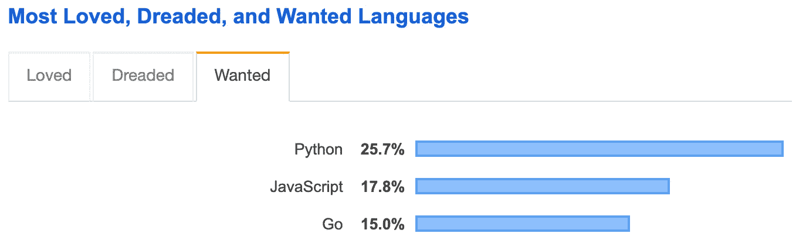
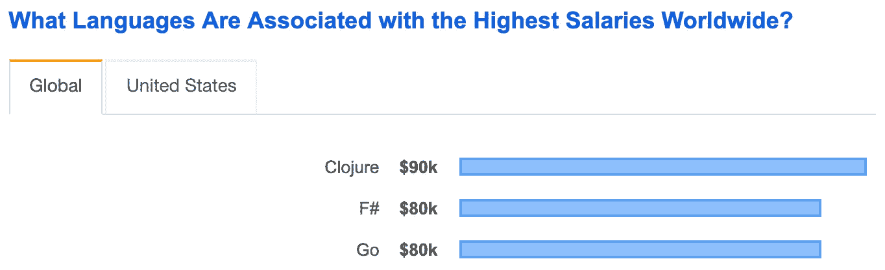

# 什么是 Go 编程语言，为什么你应该学习它

> 原文：<https://medium.com/analytics-vidhya/what-is-go-programming-language-and-why-you-should-learn-it-31ab91b4423?source=collection_archive---------1----------------------->

# 围棋是什么？

Go 编程语言(又名 Golang)是 Google 开发的一种开源语言。计算机科学世界中的一些最大的名字都与围棋有关，即 Rob Pike、Ken Thompson 和 Robert Griesemer。Go 有几个特性使它非常适合构建简单、可靠和高效的软件，现在让我们来讨论一下。

# 围棋的特点

*   开源——开源产品的本质保证了它是一种由社区为社区构建的语言。
*   静态类型化——当您构建产品级软件时，类型安全避免了许多错误，这些错误仅仅是由于将不合适的值类型赋给变量而引起的。静态类型允许早期发现小错误。像 python 这样的动态类型语言中的这种错误只在运行时抛出，这是不可取的。【T4`a = 'foo'`
    `b = True`
    `c = a / b`
*   快速编译——golang 程序的编译速度非常快，感觉就像是一种解释语言！所以 Go 是编译语言和解释语言的完美结合！
*   Go 是一种编译语言，可以生成包含所有依赖项的二进制可执行文件。这实质上意味着，运行二进制程序不需要任何运行时支持。此外，生成的二进制文件非常小，bonanza 补充道:)最好的结果是，一个人可以在大约 5 MB 内封装一个完整的软件！这是一个非常小的数字！这个构建容器的过程称为多阶段构建。
*   跨平台——这是 golang 最令人惊奇的特性之一，这也使它成为 DevOps 人的首选语言。Go 可以为不同的目标平台生成二进制可执行文件！也就是说，你可以在达尔文(Mac)上编写 Go 代码，生成可以在 Linux 上运行的二进制代码，等等，不需要任何其他支持！此外，它不像 Java 一样可以在不同的平台上运行，但问题是，它要求 Java 虚拟机安装在目标平台上，这是非常占用内存的！
*   并发性——这是使 puts Go 在后端工程领域处于领先地位的特性。并发编程是大多数开发人员的噩梦。但是 Go 处理它的方式是轻而易举的！并发是围棋中的一等公民。您可以在一个新的 goroutine(轻量级线程)中运行一个进程，只需在函数调用前加上前缀`go`。有很多东西可以讨论，但是你可以阅读我的文章关于这个话题的进一步阐述。
*   垃圾收集——这无疑减轻了开发人员的大量内存管理负担！

# 为什么要学围棋？

如果你在阅读了以上几点后仍然不相信学习围棋，让我向你展示学习它的实际好处，截至 2019 年 7 月。

*   根据 StackOverflow 2019 年的调查结果，Go 在最受欢迎的语言排名中排名第三。

*   Go 在全球薪酬最高的工作语言排行榜中排名第三。

*   随着越来越多的公司开始在工具链中采用 Go，并出于良好的理由将遗留代码库迁移到 Go，golang 专业人员的可用职位数量正在与日俱增。
*   它有一套独特的软件开发方法。它的设计融合了面向对象的原则和现代基于接口的编程。它提倡[复合而非继承](https://odetocode.com/blogs/scott/archive/2019/01/03/composition-over-inheritance-in-go.aspx)。

# 结论

我相信我至少能够提供最基本的要点，这使围棋进入了一个非常甜蜜的阶段，以及为什么人们现在应该学习它。目前，Go 正在几乎每个领域被大量使用，从服务器开发到 DevOps，从网络安全到区块链，可能性是无穷的！但是 Go 在服务器端开发中越来越受欢迎，这也恰好是我的专业领域和工作角色，因此我写了一篇关于[“Go 中的 RESTful API 开发”](http://souvikhaldar.info/programming/restful_go/)的文章。一定要去看看！**后会有期** *快乐编码*:)

*原载于 2019 年 8 月 3 日*[*http://souvikhaldar . info*](http://souvikhaldar.info/programming/golang_intro/)*。*