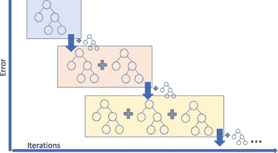
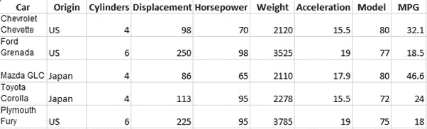
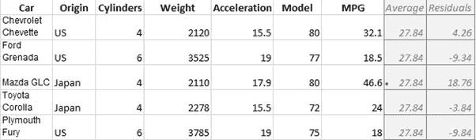
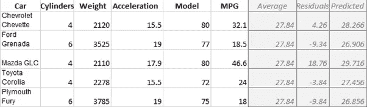
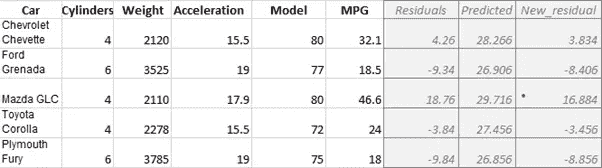
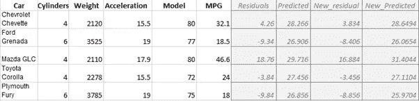
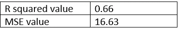
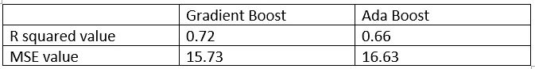

# 什么是梯度增强？和 Ada Boost 有什么不同？

> 原文：<https://medium.com/analytics-vidhya/what-is-gradient-boosting-how-is-it-different-from-ada-boost-296f055ecacd?source=collection_archive---------8----------------------->

Boosting 算法是最流行和最常用的算法之一。它们可以被认为是建立预测模型的最有力的技术之一。

提升任何其他集成算法的基本思想是将几个弱学习器组合成一个更强的学习器。推进模型按顺序尝试预测器，随后的模型尝试修复前一个模型的错误。

如果你不知道什么是集成模型，集成方法是创建多个模型，然后将它们组合起来以产生改进结果的技术。集合方法通常比单一模型产生更精确的解。

我们将在整篇文章中使用 cars 数据集来理解梯度推进的概念。我们还将拟合一个 Ada Boost 模型来比较这两种提升技术。

但首先让我们了解什么是梯度推进。

**梯度推进**

梯度增强是一种增强算法。它依赖于直觉，即最佳可能的下一个模型，当与先前的模型结合时，最小化整体预测误差。关键的想法是为下一个模型设定目标结果，以最小化误差。梯度增强可用于分类和回归。

梯度增强和 Ada 增强之间的区别在于它如何处理其前身的欠拟合值。与 AdaBoost 相反，AdaBoost 在每次交互时调整实例权重，这种方法试图使新的预测器适应前一个预测器产生的*残差*。

基本上，梯度增强包括三个要素:

1.要优化的损失函数。

2.预测能力差的学习者。

3.添加弱学习者以最小化损失函数的加法模型。

梯度提升是一种贪婪算法，很容易使训练数据集过拟合。它可以受益于正则化方法，正则化方法惩罚算法的各个部分，并通过减少过拟合来总体上提高算法的性能。

我们将在后面的章节中更多地了解这些元素。在了解渐变增强与 Ada 增强有何不同之前，让我们先了解一下什么是 Ada 增强。

**阿达助推**

自适应增强，或最常见的 AdaBoost，是一种增强算法。该算法用于校正其前任的方法是通过更加关注先前模型的欠拟合训练实例。因此，在每一个新的预测中，焦点每次都将集中在更困难的情况上。

这种顺序学习技术听起来有点像[梯度下降](/diogo-menezes-borges/what-is-gradient-descent-235a6c8d26b0)，只是 AdaBoost 不是调整单个预测器的参数来最小化成本函数，而是将预测器添加到集成中，逐渐使其变得更好。这种算法的最大缺点是模型不能并行化，因为每个预测器只能在前一个预测器被训练和评估之后被训练。

现在，让我们来了解一下这两个模型，Gradient Boost 和 Ada Boost 有什么不同。

**比较梯度增强和 Ada 增强**

比方说，我们想从汽车数据集中预测 MPG。

Ada Boost 首先根据训练数据构建一棵称为树桩的矮树。残肢对最终输出的影响程度取决于它对先前误差的补偿程度。然后 Ada Boost 基于前一个残肢所犯的错误构建一个新的残肢。Ada Boost 继续以这种方式制作树桩，直到达到我们要求的树桩数量。

相比之下，梯度推进从制作一片叶子开始，而不是一棵树或树桩。这个叶子代表对所有样本权重的初步猜测。当试图预测像 MPG 这样的连续值时，首先猜测是平均值，然后梯度提升建立一棵树。但与 Ada Boost 不同，这棵树比树桩大。但是梯度增强仍然限制了树的大小。

Ada 增强和梯度增强都会缩放树。梯度增强以相同的量缩放树。然后，梯度增强基于前一棵树产生的错误构建另一棵树，然后缩放该树。梯度增强继续以这种方式构建树，直到它达到我们要求的树的数量，或者如果额外的树不能提高拟合度。

让我们来了解一下梯度推进的工作原理。

**渐变升压工作**

梯度推进可用于回归和分类。在本节中，我们将借助一个示例来了解梯度推进是如何用于回归的。

我们从汽车数据集中抽取了一个样本，我们必须根据不同的变量来预测汽车的 MPG(每加仑英里数)

注意:出于可视化的目的，我们没有添加数据的所有变量。

我们做的第一件事是计算平均值。这是第一次尝试预测每辆车的英里数。换句话说，如果我们现在停下来，我们会预测所有车的 MPG。

这里的平均值是(32.1+18.5+46.6+24+18/5) = 27.84

然而，梯度推进并不止于此。接下来我们要做的是，根据第一棵树的错误构建一棵树。

前一棵树产生的误差是观察到的和预测的 mpg 之间的差异。

注意:出于可视化的目的，我们没有添加数据的所有变量。

这里，残差是观测 MPG 和预测 MPG 之间的差值，即(观测 MPG-预测 MPG)。这些值被称为伪残差。术语“伪残差”基于线性回归，其中观察值和预测值之间的差异会产生残差。

现在，我们将原始叶子与新树结合起来，根据训练数据对个体进行新的预测。但这可能会导致过度拟合。

梯度增强通过使用学习率来缩放来自新树的贡献来处理这个问题。

因此，第一行的预测值为:27.84 + 0.1 * 4.26 = 28.266

注意:出于可视化的目的，我们没有添加数据的所有变量。

在上表中，我们可以看到训练数据的所有预测值。

我们用新的预测 MPGs 再次计算残差。

注意:出于可视化的目的，我们没有添加数据的所有变量。

新的残差小于旧的残差。因此，这是朝着正确方向迈出的一步。

现在，我们将这棵树与前一棵树和最初的叶子结合起来。例如，在第一行:

27.84 + (0.1*4.26) + (0.1*3.83) = 28.649

注意:出于可视化的目的，我们没有添加数据的所有变量。

我们得到新的预测值，然后继续同样的过程。

总之，我们从一片叶子开始，它是我们想要预测的变量的平均值，在这个例子中是 MPG。然后，我们添加一个基于残差的树，并用学习率来衡量树对最终预测的贡献。然后，我们基于新的残差添加另一棵树，基于前一棵树产生的误差继续添加树。

**梯度增强的损失函数**

在这种情况下，损失函数就是评估我们预测 MPG 的能力。梯度增强中最常用的损失函数是:(观察-预测)^2

移除后，我们得到的损失函数与线性回归中使用的损失函数相同。

我们在梯度增强中使用它的原因是，当我们相对于“预测的”来区分它时，使用链规则，我们得到:

2/2 * —(观察值—预测值)

2 和 2 抵消了，剩下的是负残差。这使得数学更容易，因为梯度推进使用导数很多。

还有其他损失函数可供选择，但这是梯度推进回归中最受欢迎的一个。

**梯度推进模式**

为了根据数据拟合梯度推进模型，我们需要考虑几个参数。这些参数包括树的最大深度、估计器的数量、学习率的值、最小样本分裂、最小样本叶等。

为了获得这些参数的精确值，我们可以使用超参数调整。这种超参数调整将选择关于度量的最佳参数。假设，在这种情况下，度量是 R 平方值。因此，超参数调整将为参数选择这些值，从而为我们提供更好的 r 平方值。

在 cars 数据集中，当我们预测 MPG 时，通过超参数调整，我们得到估计数的值为 350，学习率为 0.1。

从 sklearn 中，我们可以使用 GradientBoostingRegressor 并在数据上拟合回归的梯度推进。

在对数据拟合梯度推进模型以预测 MPG 后，我们得到以下结果:

如我们所见，我们得到的 r 平方值为 0.66，MSE 为 17.35。

现在，让我们将这些值与梯度增强的值进行比较，看看模型之间有什么不同。

**比较梯度增强和 Ada 增强模型**

我们可以看到，模型的性能之间没有巨大的差异，但在这种情况下，梯度推进模型仍然是更好的模型。

从结果中，我们可以得出结论，对于这个数据集和参数，梯度增强模型优于 Ada 增强模型。尽管情况可能并不总是如此。

这些结果并不能清楚地表明哪个模型更好，因为对于不同的变量和不同的数据集，模型可能表现不同。考虑到这个数据集，梯度增强确实优于 Ada 增强模型，但是没有太大的差别。在这种情况下，Gradient 的性能肯定比 Ada Boost 模型好，但差距并不大。

考虑到没有对数据进行其他即兴创作，这两个模型表现异常。这就是为什么 Boosting 是当今如此有效和流行的算法。我们甚至看到这些助推算法在许多 Kaggle 比赛中的使用。助推算法非常受欢迎，而且理由也很充分。虽然梯度增强和 Ada 增强是不同的，但它们在许多方面也是相似的。最后，它们遵循相同的集合模型方法，因此在性能和输出方面是例外的。