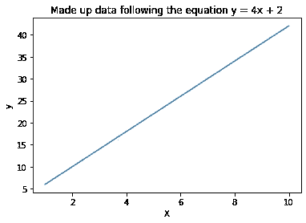
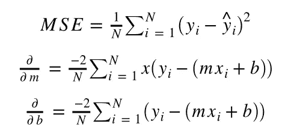
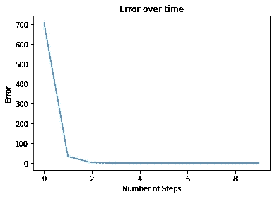
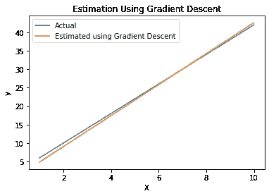

# 什么是梯度下降？

> 原文：<https://medium.com/analytics-vidhya/what-is-gradient-descent-e59d981d5cdb?source=collection_archive---------5----------------------->

# 概观

本教程是关于梯度下降的基础。这也是机器学习入门文章“什么是机器学习？”，可以在这里找到[。](/swlh/what-is-machine-learning-ff27b518909b)

# 那么什么是梯度下降呢？

梯度下降是一种为模型寻找最佳权重的方法。我们用梯度下降算法寻找最佳的机器学习模型，误差最低，准确率最高。梯度下降的一个常见解释是，站在一个不平坦的棒球场上，蒙上眼睛，你想找到场地的最低点。很自然地，你会用你的脚一点一点地走到球场的最低点。寻找任何向下的斜坡。从概念上讲，这是我们正在做的事情，以最小化我们的错误，并找到我们最好的机器学习模型。

# 这和我们第一个教程里的 y = mx + b 方程有什么关系？

我们可以计算导数、我们的误差，并更新我们的权重(也称为`m`和`b`)。

# 例子

让我们开始吧。我们将使用的两个库是 numpy 和 matplotlib。Numpy 是一个很棒的数学计算库，而 matplotlib 用于可视化和绘图。

# 导入我们将使用的库

```
*# Numpy is a powerful library in Python to do mathemetical computations*
**import** **numpy** **as** **np**

*# Importing matplotlib for visualizations*
**from** **matplotlib** **import** pyplot **as** plt
```

# 我们可以创建一些符合这个等式的数据:`y = 4x + 2`其中`m` = 4，`b` = 2

既然我们知道了基本事实，我们就可以根据这个等式创建一些数据。我们还可以将使用梯度下降计算的权重与地面真实值进行比较，其中 m = 4，b = 2。

```
X = np.array([1, 2, 3, 4, 5, 6, 7, 8, 9, 10])
y = np.array([6, 10, 14, 18, 22, 26, 30, 34, 38, 42])

plt.plot(X, y)
plt.title('Made up data following the equation y = 4x + 2')
plt.ylabel('y')
plt.xlabel('X')
plt.show()
```



(图 1)

**现在让我们用 Python 创建一个梯度下降函数**

```
**def** gradient_descent(x, y, learning_rate, steps):
    *# Randomly initialize m and b. Here we set them to 0.*
    m = b = 0

    *# N is just the number of observations*
    N = len(x)

    *# Creating an empty list to plot how the error changes*
    *# over time later on with matplotlib.*
    error_history = list()

    *# Loop through the number of iterations specified to get closer to the optimal model*
    **for** i **in** range(steps):
        *# Since y = mx + b, we predict y is going to be m * x + b*
        y_predicted = (m * x) + b

        *# We calculate the error for each model we try, attempting to get the least amount of error possible*
        *# In this case we calculate the mean squared error (MSE)*
        error = (1 / N) * sum([value ** 2 **for** value **in** (y - y_predicted)])
        *# Append to the error history, so we can visualize later*
        error_history.append(error)

        *# Calculate the partial derivatives for m and b*
        dm = (-2 / N) * sum(x * (y - y_predicted))
        db = (-2 / N) * sum((y - y_predicted))

        *# Update m and b based on the partial derivatives and the specified learning rate*
        m = m - learning_rate * dm
        b = b - learning_rate * db

        *# Print the step number, error, and weights*
        print(f"Step {i + 1} **\n** Error = **{error}** **\n** m = **{m}** **\n** b = **{b}** **\n**")

    **return** m, b, error_history
```

# 让我们来分解这个函数

1.  首先我们设置 m 和 b 等于 0。这是为了随机初始化这些变量，您可以将它们设置为您想要的任何值。

2.然后我们找到我们有多少数据点，并把它作为变量`N`

3.我们创建一个空数组来保存错误的历史(记住，错误是我们预测的值和实际值之间的差)

4.最后，我们创建梯度下降循环:

*   首先，在循环中，我们计算我们的预测点，也就是 mx + b 中的 y。因此，我们以`y_predicted = mx + b`结束
*   我们计算每个预测点的误差。在这种情况下，我们使用均方误差(MSE)。计算方法是找出误差，然后求平方，再取所有平方误差的平均值。
*   然后，我们将 MSE 添加到历史数组中，以便以后可视化。
*   现在，我们为梯度下降算法做一些非常重要和基本的事情——我们计算权重的偏导数。偏导数只是保持其他变量不变，而你要弄清楚你所观察的变量在这个过程中是如何表现的。
*   然后我们根据偏导数和我们指定的学习率更新我们的权重`m`和`b`。(学习速度是你迈出的一大步)
*   最后我们打印出值并返回变量。

*公式:*



(公式)

我们可以指定梯度下降算法要运行多少个“步骤”。基本上，你被蒙住眼睛时可以在棒球场上走多少步。

```
steps = 5
```

我们还可以指定“学习率”，这将告诉我们这些步骤有多大。从概念上讲，想想每次你在棒球场上迈出一步时，你被允许迈出多大的一步。太大的一步可能会导致你在场地的最低点拍摄过度。但是，过小的一步会让你花更长的时间找到最低点。这个变量在深度学习中被广泛讨论。现在我们将它设置为 0.01。

```
learning_rate = 0.01
```

现在让我们通过梯度下降运行我们的虚构数据，看看会弹出什么样的`m`和`b`值。

```
m, b, error_history = gradient_descent(X, y, learning_rate, steps)
```

> [输出]
> 
> 第一步
> 
> 误差= 708.0，m = 3.3000000000000003，b = 0.48
> 
> …
> 
> 第五步
> 
> 误差= 0.40731798550902065，m = 4.194540273，b = 0.6321866478

注意，误差继续减小，并且`m`接近 4，而`b`接近 2。如果我们增加算法允许采取的步骤数，它将更接近真实值。

```
steps = 10
m, b, error_history = gradient_descent(X, y, learning_rate, steps)
```

> [输出]
> 
> 第一步
> 
> 误差= 708.0，m = 3.3，b = 0.48
> 
> …
> 
> 第十步
> 
> 误差= 0.3875，m = 4.19234，b = 0.66093

您可以看到，随着更多的步骤，我们越来越接近 4 和 2 的真实`m`和`b`值！

# 让我们看看在每一步之后错误是如何变化的

```
plt.plot(range(steps), error_history)
plt.title('Error over time')
plt.ylabel('Error')
plt.xlabel('Number of Steps')
plt.show()
```



(图 2)

我们可以看到，它急剧下降。然后慢慢变低。在训练深度学习或其他机器学习模型时，你会经常看到这种类型的情节。

# 现在让我们看看梯度下降算法得出的线，用实际的线绘制。

```
y_predicted = (m * X) + b

plt.plot(X, y)
plt.plot(X, y_predicted)
plt.title('Estimation Using Gradient Descent')
plt.ylabel('y')
plt.xlabel('X')
plt.legend(["Actual", "Estimated using Gradient Descent"])
plt.show()
```



(图 3)

我们可以看到梯度下降算法做得非常好！如果我们允许梯度下降运行更长时间，它将能够更接近这个图中的实际函数。

# 摘要

总之，梯度下降是一种优化机器学习模型的算法。它试图找到模型的最佳权重，以逼近在数据中找到的函数。随着时间的推移，误差将(有希望)减少，准确性将提高。为此，梯度下降算法计算权重的偏导数。这些偏导数告诉算法在哪个方向更新权重。而学习率告诉我们，在偏导数给定的方向上，权重允许采取多大的步长。

# 个人简历

Frankie Cancino 是 Target 的高级人工智能科学家，住在旧金山湾区，是数据科学明尼阿波利斯集团的创始人。

# 链接

*   [原 Jupyter 笔记本](https://github.com/frankiecancino/ML_Tutorials/blob/master/gradient_descent.ipynb)
*   [什么是机器学习？](/swlh/what-is-machine-learning-ff27b518909b)
*   [领英](https://www.linkedin.com/in/frankie-cancino/)
*   [推特](https://twitter.com/frankiecancino)