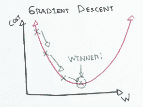
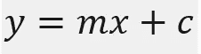
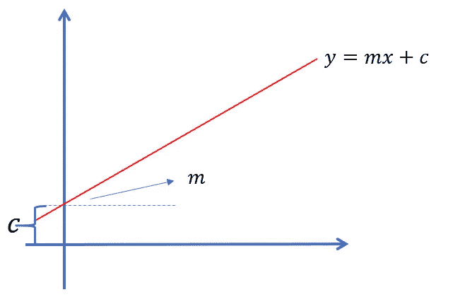
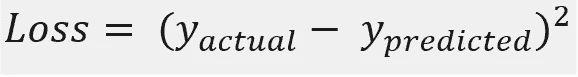
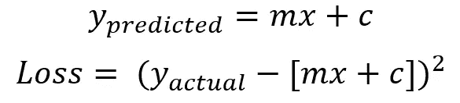
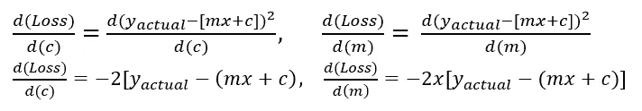
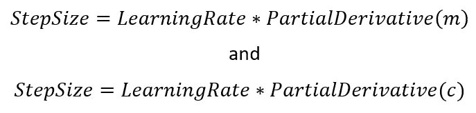

# 什么是梯度下降？它是如何工作的？

> 原文：<https://medium.com/analytics-vidhya/what-is-gradient-descent-how-does-it-work-b713fab88349?source=collection_archive---------10----------------------->

> **目的—** 了解梯度下降以及梯度下降是如何逐步进行的。

# 梯度下降

梯度下降是一种**优化算法**，用于通过沿最陡下降方向缓慢移动来最小化函数，最陡下降方向由梯度的负值定义。

梯度下降算法

用于更新机器学习中的参数，例如**线性回归**中的**回归系数**和**神经网络**中的**权重**。

让我们举一个简单的线性回归问题的例子，我们的目的是在只给定一个自变量的情况下预测因变量(y)。对于上述线性回归模型，直线方程如下。

线性回归的直线方程

在上式中，y 是因变量，
x 是自变量，
m 是直线的斜率，
c 是直线在 y 轴上的截距。

线性回归线不同分量的可视化

为此，我们将损失函数视为误差平方和。损失函数的方程如下。

损失函数

> 这里，我们需要优化“m”和“c”的值，以便最小化损失函数。

由于 y_predicted 是线性回归方程给出的输出，因此任何给定点的损耗可由下式给出

为了找出斜率的负值，我们先求出 m 和 c 的偏导数

偏导数 w . r . t . m 和 c

> 当两个或两个以上的偏导数在同一个方程上对两个或两个以上的不同变量进行求导时，称为梯度。

在对‘m’和‘c’进行 w.r.t .的偏导数后，我们得到上面给出的 2 个方程，当‘m’和‘c’的某个值给定并在所有数据点上求和时，我们得到斜率的负侧。

下一步是假设一个学习率，通常用“α”(alpha)表示。在大多数情况下，学习率被设置为非常接近 0，例如 0.001 或 0.005。

> 小的学习速率将导致梯度下降算法的步骤过多，并且如果选择大的“α”值，则可能导致模型永远不会收敛于最小值。

接下来是根据我们的学习速度来确定步长。步长可以定义为

使用学习率寻找下一个点

这将给我们 2 个点，它们将代表‘m’和‘c’的更新值。

我们迭代寻找斜率的负值的步骤，然后更新‘m’和‘c’的值，直到我们达到或收敛于我们的最小值。

# 梯度下降怎么知道什么时候停止算法的迭代？

通常，当两个条件中的一个满足时，梯度下降将停止。
1。当步长很小时，它不会对‘m’和‘c’的值产生太大影响。
2。如果由于某种原因，算法无法收敛，它将在 1000 次迭代后自动停止，该参数可以在编程期间更改。

# 梯度下降的类型

有 3 种类型的梯度下降即，
1。随机梯度下降
2。批次梯度下降
3。小批量梯度下降

> 当数据集太大时，执行 n 步的计算变得非常困难，因此使用随机和小批量梯度下降。

**随机梯度下降—** 在极端情况下，梯度下降在每一步选取一个训练数据实例，并基于该数据点实例进行更新

**批量梯度下降** —在批量梯度下降中，算法使用整个数据集来更新系数值。

**小批量梯度下降—** 在小批量梯度下降中，算法在每一步从整个数据集中挑选一个小批量，并更新系数的值。该方法兼有随机梯度下降法和分批梯度下降法的优点。