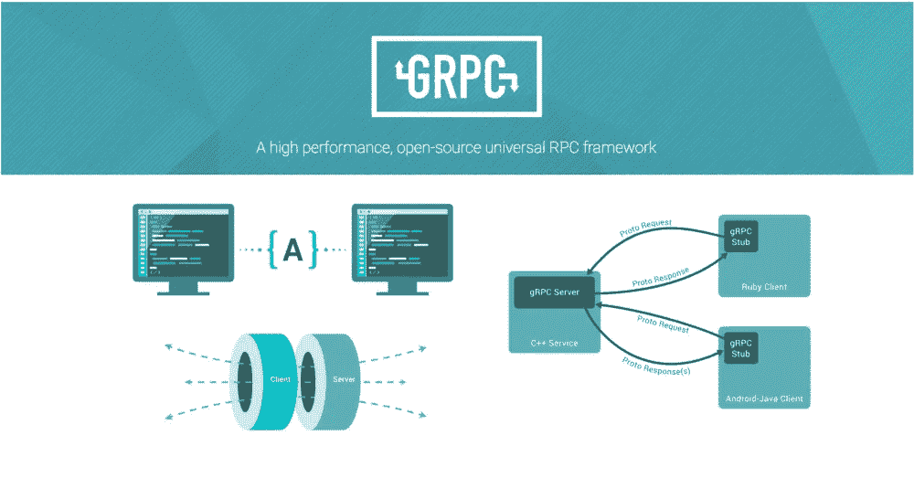

# gRPC 是什么？JAVA 简介

> 原文：<https://medium.com/analytics-vidhya/what-is-grpc-a-brief-introduction-with-java-1e22f91a1271?source=collection_archive---------2----------------------->

“gRPC 是一个现代的开源高性能 RPC 框架，可以在任何环境中运行。它可以通过对负载平衡、跟踪、运行状况检查和身份验证的可插拔支持，高效地连接数据中心内和跨数据中心的服务。它也适用于分布式计算的最后一英里，将设备、移动应用程序和浏览器连接到后端服务。”[1]

云计算原生计算基金会是 gRPC 及其现有生态系统项目(【https://github.com/grpc】和)的新家

与 Rest、SOAP 等有一些比较。在本教程中，我不会做比较。但是你可以找到其中的一些 [1](https://www.mertech.com/blog/know-your-api-protocols) 、 [2](https://doc.akka.io/docs/akka-grpc/current/whygrpc.html) 、 [3](https://www.yonego.com/nl/why-milliseconds-matter/#gref) 。



教程的大纲:

1-)使用协议缓冲区 id1 在. proto 文件中定义服务

2-)生成服务器

3)使用协议缓冲编译器的客户端存根代码。

**1-)用原型文件定义服务**

默认情况下，gRPC 使用协议缓冲区，这是 Google 用于序列化结构化数据的成熟开源机制。

“协议缓冲区是一种灵活、高效、自动化的序列化结构化数据的机制——比如 XML，但更小、更快、更简单。一旦定义了数据的结构化方式，就可以使用专门生成的源代码，使用各种语言轻松地将结构化数据写入各种数据流或从中读取。您甚至可以更新您的数据结构，而不会破坏针对“旧”格式编译的已部署程序。[2]

**！重要！:**gRPC 站点上有一个 Java 的基础教程[5]。但是文档并不能完全覆盖整个过程，尤其是你是一个新手。这里有一些假设，假设你对这个概念非常熟悉。我将提到理解概念和如何解决问题的额外步骤。

版本 3 的样本原型文件。[4]

```
syntax = "proto3";package tutorial;import "google/protobuf/timestamp.proto";

option java_multiple_files = true;
option java_package = "com.example.tutorial";
option java_outer_classname = "AddressGuideProtos";
service AddressGuide {
    rpc GetAddressBook(Person) returns (AddressBook) {}
}
message Person {
  string name = 1;
  int32 id = 2;  // Unique ID number for this person.
  string email = 3;
enum PhoneType {
    MOBILE = 0;
    HOME = 1;
    WORK = 2;
  }
message PhoneNumber {
    string number = 1;
    PhoneType type = 2;
  }
repeated PhoneNumber phones = 4;
google.protobuf.Timestamp last_updated = 5;
}
// Our address book file is just one of these.
message AddressBook {
  repeated Person people = 1;
}
```

这个原型文件将被编译器用来生成源代码。在进入编译器阶段之前，让我们描述一些选项。

> option Java _ multiple _ files = true；

在不同的文件中创建对象。

> option Java _ package = " com . example . tutorial "；

设置 Java 包名。

*   **下载协议缓冲区并设置编译器**

[](https://github.com/protocolbuffers/protobuf/releases) [## protocolbuffers/protobuf

### 此时您不能执行该操作。您已使用另一个标签页或窗口登录。您已在另一个选项卡中注销，或者…

github.com](https://github.com/protocolbuffers/protobuf/releases) 

下载最新文件。您可以下载特定于编程语言的文件或包含全部支持语言的所有文件。我用了所有版本。

支持的语言:C++，Java，Go，C#，Python，Objective-C，JavaScript，Ruby，Php，Dart

Unix 安装(Github repo 自述文件中的 Windows 安装):

```
./configure
make
make check
sudo make install
sudo ldconfig
```

您可以在 Github repo 找到生成资源的示例命令。

```
protoc --java_out=${OUTPUT_DIR} path/to/your/proto/file
```

我前面引用的 Java 文档中有一个表达式如下。

> “以下类是从我们的服务定义中生成的:
> 
> `Feature.java`、`Point.java`、`Rectangle.java`以及其他包含所有协议缓冲区代码以填充、序列化和检索我们的请求和响应消息类型的代码。
> 
> `RouteGuideGrpc.java`其中包含(以及一些其他有用的代码):
> 
> 一个用于`RouteGuide`服务器实现`RouteGuideGrpc.RouteGuideImplBase`的基类，具有`RouteGuide`服务中定义的所有方法。
> 
> *存根*类，客户端可以使用它们与`RouteGuide`服务器对话。"

**！！！**文档使用了一个不同的例子:`*RouteGuide*`。并表示应该生成`*RouteGuideGrpc*`。上述命令在任何情况下都不会产生`*RouteGuideGrpc*`。此外，也不会生成 AddressGuideGrpc。但是官方文件说**服务器应该实现生成的基类(** `*RouteGuideImplBase*` **)，这个基类位于 Grpc 文件**里面。关于你的原型文件，应该有一个包含所有方法定义的基类。文档中没有任何关于该文件如何生成的信息。你很容易在这一步停滞不前。经过一番研究的结果是:

*   你需要使用**协议插件**来生成这个重要的文件。

[](https://stackoverflow.com/questions/31029675/protoc-not-generating-service-stub-files/31031346#31031346) [## 协议不生成服务存根文件

### 感谢贡献一个堆栈溢出的答案！请务必回答问题。提供详细信息并分享…

stackoverflow.com](https://stackoverflow.com/questions/31029675/protoc-not-generating-service-stub-files/31031346#31031346) 

描述在哪里以及如何下载的插件报告:

[](https://github.com/grpc/grpc-java/tree/master/compiler) [## grpc/grpc-java

### 这将从. proto 文件的服务定义中生成 Java 接口。它与 Protobuf 一起工作…

github.com](https://github.com/grpc/grpc-java/tree/master/compiler) 

所以我生成所有源代码的最后一个命令如下:

```
protoc -plugin=protoc-gen-grpc-java=/PATH/protoc-gen-grpc-java-1.26.0-osx-x86_64.exe SOURCE_DIST -java_out=DEST_DIR -I=DEST_DIR    -grpc-java_out=DEST_DIR
```

> -plugin = protoco-gen-grpc-Java

生成 XXImplBase 类。

PS:你需要给 macos 上的可执行插件权限。

[https://stack overflow . com/questions/55023435/grpc-out-protocol-gen-grpc-plugin-failed-with-status-code-1-on-OS x-Java](https://stackoverflow.com/questions/55023435/grpc-out-protoc-gen-grpc-plugin-failed-with-status-code-1-on-osx-java)

源已生成。模特班和 AddressGuideGrpc.java 都准备好了。下一步是创建一个 maven 项目。将源代码复制到项目中。并添加以下依赖项。

```
<dependency>
    <groupId>com.google.protobuf</groupId>
    <artifactId>protobuf-java</artifactId>
    <version>3.11.0</version>
</dependency>
<dependency>
    <groupId>io.grpc</groupId>
    <artifactId>grpc-stub</artifactId>
    <version>1.26.0</version>
</dependency>
<dependency>
    <groupId>io.grpc</groupId>
    <artifactId>grpc-protobuf</artifactId>
    <version>1.26.0</version>
</dependency>
```

完整代码的 Github 链接:

[](https://github.com/yunuskilicdev/grpcdemo) [## yunuskilidev/grpcdemo

### 此时您不能执行该操作。您已使用另一个标签页或窗口登录。您已在另一个选项卡中注销，或者…

github.com](https://github.com/yunuskilicdev/grpcdemo) 

**2-) gRPC 服务器**

```
package com.example.tutorial;

import io.grpc.Server;
import io.grpc.ServerBuilder;
import io.grpc.stub.StreamObserver;

import java.io.IOException;
import java.util.ArrayList;
import java.util.Collection;
import java.util.concurrent.TimeUnit;
import java.util.logging.Logger;

public class GrpcServer {
   private static final Logger *logger* = Logger.*getLogger*(GrpcServer.class.getName());

   private final int port;
   private final Server server;

   public GrpcServer(int port) {
      this(ServerBuilder.*forPort*(port), port);
   }

   public GrpcServer(ServerBuilder<?> serverBuilder, int port) {
      this.port = port;
      ArrayList<AddressBook> addressBooks = new ArrayList();
      server = serverBuilder.addService(new AddressGuideService(addressBooks))
                   .build();
   }

   public static void main(String[] args) throws IOException, InterruptedException {
      GrpcServer server = new GrpcServer(8980);
      server.start();
      server.blockUntilShutdown();
   }

   private void blockUntilShutdown() throws InterruptedException {
      if (server != null) {
         server.awaitTermination();
      }
   }

   private void start() throws IOException {
      server.start();
      *logger*.info("Server started, listening on " + port);
      Runtime.*getRuntime*().addShutdownHook(new Thread() {
         @Override
         public void run() {
            // Use stderr here since the logger may have been reset by its JVM shutdown hook.
            System.*err*.println("*** shutting down gRPC server since JVM is shutting down");
            try {
               GrpcServer.this.stop();
            } catch (InterruptedException e) {
               e.printStackTrace(System.*err*);
            }
            System.*err*.println("*** server shut down");
         }
      });
   }

   private void stop() throws InterruptedException {
      if (server != null) {
         server.shutdown().awaitTermination(30, TimeUnit.*SECONDS*);
      }
   }

   private static class AddressGuideService extends AddressGuideGrpc.AddressGuideImplBase {
      private final Collection<AddressBook> addressbookCollection;

      public AddressGuideService(Collection<AddressBook> addressBookCollection) {
         this.addressbookCollection = addressBookCollection;
      }

      @Override
      public void getAddressBook(Person request, StreamObserver<AddressBook> responseObserver) {
         responseObserver.onNext(getAddressBook());
         responseObserver.onCompleted();
      }

      private AddressBook getAddressBook() {
         return AddressBook.*newBuilder*().addPeople(Person.*newBuilder*().build()).build();
      }
   }
}
```

> AddressGuideService 扩展了 AddressGuideGrpc。AddressGuideImplBase

正如我前面提到的，我们需要扩展 ImplBase 类，它是从我们的 proto 生成的。我们需要覆盖服务。在我们的例子中，我基本上返回了一个空对象。

启动、停止和阻塞关闭部分与 gRPC 文件相同。我们的服务器将监听 8980 端口。

**3-) gRPC 客户端**

```
package com.example.tutorial;

import io.grpc.ManagedChannel;
import io.grpc.ManagedChannelBuilder;

import java.util.concurrent.TimeUnit;
import java.util.logging.Logger;

public class GrpcClient {

   private static final Logger *logger* = Logger.*getLogger*(GrpcClient.class.getName());

   private final ManagedChannel channel;
   private final AddressGuideGrpc.AddressGuideBlockingStub blockingStub;
   private final AddressGuideGrpc.AddressGuideStub asyncStub;

   public GrpcClient(String host, int port) {
      this(ManagedChannelBuilder.*forAddress*(host, port).usePlaintext());
   }

   public GrpcClient(ManagedChannelBuilder<?> channelBuilder) {
      channel = channelBuilder.build();
      blockingStub = AddressGuideGrpc.*newBlockingStub*(channel);
      asyncStub = AddressGuideGrpc.*newStub*(channel);
   }

   public static void main(String[] args) throws InterruptedException {
      GrpcClient grpcClient = null;
      try{
         grpcClient = new GrpcClient("127.0.0.1", 8980);
         AddressBook addressBook = grpcClient.getAddressBook(Person.*newBuilder*().build());;
      }catch (Exception e){

      }finally {
         grpcClient.shutdown();
      }
   }

   public void shutdown() throws InterruptedException {
      channel.shutdown().awaitTermination(5, TimeUnit.*SECONDS*);
   }

   public AddressBook getAddressBook(Person person) {
      return blockingStub.getAddressBook(person);
   }
}
```

启动 gRPC 服务器后，运行客户机并查看预期的结果。

PS:建议关机后等待终止。

全部完成

谢谢:)

引用:

1-)[https://grpc.io/](https://grpc.io/)

2-)[https://developers.google.com/protocol-buffers/docs/overvie](https://developers.google.com/protocol-buffers/docs/overview)w

3-)[https://cloud.google.com/apis/design/proto3](https://cloud.google.com/apis/design/proto3)

4-)[https://github . com/protocol buffers/proto buf/blob/master/examples/address book . proto](https://github.com/protocolbuffers/protobuf/blob/master/examples/addressbook.proto)

5-)[https://grpc.io/docs/tutorials/basic/java/](https://grpc.io/docs/tutorials/basic/java/)