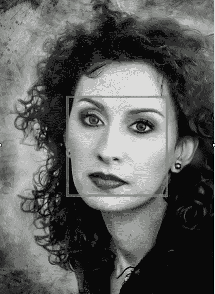
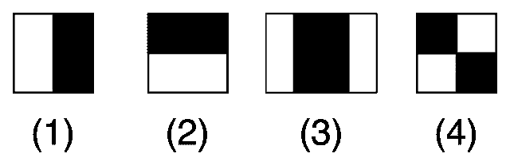
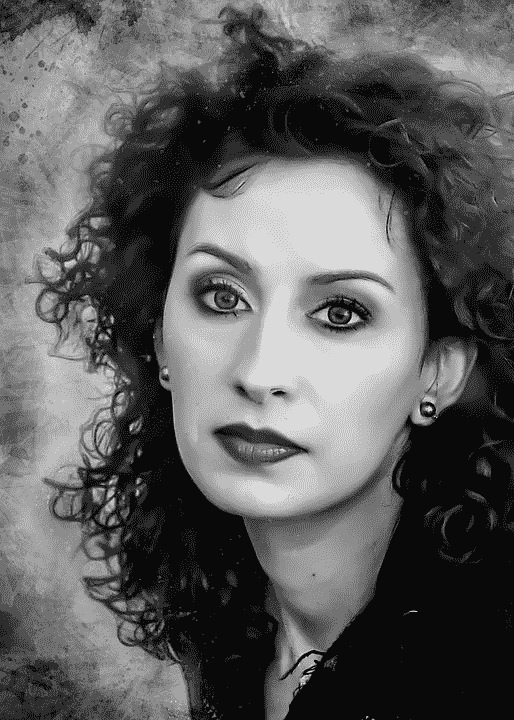
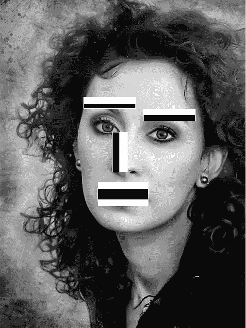
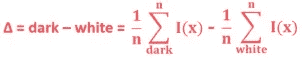
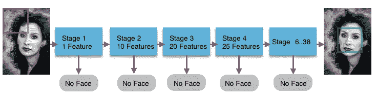

# 人脸检测中用到的 Haar 特征有哪些？

> 原文：<https://medium.com/analytics-vidhya/what-is-haar-features-used-in-face-detection-a7e531c8332b?source=collection_archive---------2----------------------->

基于哈尔特征的人脸检测

人脸识别是指识别人，人脸验证是指验证声称的人(通过在某个数据库中进行匹配)。它的应用遍及各个领域，如学校、学院、组织、工厂、公共场所、监控等。这些技术正在全球范围内获得动力，并随着人类情感识别而延伸，其应用是巨大的。

人脸识别的关键是检测人脸的相关特征，如眼睛、眉毛、鼻子、嘴唇等。那么我们如何实时/在图像中检测这些特征呢？答案是**哈尔小波或者哈尔特征**。所使用的算法被称为 Viola-Jones 算法。在这篇文章中，我们将试图了解什么是 Haar 特征，以及它们如何用于人脸检测。

哈尔特征是阿尔弗雷德·哈尔在 1909 年提出的一系列重新标度的方形函数。它们类似于卷积神经网络课程中讲授的卷积核。我们将把这些 haar 特征应用到人脸的所有相关部分，从而检测出人脸。

哈尔特征的例子:方形内核。[来源](https://upload.wikimedia.org/wikipedia/commons/thumb/3/31/VJ_featureTypes.svg/640px-VJ_featureTypes.svg.png)

如上图所示，有边要素(1 和 2)，线要素(3)。它们是黑白像素图像(值 0 或值 1)。但是通常我们有灰度/彩色图像(像素值范围从 0 到 255)。现在假设我们有黑白图像的理想场景。

目标图像。[来源](https://pixabay.com/photos/woman-portrait-face-girl-beauty-3834641/)

为了检测眉毛，我们将使用 Haar 特征(图像(1))，因为前额和眉毛形成像图像一样的较亮像素-较暗像素。类似地，为了检测嘴唇，我们使用具有更亮-更暗-更亮像素的类似 Haar 的特征(图像(3))。为了检测鼻子，我们可以使用来自(图像(1))的更暗-更亮的类似 Harr 的特征。诸如此类。

应用于人脸相关部分的哈尔特征

让我们看看一些需要的计算。

对于黑白图像(参见下面的第一个方框)，像素值为 0 或 1 *(理想情况)*，但在实际情况下，我们有标准化的灰度图像，如包含像素值的底部方框所示。

像素值:理想情况下的 0 和 1(顶部方框)，真实情况下的归一化灰度值(底部方框)

根据 Viola-Jonas 算法，为了检测图像中存在的 Haar 类特征，下面的公式应该给出更接近 1 的结果。该值越接近 1，图像中检测 Haar 特征的变化越大。

理想情况:Delta =(1/8)*(8)——(1/8)* 0 = 1

真实案例:Delta =(1/8)*(5.9)-(1/8)*(1.3)= 0.575

*(对于灰度图像，假设我们已经将黑白阈值设置为 0.3。意味着像素值小于或等于 0.3 被认为是白色，任何大于 0.3 的像素被认为是黑色)*

我们可以定义另一个阈值参数来检测边缘或 Haar 特征。我们称之为德尔塔*(这不同于白暗阈值)*。假设我们已经将阈值设置为 0.5。任何大于 0.5 的 delta 值都会检测到 Haar 特征。以这种方式，我们可以在给定的图像上应用、获取和检测最相关的特征，如眉毛、嘴唇、鼻子等。

接下来我们将快速了解什么是**哈尔级联分类器**

它们是一系列分类器或特征(正如我们在上面看到的),用于识别图像中的对象。使用滑动窗口和 haar 特征的数量(随着级数的增加而增加)，最终导致检测人脸与否。为 Viola Jonas 方法定义了总共 38 个阶段。根据滑动窗口的大小和人脸的位置、特征的数量，可以在某一阶段检测到人脸。

哈尔级联分类器方法

希望你在理解人脸检测中使用的 Haar 特征时有一些直觉。我已经尽力简化了术语。如果你有任何问题，请发表评论。我很乐意回答。

感谢您阅读文章。