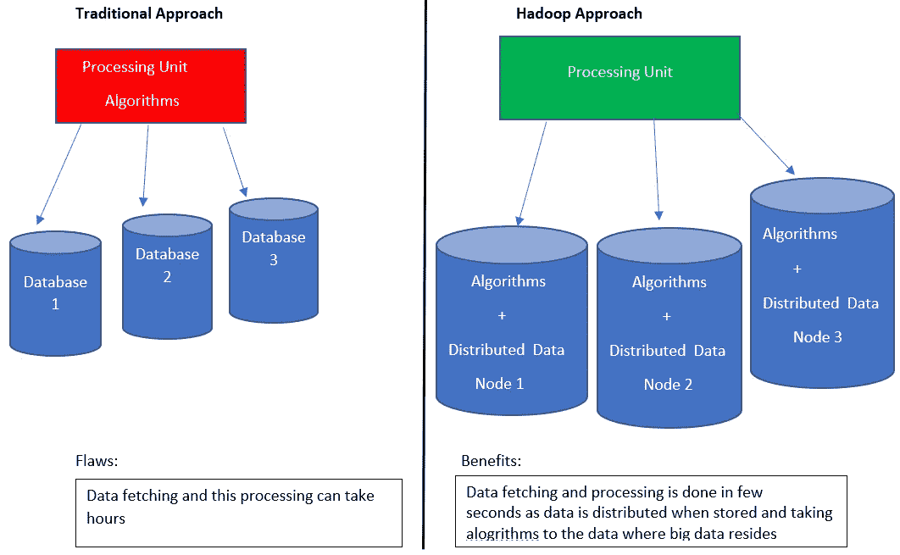
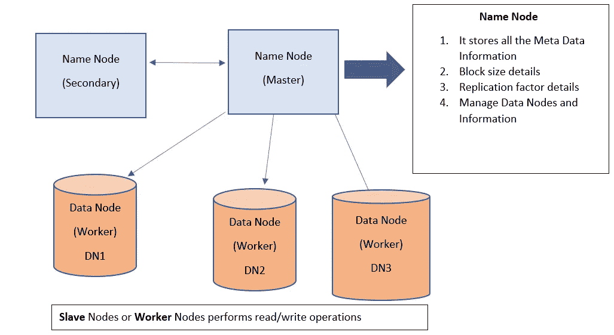

# 什么是 hadoop，我们为什么使用它？？

> 原文：<https://medium.com/analytics-vidhya/what-is-hadoop-and-why-we-use-it-bf528441aed3?source=collection_archive---------25----------------------->

任何时候，你一定听说过这个流行的词“ **Hadoop** ”，想要了解更多，但你最终会阅读大量复杂的术语，这让它听起来很无聊。

## 不要担心，我将在本文中向您介绍 hadoop 及其框架。

## **等等，在进入 hadoop 之前，我们为什么不理解它为什么出名！！**

在 hadoop 发明之前，许多组织都面临着**存储**和**处理**大数据的挑战。早在 2005 年， **Doug Cutting** 和 **Mike Cafarella** 创造了 **hadoop。**那么到底是什么， **Hadoop** 就是 **Apache** 框架，用来解决大数据的存储和处理问题。它能够处理各种数据(结构化、半结构化或非结构化)。

对于公司来说，这是一个实施 hadoop 的绝佳机会，因为它通过提供对大型数据集的分析来提供帮助。它类似于 OLAP(在线分析处理)

**" *大型社交媒体和科技巨头认为，如果将处理算法放在存储数据的地方会更好* "**

Hadoop 的需求

## 事实:在谷歌上搜索数据只需要 0.52 秒甚至更短的时间

Hadoop 的两个主要组件是 **HDFS** ( Hadoop 分布式文件系统)和**Hadoop MapReduce:**MapReduce 是一个编程模型&框架，能够并行处理大型数据集。

Hadoop 架构

Hadoop 架构通常也称为**集群**，它由名称节点&数据节点组成。该群集有一个名称节点和多个数据节点。可以根据需要添加数据节点。这种**可扩展性**特性也是优于传统系统的优势。

**簇大小**是每个数据节点上数据存储大小的总和。例如，如果您的群集有 5 个 5 Tb 的数据节点，群集大小将为 25 TB。

**块大小**很重要，因为它定义了要分配给大型数据集的每个块的数量。例如，如果您的块大小= 64 MB，并且您想要跨 5 个数据节点存储 300MB 的数据集，则该数据集将被划分为 64 MB 的块，以存储在数据节点上。

复制因子非常非常重要，因为它提供了容错的重要特性。此复制因子表示跨节点复制数据的次数。默认情况下，其值为 3。如果我们需要更改它的值，我们可以在 hdfs-site.xml 中添加新值。

# 【map-reduce 如何工作？？

Hadoop map-reduce 将工作分成许多任务。在大数据集上使用 map-reduce 实现存储的并行处理和分布。这两类任务主要在集群上运行。它们按顺序工作，即首先执行地图任务，然后执行缩减任务。

# 1。 **地图任务**(拆分&地图)

> **这也称为映射器类。这是数据处理的开始阶段，它获取输入数据并将其拆分为每个记录，然后将其映射为键-值对。**

# 2.**减少任务**(洗牌，减少)

> **这也被称为减速器类。它从映射器类获取输出，然后减少它(减少它意味着它将聚集并生成一个单一输出)**

地图简化工作

上图详细展示了 map-reduce 的工作原理。集群的名称节点不仅跟踪作业，还寻找集群的资源管理。主节点正在做大量的工作。在 Hadoop 2+版本中，引入了 YARN。

**我希望这篇文章能帮助你了解 Hadoop 及其架构。请在评论中提供反馈**