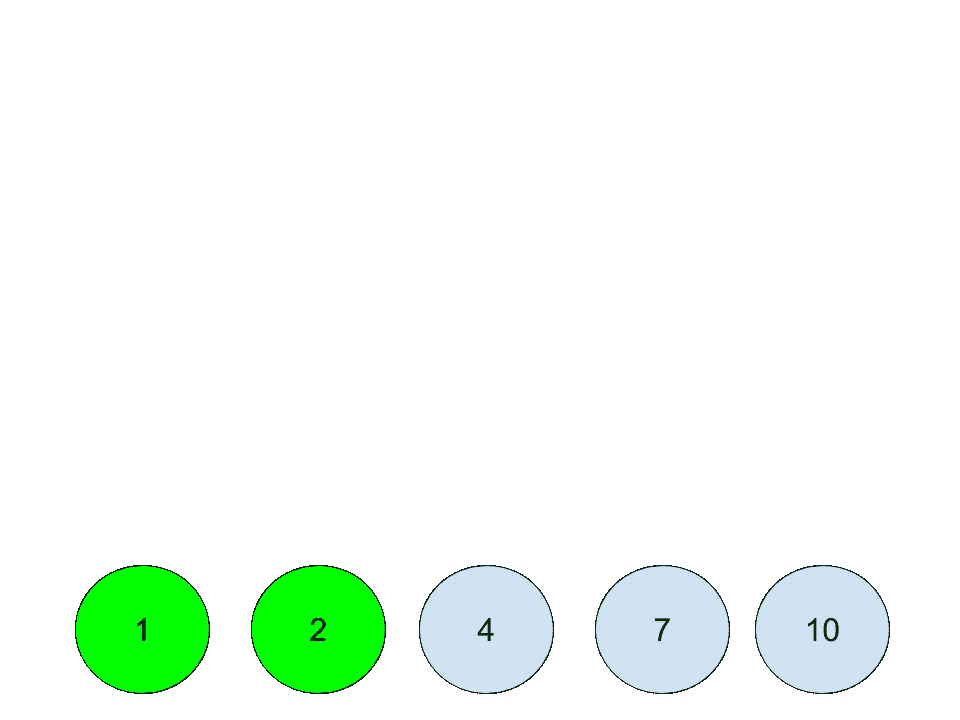
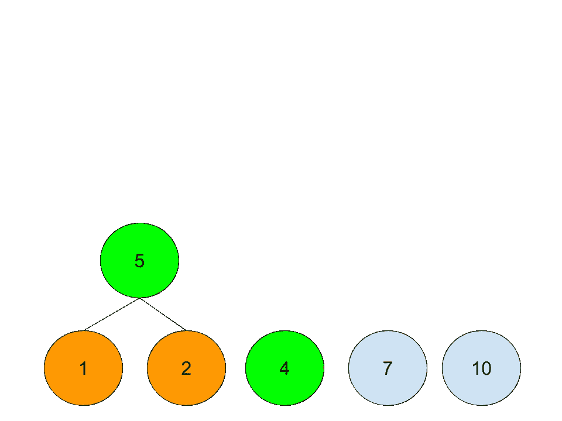
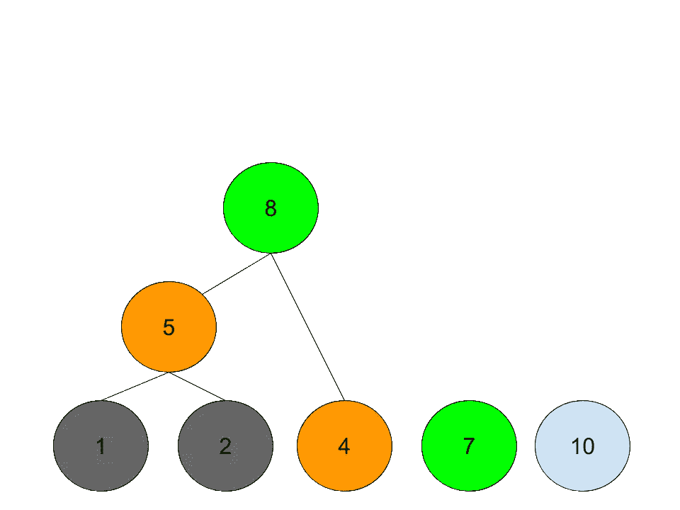
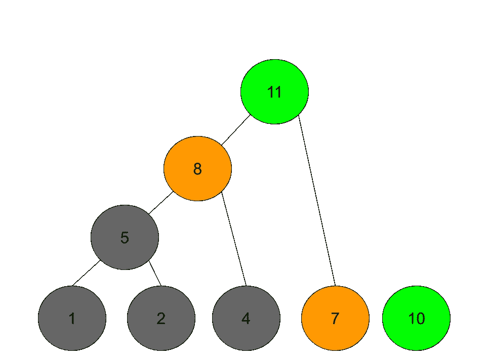
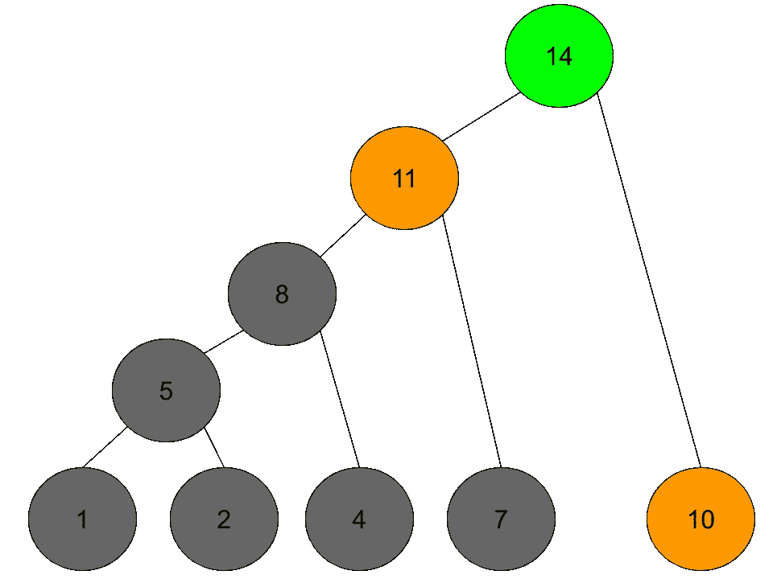
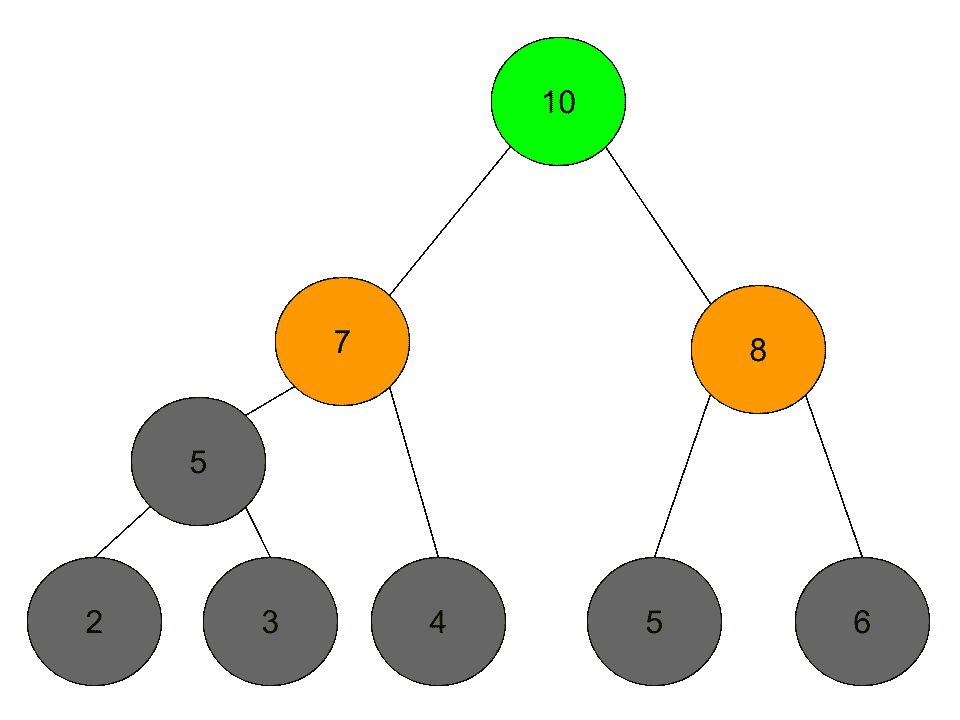
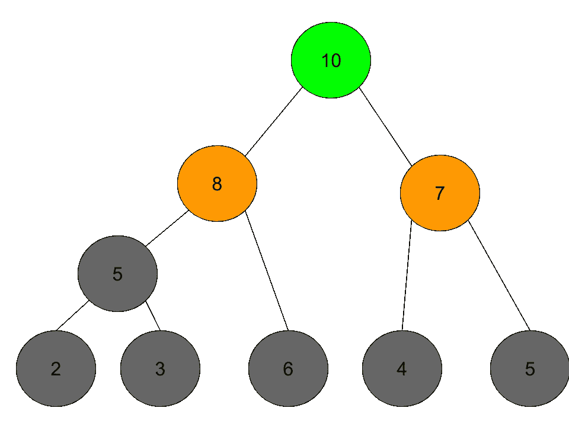

# 什么是霍夫曼编码？

> 原文：<https://medium.com/analytics-vidhya/what-is-huffman-coding-ea36379da63e?source=collection_archive---------6----------------------->

霍夫曼码是一种特殊类型的最佳前缀码，通常用于无损数据压缩。这是来自维基百科的定义。霍夫曼对电信专业人士很感兴趣，因为这种编码方法可以大大提高编码效率。对于计算机科学家或程序员来说，这很有趣，因为它使用了贪婪算法和优先级队列数据结构。贪婪算法是一种重要的算法，优先级队列是一种重要的数据结构。

如果你觉得你没有完全理解霍夫曼编码过程，这里有两个很好的视频可以观看。

[https://youtu.be/fPthQE7Li8M](https://youtu.be/fPthQE7Li8M)

看完这两个视频，我想你已经完全理解了霍夫曼编码算法。对于所有的贪婪算法，至少在实践过程中，我们总要问一个问题:如何证明？

非正式的证明可以在这里找到:

[](https://www.quora.com/How-do-we-prove-that-the-Huffman-coding-algorithm-is-optimal) [## 我们如何证明霍夫曼编码算法是最优的？

### 答案(2 之 1):霍夫曼码是最佳的，因为:1。它减少了来自终端的未使用码字的数量。

www.quora.com](https://www.quora.com/How-do-we-prove-that-the-Huffman-coding-algorithm-is-optimal) 

正式的证明可以在这里找到:

两点如果能有更深入的了解会有帮助。从

1.  **“在最佳代码中，出现频率较高(出现概率较高)的符号将比出现频率较低的符号具有更短的码字。”**
2.  **“在最佳码中，出现频率最低的两个符号将具有相同的长度。”**

至此，你可能对霍夫曼编码有了更好的理解。现在，让我们做一些练习。问题是 1199。从 leetcode 构建块的最短时间。

[](https://leetcode.com/problems/minimum-time-to-build-blocks/) [## 帐户登录- LeetCode

### 提高你的编码技能，迅速找到工作。这是扩展你的知识和做好准备的最好地方…

leetcode.com](https://leetcode.com/problems/minimum-time-to-build-blocks/) 

这是一个难题。然而，这个问题将完全遵循霍夫曼编码方法。如果你觉得把问题转化成霍夫曼问题有困难，这意味着你还需要更多的努力来理解霍夫曼代码。对于这个问题，我们可以看到，如果一个块需要更多的时间来构建，那么覆盖该块的分支将有更少的工人。同时，在建造昂贵的街区期间，我们可以有一些时间来分割更多的工人。这完全可以遵循霍夫曼编码方法。

我们可以通过一个例子来分析这个问题:分割成本为 3 的 blocks [1，2，4，7，10]。

我们有几个步骤，这些步骤如下所示。



图 1:步骤 1:对块进行排序，并将最上面的两个最小的节点涂成绿色。



图 2:第二步:通过合并前面两个最小的节点+分割成本，生成一个父节点。两个新的最小节点将以绿色显示。



图 3:步骤 3:重复步骤 2。浏览过的节点将显示为绿色，最近浏览过的节点将显示为黄色。



图 4:步骤 4



图 5:第 5 步:完成。

看看这些步骤，从步骤 5 开始，如果我们从根节点到叶节点，我们将清楚整个过程:第一层:将一个工人分成 2 个，一个为具有 10 个时间单位的块工作，一个为具有 11 个成本的节点工作。然后，对于为区块 11 工作的工人，它被进一步分成两个工人，一个为区块 7 工作，另一个为区块 8 工作。…它完全遵循霍夫曼编码过程，对吗？唯一稍微不同的是父节点生成必须考虑分裂成本。

让我们构建另一个示例，使其结构类似于此处视频中显示的示例。

Blocks = [2，3，4，5，6]，拆分成本为 2。图 6 中只显示了最终的最优树。此示例还显示了问题描述的场景“请注意，如果两个工人同时拆分，他们将并行拆分，因此成本将被拆分”。从图 6 中，我们可以看到它的结构与上面给出的视频相似。



图 6:第二个例子的最后一步:Blocks = [2，3，4，5，6]，拆分成本为 2。在本例中，在生成 2 和 3 的父节点后，我们有两个 5 可供选择。在这个例子中，我们首先考虑 2 和 3 的父代 5。



图 7:第二个例子的最后一步:Blocks = [2，3，4，5，6]，拆分成本为 2。在本例中，在生成 2 和 3 的父节点后，我们有两个 5 可供选择。在这个例子中，我们首先考虑作为叶节点的 5。

如果理解了 Huffman 编码部分，代码就简单了(我假设读者熟悉 heap。如果没有，我强烈建议读者先找一些教程来理解 heap。如果 heap 适合您，那么代码可以很简单)。解决方案就在这里:

```
class Solution:
    def minBuildTime(self, blocks: List[int], split: int) -> int:
        heapq.heapify(blocks)
        while True:
            if len(blocks)==1:return blocks[0]
            a, b = heapq.heappop(blocks), heapq.heappop(blocks)
            heapq.heappush(blocks, b+split) # as b is great or eqaul to a, so no need to max(a,b) + split
```

感谢阅读。