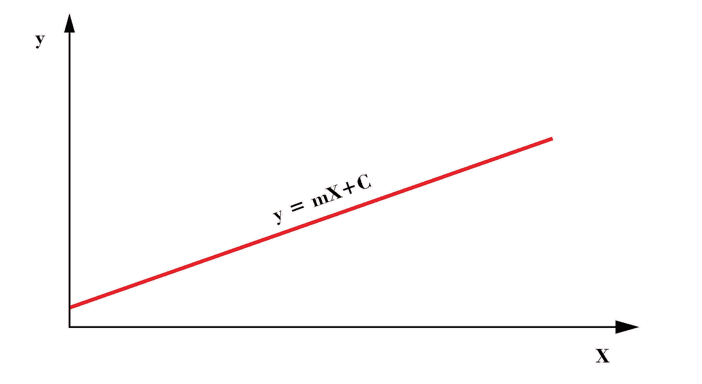
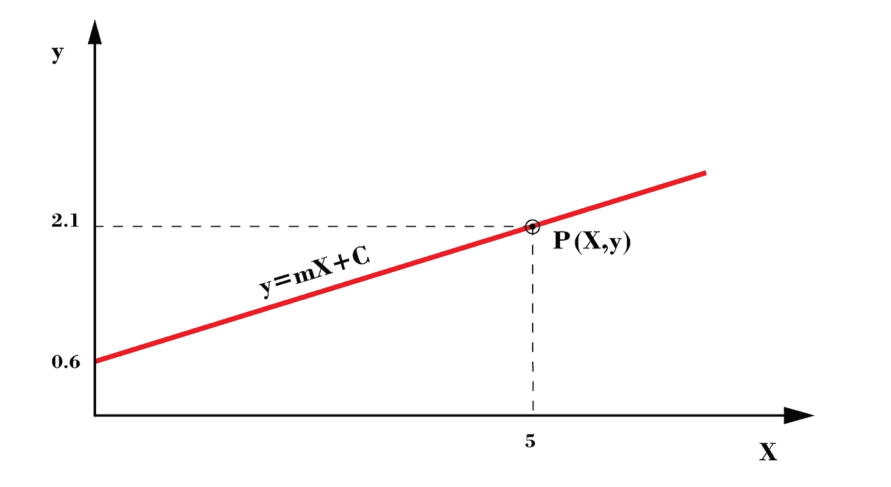
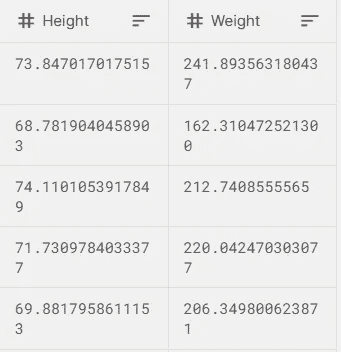

# 什么是线性回归？

> 原文：<https://medium.com/analytics-vidhya/what-is-linear-regression-923e4da5c078?source=collection_archive---------17----------------------->

线性回归的基本理论理解。

图片提供:[拉吉塔纳瓦德](https://medium.com/u/589690012fe9?source=post_page-----923e4da5c078--------------------------------)，【https://www.behance.net/rajtanawade】T2

*(秘密:这是从统计学中偷(借)来的技术)*

在当前快速发展的世界中，许多技术正受到关注。因此，许多人开始学习最新的技术来提高他们的技能，当然也是为了保住他们的工作。

机器学习是全世界发展最快的技术，显然是因为它能够让我们的日常生活变得更加轻松。

现在让我们进入这篇文章的主要目标。

概括地说，我们在机器学习中解决两种类型的问题:

1.  **分类** -用于预测离散变量。例如，评论是正面的还是负面的
2.  **回归** -用于预测一个连续的实变量。例如预测股票价格

这里我们将讨论回归问题，即我们将看到机器学习如何帮助预测一个实值变量。目前有许多算法可用于完成这项工作。线性回归就是其中之一，也是最基本的一种。所以，让我们深入研究一下…

> **线性回归**

顾名思义，这是一种使用 [*线性*](https://en.wikipedia.org/wiki/Linearity) 方法来预测真实值的算法，真实值可以是股票价格、房价或其他由真实值表示的东西。

所以，

> 在统计学中， [**线性回归**](https://en.wikipedia.org/wiki/Linear_regression) 是对标量响应(或因变量)与一个或多个解释变量(或自变量)之间的关系进行建模的线性方法

这就是维基百科对线性回归的定义。

简单来说，如果有两个变量 **X** 和 **y** ，我们可以用线性回归找出 **X** 和 **y** 之间的关系。但是线性回归是如何实现这个任务的呢？

**y = mX + c**

以上是直线方程，这就是线性回归通过找出 **' *m'*** 和 **' *c'*** 的最佳值来完成对 **X** 和 **y** 之间关系建模的任务。在这里，我们试图根据 **X** 的值找出 **y** 的值。

例如给定 **X = 5** ， **m=0.3** ， **c** **= 0.6** 求 **y** 的值。

所以我们可以计算出单点 **X** 的值 **y** 如下，

**y = 0.3 * 5 + 0.6**

**y = 2.1**

图片提供:[拉吉塔纳瓦德](https://medium.com/u/589690012fe9?source=post_page-----923e4da5c078--------------------------------)，[https://www.behance.net/rajtanawade](https://www.behance.net/rajtanawade)

这是通过使用单点 **X** 的直线方程计算出的 **y** 的值。当有多个 **X** 点和对应的多个 **y** 点需要计算时，通过线性回归算法进行计算。

但是你一定在想，在有很多 **X** 点的情况下，我们怎么知道 **m** 和 **c** 的值呢？嗯，这就是机器学习的用武之地……我指的是线性回归模型，它概括了 **m** 和 **c** 的值，以便找到所有 **X** 点的 **y** 的值。

因此，基本上，当我们有许多 **X** 点时，我们将这些点提供给线性回归算法，它会给出系数 **m** 和 **c** 的广义值。此外，这些系数可用于预测我们未来提供的任何点 **X** 的 **y** 的值。

例如，查看下表，

在这里找到完整的数据集:[https://www . ka ggle . com/sonalisingh 1411/genderheightwightcsv #](https://www.kaggle.com/sonalisingh1411/genderheightweightcsv#)

这里， **X =身高**和 **y =体重**我们将这些数据提供给线性回归模型，它给出了 **m** 和 **c** 的综合值，可以使用公式 **y=mX + c** 来预测任意点 **y** 的值。在上面的例子中，我们将得到系数( **m** 和 **c** )，该系数可应用于任何身高值，以预测(计算)该特定人的体重。

这是线性回归的一个非常基本的概述。在下一篇文章中，我们将看到线性回归算法实际上是如何工作的，以便找出广义系数。

感谢您阅读本文，希望您对线性回归有所了解。如果这篇文章帮助你理解了线性回归的基本原理，请与你认为会受益的人分享。

再次感谢，下一篇文章再见，我们将看到线性回归的实际工作。

Ps:如有误解，欢迎随时指出。

> 参考:

 [## 线性回归

### 在统计学中，线性回归是一种建模标量响应(或变量)之间关系的线性方法

en.wikipedia.org](https://en.wikipedia.org/wiki/Linear_regression)