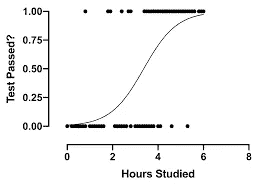

# 什么是机器学习？🤔

> 原文：<https://medium.com/analytics-vidhya/what-is-machine-learning-3977a3b08384?source=collection_archive---------14----------------------->

这个词现在已经成为一个烫手山芋，我希望你们大多数人都听过这个词很多次，但不知道它到底是什么？所以让我们看看它是什么。

机器学习

***机器学习*** 是人工智能 **(AI)** 的子集，它为系统提供了从经验中自动学习和改进的能力，而无需显式编程。

***机器学习*** 往往是数据科学工作的重要工具，尤其是从数据中做出预测。

***机器学习*** 是统计学和计算机科学的交叉学科。

# **机器学习生命周期的 7 个步骤**

1.  收集数据—收集相关数据。
2.  数据准备—组织收集的数据
3.  数据争论—检测并消除数据中的噪音、无效数据、缺失值和重复值。
4.  数据分析——利用机器学习算法建立 ML 模型。
5.  训练模型-通过应用各种机器学习算法，使用数据集训练模型。
6.  测试模型-检查模型的准确性。
7.  部署—在真实系统中部署模型。

# 机器学习分类

1.  监督机器学习
2.  无监督机器学习
3.  强化机器学习

机器学习算法的分类

# **监督机器学习**

受监督的机器学习算法可以将它们从过去的数据中学习到的知识应用到新的数据中，使用标记的例子来预测未来的事件。

简单地说，受监督的机器学习算法由训练数据(标记的)来训练，即，它具有 x 值和相应的 y 值。该算法生成一个将 x 映射到 y 的函数，并将相同的函数应用于新数据，并预测目标值。

受监督的机器学习进一步分为两种类型

1.  回归
2.  分类

***回归:-*** 回归分析是一种预测建模技术，研究因变量和自变量之间的关系。

回归算法分类如下:

1.  线性回归
2.  多项式回归
3.  支持向量回归
4.  里脊回归
5.  套索回归

**线性回归** :-线性回归显示自变量和因变量之间的线性关系。

*   如果只有一个输入变量，那么它被称为简单线性回归。如果有一个以上的输入变量，那么它被称为多元线性回归。

线性回归

线性回归的数学方程

Y= aX+b

Y =因变量—目标值

X =独立变量

a、b 是线性系数

例如:工资预测、房地产预测等，

***多项式回归***:-对于由非线性方式的数据点组成的数据集，我们使用多项式回归。在多项式回归中，原始特征被转换成给定次数的多项式特征，然后使用线性模型进行建模。

多项式回归

多项式回归的数学表达式。

Y= b0+b1x+ b2x2+ b3x3+…..+ bnxn

Y =因变量—目标变量

x =独立变量

b0，b1，b2，b3，…，bn 是回归常数。

**支持向量回归** :-这是一种适用于连续变量的回归算法。

支持向量回归的主要目标是考虑边界线内的最大数据点，并且*超平面(最佳拟合线)*必须包含最大数量的数据点。

支持向量回归

**岭回归** :-如果自变量之间存在高度共线性，那么我们使用岭回归来降低模型的复杂性。它也被称为 **L2 正规化**。岭回归是线性回归最稳健的版本之一，其中引入了少量的偏差，以便我们可以获得更好的长期预测。添加到模型中的偏差量被称为**岭回归损失**。

岭回归的数学表达式是:

**套索回归**:——也叫 **L1 正规化**。它类似于岭回归，只是罚项只包含绝对权重，而不是权重的平方。

套索回归的数学表达式是:

**分类** :-分类是一个有监督的机器学习概念，它将数据分类成类。最常见的分类问题有— [语音识别](https://www.edureka.co/blog/speech-recognition-python/)、[人脸检测](https://www.edureka.co/blog/tensorflow-object-detection-tutorial/)、手写识别、文档分类等。,

分类算法分类如下:

1.  逻辑回归
2.  朴素贝叶斯
3.  k-最近邻
4.  决策图表
5.  随机森林

**逻辑回归** :-是机器学习中的一种分类算法，使用一个或多个自变量来确定目标值。该算法的主要目的是找到因变量和自变量之间的最佳拟合关系。

例子:天气预报等，

逻辑回归。

**朴素贝叶斯**:-这是一种基于贝叶斯定理的分类算法。朴素贝叶斯分类器假设一个类中特定特征的存在与该类中任何其他特征的存在无关。即使它们相互依赖，所有这些属性对概率的贡献也是独立的。

数学表示:

**K-最近邻** :-它被监督并获取一串被标记的点，并用它们来标记其他点。为了给新点加标签，它查看最近邻的标签，对不同种类的标签进行计数，并将标签计数为新点的最高标签。“k”是它检查的邻居数量。在下图中，当 k = 3 时，A 类计数为 1，B 类计数为 2，因此，该模型将新的点标记为 B 类(2 > 1)。

k-最近邻

**决策树回归**:-这是一个树形结构分类器，它由两个节点组成，分别叫做决策节点和叶子节点。决策节点用于做出决策，具有多个分支，这些分支代表决策规则，而叶节点是输出节点，不包含任何进一步的分支。

*   ****

决策图表

**随机森林回归** :-由于森林由许多树组成，随机森林包含许多决策树。树的数量越多，精确度越高，并且防止了过度拟合的问题。

随机森林

机器学习类型

这是关于机器学习和监督机器学习的介绍。让我们在我的下一篇文章中看看什么是无监督机器学习和强化机器学习。

感谢读者阅读整篇文章，这是我的第一篇文章，所以我请求大家在评论区给我反馈，帮助我改进。谢谢你。😊😊😊😊😊