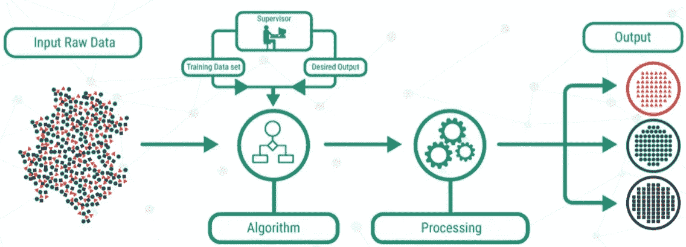
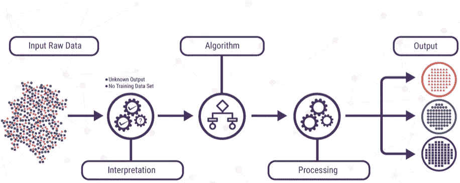
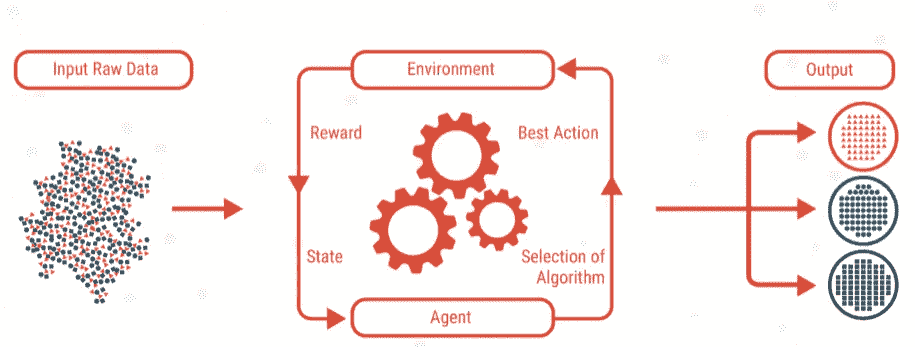
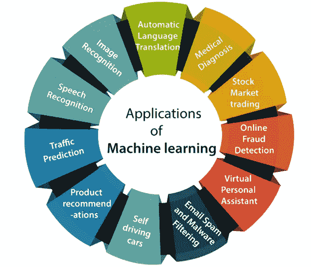

# 什么是机器学习？

> 原文：<https://medium.com/analytics-vidhya/what-is-machine-learning-446d570cadab?source=collection_archive---------20----------------------->

让我们看看什么是机器学习，它是如何工作的...

# **什么是机器学习？**

M 机器学习是对通过经验自动改进的计算机算法的研究。这是一个教计算机系统如何在输入数据时做出准确预测的过程。它被视为人工智能(AI)的一个子集。

简单地说，机器学习是人工智能的一个应用。它允许软件应用程序在预测结果时变得更加准确，而无需显式编程。通过使用机器学习算法，我们可以预测世界上的许多事情，因为机器学习算法使用历史数据作为输入来预测新的输出值。

# 人工智能和机器学习有什么不同？

人工智能(AI)系统通常至少会展示其中一些特征。它们是计划、学习、推理、解决问题、知识表达、感知、运动和操作，以及在较小程度上的社会智力和创造力。另一方面，机器学习(ML)，还有各种其他方法用于构建人工智能系统，包括进化计算，其中算法在各代之间进行随机突变和组合，以试图“进化”最佳解决方案，以及专家系统，其中计算机被编程有规则，允许它们模仿特定领域人类专家的行为，例如驾驶飞机的自动驾驶系统[1]。

# 机器学习的类型

通常机器学习分为四种类型。它根据算法如何学习变得更准确来分类。这些类型是，

1.  **监督学习**
2.  **无监督学习**
3.  **半监督学习**
4.  **强化学习**

数据科学家选择使用的算法类型取决于他们想要预测的数据类型。

# 什么是监督学习？

监督学习是指模型在有标签的数据集上接受训练。**标记为**的数据集是既有输入参数又有输出参数的数据集。对于监督学习的训练，系统暴露于大量的标记数据。数据科学家为算法提供带标签的训练数据，并定义他们希望算法评估相关性的变量。算法的输入和输出都是指定的。

监督学习

## 监督机器学习如何工作

有监督的机器学习需要用标记的输入和期望的输出来训练算法。监督学习算法适用于以下任务，

*   **二元分类—** 将数据分为两类。
*   **多类分类—** 在两种以上的答案中进行选择。
*   **回归建模—** 预测连续值。
*   **集成—** 将多个机器学习模型的预测结合起来，产生一个准确的预测。

# 什么是无监督学习？

在无监督学习中，用于从由输入数据组成的数据集(无标记响应)中进行推断的算法。在这里，我们采用算法来识别数据中的模式，试图找出将数据分成不同类别的相似之处。

无监督学习

## 无监督机器学习如何工作

无监督的机器学习算法不需要对数据进行标记。他们筛选未标记的数据，寻找可用于将数据点分组为子集的模式。

大多数类型的深度学习，包括神经网络，都是无监督的算法。无监督学习算法适用于以下任务:

*   **聚类—** 根据数据的相似性将数据集分成不同的组。
*   **异常检测—** 识别数据集中的异常数据点。
*   **关联挖掘—** 识别数据集中频繁出现的项目集。
*   **降维—** 减少数据集中变量的数量。

# 什么是半监督学习？

在半监督学习中，包含了前两种类型的混合。该技术依赖于使用少量标记数据和大量未标记数据来训练系统。标记的数据用于部分训练机器学习模型，然后部分训练的模型用于标记未标记的数据，这一过程称为伪标记。然后在标记和伪标记数据的结果混合上训练该模型。

## 半监督学习如何工作

半监督学习的工作原理是将少量的 [l](https://searchenterpriseai.techtarget.com/feature/Labeled-data-brings-machine-learning-applications-to-life) 带标签的训练数据输入到算法中。当算法在标记数据集上训练时，它们的性能通常会提高。半监督学习在监督学习的性能和非监督学习的效率之间找到了一个中间点。使用半监督学习的一些领域包括:

*   **机器翻译—** 教算法翻译基于非完整词典的语言。
*   **欺诈检测—** 在只有少量正面案例时识别欺诈案例。
*   **标记数据—** 在小数据集上训练算法可以学习自动将数据标签应用到更大的数据集。

# 什么是强化学习？

这不像无监督和有监督的机器学习，强化学习不依赖于静态数据集。它在动态环境中运作，并从收集的经验中学习。数据点或经验是在训练期间通过环境和软件代理之间的试错交互来收集的。强化学习的这一方面很重要，因为它减少了训练前对数据收集、预处理和标记的需要，否则在监督和非监督学习中是必要的。

强化学习

## 强化学习如何工作

强化学习的工作原理是编写一个算法，该算法有一个明确的目标和一套实现该目标的规定规则。强化学习通常用于以下领域，

*   **机器人技术—** 机器人可以使用这种技术学习在现实世界中执行任务。
*   **视频游戏——**强化学习已经被用来教机器人玩一些视频游戏。
*   **资源管理—** 给定有限的资源和明确的目标。

# 机器学习的用途

今天，我们在日常生活中大多数时候都在使用机器学习，甚至在不知不觉中。如谷歌地图、谷歌助手、Alexa、Siri 等。而且每天都在快速增长。

机器学习的最具趋势的现实世界应用

机器学习可以帮助企业更深层次地了解客户。通过收集客户数据并将其与一段时间内的行为相关联，机器学习算法可以学习关联，并帮助团队根据客户需求定制产品开发和营销计划。像明智的，大多数时候它更容易我们的工作。

# 结论

在这篇文章中，我只是简单介绍了机器学习。我们可以使用机器学习来预测数据，这对我们来说是非常有用的技术。

因此，在未来，我希望与您讨论更多关于机器学习以及如何利用机器学习进行预测的问题。

感谢您通读这篇文章，如果您觉得有帮助，请随意留下一些掌声。

# 参考

[1]北达科他州希思，2020 年。*什么是机器学习？你需要知道的一切| Zdnet* 。[在线] ZDNet。可在:<https://www . zdnet . com/article/what-is-machine-learning-everything-you-need-to-know/>【2020 年 12 月 2 日访问】。

[2] SearchEnterpriseAI。2020.*什么是机器学习(ML)？*。[在线]请访问:<https://search enterprise ai . tech target . com/definition/machine-learning-ML>【2020 年 12 月 2 日访问】。