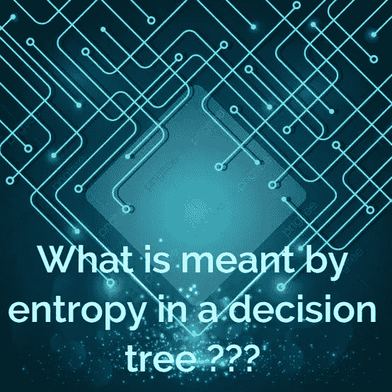
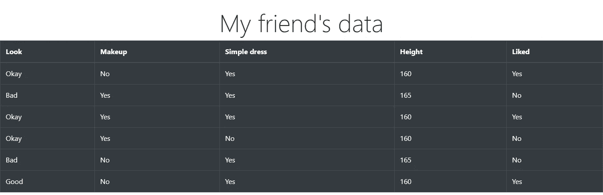
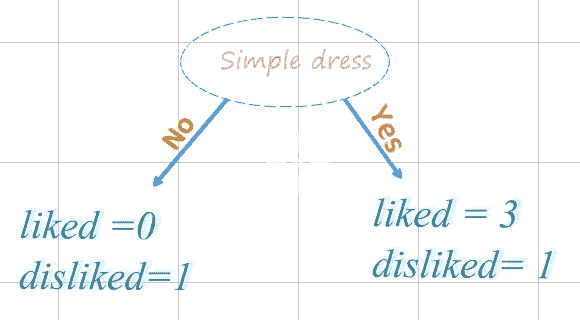
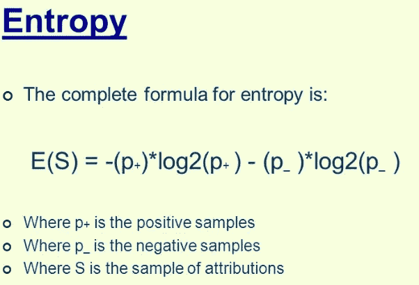

# 决策树中熵的含义是什么？？

> 原文：<https://medium.com/analytics-vidhya/what-is-meant-by-entropy-in-a-decision-tree-8078e8b795c2?source=collection_archive---------15----------------------->

这篇文章会让你理解熵在决策树中的应用。让我们开始吧…

> *高熵的真实例子。乱七八糟的房间……*

你的房间熵是多少？？

## 熵是什么？？

通俗地说，熵只是随机性的一种度量。我们总想把随机性降到最低，因为随机性多了会有很多不确定性。

> ***用有趣的例子解释...***

我朋友关于他喜欢的女孩的数据

这是我收集的关于我朋友喜欢的女孩的数据。这是我使用的四个特征。

**Look** :有三种类型(不好，还好，好)这描述的是她对他的样子，而不是对别人的。

**化妆**:她是否使用 make 是一个布尔属性

**简单的衣服**:她是否穿简单的衣服是一个布尔属性

身高:以厘米为单位，她有多高。

利用上述数据，我们应该做些什么？？？

我们的目标是利用任何一个特征，预测他会不会喜欢一个女生。让我们用**简单的服装**作为特色。

关于树的决策的数据流图

一个分裂的总熵是它的右节点和左节点的熵之和；

## 分裂的熵公式

熵的公式。

**公式描述:**

S =熵，P+(喜欢的概率)，(p-)不喜欢的概率

左的**熵=-(0)* log2(0)-(1/1)* log2(1)**等于**零。**这个条件是纯节点或者叶节点。以上条件就是我们想要的。

右的熵=-(2/5)* log2(2/5)-(3/5)* log2(3/5)等于 0.962 不算好。

要点

1.  我们总是希望熵越小越好。
2.  具有低熵的属性具有比其他属性更高的优先级。这也将具有更高的信息增益

在评论中写下，你会选择哪个特征来决定你的朋友是否会喜欢一个女孩。