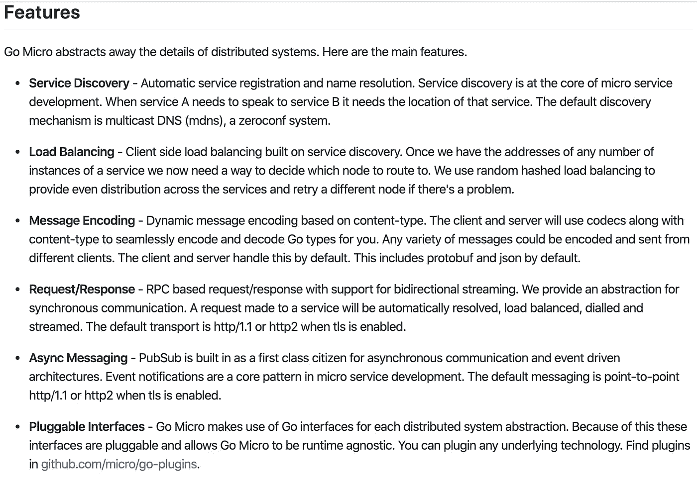

# 什么是微服务架构？使用 go-micro 在 Golang 中实现微服务

> 原文：<https://medium.com/analytics-vidhya/what-is-microservices-architecture-implementation-of-a-microservice-in-golang-using-go-micro-772578b37756?source=collection_archive---------16----------------------->

# 介绍

*   它是面向服务架构(或 SOA)的一种变体。
*   面向服务的架构(SOA)是一种架构方法，其中应用程序利用网络中可用的服务。在这种架构中，通过互联网上的通信呼叫，提供服务以形成应用。
*   因此，我们可以将 SOA 视为客户端-服务器架构的通用版本，其中服务器可以服务于来自任何客户端而不是特定客户端的请求，就像典型的客户端-服务器架构一样。
*   遵循 Unix 哲学*“做一件事，把它做好”*。
*   微服务架构的目的是使系统解耦，更加模块化。系统的不同组件是松散耦合的。这个想法是为了实现“关注点分离”。

**现在让我们来谈谈微服务架构的优缺点。**

## 优势

1.  由于系统被分解成几个独立的服务，因此每个组件都可以单独扩展和固定。这样水平缩放变得容易多了！
2.  每个组件都是相互独立的语言和设计。因此，系统可以是多语言的，我们可以选择语言或工具，以最好的方式服务于特定组件的目的。例如，假设我正在构建一个需要高度并发的软件，它还需要实现一些机器学习算法。在整体架构中，由于整个代码库通常是用一种语言编写的，在这种情况下，让这种语言是 Python，那么我们可以实现一个非常好的机器学习算法的实现，但却无法使用一个非常好的框架来编写高度并发的 web 服务器。如果我们能够用支持高并发性的语言(如 golang)和 python 中的机器学习部分来编写 web 服务器就更好了，因为它有非常好的库。幸运的是，微服务架构让你实现了这一点，因为机器学习部分和 web 服务器部分可以被制成微服务，它们可以通过网络调用(通常)相互通信，因此相互独立。
3.  每个服务的规模越小，理解系统就越容易。在一个整体架构中，系统的整个逻辑同时存在，理解一个特定的部分变得很困难。例如，假设脸书有单体建筑。如果我想了解脸书是如何处理用户注册过程的，那么我将不得不浏览数百万行代码来理解注册是如何工作的。但是，如果脸书有微服务架构，用户注册的是完全不同的服务，那么我可以直接访问该服务并了解其工作流程。随着软件规模的增长和新员工不断加入组织，这个概念变得非常重要。
4.  它允许连续交付，因为系统现在是松散耦合的(每个服务相互独立)。
    对于 eg，假设我的软件有两个部分，注册和签到。如果我的注册工作已经完成，而登录还没有完成，我可以单独部署注册，而不是等待登录完成！
5.  成本优化可以通过只缩放那些需要缩放的部分来实现。
    举个例子，假设我正在开发一个音乐流媒体服务，目前有很多用户注册，但实际上并没有很多人在听音乐。然后，我可以扩大用户注册微服务，而不是流媒体服务，因此成本降低。

## 不足之处

1.  难测试:由于系统现在分为多个部分，现在为了测试整个系统，每个部分(微服务)都需要单独测试。
2.  问题倍增:假设整个系统有 **n** 个问题，现在它被分成 **m** 个微服务，所以现在我们有 **n*m** 个问题！
3.  安全性降低:每个微服务都有自己的通信接口，因此通信接口的数量增加了，攻击的面积也增加了！
4.  依赖关系的数量增加。
5.  维护变得复杂。
6.  微服务之间的大多数通信都是通过网络进行的，因此延迟增加了。
7.  一些消息可能会丢失，导致可靠性降低。(这在很大程度上可以通过在 Kafka、Rabbit MQ 等服务之间使用消息队列来解决)

## 典型结构

微服务由三个主要组件组成:

|通信| -> |处理| -> |存储|

1.  通信主要以 HTTP API 或 gRPC 端点的形式实现。它用于接收请求和响应。
2.  处理是微服务的核心逻辑，处理请求并生成响应。
3.  存储是可选的，但是如果微服务需要持久存储，那么它需要有一个单独的数据库。

## 现在让我们实现一个简单的微服务，它将两个参数作为参数，将它们相加并返回结果。我们将使用 golang 中的 go-micro 框架来完成这项工作。

首先，为什么要写一个微服务？
1。语法和 Python 一样简单，但是由于类型安全、垃圾收集、没有花哨的技巧，产生的软件非常可靠！
2。它为几乎所有可能的平台生成静态二进制。你可以在 Mac 中编写代码，为 Linux、windows 等创建二进制文件。另外，单个二进制可执行文件允许创建小至 5 MB 的容器，这大大减少了引导时间。
3。对搭建微服务有很大的支持。事实上，据许多人说，它得到了最好的支持。诸如 go-micro、go-kit、gizmo 等框架使之变得轻而易举！
4。太快了！

我们选择 [go-micro](https://github.com/micro/go-micro) 框架是因为它抽象了许多分布式系统的复杂性，并且几乎可以直接开箱即用！一定要看看它的特点。

去微

请克隆[此](https://github.com/souvikhaldar/golang-microservice-example)存储库，并在以下步骤中引用它。

# 先决条件

1.  安装协议生成微`go get github.com/micro/protoc-gen-micro`
2.  安装 Go 对协议缓冲区的支持`go get -u github.com/golang/protobuf/protoc-gen-go`
3.  [安装协议缓冲编译器](https://github.com/protocolbuffers/protobuf)

# 编写自己的微服务的步骤

1.  在 protobuf 中编写 API 文档，如`sum/sum.proto`所示
2.  使用`protoc --proto_path=$GOPATH/src:. --micro_out=. --go_out=. sum.proto`编译它。
3.  通过实现在生成的 go 文件中可以看到的`Adder`接口来实现服务器。在 server.go 中)和客户端(看 impl。在 client.go 中)

# 如何运行这个示例

打开两个终端，首先在一个终端运行服务器，然后在另一个终端运行客户端。你完了！

这绝对是一个非常简单的服务，但我希望它能帮助您起步。我在一次聚会上讲过这个，你可以在这里分别找到[幻灯片](https://docs.google.com/presentation/d/1XPZp-ZeiGtQiypJkqyYBfkdvvUWPtKPQQ2p5cm8vkGo/edit?usp=sharing)和[视频演示](https://youtu.be/U7mKebOVoNY)。如果需要更多信息，请在推特上联系我。

*原载于 2019 年 12 月 4 日*[*http://souvikhaldar . info*](http://souvikhaldar.info/programming/py_micro/)*。*