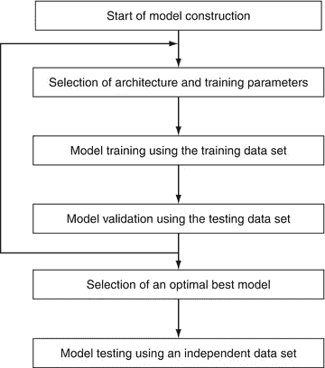
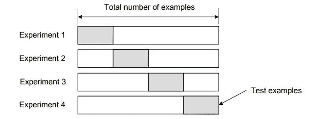
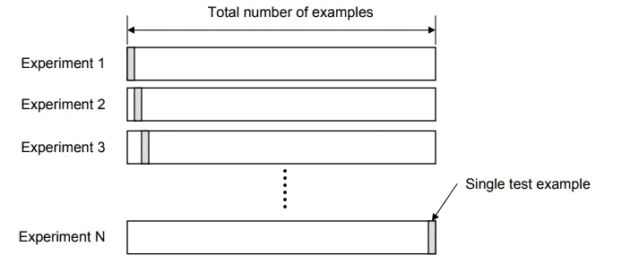
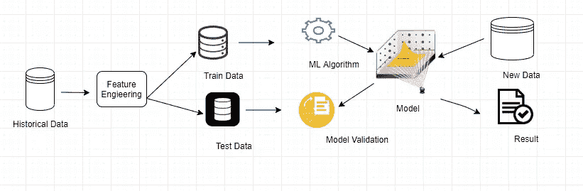
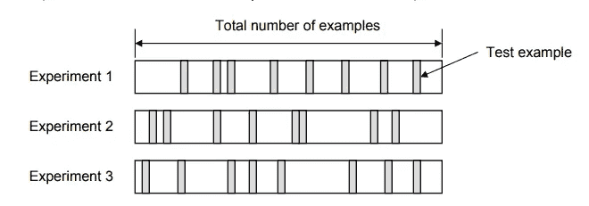
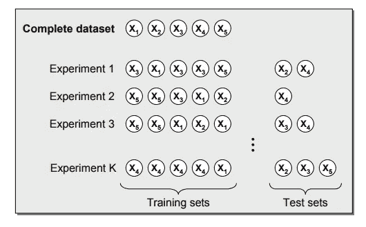

# 什么是模型验证。

> 原文：<https://medium.com/analytics-vidhya/what-is-model-validation-257686d0253e?source=collection_archive---------4----------------------->

在机器学习中，模型验证是指用测试数据集评估训练模型的过程。测试数据集是从中推断出训练集的相似数据集的不同位。使用测试数据集的主要原因是为了测试准备好的模型的推测能力。模型验证在模型训练之后完成。除了模型训练之外，模型验证还旨在找到一个具有最佳执行的理想模型。

你需要评估你曾经建立的几乎每一个模型。在大多数(但不是所有)应用中，模型质量的重要部分是预测分析。因此，模型的预测会接近实际发生的情况吗？许多人在测量预测分析时犯了一个巨大的错误。他们使用训练数据进行预测，并将这些预测与训练数据中的目标值进行对比。你会看到这种方法的问题，以及如何阐明它，但是我们应该首先考虑如何做。对于机器学习验证，您可以遵循依赖于模型推进技术的过程，因为有各种各样的策略来创建 ML 模型。

选择正确的验证方法对于保证验证方法的准确性和公正性同样至关重要。尽管数据量巨大，但对大众来说，你可能不需要批准。尽管如此，实际上情况是多种多样的，因为我们所举的例子或准备的训练数据可能并不符合大众的真实形象。

这里你必须利用正确的验证技术来验证你的机器学习模型。然而，有各种各样的验证技术可以遵循，并确保哪一种对你的 ML 模型是合理的，并帮助你以公正的方式直接执行这一职责，使你的 ML 模型在人工智能世界中完全可靠和令人满意。

# 机器学习模型验证技术。

## 维持验证方法

它被认为是最简单的模型验证技术之一，可以帮助您发现您的模型如何给出关于维持集的结论。在这种方法下，通过[图像注释](https://www.cogitotech.com/services/image-annotation/)服务完成的给定标签数据集被获取并被分配到测试和训练集中，然后将模型拟合到训练数据并预测测试集的标签。

正确预测的部分构成了我们对预测准确性的评估。已知的测试标签在预测过程中被保留。实际上，专家避免在相同的训练数据集上训练和评估模型，这也被称为替代评估，因为它会由于过度拟合而呈现非常乐观的偏差。

## k 倍交叉验证法

根据从事人工智能工作的大公司的说法，交叉验证是另一种重要的技术 [ML 模型验证](https://www.cogitotech.com/ml-model-validation-services/)，其中通过在可用输入数据的子集上训练大量 ML 模型并在数据的匹配子集上评估它们来评估 ML 模型。

基本上，这种方法用于检测训练数据中的过度拟合或波动，该训练数据被模型选择和学习为概念。还存在要求更高的交叉验证方法，包括 K 重验证，其中交叉验证过程重复多次，将样本数据分成 K 个部分。

## 留一交叉验证法

在机器学习的这种验证方法下，除了一个记录之外的所有数据都用于训练，而这一个记录稍后仅用于测试。并且如果有 N 个记录，则该过程重复 N 次，并且具有使用整个数据进行训练和测试的特权。但是，这种方法相对昂贵，因为它通常需要构建数量上等于训练集大小的许多模型。

在这种技术下，模型的错误率几乎是每次重复的错误率的平均值。这种方法给出的评价是好的，但是初看起来计算起来非常昂贵。幸运是，没有经验的学习者可以很容易地做出 LOO 预测，就像他们做出其他常规预测一样。这是评估模型的最佳方法之一，因为它不会比计算残差花费更多的时间，从而节省了时间和进化成本。

## 随机二次抽样验证方法

提供 ML 算法验证服务的公司也使用这种技术来评估模型。在这种方法下，数据被多次随机划分成不连续的训练集和测试集，这意味着从数据集中随机选择多组数据并组合以形成测试数据集，而剩余的数据形成训练数据集。

从每个分区获得的精度被平均，并且模型的误差率是每次迭代的误差率的平均值。随机二次抽样法的优点是，它可以重复无限次。

## 自举 ML 验证方法

Bootstrapping 是 ML 模型验证的另一种有用方法，它可以在不同的情况下工作，如评估预测模型性能、集成方法或估计模型的偏差和方差。

在这种技术下，机器学习训练数据集通过替换被随机选择，并且未被选择用于训练的剩余数据集被用于测试。该模型的误差率是每次迭代误差率的平均值，因为与 K 倍交叉验证不同，该值可能在验证过程中逐倍变化。

## 总结

除了这些最广泛使用的模型验证技术之外，机器学习工程师还利用教授和测试方法、运行人工智能模型模拟以及包括覆盖机制来评估模型预期。在任何情况下，这些哲学都适合大企业，保证人工智能框架提供正确的选择。从根本上说，这种方法用于人工智能计算验证服务，并且很难找到更好的方法来准备和支持这些高质量和最值得注意的准确性的框架，同时与对人、业务执行和组织的品牌声誉的不友好影响保持战略距离。