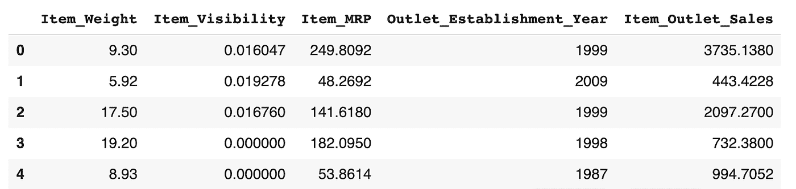
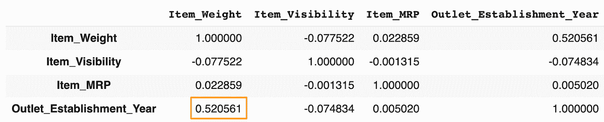
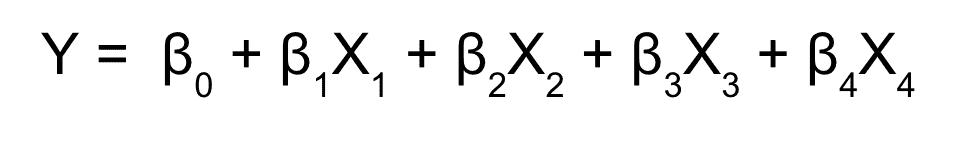
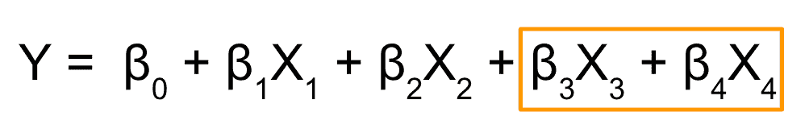
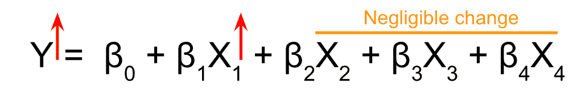
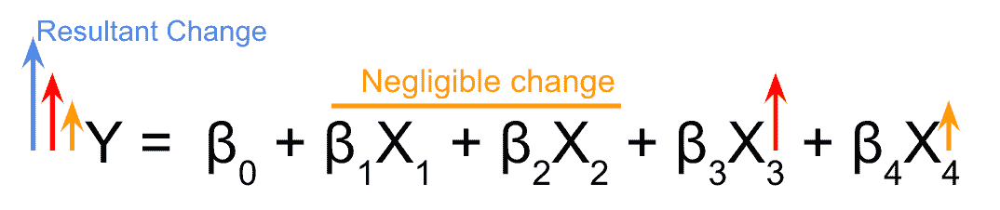
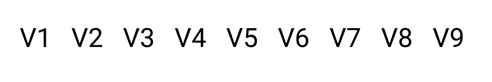
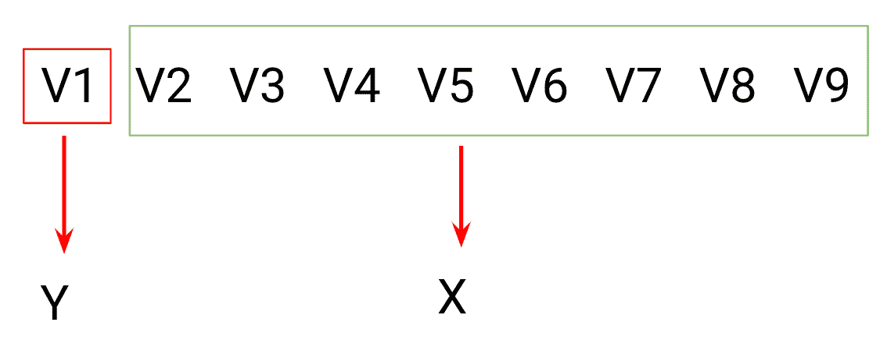
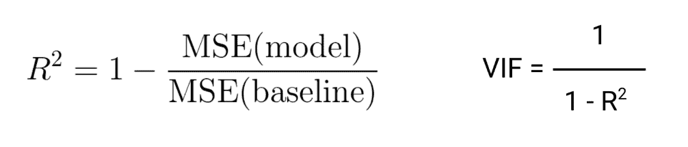

# 什么是多重共线性，如何消除多重共线性？

> 原文：<https://medium.com/analytics-vidhya/what-is-multicollinearity-and-how-to-remove-it-413c419de2f?source=collection_archive---------1----------------------->

# 介绍

随着机器学习和深度学习的进步，我们现在有一个算法库，可以处理我们抛给他们的任何问题。但是这些高级复杂的算法有一个问题，它们不容易解释。

当谈到机器学习模型的可解释性时，没有什么比线性回归更简单和可解释性了。但是，线性回归的可解释性可能存在某些问题，尤其是当违反了线性回归的多重共线性假设时。

我假设你熟悉线性回归的假设。

如果你和他一样，可以参考下面的链接，了解更多“线性回归的假设”。

[https://www . analyticsvidhya . com/blog/2016/07/deeper-regression-analysis-assumptions-plots-solutions/](https://www.analyticsvidhya.com/blog/2016/07/deeper-regression-analysis-assumptions-plots-solutions/)

我们将研究以下关于多重共线性的问题:

1.  什么是多重共线性？
2.  多重共线性如何影响解释？
3.  我们如何检测并消除它？

所以让我们开始逐一回答这些问题。

# 1.什么是多重共线性？

多重共线性是指自变量或预测变量之间存在*显著相关性或关联性的情况。自变量之间的显著相关性通常是多重共线性存在的第一个证据。*

让我们通过一个例子来理解这一点:

假设我正在处理 BigMart 数据集的子集，如图所示

正如我们之前所讨论的，当独立变量或预测变量之间存在高度相关性时，就会出现多重共线性。

让我们来看看相关矩阵

我们可以在相关表中看到，变量 Outlet_Establishment_Year 和 Item_Weight 之间存在显著的相关性。这是多重共线性可能存在的第一个线索。

# 2.多重共线性如何影响解释

考虑下面的回归模型

在这个模型中，我们可以清楚地看到，有 4 个自变量作为 X，相应的系数作为β。现在考虑一种情况，其中除了 X3 和 X4，所有的变量都是独立的。

或者换句话说，X3 和 X4 之间有显著的相关性。

现在，为了估计每个独立变量相对于 Y 的β系数，当我们每次稍微改变任意一个独立变量的幅度时，我们观察 Y 变量幅度的*变化。*

## 案例 1:

考虑到变量 X1 和 X2，它们独立于其他变量。如果我们试图*改变 X1 或 X2 的大小，它们将不会导致任何其他自变量改变其值，或者改变一些可忽略的量*。因此，我们可以清楚地观察到自变量 X 对 y 的影响。

## 案例二:

在变量 X3 和 X4 的情况下，它们显著相关。你能猜到如果我们采用与案例 1 相同的程序会发生什么吗？

下图说明了完全相同的情况。

根据这个图像，*如果我们试图改变 X3(如红色所示)的大小来观察 Y(红色)的变化，X4(橙色)*的值也会有显著的差异。结果，我们观察到的 Y 的变化是由于 X3(红色)和 X4(橙色)的变化。最终变化(蓝色)大于实际变化(橙色)。

现在你可能会问，这有问题吗？

是的，当我们试图估计对应于 X3 的系数时，变量 X4 的贡献导致该系数被高估。正因为如此，系数被高估了。因此，我们的解释可能会产生误导。

仅根据相关性移除独立变量可以产生有价值的预测变量，因为相关性只是多重共线性存在的指示。

但是我们决心消除它。让我们来看看我们是怎么做的。

# 3.我们如何检测和消除多重共线性？

识别多重共线性的最佳方法是计算数据集中每个自变量对应的**方差膨胀因子(VIF)** 。

VIF 告诉我们一个独立变量是如何被其他独立变量预测的。让我们借助一个例子来理解这一点。

假设我们有 9 个独立变量，如图所示。为了计算变量 V1 的 VIF，我们分离出变量 V1 并将其视为目标变量，所有其他变量将被视为预测变量。

我们使用所有其他预测变量，并训练一个回归模型，找出相应的 R2 值。

使用这个 R2 值，我们计算如下图所示的 VIF 值。

从公式中我们可以清楚地看到，随着 R2 值的增加，VIF 值也增加。较高的 R2 值表示:

*“其他自变量很好地解释了目标自变量”*

现在，决定是否应该删除变量的 VIF 阈值应该是什么？

总是希望 VIF 值尽可能小，但这可能会导致从数据集中移除许多重要的独立变量。因此，VIF = 5 通常被作为阈值。这意味着任何大于 5 的独立变量都将被移除。尽管理想的阈值取决于手头的问题。

线性回归的力量在于模型的简单解释。错过多重共线性肯定会扼杀使用线性回归的初衷。假设您已经理解了多重共线性的概念、多重共线性引起的问题以及如何在任何给定的问题中检测和消除多重共线性，我将对本文进行总结。