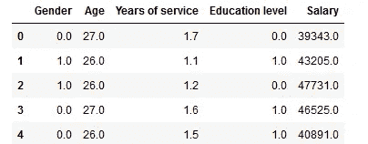
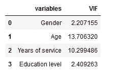
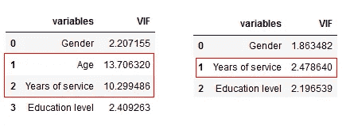
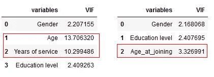

# 什么是多重共线性？这是你需要知道的一切

> 原文：<https://medium.com/analytics-vidhya/what-is-multicollinearity-heres-everything-you-need-to-know-b2e2e26108d4?source=collection_archive---------18----------------------->

# 介绍

多重共线性可能很难发音，但在机器学习领域，这是一个你应该知道的话题。我对它很熟悉，因为我有统计学背景，但我见过很多专业人士不知道多重共线性的存在。

这在那些来自非数学背景的机器学习人员中尤其普遍。虽然是的，多重共线性可能不是您旅途中需要掌握的最重要的主题，但它仍然非常重要，值得学习。尤其是当你参加数据科学家面试的时候！

因此，在本文中，我们将了解什么是多重共线性，为什么它是一个问题，是什么导致多重共线性，然后了解如何检测和修复多重共线性。

在进一步深入之前，有必要对回归和一些统计术语有一个基本的了解。为此，我强烈建议浏览以下资源:

*   [*回归分析基础(免费课程！)*](https://courses.analyticsvidhya.com/courses/Fundamentals-of-Regression-Analysis?utm_source=blog&utm_medium=what-is-multicollinearity)
*   [*线性回归入门*](https://www.analyticsvidhya.com/blog/2017/06/a-comprehensive-guide-for-linear-ridge-and-lasso-regression/?utm_source=blog&utm_medium=what-is-multicollinearity)

# 目录

*   什么是多重共线性？
*   多重共线性的问题是
*   什么原因导致多重共线性？
*   用 VIF 检测多重共线性
*   修复多重共线性

# 什么是多重共线性？

> 当回归模型中的两个或多个独立变量高度相关时，就会出现多重共线性。

这意味着一个独立变量可以从[回归模型](https://courses.analyticsvidhya.com/courses/Fundamentals-of-Regression-Analysis?utm_source=blog&utm_medium=what-is-multicollinearity)中的另一个独立变量预测出来。比如身高体重、家庭收入和用水量、汽车行驶里程和价格、学习时间和休闲时间等。

让我从我们的日常生活中举一个简单的例子来解释这一点。科林喜欢边嚼薯片边看电视。他看的电视越多，吃的薯条就越多，就越开心！

现在，如果我们可以量化幸福，在科林忙着做他最喜欢的活动时测量他的幸福，你认为哪个会对他的幸福产生更大的影响？吃薯片还是看电视？这很难确定，因为当我们试图通过吃薯片来衡量科林的快乐时，他开始看电视。当我们试图通过看电视来衡量他的快乐时，他开始吃薯片。

对科林来说，吃薯片和看电视是高度相关的，我们无法单独确定这些活动对他的快乐的影响。这就是多重共线性问题！

那么，你为什么要担心[机器学习](https://courses.analyticsvidhya.com/courses/applied-machine-learning-beginner-to-professional?utm_source=blog&utm_medium=what-is-multicollinearity)环境中的多重共线性呢？接下来我们来回答这个问题。

# 多重共线性的问题是

多重共线性可能是回归模型中的一个问题，因为我们无法区分自变量对因变量的个别影响。例如，让我们假设在下面的线性方程中:

> Y = W0+W1*X1+W2*X2

系数 W1 是在保持 X2 不变的情况下，X1 每增加一个单位，Y 的增加量。但是由于 X1 和 X2 高度相关，X1 的变化也会引起 X2 的变化，我们无法看到它们对 y 的单独影响

> *“这使得 X1 对 Y 的影响很难与 X2 对 Y 的影响区分开来。”*

多重共线性可能不会对模型的准确性产生太大影响。但是我们可能会在确定你的模型中的单个特征的效果时失去可靠性——当涉及到[可解释性](https://www.analyticsvidhya.com/blog/2019/08/decoding-black-box-step-by-step-guide-interpretable-machine-learning-models-python/?utm_source=blog&utm_medium=what-is-multicollinearity)时，这可能会是一个问题。

# 什么原因导致多重共线性？

多重共线性可能由以下问题引起:

*   多重共线性的存在可能是因为创建时数据集中存在问题。这些问题可能是因为设计不良的实验、高度观察性的数据或无法操纵数据:

例如，从家庭收入和电器数量确定一个家庭的用电量。在这里，我们知道一个家庭的电器数量会随着家庭收入的增加而增加。但是，这不能从数据集中删除

*   当创建依赖于其他变量的新变量时，也可能出现多重共线性:

例如，从身高和体重变量中为身体质量指数创建一个变量会在模型中包含冗余信息

*   在数据集中包含相同的变量:

例如，包括华氏温度和摄氏温度的变量

*   哑变量的不准确使用也会导致多重共线性问题。这被称为**虚拟变量陷阱**:

例如，在包含具有两个唯一值的婚姻状态变量的数据集中:“已婚”、“单身”。为它们创建虚拟变量会包含冗余信息。对于“已婚”/“单身”状态，我们可以只使用一个包含 0/1 的变量。

*   在某些情况下，数据不足也会导致多重共线性问题

# 使用 VIF 检测多重共线性

让我们尝试检测数据集中的多重共线性，让您了解可能会出错的情况。

我创建了一个数据集，该数据集根据以下特征确定公司中某个人的工资:

*   性别(0-女性，1-男性)
*   年龄
*   服务年限(在公司工作的年限)
*   教育水平(0——无正规教育，1——毕业前，2——毕业后)

多重共线性可以通过多种方法检测。在本文中，我们将重点介绍最常见的一种**——VIF(可变通胀因素)**。

> *“VIF 决定了自变量之间相关性的强弱。它是通过选取一个变量并将其与其他变量进行回归来预测的。”*
> 
> *或*
> 
> *自变量的 VIF 分数代表该变量被其他自变量解释的程度。*

**R** 值的确定是为了找出一个自变量被其他自变量描述得有多好。高值的 **R** 意味着该变量与其他变量高度相关。这由下面表示的 **VIF** 捕获:

因此， **R** 值越接近 1，VIF 值越高，与特定自变量的多重共线性越高。

*   VIF 从 1 开始，没有上限
*   VIF = 1，自变量和其他变量之间没有相关性
*   VIF 超过 5 或 10 表示该自变量与其他变量之间存在高度多重共线性

我们可以看到，“年龄”和“服务年限”具有较高的 VIF 值，这意味着它们可以通过数据集中的其他独立变量来预测。

> *虽然相关矩阵和散点图也可用于发现多重共线性，但他们的发现仅显示了自变量之间的双变量关系。VIF 是首选，因为它可以显示一个变量与一组其他变量的相关性。*

# 修复多重共线性

删除其中一个相关要素将有助于降低相关要素之间的多重共线性:

左边的图像包含变量的原始 VIF 值，右边的图像是删除**“年龄”**变量后的图像。

我们能够从数据集中删除变量**【年龄】**，因为它的信息是由“服务年限”变量捕获的。这减少了数据集中的冗余。

*删除变量应该是一个从具有最大 VIF 值的变量开始的迭代过程，因为它的趋势很容易被其他变量捕捉到。如果你这样做，你会注意到其他变量的 VIF 值也会减少，尽管程度不同。*

*在我们的例子中，剔除了* ***【年龄】*** *变量后，所有变量的 VIF 值都有不同程度的下降。*

接下来，将相关变量合并成一个，去掉其他变量。这将减少多重共线性:

左边的图像包含变量的原始 VIF 值，右边的图像是组合了**‘年龄’**和**‘服务年限’**变量后的图像。将**‘年龄’**和**‘经验年限’**组合成一个变量**‘年龄 _ 加入’**使我们能够捕捉这两个变量中的信息。

但是，多重共线性可能并不是每次都是问题。修复多重共线性的需要主要取决于以下原因:

1.  当您更关心单个要素(而不是一组要素)对目标变量的影响程度时，移除多重共线性可能是一个不错的选择
2.  如果您感兴趣的要素中不存在多重共线性，则多重共线性可能不是问题。

# 结束注释

当您构建可解释的机器学习模型时，关于多重共线性的知识会非常有帮助。

我希望这篇文章对理解多重共线性问题以及如何处理它有所帮助。如果你想了解其他回归模型，或者想了解模型解释，我强烈推荐你去看看下面这些写得很精彩的文章:

*   [回归建模](https://www.analyticsvidhya.com/blog/2015/08/comprehensive-guide-regression/?utm_source=blog&utm_medium=what-is-multicollinearity)
*   [机器学习模型的可解释性](https://www.analyticsvidhya.com/blog/2019/08/decoding-black-box-step-by-step-guide-interpretable-machine-learning-models-python/?utm_source=blog&utm_medium=what-is-multicollinearity)

作为下一步，你还应该看看[回归基础(免费)课程](https://www.analyticsvidhya.com/blog/2017/06/a-comprehensive-guide-for-linear-ridge-and-lasso-regression/?utm_source=blog&utm_medium=what-is-multicollinearity)。你也可以在分析 Vidhya 的 Android 应用上阅读这篇文章

*原载于 2020 年 3 月 19 日*[*【https://www.analyticsvidhya.com】*](https://www.analyticsvidhya.com/blog/2020/03/what-is-multicollinearity/)*。*