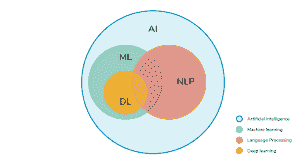
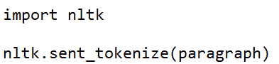
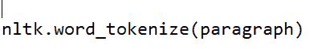
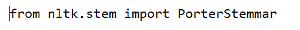
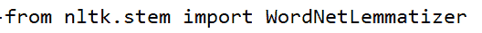
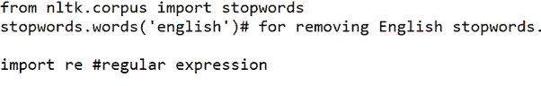
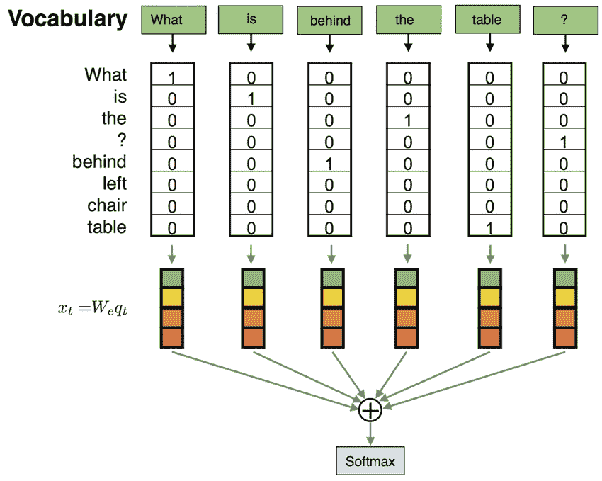
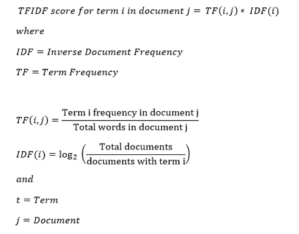

# 什么是自然语言处理？

> 原文：<https://medium.com/analytics-vidhya/what-is-natural-language-processing-697c8251940b?source=collection_archive---------29----------------------->

自然语言处理(NLP)是对人类文本或语音的自动理解。这是 ML 的一种特殊应用，我们在其中处理文本数据。

它广泛用于情感分析，如理解特定的推文或评论是正面还是负面。它还用于垃圾邮件分类、合并语义、分析句子结构。

NLP 也可以通过使用 LSTM 的深度学习来使用，但那是在高级 NLP 下，我们试图分析句子结构并预测即将到来的文本。

在这里，我将向你介绍基本的自然语言处理和步骤。

# NLP 中涉及的步骤。

# 1)-标记化。

这是一个将段落转换成句子和单词的过程。

例如:

健康在我们的生活中扮演着非常重要的角色。 *它被定义为社会、身体和精神* *我们身体的适应力。健康的人精神健康，没有任何紧张感。*

第一步，这段文字被转换成句子和单词。

NLTK 是一个基本的库，支持 Python 中的分类、词干、标记、解析、语义推理和标记化等任务。

这是将段落转换成句子。用这个我们可以把它转换成 3 个句子

健康在我们的生活中起着非常重要的作用。

2)-它被定义为我们身体的社会、精神和身体健康。

3)-健康的人是指精神健康，没有任何紧张感的人。

这是将段落转换成单词。

"健康"，"戏剧"，"一个"，"非常"，"重要"，"角色"，"在"，"我们的" "生活"，"生活"。"、"它"、"是"、"定义的"、"作为"、"该"、"社会的"、"精神的"、"和"、"身体的"、"健康的"、"的"、"我们的"、"身体的"、"身体的"。、"一" "健康"、"人"、"是"、"某人"、"谁"、"是"、"精神上"、"适合"、"他们"、"做"、"不"、"有"、"任何"、"善良"、"的"、"紧张"、"的"。"

# 2)-词干化和词汇化。

将 para 转换成单词后，下一步是将它们转换成 base root 单词。这可能发生在两种类型中，即词干化和词汇化。

词干:-

*播放* - >播放*播放*

*健康* - >健康*健康*

*张力*->-*十位*

steeming 的一个缺点是，当它将单词转换成它们的基本词根时，基本词没有必要有任何含义。

词汇化:-

*剧*——>剧*剧*

*健康*->-*健康*

*紧张* - >紧张*紧张*

在这里，通过使用词汇化，单词被转换成具有适当含义的基本单词。

# 3)-删除停用词和标点符号。

停用字词:-这些是在处理自然语言数据(文本)之前或之后过滤掉的字词。这些词对数据来说没有太多的语义价值，所以最好从数据中删除这些词。

例如:-“*是*”、“*一个*”、“中的*”、“*我们的*”、“*中的*”、“*和*”。*

它将删除所有的标点符号，句号和逗号。

# 4)-矢量化

将文本转换为矢量的过程称为矢量化。

**如何用 CountVectorizer 将文本转换成字数向量。**

将文本数据转换成向量的一种简单方法是使用单词包(BoW)

在这种情况下，所有文本都根据该文本在句子中的出现频率转换为 0 或 1。唯一的缺点是它不能给我们太多的文本语义，因为它不能给句子中的重要文本提供更多的权重。

**如何用 tfidfvectorizer 将文本转换成词频向量。**

词频逆文档频率缩写为 tf-idf。它是句子的 tf 和 idf 的组合。

词频:这总结了给定单词在文档中出现的频率。

逆文档频率:这减少了文档中出现很多的单词。

**如何用哈希矢量器将文本转换成整数？**

计数和频率有一个限制，那就是词汇表变得非常大。

在散列法中，我们将文本数据转换成整数。唯一的缺点是没有办法将整数或编码转换回单词。

* * * * * * * * * *我们还可以使用 Word2Vec 将文本数据转换为向量，word 2 vec 使用神经网络模型从大型语料库中学习单词关联。*********

**关于 word2vec 的更多信息:-**

[https://towards data science . com/introduction-to-word-embedding-and-word 2 vec-652 d0c 2060 fa](https://towardsdatascience.com/introduction-to-word-embedding-and-word2vec-652d0c2060fa)

快乐学习。