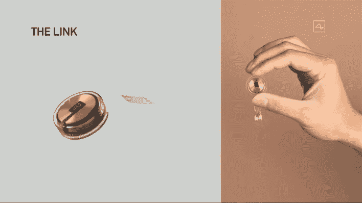

# 埃隆马斯克的 Neuralink 是什么？

> 原文：<https://medium.com/analytics-vidhya/what-is-neuralink-by-elon-musk-d5cdb3e2da4c?source=collection_archive---------15----------------------->

神经链接设备

将我们的大脑与计算机连接起来的想法，能够不用说一句话就进行无线通信，能够幻想和做我们以前从未想过的事情等等，使我们感到强大，这是我们在科幻电影中想象和描绘的东西。现在，所有这些幻想都可以成为现实，这要归功于 Neuralink——这是埃隆·马斯克的公司 neural ink 的最新技术创新，该公司旨在围绕神经接口开发技术。

## **什么是 Neuralink 技术？**

Neuralink N1 是一个 4 毫米见方的芯片，被植入颅骨，其中有 1024 个通道或电极与大脑接口。它能够通过蓝牙低能量与任何设备或外部世界进行无线通信，从而向大脑发送信号或从大脑接收信号。

这种设备目前的目标是帮助神经系统疾病，这些疾病的根源是大脑无法与身体周围的神经连接。这些疾病包括癫痫和帕金森病，但也包括脊髓神经损伤后的截瘫和四肢瘫痪。但仅限于治愈疾病吗？当然不是。它当然可以做很多其他的事情，随着芯片的升级，这些事情会随着时间的推移而消失。

该芯片是一个巧妙的和非常创新的作品，它将许多学科和技术领域结合在一起，如软件工程、嵌入式工程、神经科学、电气工程、机械系统等。让我们看看这项技术的能力，以及它是如何在一个非常广泛的层面上工作的。

## **neural ink 芯片基于什么架构？**

Neuralink 基于芯片设计的定制架构，而不是 ARM 或 x86，因为它必须在一种非常不同的受限环境中工作，如人体，这可能会产生一些影响。所以芯片设计本身就很不一样。

## **芯片如何与外界通信？**

该芯片基于尖峰检测算法。它基于在线尖峰检测机制，其中芯片检测从 1024 个通道接收的任何阈值，并执行带通滤波，然后通过 BLE 发送唯一的特征形状。原始信号要复杂得多，并且经过简化，由 Neuralink 滤波。尖峰信号是大脑中代表活动的神经元发生的事件。这些是电脉冲或一种类似 0 或 1 的数字信号，由神经元发送给其他受体神经元。

## **芯片的安装流程是怎样的？**

通过在头骨顶部开一个硬币形状的小切口，芯片被植入到头骨上。精细的 1024 线被刻入大脑而不影响静脉或其他血管。切口用一种像塑料一样的材料覆盖，这种材料很耐用，看起来像肉。这是一个机器人手术过程，由 neuralink 的一个自动化系统执行整个过程。这已经在猪身上试验过了。随后，要将该设备用于人体，需要获得美国食品和药物管理局的批准。

## **它首先针对哪些带宽较低的活动，有效使用需要什么带宽？**

它可以帮助脊髓损伤患者恢复运动和交流。在这种损伤中，从脊髓到大脑的神经元受损，从而阻碍了从大脑到感觉器官的通讯。这种芯片可以像桥梁一样通过断开的连接连接电信号来弥合差距。

## **芯片上的 API 是如何设计的？**

该芯片在设备本身上进行大部分过滤，但它可以进一步扩展，将原始信号发送出去，并在计算机或智能手机设备上进行大量处理。

## **植入大脑的芯片在哪里，有什么功能？**

该芯片目前被植入大脑皮层区域，该区域包含大多数主要活动，如 3-4 毫米深的运动感觉和视觉反应，但该公司承诺将其扩展到大脑的更深层次，如下丘脑，在那里它可以挖掘抑郁和焦虑等感觉。正如该公司所说，这可以通过增加电极的长度来实现。

## **在螺纹的材料科学方面，有哪些设计挑战？**

芯片螺纹的设计能够经受住时间的考验，可以使用几十年，这样它们就不会变质，因为它们基本上是导体和绝缘体。大脑是一个腐蚀性很强的环境，因此为了防止电极腐蚀，需要一种非常坚固和薄的材料，因此碳化硅可以用作绝缘材料。由于大脑是一个非常受限的环境，所以这些细丝非常非常细，只有一根头发的 1/20 大小，即 5 微米。人们正在努力使它们更薄，以便在相同的面积内容纳更多的电极。但这是一个巨大的挑战，因为随着线的厚度减小，横截面积将减小，从而允许更少的电流流过，并将使其难以感测信号或脉冲。然而，这是每一项创新的目标。

## **设备的输入输出读写速度是多少？为加快速度做了些什么？**

装置中的所有 1024 个通道都能够记录和模拟。它有片上算法来压缩和提取尖峰信号或阈值的区域，这比大脑处理的速度快得多。收集的信号以 20 KHz 的速率数字化。ADC 转换器可实现 10 位分辨率，即 1024 个通道。尖峰检测最快可在 900 纳秒内完成。

## **如何保护芯片免受外部和内部干扰？**

频段中来自 Wifi、蓝牙、无线电等无线源的干扰可能会对芯片造成一些干扰，但芯片经过优化，可在这些频率和带宽下工作。此外，机械包装可能是用玻璃或金属做的，以防止内部震动和大脑中产生的化学物质和压力。

## **它能保存和回放未来的记忆吗？**

是的，这项技术承诺了这样一个飞跃，你可以把你所有的过去的记忆存储在一个驱动器的某个地方，并在以后检索它们。

## **哪种编程语言被用来设计芯片？**

在用于芯片设计的低级晶体管上，使用 verilog。对于高级 C，使用 C++和 python。

## **系统的安全性如何？**

所有与大脑的互动都经过认证和加密。像 BLE 这样的感觉模块被分离出来，对大脑的 IO 被保护起来免受攻击，并做一些渗透测试。

## **为什么使用猪作为该芯片初始测试的模型？**

作为功能的一部分，猪的头骨解剖与人类有些相似。他们只需要很少的资源就能快乐，因此可以通过各种情绪来测试。他们有一个长鼻子，那里是大多数感觉神经元存在的地方，大脑为它提供了一个巨大的空间。该公司表示，实验中使用的猪受到了精心照顾，是自愿的，符合动物权利保护的要求。

## **设备的可扩展性如何？**

就增加电极的数量、使它们更薄、增加安全性而言，该设备可扩展到更好的接收。因此，优化和可伸缩性的空间很大。

## **该设备未来有哪些应用和前景？**

简直不可数。心灵感应，用精神控制玩游戏，控制物体，检测即将到来的疾病等等。是人类 AI 共生之王。

## **戴在头上的设备对健康有影响吗？**

该公司已经在猪身上测试了该设备，并确认这种植入没有副作用。它可以根据需要在影响大脑的情况下进行升级和修改。

就这些。希望你喜欢这本书。